# Alt Platform Microservices

_Last reviewed: February 15, 2026_

## Overview

Alt は Compose-first の AI 拡張 RSS ナレッジプラットフォームです。Docker Compose がオーケストレーションの source of truth であり、複数のプロファイルでオプションの AI、Recap、RAG、メッセージング、ロギング機能を提供します。

## Service Categories

### Core Services
| Service | Language | Port(s) | Compose File | Health Endpoint |
|---------|----------|---------|--------------|-----------------|
| nginx | - | 80, 8080 | core.yaml | `pidof nginx` |
| alt-frontend | TypeScript (Next.js 16) | 3000 | core.yaml | `/api/health` |
| alt-frontend-sv | TypeScript (SvelteKit 2.x) | 4173 | core.yaml | `/sv/health` |
| alt-backend | Go 1.24+ (Echo) | 9000, 9101 | core.yaml | `/v1/health` |
| alt-butterfly-facade | Go 1.25+ | 9250 | bff.yaml | `/alt-butterfly-facade healthcheck` |

### Worker Services
| Service | Language | Port(s) | Compose File | Health Endpoint |
|---------|----------|---------|--------------|-----------------|
| pre-processor | Go 1.24+ | 9200, 9202 | ai.yaml | `/pre-processor healthcheck` |
| pre-processor-sidecar | Go 1.24+ | - | workers.yaml | - |
| search-indexer | Go 1.24+ | 9300, 9301 | workers.yaml | `/search-indexer healthcheck` |
| tag-generator | Python 3.13+ (FastAPI) | 9400 | workers.yaml | `/health` |
| news-creator | Python 3.11+ (FastAPI + Ollama) | 11434 | ai.yaml | `/health` |

### Auth Services
| Service | Language | Port(s) | Compose File | Health Endpoint |
|---------|----------|---------|--------------|-----------------|
| kratos | - (Ory Kratos v1.3.0) | 4433, 4434 | auth.yaml | `/admin/health/ready` |
| auth-hub | Go 1.24+ (Echo) | 8888 | auth.yaml | `/auth-hub healthcheck` |
| auth-token-manager | Deno 2.x | 9201 | workers.yaml | - |

### Message Queue Services
| Service | Language | Port(s) | Compose File | Health Endpoint |
|---------|----------|---------|--------------|-----------------|
| redis-streams | Redis 8.4 | 6380 | mq.yaml | `redis-cli ping` |
| mq-hub | Go 1.24+ | 9500 | mq.yaml | `/health` |

### Recap Pipeline Services
| Service | Language | Port(s) | Compose File | Health Endpoint |
|---------|----------|---------|--------------|-----------------|
| recap-worker | Rust 1.87+ | 9005 | recap.yaml | `/recap-worker healthcheck` |
| recap-subworker | Python 3.12+ (FastAPI) | 8002 | recap.yaml | - |
| dashboard | Python (Streamlit) | 8501, 8502 | recap.yaml | - |
| recap-evaluator | Python (FastAPI) | 8085 | recap.yaml | `/health` |

### RAG Services
| Service | Language | Port(s) | Compose File | Health Endpoint |
|---------|----------|---------|--------------|-----------------|
| rag-orchestrator | Go 1.25+ | 9010, 9011 | rag.yaml | - |

### Data Stores
| Service | Type | Port(s) | Compose File | Health Endpoint |
|---------|------|---------|--------------|-----------------|
| db | PostgreSQL 17 | 5432 | db.yaml | `pg_isready` |
| kratos-db | PostgreSQL 16 | 5434 | auth.yaml | `pg_isready` |
| recap-db | PostgreSQL 18 | 5435 | recap.yaml | `pg_isready` |
| rag-db | PostgreSQL 18 + pgvector | 5436 | rag.yaml | `pg_isready` |
| meilisearch | Meilisearch v1.27.0 | 7700 | db.yaml | `/health` |
| clickhouse | ClickHouse 25.9 | 8123, 9009 | db.yaml | `/ping` |
| redis-cache | Redis 8.0.2 | - | ai.yaml | `redis-cli ping` |

### Observability Services
| Service | Language | Port(s) | Compose File | Health Endpoint |
|---------|----------|---------|--------------|-----------------|
| rask-log-aggregator | Rust 1.87+ (Axum) | 9600, 4317, 4318 | logging.yaml | `/rask-log-aggregator healthcheck` |
| rask-log-forwarder (14x) | Rust 1.87+ | - | logging.yaml | - |

### CLI & Tools
| Service | Language | Description |
|---------|----------|-------------|
| altctl | Go 1.24+ (Cobra) | Docker Compose オーケストレーション CLI |
| alt-perf | Deno 2.x (Astral) | E2E パフォーマンス計測 |

---

## Compose File Mapping

| Compose File | Services | Profile |
|--------------|----------|---------|
| base.yaml | 共通設定 (networks, volumes, secrets) | - |
| core.yaml | nginx, alt-frontend, alt-frontend-sv, alt-backend, migrate | default |
| bff.yaml | alt-butterfly-facade | default |
| db.yaml | db, meilisearch, clickhouse | default |
| auth.yaml | kratos-db, kratos, kratos-migrate, auth-hub | default |
| workers.yaml | pre-processor-sidecar, search-indexer, tag-generator, auth-token-manager | default |
| mq.yaml | redis-streams, mq-hub | default |
| ai.yaml | redis-cache, news-creator, pre-processor | ollama |
| recap.yaml | recap-db, recap-worker, recap-subworker, dashboard, recap-evaluator | recap |
| rag.yaml | rag-db, rag-db-migrator, rag-orchestrator | rag-extension |
| logging.yaml | rask-log-aggregator, 14x rask-log-forwarder | logging |
| perf.yaml | alt-perf | perf |

---

## Service Dependency Graph

```mermaid
flowchart TB
    subgraph Edge["Edge"]
        nginx
    end

    subgraph Frontend["Frontend"]
        direction LR
        alt-frontend
        alt-frontend-sv
    end

    subgraph BFF["BFF"]
        alt-butterfly-facade
    end

    subgraph Backend["Backend"]
        alt-backend
    end

    subgraph Auth["Auth"]
        direction LR
        kratos
        auth-hub
        auth-token-manager
    end

    subgraph Workers["Workers"]
        direction LR
        pre-processor
        pre-processor-sidecar
        search-indexer
        tag-generator
        news-creator
    end

    subgraph MQ["Message Queue"]
        direction LR
        redis-streams
        mq-hub
    end

    subgraph Recap["Recap Pipeline"]
        direction LR
        recap-worker
        recap-subworker
        dashboard
        recap-evaluator
    end

    subgraph RAG["RAG"]
        rag-orchestrator
    end

    subgraph DataStores["Data Stores"]
        direction LR
        db[(PostgreSQL)]
        kratos-db[(Kratos DB)]
        recap-db[(Recap DB)]
        rag-db[(RAG DB)]
        meilisearch[(Meilisearch)]
        clickhouse[(ClickHouse)]
        redis-cache[(Redis)]
    end

    %% Request flow
    nginx --> alt-frontend & alt-frontend-sv & auth-hub
    alt-frontend-sv --> alt-butterfly-facade --> alt-backend
    alt-backend --> db & mq-hub & auth-hub
    auth-hub --> kratos --> kratos-db

    %% Worker connections (ADR-000241: via alt-backend Internal API)
    search-indexer --> alt-backend & meilisearch
    tag-generator --> alt-backend & redis-streams
    pre-processor --> db & alt-backend & redis-streams
    news-creator --> redis-cache
    mq-hub --> redis-streams

    %% Pipeline connections
    recap-worker --> recap-db & recap-subworker & news-creator
    recap-subworker & dashboard & recap-evaluator --> recap-db
    rag-orchestrator --> rag-db & search-indexer

    %% Styling - Edge (gray)
    style nginx fill:#eceff1,stroke:#546e7a,color:#37474f,stroke-width:2px

    %% Styling - Frontend (blue)
    style alt-frontend fill:#e3f2fd,stroke:#1976d2,color:#0d47a1,stroke-width:2px
    style alt-frontend-sv fill:#e3f2fd,stroke:#1976d2,color:#0d47a1,stroke-width:2px

    %% Styling - BFF (light blue)
    style alt-butterfly-facade fill:#e1f5fe,stroke:#0288d1,color:#01579b,stroke-width:2px

    %% Styling - Backend (indigo)
    style alt-backend fill:#e8eaf6,stroke:#3f51b5,color:#1a237e,stroke-width:2px

    %% Styling - Auth (pink)
    style kratos fill:#fce4ec,stroke:#c2185b,color:#880e4f,stroke-width:2px
    style auth-hub fill:#fce4ec,stroke:#c2185b,color:#880e4f,stroke-width:2px
    style auth-token-manager fill:#fce4ec,stroke:#c2185b,color:#880e4f,stroke-width:2px

    %% Styling - Workers (green)
    style pre-processor fill:#e8f5e9,stroke:#388e3c,color:#1b5e20,stroke-width:2px
    style pre-processor-sidecar fill:#e8f5e9,stroke:#388e3c,color:#1b5e20,stroke-width:2px
    style search-indexer fill:#e8f5e9,stroke:#388e3c,color:#1b5e20,stroke-width:2px
    style tag-generator fill:#e8f5e9,stroke:#388e3c,color:#1b5e20,stroke-width:2px
    style news-creator fill:#e8f5e9,stroke:#388e3c,color:#1b5e20,stroke-width:2px

    %% Styling - MQ (orange)
    style redis-streams fill:#fff3e0,stroke:#f57c00,color:#e65100,stroke-width:2px
    style mq-hub fill:#fff3e0,stroke:#f57c00,color:#e65100,stroke-width:2px

    %% Styling - Recap (purple)
    style recap-worker fill:#f3e5f5,stroke:#7b1fa2,color:#4a148c,stroke-width:2px
    style recap-subworker fill:#f3e5f5,stroke:#7b1fa2,color:#4a148c,stroke-width:2px
    style dashboard fill:#f3e5f5,stroke:#7b1fa2,color:#4a148c,stroke-width:2px
    style recap-evaluator fill:#f3e5f5,stroke:#7b1fa2,color:#4a148c,stroke-width:2px

    %% Styling - RAG (teal)
    style rag-orchestrator fill:#e0f2f1,stroke:#00796b,color:#004d40,stroke-width:2px

    %% Styling - Data Stores (amber)
    style db fill:#fff8e1,stroke:#ffa000,color:#ff6f00,stroke-width:2px
    style kratos-db fill:#fff8e1,stroke:#ffa000,color:#ff6f00,stroke-width:2px
    style recap-db fill:#fff8e1,stroke:#ffa000,color:#ff6f00,stroke-width:2px
    style rag-db fill:#fff8e1,stroke:#ffa000,color:#ff6f00,stroke-width:2px
    style meilisearch fill:#fff8e1,stroke:#ffa000,color:#ff6f00,stroke-width:2px
    style clickhouse fill:#fff8e1,stroke:#ffa000,color:#ff6f00,stroke-width:2px
    style redis-cache fill:#fff8e1,stroke:#ffa000,color:#ff6f00,stroke-width:2px
```



---

## Quick Reference - Ports

```
80      → nginx (HTTP)
3000    → alt-frontend (Next.js)
4173    → alt-frontend-sv (SvelteKit)
4433    → kratos (public API)
4434    → kratos (admin API)
5432    → db (PostgreSQL 17)
5434    → kratos-db (PostgreSQL 16)
5435    → recap-db (PostgreSQL 18)
5436    → rag-db (PostgreSQL 18)
6380    → redis-streams
7700    → meilisearch
8002    → recap-subworker
8085    → recap-evaluator
8123    → clickhouse (HTTP)
8501    → dashboard (Streamlit)
8888    → auth-hub
9000    → alt-backend (REST)
9005    → recap-worker
9009    → clickhouse (native)
9010    → rag-orchestrator (REST)
9011    → rag-orchestrator (Connect-RPC)
9101    → alt-backend (Connect-RPC)
9200    → pre-processor (REST)
9201    → auth-token-manager
9202    → pre-processor (Connect-RPC)
9250    → alt-butterfly-facade
9300    → search-indexer (REST)
9301    → search-indexer (Connect-RPC)
9400    → tag-generator
9500    → mq-hub
9600    → rask-log-aggregator (HTTP)
4317    → rask-log-aggregator (OTLP gRPC)
4318    → rask-log-aggregator (OTLP HTTP)
11434   → news-creator (Ollama API)
```

---

## Getting Started

### Default Stack (Core + Auth + DB + Workers)
```bash
altctl up
# または
docker compose -f compose/core.yaml -f compose/bff.yaml \
  -f compose/db.yaml -f compose/auth.yaml \
  -f compose/workers.yaml -f compose/mq.yaml up -d
```

### With AI Services
```bash
docker compose --profile ollama up -d
```

### With Recap Pipeline
```bash
docker compose --profile recap --profile ollama up -d
```

### With RAG Extension
```bash
docker compose --profile rag-extension up -d
```

### With Logging (Observability)
```bash
docker compose --profile logging up -d
```

### Full Stack
```bash
docker compose --profile ollama --profile recap \
  --profile rag-extension --profile logging up -d
```

### Stack Teardown
```bash
altctl down
# With volumes
altctl down --volumes
```

---

## Health Check Commands

```bash
# Core Services
curl http://localhost:3000/api/health          # alt-frontend
curl http://localhost:4173/sv/health           # alt-frontend-sv
curl http://localhost:9000/v1/health           # alt-backend
curl http://localhost:8888/health              # auth-hub

# Data Stores
curl http://localhost:7700/health              # meilisearch
curl http://localhost:8123/ping                # clickhouse

# AI Services
curl http://localhost:11434/health             # news-creator

# Recap Pipeline
curl http://localhost:9005/health/ready        # recap-worker
curl http://localhost:8085/health              # recap-evaluator

# RAG
curl http://localhost:9010/health              # rag-orchestrator

# Message Queue
curl http://localhost:9500/health              # mq-hub
```

---

## Volumes

| Volume | Service | Purpose |
|--------|---------|---------|
| db_data_17 | db | PostgreSQL 17 data |
| kratos_db_data | kratos-db | Kratos identity data |
| recap_db_data | recap-db | Recap pipeline data |
| rag_db_data | rag-db | RAG documents + embeddings |
| meili_data | meilisearch | Search indices |
| clickhouse_data | clickhouse | Log analytics |
| redis-streams-data | redis-streams | Event streams |
| redis-cache-data | redis-cache | LLM response cache |
| news_creator_models | news-creator | Ollama models |
| oauth_token_data | auth-token-manager | OAuth2 tokens |

---

## Secrets

| Secret | Used By |
|--------|---------|
| postgres_password | db |
| db_password | alt-backend |
| kratos_db_password | kratos, kratos-db |
| recap_db_password | recap-worker, recap-subworker |
| rag_db_password | rag-orchestrator, rag-db |
| meili_master_key | meilisearch, search-indexer |
| clickhouse_password | clickhouse, rask-log-aggregator |
| service_secret | alt-backend, search-indexer, tag-generator, pre-processor, news-creator, recap-worker |
| auth_shared_secret | nginx, auth-hub, alt-backend |
| backend_token_secret | auth-hub, alt-backend, alt-butterfly-facade |
| csrf_secret | auth-hub, alt-backend |
| hugging_face_token | recap-worker |
| inoreader_client_id | pre-processor-sidecar, auth-token-manager |
| inoreader_client_secret | pre-processor-sidecar, auth-token-manager |

---

## Service Documentation Links

| Service | Documentation |
|---------|---------------|
| alt-backend | [docs/alt-backend.md](./alt-backend.md) |
| alt-frontend | [docs/alt-frontend.md](./alt-frontend.md) (deprecated) |
| alt-frontend-sv | [docs/alt-frontend-sv.md](./alt-frontend-sv.md) |
| alt-butterfly-facade | [docs/alt-butterfly-facade.md](./alt-butterfly-facade.md) |
| pre-processor | [docs/pre-processor.md](./pre-processor.md) |
| pre-processor-sidecar | [docs/pre-processor-sidecar.md](./pre-processor-sidecar.md) |
| search-indexer | [docs/search-indexer.md](./search-indexer.md) |
| tag-generator | [docs/tag-generator.md](./tag-generator.md) |
| news-creator | [docs/news-creator.md](./news-creator.md) |
| auth-hub | [docs/auth-hub.md](./auth-hub.md) |
| auth-token-manager | [docs/auth-token-manager.md](./auth-token-manager.md) |
| mq-hub | [docs/mq-hub.md](./mq-hub.md) |
| recap-worker | [docs/recap-worker.md](./recap-worker.md) |
| recap-subworker | [docs/recap-subworker.md](./recap-subworker.md) |
| recap-db | [docs/recap-db.md](./recap-db.md) |
| dashboard | [docs/dashboard.md](./dashboard.md) |
| recap-evaluator | [docs/recap-evaluator.md](./recap-evaluator.md) |
| rag-orchestrator | [docs/rag-orchestrator.md](./rag-orchestrator.md) |
| rag-db | [docs/rag-db.md](./rag-db.md) |
| rask-log-aggregator | [docs/rask-log-aggregator.md](./rask-log-aggregator.md) |
| rask-log-forwarder | [docs/rask-log-forwarder.md](./rask-log-forwarder.md) |

---

## LLM Notes

- サービス間通信は HTTP/REST または Connect-RPC (Protocol Buffers)
- 認証は auth-hub 経由の X-Alt-* ヘッダーまたは JWT トークン
- サービス間認証は `X-Service-Token` + `SERVICE_SECRET`
- イベント駆動は Redis Streams + mq-hub
- alt-backend は alt-db の唯一のデータオーナー。search-indexer, tag-generator, pre-processor は Connect-RPC Internal API (:9101) 経由でデータアクセス (ADR-000241)
- GPU 要件: news-creator, recap-subworker (NVIDIA GPU)
- ログ集約は rask-log-forwarder → rask-log-aggregator → ClickHouse
