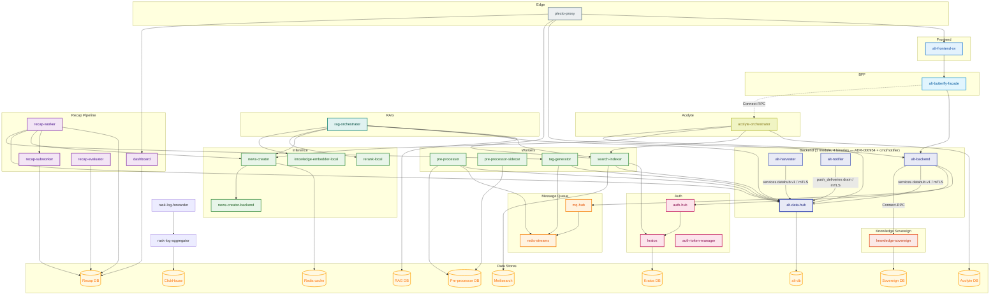

# Alt Platform Microservices

_Last reviewed: September 5, 2026_

## Overview

Alt は Compose-first の AI 拡張 RSS ナレッジプラットフォームです。Docker Compose がオーケストレーションの source of truth です。AI / Recap / RAG / Acolyte / Sovereign / logging / observability / PKI / Pact はすべて本番 `include:` チェーン（`compose/compose.yaml`）に入っている。profiled-only は `alt-perf` / `k6`（profile `perf`）と `docker-socket-proxy` / `restic-backup`（profile `backup`）の **4** 本で、include チェーンの中で `profiles:` を宣言しているのはこの 4 本だけ。本番 include チェーンは **77 declared / 63 long-running**（ephemeral 10 + profiled 4）。accidental OSU cap は **16**（`*-logs` のみ）。会計の正本は [[ops-surface-budget]] / [[000979]]。

> **インシデント対応・障害パターンの入口**: 症状起点の調査は [[runbooks/README|runbooks 索引]] (症状 → runbook 対応表)、横断的な障害パターン知識は [[runbooks/crystallized-knowledge]] (ADR 940 本 / PM 46 本の結晶化) から入る。

## Service Categories

### Core Services
Host ports below are what the stacks included by `compose/compose.yaml` publish, plus
the optional `compose.augur.yaml` overlay. Most are bound to
`127.0.0.1` and so answer on the Docker host only — east-west callers use the container
DNS name and the in-container port. The exceptions are exactly the rows flagged
`[all NICs]` in [Quick Reference - Ports](#quick-reference---ports), plus `pact-broker`,
which binds `${PROD_TAILNET_IP}` (tailnet) in addition to `127.0.0.1`. Do not infer the
bind address from this table — check the `ports:` entry in the compose file. The dev,
staging and load-test overlays (`compose/dev.yaml`, `compose/frontend-dev.yaml`,
`compose/compose.staging.yaml`, `compose/load-test.yaml`, `compose.dev.yaml`) publish on
all interfaces and are out of scope here.

| Service | Language | Host Port(s) | Compose File | Health Endpoint | Notes |
|---------|----------|--------------|--------------|-----------------|-------|
| plecto-proxy | Rust (PlectoProxy 0.11.1) | 80 → 8443, 8080 | core.yaml | `plecto healthz` / admin `/healthz` `/readyz` (:8080) | Edge/ingress; replaced nginx. Routes in `plecto/manifest.toml`。upstream は alt-frontend-sv / alt-backend / kratos / dashboard の 4 本 |
| alt-frontend-sv | TypeScript (SvelteKit 2.x, Bun) | 4173 | core.yaml | `/health` | Knowledge Home admin at `/admin/knowledge-home` |
| alt-backend | Go 1.26.6 (Echo) | 9000, 9101, 9102 | core.yaml | `/v1/health` (:9000), `/health` `/health/deep` (:9110) | User-facing API。Knowledge Home の admin / reproject API は持つが projector 本体は knowledge-sovereign 側 |
| alt-harvester | Go 1.26.6 | なし | core.yaml | `/health` (:9110) | 7 定期ジョブ専用。業務リスナーなし |
| alt-notifier | Go 1.26.6 | なし | core.yaml | `/health` (:9110) | `push_deliveries` を drain して Web Push を送る。VAPID 秘密鍵はこのコンテナのみ。API を持たない |
| alt-data-hub | Go 1.26.6 | なし | core.yaml | `/health` (:9110)、`/health/deep` は mTLS `:9443` 側 | alt-db の唯一のオーナー。業務面は mTLS `:9443` のみ |
| alt-butterfly-facade | Go 1.26.6 | 9250 | bff.yaml | `/alt-butterfly-facade healthcheck` | BFF。alt-backend と acolyte-orchestrator の両方を束ねる |

> **alt-backend / alt-harvester / alt-notifier / alt-data-hub は 1 ディレクトリ 4 バイナリ**（[[000954]] が 3 本を切り出し、その後 `cmd/notifier` が 4 本目として加わった）。
> `alt-backend/app` という単一 Go モジュール (`module alt`) から `cmd/backend` /
> `cmd/harvester` / `cmd/notifier` / `cmd/datahub` を切り出し、同じ `alt-backend/Dockerfile.backend`
> を `--build-arg BINARY=backend|harvester|notifier|datahub` で 4 イメージにビルドする
> （`BINARY` 未指定・存在しない `cmd/` はビルド失敗）。責務は次のとおり。
>
> | バイナリ | 責務 | リスナー |
> |---|---|---|
> | `alt-backend` (`cmd/backend`) | ユーザ向け API。BFF が叩く面 | REST `:9000` / Connect `:9101` / オペレータ `:9102`（admin Connect 2 サービス、loopback バインド）/ ops `:9110` |
> | `alt-harvester` (`cmd/harvester`) | `orchestrator/job/` の 7 定期ジョブ（`ogp-image-warmer` のみ `IMAGE_PROXY_ENABLED` 依存で、無効なら登録自体しない） | ops `:9110` のみ（業務リスナーなし） |
> | `alt-notifier` (`cmd/notifier`) | `push_deliveries` を drain し、各デバイスの push service へ送る Web Push dispatcher | ops `:9110` のみ（業務リスナーなし） |
> | `alt-data-hub` (`cmd/datahub`) | alt-db の唯一のオーナー。`services.datahub.v1.DataHubService` を serve | mTLS `:9443` + ops `:9110`。**publish ゼロ** |
>
> `cmd/` にはもう 1 本 `fix_article_titles` があるが、これは one-shot の運用スクリプトで
> コンテナ化されていない。`go build ./cmd/...` はこれもビルドするため、
> 「4 バイナリ」は常駐コンテナの数を指す。
>
> `:9110` は 4 バイナリ共通の ops リスナー（`bootstrap.NewOpsHandler`）で、
> `/health` と `/metrics` を出す。ホストには publish されない。`/health/deep` を
> `:9110` に載せるのは `cmd/backend` だけで（`bootstrap.WithDeepHealth`）、
> alt-data-hub の deep health は mTLS `:9443` 側にある。Prometheus は 4 バイナリを
> 別々の scrape job として持つ。
> alt-backend / alt-harvester / alt-notifier は DB 依存ゼロ（`go list -deps` の CI ガードで強制）であり、
> DB DSN と DB secret は alt-data-hub の専有。旧 `services.backend.v1.BackendInternalService`
> と `/v1/internal/*` REST は削除済み。

### Worker Services
| Service | Language | Host Port(s) | Compose File | Health Endpoint |
|---------|----------|--------------|--------------|-----------------|
| pre-processor | Go 1.26.6 | 9200, 9202 | ai.yaml | `/pre-processor healthcheck` |
| pre-processor-sidecar | Go 1.26.6 | なし | workers.yaml | なし（`INOREADER_SYNC` は compose 既定で無効） |
| search-indexer | Go 1.26.6 | 9300, 9301 | workers.yaml | `/search-indexer healthcheck` |
| tag-generator | Python 3.14 (FastAPI) | 9400 | workers.yaml | `/health` |

`pre-processor` / `search-indexer` / `tag-generator` はいずれも業務ポートに加えて
mTLS `:9443`（`MTLS_PORT`）と ops `:9110`（`OPS_LISTEN`）を持つが、どちらも publish
されない。`tag-generator` の `:9400` は loopback publish で、`PeerIdentityMiddleware`
は `strict=False` で走るため peer 名の強制は行っていない。

### Inference Services
| Service | Language / Base | Host Port(s) | Compose File | Health Endpoint | GPU |
|---------|-----------------|--------------|--------------|-----------------|-----|
| news-creator | Python 3.14 (FastAPI, priority-queue proxy) | 11434 | ai.yaml | `/health`（`/health/deep` が Ollama を叩く） | なし |
| news-creator-backend | Ollama（`news-creator/Dockerfile.backend`） | 11435 | ai.yaml | `/api/tags` | NVIDIA |
| rerank-local | Python 3.14 (`rerank-server/`) | 8082 → 8080 | rag.yaml | `/health` | CPU |
| knowledge-embedder-local | Ollama（`knowledge-embedder/`） | 11437 → 11434 | rag.yaml | `/api/tags` | NVIDIA |
| knowledge-augur | Ollama 0.32.14 | 11435 → 11434 | compose.augur.yaml | `/api/tags` | AMD / Vulkan（`/dev/kfd`, `/dev/dri`） |
| knowledge-embedder | Ollama 0.32.14 | 11436 → 11434 | compose.augur.yaml | - | AMD / Vulkan |

`news-creator`（FastAPI）と `news-creator-backend`（Ollama ランナー）は別コンテナで、
GPU を持つのは後者だけ。deployed default は `LLM_MODEL=gemma4-e4b-12k` /
`MODEL_ROUTING_ENABLED=false`。`rerank-local` は `RERANK_MODEL` 既定
`cl-nagoya/ruri-v3-reranker-310m`、`knowledge-embedder-local` は
`EMBEDDING_MODELS=bge-m3`。GPU 逼迫時の evict を避けるため embedding 用インスタンスを
生成用と分離してある。

`compose.augur.yaml` は **include チェーンの外にある standalone overlay** で、
独自の `augur-network` にしか繋がらない。したがって rag-orchestrator から
`knowledge-augur` という compose 名は解決できず、既定の Ask Augur 経路でもない
（既定は `AUGUR_EXTERNAL=http://news-creator:11434`）。モデルは Modelfile から
`gpt-oss20b-cpu` / `gpt-oss20b-igpu` / `qwen3-8b-rag` / `gemma3-4b-rag` を作り、
`AUGUR_KNOWLEDGE_MODEL` 既定 `gemma3-4b-rag` を preload する。Swallow 系モデルは
リポジトリ内のどこにも残っていない。

### Auth Services
| Service | Language | Host Port(s) | Compose File | Health Endpoint |
|---------|----------|--------------|--------------|-----------------|
| kratos | - (Ory Kratos v1.3.0) | 4433 | auth.yaml | `/admin/health/ready` (:4434, publish なし) |
| auth-hub | Go 1.26.6 (Echo) | なし | auth.yaml | `/auth-hub healthcheck` |
| auth-token-manager | Deno 2.x | 9201 | workers.yaml | `deno run` ベースの healthcheck |

`auth-hub` はホストポートを publish しない（`:8888` はコンテナ内のみ、mTLS `:9443` と
ops `:9110` も同様）。edge の認証委譲は plecto-proxy 側に **移植されておらず**、
`nginx/conf.d/default.conf` は読み込まれていないプロトタイプ。

### Message Queue Services
| Service | Language | Host Port(s) | Compose File | Health Endpoint |
|---------|----------|--------------|--------------|-----------------|
| redis-streams | Redis 8.4.5 | 6380 → 6379 | mq.yaml | `redis-cli ping` |
| mq-hub | Go 1.26.6 | 9500 | mq.yaml | `/health` |

### Report Generation Services (Acolyte)
| Service | Language | Host Port(s) | Compose File | Health Endpoint |
|---------|----------|--------------|--------------|-----------------|
| acolyte-orchestrator | Python 3.14 (Starlette + Connect-RPC + LangGraph) | 8090 | acolyte.yaml | `/health`（Connect は `/alt.acolyte.v1.AcolyteService/…`） |
| acolyte-db | PostgreSQL 18.6 | 5439 → 5432 | acolyte.yaml | `pg_isready` |
| acolyte-db-migrator | Atlas（`acolyte-migration-atlas/`） | - | acolyte.yaml | - |

acolyte-orchestrator は uvicorn の HTTP/1.1 で serve しているため `grpcurl` では到達
できない。Connect-over-HTTP（`curl -H 'Content-Type: application/json'`）を使う。

### Recap Pipeline Services
| Service | Language | Host Port(s) | Compose File | Health Endpoint |
|---------|----------|--------------|--------------|-----------------|
| recap-worker | Rust（toolchain 1.95.0 / production image は rust:1.94-bookworm） | 9005 | recap.yaml | `/recap-worker healthcheck` |
| recap-subworker | Python 3.14 (FastAPI) | 8002 | recap.yaml | `/health` |
| dashboard | Python (Streamlit) | 8501, 8502 → 8000 | recap.yaml | compose healthcheck なし |
| recap-evaluator | Python 3.14 (FastAPI) | 8085 → 8080 | recap.yaml | `/health`（compose healthcheck は未定義） |

recap-subworker は NVIDIA GPU を 1 枚予約する（`count: 1`）。dashboard も
`utility` capability で GPU を予約するが、これは監視用途で推論ではない。

### RAG Services
| Service | Language | Host Port(s) | Compose File | Health Endpoint |
|---------|----------|--------------|--------------|-----------------|
| rag-orchestrator | Go 1.26.6 | 9010, 9011 | rag.yaml | `/healthz` (:9010)、`/health` (:9110 ops) |

`rag-orchestrator` は REST `:9010` / Connect `:9011` / PKI ops `:9110` の 3 リスナーを持つ。
推論の相方は `rerank-local` / `knowledge-embedder-local`（上の Inference Services）。

### Knowledge Sovereign Services
| Service | Language | Host Port(s) | Compose File | Health Endpoint |
|---------|----------|--------------|--------------|-----------------|
| knowledge-sovereign | Go 1.26.6 | 9510 → 9500, 9511 → 9501 | sovereign.yaml | `/health` (:9501) |
| knowledge-sovereign-db-migrator | Atlas（`knowledge-sovereign/migrations/`） | - | sovereign.yaml | - |

`:9500` は event-log RPC（`ListKnowledgeEvents` / `AppendKnowledgeEvent`）、
`:9501` は metrics / health と admin 面（`ADMIN_TOKEN_FILE` で Bearer 認証）。
Knowledge Home / Knowledge Trail の projector はこのサービスが持つ
（`usecase/knowledge_home_projector`, `usecase/knowledge_trail_projector`）。

### PKI Services
| Service | Language | Host Port(s) | Compose File | Health Endpoint |
|---------|----------|--------------|--------------|-----------------|
| step-ca | - (smallstep/step-ca 0.30.2) | なし | pki.yaml | `step ca health` |
| step-ca-bootstrap | oneshot (step-ca image) | - | pki.yaml | - |
| pki-agent | Go | - | **not a compose workload** | tooling only |

> **Workload sidecar は退役**（[[000978]]）。east-west 14 親（alt-backend / alt-harvester / alt-notifier / alt-data-hub / alt-butterfly-facade / auth-hub / pre-processor / search-indexer / tag-generator / recap-worker / recap-subworker / acolyte-orchestrator / news-creator / rag-orchestrator）が **in-process** で enroll / renew する（`PKI_ENROLLMENT=enabled`、subject-scoped JWK `pki-agent-<subject>`）。14 本の `pki-agent-*-jwk` secret がその親にだけマウントされているのが実装上の数え方。pki-agent イメージと `pki-agent/scripts/bootstrap-pki-provisioner.sh` は **CA 側 tooling**（provisioner + CN allowlist）として残る。compose に `pki-agent-*` を再宣言すると同一 cert volume の dual writer になる。ops `:9110` は親プロセスの private 面で、ホストへ publish しない。

### Data Stores
| Service | Type | Host Port(s) | Compose File | Health Endpoint |
|---------|------|--------------|--------------|-----------------|
| db | PostgreSQL 17.11-alpine | 5432 | db.yaml | `pg_isready` |
| pgbouncer | pgbouncer v1.25.1 (db 前段) | なし | pgbouncer.yaml | `pg_isready -p 6432` |
| kratos-db | PostgreSQL 16.15-alpine | 5434 → 5432 | auth.yaml | `pg_isready` |
| pgbouncer-kratos | pgbouncer v1.25.1 (kratos-db 前段) | なし | pgbouncer.yaml | `pg_isready -p 6432` |
| recap-db | PostgreSQL 18.6 + pg_cron（`docker/postgres/Dockerfile.recap-db`） | 5435 → 5432 | recap.yaml | `pg_isready` |
| rag-db | PostgreSQL 18.6 + pgvector（`rag-db/Dockerfile`） | 5436 → 5432 | rag.yaml | `pg_isready` |
| pre-processor-db | PostgreSQL 17.11-alpine | 5437 → 5432 | db.yaml | `pg_isready` |
| knowledge-sovereign-db | PostgreSQL 16.15-alpine | 5438 → 5432 | sovereign.yaml | `pg_isready` |
| acolyte-db | PostgreSQL 18.6-alpine | 5439 → 5432 | acolyte.yaml | `pg_isready` |
| pact-db | PostgreSQL 16.15-alpine | なし | pact.yaml | `pg_isready` |
| meilisearch | Meilisearch v1.27.0 | 7700 | db.yaml | `/health` |
| clickhouse | ClickHouse 25.9 | 8123, 9009 → 9000 | db.yaml | `/ping` |
| redis-streams | Redis 8.4.5-alpine | 6380 → 6379 | mq.yaml | `redis-cli ping` |
| redis-cache | Redis 8.0.2-alpine | なし | ai.yaml | `redis-cli ping` |

DB の所有関係は 1 サービス 1 DB ではない。`db`（alt-db）だけが alt-data-hub 専有で、
`recap-db` / `rag-db` / `acolyte-db` / `kratos-db` / `knowledge-sovereign-db` /
`pre-processor-db` はそれぞれのサービスが直接繋ぐ。

### Observability Services
| Service | Language / Image | Host Port(s) | Compose File | Health Endpoint |
|---------|------------------|--------------|--------------|-----------------|
| rask-log-aggregator | Rust (Axum) | なし（:9600, :4317, :4318 は内部のみ） | logging.yaml | `/rask-log-aggregator healthcheck` |
| rask-log-forwarder (16x) | Rust | なし | logging.yaml | `/rask-log-forwarder healthcheck` |
| prometheus | prom/prometheus v3.1.0 | 9090 | observability.yaml | `/-/healthy` |
| alertmanager | prom/alertmanager v0.28.1 | 9093 | observability.yaml | `/-/healthy` |
| grafana | grafana/grafana 11.4.0 | 3001 → 3000 `[all NICs]` | observability.yaml | `/api/health` |
| cadvisor | gcr.io/cadvisor v0.51.0 | 8181 → 8080 | observability.yaml | `/healthz` |

forwarder は 16 本ちょうどで、これが accidental OSU cap そのもの。内訳は
`nginx-logs`, `alt-backend-logs`, `alt-harvester-logs`, `alt-data-hub-logs`,
`auth-hub-logs`, `tag-generator-logs`, `pre-processor-logs`, `search-indexer-logs`,
`news-creator-logs`, `news-creator-backend-logs`, `recap-worker-logs`,
`recap-subworker-logs`, `dashboard-logs`, `recap-evaluator-logs`,
`rag-orchestrator-logs`, `mq-hub-logs`。`nginx-logs` は名前だけが残っているが、
`TARGET_SERVICE` の既定値は `plecto-proxy` で、edge の実体を正しく追っている。
`alt-notifier` / `knowledge-sovereign` / `alt-butterfly-facade` /
`alt-frontend-sv` / `acolyte-orchestrator` / `pre-processor-sidecar` には
専用 forwarder が付いていない（cap を上げずに済ませている裏返し）。

### Contract Testing
| Service | Image | Host Port(s) | Compose File | Health Endpoint |
|---------|-------|--------------|--------------|-----------------|
| pact-broker | pactfoundation/pact-broker 2.139.0 | 9292（`127.0.0.1` と `${PROD_TAILNET_IP}` の 2 箇所に bind） | pact.yaml | Basic 認証付き HTTP probe |
| pact-db | PostgreSQL 16.15-alpine | なし | pact.yaml | `pg_isready` |

`compose/pact.yaml` はかつて `profiles: [pact]` の opt-in だったが、常時起動に
昇格しており、いまは profile を宣言していない。

### Ephemeral (one-shot) Units
`service_completed_successfully` で待たれる 10 本。long-running OSU には数えない。

| Service | Compose File | 役割 |
|---------|--------------|------|
| migrate | core.yaml | alt-db Atlas migration（`migrations-atlas/`） |
| pre-processor-db-migrator | db.yaml | pre-processor-db Atlas migration |
| clickhouse-migrator | db.yaml | ClickHouse スキーマ適用 |
| kratos-migrate | auth.yaml | Kratos schema migration |
| recap-db-migrator | recap.yaml | recap-db Atlas migration |
| rag-db-migrator | rag.yaml | rag-db Atlas migration |
| acolyte-db-migrator | acolyte.yaml | acolyte-db Atlas migration |
| knowledge-sovereign-db-migrator | sovereign.yaml | knowledge-sovereign-db Atlas migration |
| oauth-token-init | workers.yaml | `oauth_token_data` の初期化 |
| step-ca-bootstrap | pki.yaml | step-ca の provisioner / trust bundle 生成 |

### CLI & Tools
| Name | Language | Description |
|------|----------|-------------|
| altctl | Go 1.26.6 (Cobra) | Docker Compose オーケストレーション CLI。`up` / `down` / `home reproject` / `home slo` などを持つ |
| alt-perf | Deno 2.x (Astral) | E2E パフォーマンス計測（profile `perf`） |
| k6 | grafana/k6 0.55.0 | 負荷シナリオ実行（profile `perf`） |
| restic-backup | restic（`compose/backup.yaml`） | ボリューム / DB バックアップ（profile `backup`） |
| docker-socket-proxy | tecnativa/docker-socket-proxy v0.4.2 | restic-backup 用の Docker socket 仲介（profile `backup`） |

### Retired / not deployed
| Name | 状態 |
|------|------|
| nginx | plecto-proxy に置換済み。`nginx/` のコンフィグは読み込まれていない。include チェーンに `nginx` サービスは存在しない（`nginx-logs` は forwarder の名前が残っているだけ） |
| alt-frontend | Next.js 版フロントエンド。削除済み。[docs/alt-frontend.md](./alt-frontend.md) は歴史記録 |
| pki-agent サイドカー | 14 本すべて退役（[[000978]]）。親プロセスの in-process enrollment に置換 |
| sidecar-proxy | `alt-backend/sidecar-proxy` にコードと Dockerfile はあるが、compose ワークロードとしては宣言されていない |
| genre-classifier | ソースなし（`.venv` の残骸のみ）。compose 参照ゼロ |
| feed-validator | 学習用プロジェクト。compose ワークロードではない |

---

## Compose File Mapping

`compose/compose.yaml` の `include:` に並ぶ 18 ファイル（`base.yaml` は
`extends` / anchors の供給元で include されない）。**profile 列に値があるのは 4 本だけ**
で、それ以外は include されるだけで起動する。

| Compose File | Services | Profile |
|--------------|----------|---------|
| base.yaml | 共通設定 (networks, volumes, secrets, anchors) — include されない | - |
| core.yaml | plecto-proxy, alt-frontend-sv, alt-backend, alt-harvester, alt-notifier, alt-data-hub, migrate | - |
| bff.yaml | alt-butterfly-facade | - |
| db.yaml | db, meilisearch, clickhouse, clickhouse-migrator, pre-processor-db, pre-processor-db-migrator | - |
| pgbouncer.yaml | pgbouncer, pgbouncer-kratos | - |
| auth.yaml | kratos-db, kratos-migrate, kratos, auth-hub | - |
| workers.yaml | pre-processor-sidecar, search-indexer, tag-generator, oauth-token-init, auth-token-manager | - |
| mq.yaml | redis-streams, mq-hub | - |
| ai.yaml | redis-cache, news-creator-backend, news-creator, pre-processor | - |
| recap.yaml | recap-db, recap-db-migrator, recap-worker, recap-subworker, dashboard, recap-evaluator | - |
| rag.yaml | rag-db, rag-db-migrator, rag-orchestrator, knowledge-embedder-local, rerank-local | - |
| acolyte.yaml | acolyte-db, acolyte-db-migrator, acolyte-orchestrator | - |
| sovereign.yaml | knowledge-sovereign-db, knowledge-sovereign-db-migrator, knowledge-sovereign | - |
| pki.yaml | step-ca, step-ca-bootstrap（workload pki-agent sidecar は 0。enrollment は親 in-process） | - |
| logging.yaml | rask-log-aggregator, 16x rask-log-forwarder | - |
| observability.yaml | prometheus, alertmanager, grafana, cadvisor | - |
| pact.yaml | pact-db, pact-broker | - |
| perf.yaml | alt-perf, k6 | `perf` |
| backup.yaml | docker-socket-proxy, restic-backup | `backup` |
| compose.augur.yaml | knowledge-augur, knowledge-augur-volume-init, knowledge-embedder, knowledge-embedder-volume-init | include されない standalone overlay |

`compose/dev.yaml` / `compose/frontend-dev.yaml` / `compose/compose.dev.yaml` /
`compose/compose.staging.yaml` / `compose/load-test.yaml` / `compose/news-creator-ollama-stub`
はオーバーレイであり、`compose/compose.yaml` の include チェーンには入っていない。

---

## Service Dependency Graph


```mermaid
flowchart TB
    subgraph Edge["Edge"]
        plecto-proxy
    end

    subgraph Frontend["Frontend"]
        alt-frontend-sv
    end

    subgraph BFF["BFF"]
        alt-butterfly-facade
    end

    subgraph Backend["Backend (1 module, 4 binaries — ADR-000954 + cmd/notifier)"]
        direction LR
        alt-backend
        alt-harvester
        alt-notifier
        alt-data-hub
    end

    subgraph Auth["Auth"]
        direction LR
        kratos
        auth-hub
        auth-token-manager
    end

    subgraph Workers["Workers"]
        direction LR
        pre-processor
        pre-processor-sidecar
        search-indexer
        tag-generator
    end

    subgraph Inference["Inference"]
        direction LR
        news-creator
        news-creator-backend
        rerank-local
        knowledge-embedder-local
    end

    subgraph MQ["Message Queue"]
        direction LR
        redis-streams
        mq-hub
    end

    subgraph Recap["Recap Pipeline"]
        direction LR
        recap-worker
        recap-subworker
        dashboard
        recap-evaluator
    end

    subgraph RAG["RAG"]
        rag-orchestrator
    end

    subgraph Acolyte["Acolyte"]
        acolyte-orchestrator
    end

    subgraph Sovereign["Knowledge Sovereign"]
        knowledge-sovereign
    end

    subgraph DataStores["Data Stores"]
        direction LR
        db[(alt-db)]
        kratos-db[(Kratos DB)]
        recap-db[(Recap DB)]
        rag-db[(RAG DB)]
        acolyte-db[(Acolyte DB)]
        pre-processor-db[(Pre-processor DB)]
        sovereign-db[(Sovereign DB)]
        meilisearch[(Meilisearch)]
        clickhouse[(ClickHouse)]
        redis-cache[(Redis cache)]
    end

    %% Request flow (plecto upstreams: alt-frontend-sv, alt-backend, kratos, dashboard)
    plecto-proxy --> alt-frontend-sv & alt-backend & kratos & dashboard
    alt-frontend-sv --> alt-butterfly-facade --> alt-backend
    alt-backend --> mq-hub & auth-hub
    auth-hub --> kratos --> kratos-db

    %% alt-db ownership (ADR-000241 + ADR-000954): alt-data-hub is the only
    %% process holding a DB DSN. Everyone else, alt-backend and alt-harvester
    %% included, goes through services.datahub.v1.DataHubService over mTLS :9443.
    alt-data-hub --> db
    alt-backend -->|"services.datahub.v1 / mTLS"| alt-data-hub
    alt-harvester -->|"services.datahub.v1 / mTLS"| alt-data-hub
    alt-notifier -->|"push_deliveries drain / mTLS"| alt-data-hub

    %% Knowledge Home / Trail: the event log and every projection live in
    %% knowledge-sovereign-db, not alt-db. alt-backend only holds the admin
    %% and reproject API and calls knowledge-sovereign over Connect-RPC.
    alt-backend -->|"Connect-RPC"| knowledge-sovereign
    knowledge-sovereign --> sovereign-db

    %% Worker connections
    search-indexer --> alt-data-hub & meilisearch
    tag-generator --> alt-data-hub & redis-streams
    pre-processor --> alt-data-hub & redis-streams & pre-processor-db
    pre-processor-sidecar --> pre-processor-db
    news-creator --> redis-cache & news-creator-backend
    mq-hub --> redis-streams

    %% Acolyte connections
    alt-butterfly-facade -.->|"Connect-RPC"| acolyte-orchestrator
    acolyte-orchestrator --> acolyte-db & search-indexer & news-creator & alt-data-hub

    %% Pipeline connections
    recap-worker --> recap-db & recap-subworker & news-creator & alt-data-hub & tag-generator
    recap-subworker & dashboard & recap-evaluator --> recap-db
    rag-orchestrator --> rag-db & search-indexer & alt-data-hub & news-creator
    rag-orchestrator --> rerank-local & knowledge-embedder-local

    %% Logging
    rask-log-forwarder --> rask-log-aggregator --> clickhouse

    %% Styling - Edge (gray)
    style plecto-proxy fill:#eceff1,stroke:#546e7a,color:#37474f,stroke-width:2px

    %% Styling - Frontend (blue)
    style alt-frontend-sv fill:#e3f2fd,stroke:#1976d2,color:#0d47a1,stroke-width:2px

    %% Styling - BFF (light blue)
    style alt-butterfly-facade fill:#e1f5fe,stroke:#0288d1,color:#01579b,stroke-width:2px

    %% Styling - Backend (indigo)
    style alt-backend fill:#e8eaf6,stroke:#3f51b5,color:#1a237e,stroke-width:2px
    style alt-harvester fill:#e8eaf6,stroke:#3f51b5,color:#1a237e,stroke-width:2px
    style alt-notifier fill:#e8eaf6,stroke:#3f51b5,color:#1a237e,stroke-width:2px
    style alt-data-hub fill:#e8eaf6,stroke:#3f51b5,color:#1a237e,stroke-width:3px

    %% Styling - Auth (pink)
    style kratos fill:#fce4ec,stroke:#c2185b,color:#880e4f,stroke-width:2px
    style auth-hub fill:#fce4ec,stroke:#c2185b,color:#880e4f,stroke-width:2px
    style auth-token-manager fill:#fce4ec,stroke:#c2185b,color:#880e4f,stroke-width:2px

    %% Styling - Workers (green)
    style pre-processor fill:#e8f5e9,stroke:#388e3c,color:#1b5e20,stroke-width:2px
    style pre-processor-sidecar fill:#e8f5e9,stroke:#388e3c,color:#1b5e20,stroke-width:2px
    style search-indexer fill:#e8f5e9,stroke:#388e3c,color:#1b5e20,stroke-width:2px
    style tag-generator fill:#e8f5e9,stroke:#388e3c,color:#1b5e20,stroke-width:2px

    %% Styling - Inference (green)
    style news-creator fill:#e8f5e9,stroke:#388e3c,color:#1b5e20,stroke-width:2px
    style news-creator-backend fill:#e8f5e9,stroke:#388e3c,color:#1b5e20,stroke-width:2px
    style rerank-local fill:#e8f5e9,stroke:#388e3c,color:#1b5e20,stroke-width:2px
    style knowledge-embedder-local fill:#e8f5e9,stroke:#388e3c,color:#1b5e20,stroke-width:2px

    %% Styling - MQ (orange)
    style redis-streams fill:#fff3e0,stroke:#f57c00,color:#e65100,stroke-width:2px
    style mq-hub fill:#fff3e0,stroke:#f57c00,color:#e65100,stroke-width:2px

    %% Styling - Recap (purple)
    style recap-worker fill:#f3e5f5,stroke:#7b1fa2,color:#4a148c,stroke-width:2px
    style recap-subworker fill:#f3e5f5,stroke:#7b1fa2,color:#4a148c,stroke-width:2px
    style dashboard fill:#f3e5f5,stroke:#7b1fa2,color:#4a148c,stroke-width:2px
    style recap-evaluator fill:#f3e5f5,stroke:#7b1fa2,color:#4a148c,stroke-width:2px

    %% Styling - RAG (teal)
    style rag-orchestrator fill:#e0f2f1,stroke:#00796b,color:#004d40,stroke-width:2px

    %% Styling - Acolyte (lime)
    style acolyte-orchestrator fill:#f0f4c3,stroke:#afb42b,color:#827717,stroke-width:2px

    %% Styling - Knowledge Sovereign (deep orange)
    style knowledge-sovereign fill:#fbe9e7,stroke:#e64a19,color:#bf360c,stroke-width:2px

    %% Styling - Data Stores (amber)
    style db fill:#fff8e1,stroke:#ffa000,color:#ff6f00,stroke-width:2px
    style kratos-db fill:#fff8e1,stroke:#ffa000,color:#ff6f00,stroke-width:2px
    style recap-db fill:#fff8e1,stroke:#ffa000,color:#ff6f00,stroke-width:2px
    style rag-db fill:#fff8e1,stroke:#ffa000,color:#ff6f00,stroke-width:2px
    style acolyte-db fill:#fff8e1,stroke:#ffa000,color:#ff6f00,stroke-width:2px
    style pre-processor-db fill:#fff8e1,stroke:#ffa000,color:#ff6f00,stroke-width:2px
    style sovereign-db fill:#fff8e1,stroke:#ffa000,color:#ff6f00,stroke-width:2px
    style meilisearch fill:#fff8e1,stroke:#ffa000,color:#ff6f00,stroke-width:2px
    style clickhouse fill:#fff8e1,stroke:#ffa000,color:#ff6f00,stroke-width:2px
    style redis-cache fill:#fff8e1,stroke:#ffa000,color:#ff6f00,stroke-width:2px
```

---

## Quick Reference - Ports

**Host** ports only — i.e. what a `ports:` entry actually publishes. Unless marked
`[all NICs]`, the bind address is `127.0.0.1`, so the port answers on the Docker host
and nowhere else. `(→ N)` is the in-container port when it differs from the host port.

```
80      → plecto-proxy (edge/ingress, → 8443)     [all NICs]
3001    → grafana (→ 3000)                        [all NICs]
4173    → alt-frontend-sv (SvelteKit)
4433    → kratos (public API)
5432    → db (alt-db, PostgreSQL 17.11)
5434    → kratos-db (PostgreSQL 16.15, → 5432)
5435    → recap-db (PostgreSQL 18.6 + pg_cron, → 5432)
5436    → rag-db (PostgreSQL 18.6 + pgvector, → 5432)
5437    → pre-processor-db (PostgreSQL 17.11, → 5432)
5438    → knowledge-sovereign-db (PostgreSQL 16.15, → 5432)
5439    → acolyte-db (PostgreSQL 18.6, → 5432)
6380    → redis-streams (→ 6379)
7700    → meilisearch
8002    → recap-subworker
8080    → plecto-proxy admin (/metrics /healthz /readyz)
8082    → rerank-local (→ 8080)
8085    → recap-evaluator (→ 8080)
8090    → acolyte-orchestrator (Connect-RPC over HTTP/1.1)
8123    → clickhouse (HTTP)
8181    → cadvisor (→ 8080)
8501    → dashboard (Streamlit)
8502    → dashboard (metrics, → 8000)
9000    → alt-backend (REST)
9005    → recap-worker
9009    → clickhouse (native, → 9000)
9010    → rag-orchestrator (REST)
9011    → rag-orchestrator (Connect-RPC)
9090    → prometheus
9093    → alertmanager
9101    → alt-backend (Connect-RPC)
9102    → alt-backend (admin Connect only, unauthenticated — loopback only)
9200    → pre-processor (REST)
9201    → auth-token-manager
9202    → pre-processor (Connect-RPC)
9250    → alt-butterfly-facade
9292    → pact-broker (also bound on ${PROD_TAILNET_IP})
9300    → search-indexer (REST)
9301    → search-indexer (Connect-RPC)
9400    → tag-generator
9500    → mq-hub
9510    → knowledge-sovereign (event-log RPC, → 9500)
9511    → knowledge-sovereign (metrics/health/admin, → 9501)
11434   → news-creator (FastAPI priority-queue proxy)
11435   → news-creator-backend (Ollama runner, ai.yaml)
11435   → knowledge-augur (compose.augur.yaml, → 11434)  [all NICs, conflicts with the row above]
11436   → knowledge-embedder (compose.augur.yaml, → 11434) [all NICs]
11437   → knowledge-embedder-local (rag.yaml, → 11434)
```

**No host port at all** — reachable only from inside `alt-network` via the container
DNS name: `alt-harvester` (:9110), `alt-notifier` (:9110),
`alt-data-hub` (:9443 mTLS, :9110), `auth-hub` (:8888, :9443, :9110),
`kratos` admin (:4434), `pgbouncer` / `pgbouncer-kratos` (:6432),
`rask-log-aggregator` (:9600, :4317, :4318), `redis-cache`, `pre-processor-sidecar`,
`pact-db`, `step-ca`, and every `*-logs` forwarder.
`curl http://localhost:<port>` against any of these cannot work;
use `docker compose exec <service> …` instead. The 14 parents' PKI ops `:9110`
and their mTLS `:9443` listeners are also unpublished (Prometheus scrapes via
Compose DNS). Workload `pki-agent-*` sidecars are not declared.

`alt-data-hub` の publish ゼロは意図的な境界であり、
`scripts/compose-port-audit.py` が CI で門にしている（[[000954]] D5）。
`:9443` は mTLS 専用で peer allowlist (`DATAHUB_ALLOWED_PEERS`) を通らない証明書は
拒否されるため、`curl` では到達できない。4 バイナリ共通の `:9110` も publish されない。

---

## Getting Started

### Default Stack (production include)

```bash
altctl up
# または
docker compose -f compose/compose.yaml -p alt up -d
```

AI / Recap / RAG / Acolyte / Sovereign / logging / observability / PKI / Pact は
すべて上記 include に含まれる。`--profile ollama` 等は使わない（そのような profile は
どの compose ファイルにも宣言されていない）。

profiled-only（明示 `--profile`）: `alt-perf` / `k6`（`perf`）、
`docker-socket-proxy` / `restic-backup`（`backup`）。

### Stack Teardown
```bash
altctl down
# With volumes
altctl down --volumes
```

---

## Health Check Commands

Use `curl -fsS` (not bare `curl`): `-f` makes a non-2xx a non-zero exit and `-S` keeps
the connection error on stderr, so a dead endpoint is loud instead of printing nothing.

```bash
# Core Services
curl -fsS http://localhost:8080/readyz              # plecto-proxy (edge, admin port)
curl -fsS http://localhost:4173/health              # alt-frontend-sv
curl -fsS http://localhost:9000/v1/health           # alt-backend
curl -fsS http://localhost:9250/health              # alt-butterfly-facade

# Data Stores
curl -fsS http://localhost:7700/health              # meilisearch
curl -fsS http://localhost:8123/ping                # clickhouse

# Inference
curl -fsS http://localhost:11434/health             # news-creator (FastAPI proxy)
curl -fsS http://localhost:11435/api/tags           # news-creator-backend (Ollama runner)
curl -fsS http://localhost:8082/health              # rerank-local
curl -fsS http://localhost:11437/api/tags           # knowledge-embedder-local

# Recap Pipeline
curl -fsS http://localhost:9005/health/ready        # recap-worker
curl -fsS http://localhost:8085/health              # recap-evaluator
curl -fsS http://localhost:8002/health              # recap-subworker

# RAG
curl -fsS http://localhost:9010/healthz             # rag-orchestrator

# Acolyte
curl -fsS http://localhost:8090/health              # acolyte-orchestrator

# Message Queue
curl -fsS http://localhost:9500/health              # mq-hub

# Knowledge Sovereign
curl -fsS http://localhost:9511/health              # knowledge-sovereign (host 9511 -> :9501)

# Observability
curl -fsS http://localhost:9090/-/healthy           # prometheus
curl -fsS http://localhost:9093/-/healthy           # alertmanager
```

`auth-hub`, `kratos`'s admin API, `alt-harvester`, `alt-notifier` and `alt-data-hub`
publish no host port, so they have no `localhost` form. Probe them from inside the
network instead:

```bash
docker compose -f compose/compose.yaml -p alt exec auth-hub /auth-hub healthcheck
docker compose -f compose/compose.yaml -p alt exec alt-harvester /app-entry healthcheck
docker compose -f compose/compose.yaml -p alt exec alt-notifier /app-entry healthcheck
docker compose -f compose/compose.yaml -p alt exec alt-data-hub /app-entry healthcheck
docker compose -f compose/compose.yaml -p alt exec kratos \
  wget --spider -q http://127.0.0.1:4434/admin/health/ready
```

---

## Volumes

### Data volumes
| Volume | Service | Purpose |
|--------|---------|---------|
| db_data_17 | db | alt-db PostgreSQL 17 data |
| kratos_db_data | kratos-db | Kratos identity data |
| recap_db_data | recap-db | Recap pipeline data |
| rag_db_data | rag-db | RAG documents + embeddings |
| acolyte_db_data | acolyte-db | Acolyte run / report state |
| knowledge-sovereign-db-data | knowledge-sovereign-db | Knowledge event log + projections |
| pre_processor_db_data | pre-processor-db | pre-processor / pre-processor-sidecar 専有データ |
| pact_db_data | pact-db | Pact Broker data |
| meili_data | meilisearch | Search indices |
| clickhouse_data | clickhouse | Log analytics |
| redis-streams-data | redis-streams | Event streams |
| redis-cache-data | redis-cache | LLM response cache |
| oauth_token_data | auth-token-manager | OAuth2 tokens |
| prometheus_data | prometheus | Metrics TSDB |
| alertmanager_data | alertmanager | Silences + notification log |
| grafana_data | grafana | Dashboards / users |
| step_ca_data | step-ca | CA keys + database |

### Model caches
| Volume | Service |
|--------|---------|
| news_creator_models | news-creator-backend |
| knowledge_embedder_local_models | knowledge-embedder-local |
| rerank_local_models | rerank-local |
| knowledge_augur_models | knowledge-augur（compose.augur.yaml） |
| knowledge_embedder_models | knowledge-embedder（compose.augur.yaml） |

### PKI volumes
`pki_trust_bundle`（全親が read-only でマウントする CA bundle）と、
親ごとの cert volume が 14 本: `alt_backend_certs`, `alt_harvester_certs`,
`alt_notifier_certs`, `alt_data_hub_certs`, `alt_butterfly_facade_certs`,
`auth_hub_certs`, `pre_processor_certs`, `search_indexer_certs`,
`tag_generator_certs`, `news_creator_certs`, `recap_worker_certs`,
`recap_subworker_certs`, `rag_orchestrator_certs`, `acolyte_orchestrator_certs`。

`acolyte-db` / `knowledge-sovereign-db` / `pre-processor-db` のボリュームは
`compose/backup.yaml` の restic-backup にマウントされておらず、バックアップ対象外。
詳細は [[backup-restore]]。

---

## Secrets

`compose/base.yaml` の `secrets:` が宣言し、compose が消費している実体。
旧 `service_secret` / `auth_shared_secret`（`X-Service-Token` 方式）は
[[000743]] で全サービスから撤去済みで、もうどこにも存在しない。

| Secret | Used By |
|--------|---------|
| postgres_password | db, migrate, pgbouncer, alt-data-hub |
| db_password | db |
| pp_db_password | db, pre-processor-db, pre-processor-db-migrator, pre-processor, pre-processor-sidecar |
| pre_processor_sidecar_db_password | db |
| kratos_db_password | kratos-db, kratos, kratos-migrate, pgbouncer-kratos |
| kratos_cookie_secret / kratos_cipher_secret | kratos |
| recap_db_password | recap-db, recap-db-migrator, recap-worker, recap-subworker, recap-evaluator, dashboard |
| rag_db_password | rag-db, rag-db-migrator, rag-orchestrator |
| acolyte_db_password | acolyte-db, acolyte-db-migrator, acolyte-orchestrator |
| sovereign_db_password | knowledge-sovereign-db, knowledge-sovereign-db-migrator, knowledge-sovereign |
| sovereign_admin_token | knowledge-sovereign, alt-frontend-sv |
| meili_master_key | meilisearch, search-indexer |
| meili_search_key | search-indexer |
| clickhouse_password | clickhouse, clickhouse-migrator, rask-log-aggregator, grafana |
| backend_token_secret | auth-hub, alt-backend, alt-butterfly-facade, alt-data-hub, k6 |
| auth_hub_internal_secret | auth-hub, alt-data-hub |
| csrf_secret | auth-hub, alt-backend |
| image_proxy_secret | alt-backend, alt-harvester |
| vapid_public_key | alt-backend |
| vapid_private_key | alt-notifier |
| hugging_face_token | recap-worker |
| inoreader_client_id / inoreader_client_secret | pre-processor-sidecar, auth-token-manager |
| internal_auth_token | pre-processor-sidecar, auth-token-manager |
| grafana_admin_password | grafana |
| pushover_token / pushover_user_key / deadman_ping_url | alertmanager |
| pact_broker_basic_auth_password | pact-broker |
| pact_db_password | pact-broker, pact-db |
| restic_password | restic-backup |
| step_ca_root_password | step-ca |
| `pki-agent-<subject>-jwk` (14 本) | 対応する親サービス 1 本ずつ |

---

## Service Documentation Links

| Service | Documentation |
|---------|---------------|
| alt-backend | [docs/alt-backend.md](./alt-backend.md) |
| alt-harvester | [docs/alt-backend.md](./alt-backend.md) (同一モジュール。分割の根拠は [[000954]]) |
| alt-notifier | [docs/alt-backend.md](./alt-backend.md) (同一モジュール。4 本目のバイナリ) |
| alt-data-hub | [docs/alt-backend.md](./alt-backend.md) (同一モジュール。分割の根拠は [[000954]]) |
| alt-frontend | [docs/alt-frontend.md](./alt-frontend.md) (removed — 歴史記録) |
| alt-frontend-sv | [docs/alt-frontend-sv.md](./alt-frontend-sv.md) |
| alt-butterfly-facade | [docs/alt-butterfly-facade.md](./alt-butterfly-facade.md) |
| pre-processor | [docs/pre-processor.md](./pre-processor.md) |
| pre-processor-sidecar | [docs/pre-processor-sidecar.md](./pre-processor-sidecar.md) |
| search-indexer | [docs/search-indexer.md](./search-indexer.md) |
| tag-generator | [docs/tag-generator.md](./tag-generator.md) |
| news-creator | [docs/news-creator.md](./news-creator.md) |
| auth-hub | [docs/auth-hub.md](./auth-hub.md) |
| auth-token-manager | [docs/auth-token-manager.md](./auth-token-manager.md) |
| mq-hub | [docs/mq-hub.md](./mq-hub.md) |
| recap-worker | [docs/recap-worker.md](./recap-worker.md) |
| recap-subworker | [docs/recap-subworker.md](./recap-subworker.md) |
| recap-db | [docs/recap-db.md](./recap-db.md) |
| dashboard | [docs/dashboard.md](./dashboard.md) |
| recap-evaluator | [docs/recap-evaluator.md](./recap-evaluator.md) |
| rag-orchestrator | [docs/rag-orchestrator.md](./rag-orchestrator.md) |
| rag-db | [docs/rag-db.md](./rag-db.md) |
| acolyte-orchestrator | [docs/acolyte-orchestrator.md](./acolyte-orchestrator.md) |
| acolyte-db | [docs/acolyte-db.md](./acolyte-db.md) |
| knowledge-sovereign | [[wiki/services/knowledge-sovereign]]（docs/services 側のページはまだない） |
| rask-log-aggregator | [docs/rask-log-aggregator.md](./rask-log-aggregator.md) |
| rask-log-forwarder | [docs/rask-log-forwarder.md](./rask-log-forwarder.md) |
| rask-logging-architecture | [docs/rask-logging-architecture.md](./rask-logging-architecture.md) |
| knowledge-augur | [docs/knowledge-augur.md](./knowledge-augur.md) |
| alt-db | [docs/alt-db.md](./alt-db.md) |
| altctl | [docs/altctl.md](./altctl.md) |
| alt-perf | [docs/alt-perf.md](./alt-perf.md) |
| metrics | [docs/metrics.md](./metrics.md) |
| sidecar-proxy | [docs/sidecar-proxy.md](./sidecar-proxy.md)（compose ワークロードではない） |

`plecto-proxy` / `alt-notifier` / `rerank-local` / `knowledge-embedder-local` /
`prometheus` / `alertmanager` / `grafana` / `cadvisor` / `pgbouncer` / `pact-broker`
には専用のサービスページがまだない。plecto のルーティングは
`plecto/manifest.toml` と [[wiki/services/nginx]]（歴史記録）を参照。

---

## LLM Notes

- Inter-service communication via HTTP/REST or Connect-RPC (Protocol Buffers)
- Authentication via auth-hub X-Alt-* headers or JWT tokens
- Service-to-service auth: mTLS のみ。`X-Service-Token` / `SERVICE_SECRET` は [[000743]] で全サービスから撤去済み
- Event-driven via Redis Streams + mq-hub
- **alt-data-hub is the sole data owner for alt-db** ([[000241]] の原則を [[000954]] がプロセス境界として物理化)。alt-backend / alt-harvester / alt-notifier を含む全 consumer は `services.datahub.v1.DataHubService`（Connect-RPC、mTLS `:9443`）経由でのみ alt-db に触れる。`DATAHUB_ALLOWED_PEERS` の既定値が許す peer は alt-backend / alt-harvester / alt-notifier / pre-processor / search-indexer / tag-generator / recap-worker / rag-orchestrator / acolyte-orchestrator の 9 主体で、peer CN を fail-closed に検証する
- **alt-db 以外の DB は各サービス直結**。recap-db は recap-worker / recap-subworker / dashboard / recap-evaluator、rag-db は rag-orchestrator、acolyte-db は acolyte-orchestrator、kratos-db は kratos（pgbouncer-kratos 経由）、knowledge-sovereign-db は knowledge-sovereign、pre-processor-db は pre-processor / pre-processor-sidecar が持つ
- GPU requirements: news-creator-backend, knowledge-embedder-local, recap-subworker（NVIDIA）。dashboard は `utility` capability で GPU を予約するが監視用途。rerank-local は CPU。knowledge-augur / knowledge-embedder は standalone overlay 側で AMD / Vulkan
- Log aggregation: rask-log-forwarder (16x) → rask-log-aggregator → ClickHouse (`rask_logs`)
- Metrics: prometheus → alertmanager / grafana。4 バイナリはそれぞれ独立した scrape job
- **mTLS leaf ライフサイクル**: 14 親が in-process enrollment を所有する。pki-agent は compose ワークロードではない（[[000978]]）。ホスト cutover の前提は 14 JWK ファイル + subject-scoped provisioner + 新イメージ（runbook [[pki-agent-recovery]]）。本カタログはデプロイ済みを主張しない
- Tag Verse (3D tag cloud): alt-backend `alt.articles.v2` `FetchTagCloud` RPC → Barnes-Hut O(n log n) server-side layout → alt-frontend-sv (Three.js/Threlte v8 WebGPU); tag co-occurrence data は alt-data-hub の `services.datahub.v1` `FetchTagCloud` capability 経由（`feed_tags` × `article_tags` CTE query）、alt-backend 側で 30 min TTL キャッシュ。usecase は `shared/usecase/fetch_tag_cloud_usecase`。定期ジョブ `tag-cloud-cache-warmer` は [[000954]] Wave 1 で廃止され、初回リクエスト時の遅延ウォームに置き換わっている（プロセス内キャッシュを別プロセスから温めても効かないため）
- **Knowledge Home / Knowledge Trail は knowledge-sovereign-db が持つ**。alt-db 側の `knowledge_events` / `knowledge_home_items` / `knowledge_user_events` / `knowledge_projection_checkpoints` / `knowledge_backfill_jobs` / `knowledge_projection_versions` / `knowledge_lenses` / `knowledge_reproject_runs` / `knowledge_projection_audits` は `20260323100000_drop_sovereign_tables.sql` で、`knowledge_trail_footprints` / `knowledge_trail_branches` は `20260611000002_drop_misplaced_trail_tables.sql` で DROP 済み。projector 本体（`knowledge_home_projector` / `knowledge_trail_projector`）は knowledge-sovereign にある。alt-backend が持つのは admin / reproject の API 面（`KnowledgeHomeAdminService`、loopback オペレータリスナー `:9102`）で、実処理は Connect-RPC で knowledge-sovereign に委譲する。altctl は `home reproject` / `home slo` を持ち、フロントの admin 画面は `/admin/knowledge-home`
