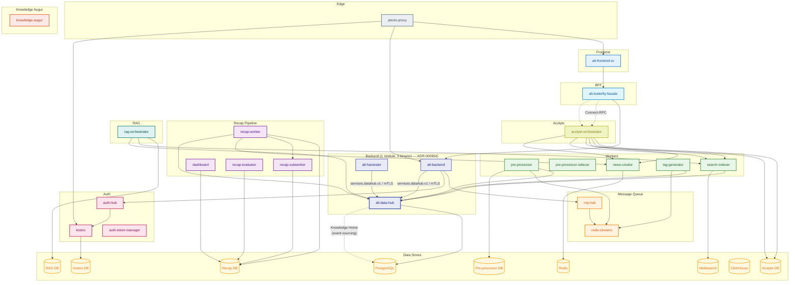

# Alt Platform Microservices

_Last reviewed: August 19, 2026_

## Overview

Alt は Compose-first の AI 拡張 RSS ナレッジプラットフォームです。Docker Compose がオーケストレーションの source of truth です。AI / Recap / RAG / logging は本番 `include:` チェーン（`compose/compose.yaml`）に入っている。profiled-only は `alt-perf` / `docker-socket-proxy` / `k6` / `restic-backup` の **4** 本。本番 include チェーンは **77 declared / 63 long-running**（ephemeral 10 + profiled 4）。accidental OSU cap は **16**（`*-logs` のみ）。会計の正本は [[ops-surface-budget]] / [[000979]]。

> **インシデント対応・障害パターンの入口**: 症状起点の調査は [[README|runbooks 索引]] (症状 → runbook 対応表)、横断的な障害パターン知識は [[crystallized-knowledge]] (ADR 940 本 / PM 46 本の結晶化) から入る。

## Service Categories

### Core Services
Host ports below are what the stacks included by `compose/compose.yaml` publish, plus
the optional `compose.augur.yaml` overlay. Most are bound to
`127.0.0.1` and so answer on the Docker host only — east-west callers use the container
DNS name and the in-container port. The exceptions are exactly the rows flagged
`[all NICs]` in [Quick Reference - Ports](#quick-reference---ports), plus `pact-broker`,
which binds `${PROD_TAILNET_IP}` (tailnet) in addition to `127.0.0.1`. Do not infer the
bind address from this table — check the `ports:` entry in the compose file. The dev,
staging and load-test overlays (`compose/dev.yaml`, `compose/frontend-dev.yaml`,
`compose/compose.staging.yaml`, `compose/load-test.yaml`, `compose.dev.yaml`) publish on
all interfaces and are out of scope here.

| Service | Language | Host Port(s) | Compose File | Health Endpoint | Notes |
|---------|----------|--------------|--------------|-----------------|-------|
| plecto-proxy | Rust (PlectoProxy 0.6.0) | 80 → 8443, 8080 | core.yaml | `plecto healthz` / admin `/healthz` `/readyz` (:8080) | Edge/ingress; replaced nginx. Routes in `plecto/manifest.toml` |
| alt-frontend-sv | TypeScript (SvelteKit 2.x) | 4173 | core.yaml | `/health` | Knowledge Home admin at `/admin/knowledge-home` |
| alt-backend | Go 1.26+ (Echo) | 9000, 9101, 9102 | core.yaml | `/v1/health` (:9000), `/health` (:9110) | User-facing API. Knowledge Home (event sourcing, projector, reproject, SLO) |
| alt-harvester | Go 1.26+ | なし | core.yaml | `/health` (:9110) | 7 定期ジョブ専用。業務リスナーなし |
| alt-data-hub | Go 1.26+ | なし | core.yaml | `/health` (:9110) | alt-db の唯一のオーナー。mTLS `:9443` のみ |
| alt-butterfly-facade | Go 1.26+ | 9250 | bff.yaml | `/alt-butterfly-facade healthcheck` | Knowledge Home Admin API routing |

> **alt-backend / alt-harvester / alt-data-hub は 1 ディレクトリ 3 バイナリ**（[[000954]]）。
> `alt-backend/app` という単一 Go モジュール (`module alt`) から `cmd/backend` /
> `cmd/harvester` / `cmd/datahub` の 3 本を切り出し、同じ `alt-backend/Dockerfile.backend`
> を `--build-arg BINARY=backend|harvester|datahub` で 3 イメージにビルドする
> （`BINARY` 未指定はビルド失敗）。責務は次のとおり。
>
> | バイナリ | 責務 | リスナー |
> |---|---|---|
> | `alt-backend` (`cmd/backend`) | ユーザ向け API。BFF が叩く面 | REST `:9000` / Connect `:9101` / オペレータ `:9102`（admin Connect 2 サービス、loopback バインド）/ ops `:9110` |
> | `alt-harvester` (`cmd/harvester`) | `orchestrator/job/` の 7 定期ジョブ | ops `:9110` のみ（業務リスナーなし） |
> | `alt-data-hub` (`cmd/datahub`) | alt-db の唯一のオーナー。`services.datahub.v1.DataHubService` を serve | mTLS `:9443` + ops `:9110`。**publish ゼロ** |
>
> `:9110` は 3 バイナリ共通の ops リスナー（`bootstrap.NewOpsHandler`）で、
> `/health` と `/metrics` を出す。ホストには publish されない。
> alt-backend / alt-harvester は DB 依存ゼロ（`go list -deps` の CI ガードで強制）であり、
> DB DSN と DB secret は alt-data-hub の専有。旧 `services.backend.v1.BackendInternalService`
> と `/v1/internal/*` REST は削除済み。

### Worker Services
| Service | Language | Port(s) | Compose File | Health Endpoint |
|---------|----------|---------|--------------|-----------------|
| pre-processor | Go 1.26+ | 9200, 9202 | ai.yaml | `/pre-processor healthcheck` |
| pre-processor-sidecar | Go 1.26+ | - | workers.yaml | - |
| search-indexer | Go 1.26+ | 9300, 9301 | workers.yaml | `/search-indexer healthcheck` |
| tag-generator | Python 3.14+ (FastAPI) | 9400 | workers.yaml | `/health` |
| news-creator | Python 3.14+ (FastAPI + Ollama) | 11434 | ai.yaml | `/health` |
| knowledge-augur | Ollama (Swallow-8B) | 11435 | compose.augur.yaml | `/api/tags` |

### Auth Services
| Service | Language | Port(s) | Compose File | Health Endpoint |
|---------|----------|---------|--------------|-----------------|
| kratos | - (Ory Kratos v1.3.0) | 4433, 4434 | auth.yaml | `/admin/health/ready` |
| auth-hub | Go 1.26+ (Echo) | 8888 | auth.yaml | `/auth-hub healthcheck` |
| auth-token-manager | Deno 2.x | 9201 | workers.yaml | - |

### Message Queue Services
| Service | Language | Port(s) | Compose File | Health Endpoint |
|---------|----------|---------|--------------|-----------------|
| redis-streams | Redis 8.4 | 6380 | mq.yaml | `redis-cli ping` |
| mq-hub | Go 1.26+ | 9500 | mq.yaml | `/health` |

### Report Generation Services
| Service | Language | Port(s) | Compose File | Health Endpoint |
|---------|----------|---------|--------------|-----------------|
| acolyte-orchestrator | Python 3.14+ (Starlette + Connect-RPC + LangGraph) | 8090 | acolyte.yaml | `/alt.acolyte.v1.AcolyteService/HealthCheck` |
| acolyte-db | PostgreSQL 18 | 5439 | acolyte.yaml | `pg_isready` |
| acolyte-db-migrator | Atlas 0.31 | - | acolyte.yaml | - |

### Recap Pipeline Services
| Service | Language | Port(s) | Compose File | Health Endpoint |
|---------|----------|---------|--------------|-----------------|
| recap-worker | Rust 1.94+ | 9005 | recap.yaml | `/recap-worker healthcheck` |
| recap-subworker | Python 3.14+ (FastAPI) | 8002 | recap.yaml | - |
| dashboard | Python (Streamlit) | 8501, 8502 | recap.yaml | - |
| recap-evaluator | Python (FastAPI) | 8085 | recap.yaml | `/health` |

### RAG Services
| Service | Language | Port(s) | Compose File | Health Endpoint |
|---------|----------|---------|--------------|-----------------|
| rag-orchestrator | Go 1.26+ | 9010, 9011 | rag.yaml | - |

### Knowledge Sovereign Services
| Service | Language | Port(s) | Compose File | Health Endpoint |
|---------|----------|---------|--------------|-----------------|
| knowledge-sovereign | Go 1.26+ | 9510, 9511 | sovereign.yaml | `/health` (:9511) |
| knowledge-sovereign-db-migrator | Atlas | - | sovereign.yaml | - |

### PKI Services
| Service | Language | Port(s) | Compose File | Health Endpoint |
|---------|----------|---------|--------------|-----------------|
| step-ca | - (smallstep/step-ca 0.30.2) | - | pki.yaml | `step ca health` |
| step-ca-bootstrap | oneshot | - | pki.yaml | - |
| pki-agent | Go 1.26+ | - | **not a compose workload** | tooling only |

> **Workload sidecar は退役**（[[000978]]）。east-west 14 親（alt-backend / alt-harvester / alt-data-hub / alt-notifier / alt-butterfly-facade / auth-hub / pre-processor / search-indexer / tag-generator / recap-worker / acolyte-orchestrator / recap-subworker / news-creator / rag-orchestrator）が **in-process** で enroll / renew する（`PKI_ENROLLMENT=enabled`、subject-scoped JWK `pki-agent-<subject>`）。pki-agent イメージと `pki-agent/scripts/bootstrap-pki-provisioner.sh` は **CA 側 tooling**（provisioner + CN allowlist）として残る。compose に `pki-agent-*` を再宣言すると同一 cert volume の dual writer になる。ops `:9110` は親プロセスの private 面で、ホストへ publish しない。

### Data Stores
| Service | Type | Port(s) | Compose File | Health Endpoint |
|---------|------|---------|--------------|-----------------|
| db | PostgreSQL 17 | 5432 | db.yaml | `pg_isready` |
| kratos-db | PostgreSQL 16 | 5434 | auth.yaml | `pg_isready` |
| recap-db | PostgreSQL 18 | 5435 | recap.yaml | `pg_isready` |
| rag-db | PostgreSQL 18 + pgvector | 5436 | rag.yaml | `pg_isready` |
| pre-processor-db | PostgreSQL 17 | 5437 | db.yaml | `pg_isready` |
| acolyte-db | PostgreSQL 18 | 5439 | acolyte.yaml | `pg_isready` |
| knowledge-sovereign-db | PostgreSQL 16 | 5438 | sovereign.yaml | `pg_isready` |
| meilisearch | Meilisearch v1.27.0 | 7700 | db.yaml | `/health` |
| clickhouse | ClickHouse 25.9 | 8123, 9009 | db.yaml | `/ping` |
| redis-cache | Redis 8.0.2 | - | ai.yaml | `redis-cli ping` |

### Observability Services
| Service | Language | Port(s) | Compose File | Health Endpoint |
|---------|----------|---------|--------------|-----------------|
| rask-log-aggregator | Rust 1.94+ (Axum) | 9600, 4317, 4318 | logging.yaml | `/rask-log-aggregator healthcheck` |
| rask-log-forwarder (16x) | Rust 1.94+ | - | logging.yaml | - |

### CLI & Tools
| Service | Language | Description |
|---------|----------|-------------|
| altctl | Go 1.26+ (Cobra) | Docker Compose オーケストレーション CLI |
| alt-perf | Deno 2.x (Astral) | E2E パフォーマンス計測 |

---

## Compose File Mapping

| Compose File | Services | Profile |
|--------------|----------|---------|
| base.yaml | 共通設定 (networks, volumes, secrets) | - |
| core.yaml | plecto-proxy, alt-frontend-sv, alt-backend, alt-harvester, alt-data-hub, migrate | default |
| bff.yaml | alt-butterfly-facade | default |
| db.yaml | db, meilisearch, clickhouse, pre-processor-db, pre-processor-db-migrator | default |
| auth.yaml | kratos-db, kratos, kratos-migrate, auth-hub | default |
| workers.yaml | pre-processor-sidecar, search-indexer, tag-generator, auth-token-manager | default |
| mq.yaml | redis-streams, mq-hub | default |
| ai.yaml | redis-cache, news-creator, pre-processor | ollama |
| recap.yaml | recap-db, recap-worker, recap-subworker, dashboard, recap-evaluator | recap |
| rag.yaml | rag-db, rag-db-migrator, rag-orchestrator | rag-extension |
| acolyte.yaml | acolyte-db, acolyte-db-migrator, acolyte-orchestrator | acolyte |
| sovereign.yaml | knowledge-sovereign-db, knowledge-sovereign-db-migrator, knowledge-sovereign | - |
| pki.yaml | step-ca, step-ca-bootstrap（workload pki-agent sidecar は 0。enrollment は親 in-process） | - |
| logging.yaml | rask-log-aggregator, 16x rask-log-forwarder | logging |
| perf.yaml | alt-perf | perf |
| compose.augur.yaml | knowledge-augur, knowledge-augur-volume-init, knowledge-embedder, knowledge-embedder-volume-init | standalone |

---

## Service Dependency Graph


```mermaid
flowchart TB
    subgraph Edge["Edge"]
        plecto-proxy
    end

    subgraph Frontend["Frontend"]
        alt-frontend-sv
    end

    subgraph BFF["BFF"]
        alt-butterfly-facade
    end

    subgraph Backend["Backend (1 module, 3 binaries — ADR-000954)"]
        direction LR
        alt-backend
        alt-harvester
        alt-data-hub
    end

    subgraph Auth["Auth"]
        direction LR
        kratos
        auth-hub
        auth-token-manager
    end

    subgraph Workers["Workers"]
        direction LR
        pre-processor
        pre-processor-sidecar
        search-indexer
        tag-generator
        news-creator
    end

    subgraph MQ["Message Queue"]
        direction LR
        redis-streams
        mq-hub
    end

    subgraph Recap["Recap Pipeline"]
        direction LR
        recap-worker
        recap-subworker
        dashboard
        recap-evaluator
    end

    subgraph RAG["RAG"]
        rag-orchestrator
    end

    subgraph Acolyte["Acolyte"]
        acolyte-orchestrator
    end

    subgraph Augur["Knowledge Augur"]
        knowledge-augur
    end

    subgraph DataStores["Data Stores"]
        direction LR
        db[(PostgreSQL)]
        kratos-db[(Kratos DB)]
        recap-db[(Recap DB)]
        rag-db[(RAG DB)]
        acolyte-db[(Acolyte DB)]
        pre-processor-db[(Pre-processor DB)]
        acolyte-db[(Acolyte DB)]
        meilisearch[(Meilisearch)]
        clickhouse[(ClickHouse)]
        redis-cache[(Redis)]
    end

    %% Request flow (plecto upstreams: alt-frontend-sv, alt-backend, kratos, dashboard)
    plecto-proxy --> alt-frontend-sv & alt-backend & kratos
    alt-frontend-sv --> alt-butterfly-facade --> alt-backend
    alt-backend --> mq-hub & auth-hub
    auth-hub --> kratos --> kratos-db

    %% alt-db ownership (ADR-000241 + ADR-000954): alt-data-hub is the only
    %% process holding a DB DSN. Everyone else, alt-backend and alt-harvester
    %% included, goes through services.datahub.v1.DataHubService over mTLS :9443.
    alt-data-hub --> db
    alt-backend -->|"services.datahub.v1 / mTLS"| alt-data-hub
    alt-harvester -->|"services.datahub.v1 / mTLS"| alt-data-hub
    alt-data-hub -.->|"Knowledge Home\n(event sourcing)"| db

    %% Worker connections
    search-indexer --> alt-data-hub & meilisearch
    tag-generator --> alt-data-hub & redis-streams
    pre-processor --> alt-data-hub & redis-streams
    news-creator --> redis-cache
    mq-hub --> redis-streams

    %% Pre-processor -> pre-processor-db
    pre-processor --> pre-processor-db

    %% Acolyte connections
    alt-butterfly-facade -.->|"Connect-RPC"| acolyte-orchestrator
    acolyte-orchestrator --> acolyte-db & search-indexer & news-creator

    %% Pipeline connections
    recap-worker --> recap-db & recap-subworker & news-creator
    recap-subworker & dashboard & recap-evaluator --> recap-db
    rag-orchestrator --> rag-db & search-indexer & alt-data-hub
    recap-worker --> alt-data-hub

    %% Acolyte connections
    alt-butterfly-facade -.-> acolyte-orchestrator
    acolyte-orchestrator --> acolyte-db & search-indexer & news-creator

    %% Styling - Edge (gray)
    style plecto-proxy fill:#eceff1,stroke:#546e7a,color:#37474f,stroke-width:2px

    %% Styling - Frontend (blue)
    style alt-frontend-sv fill:#e3f2fd,stroke:#1976d2,color:#0d47a1,stroke-width:2px

    %% Styling - BFF (light blue)
    style alt-butterfly-facade fill:#e1f5fe,stroke:#0288d1,color:#01579b,stroke-width:2px

    %% Styling - Backend (indigo)
    style alt-backend fill:#e8eaf6,stroke:#3f51b5,color:#1a237e,stroke-width:2px
    style alt-harvester fill:#e8eaf6,stroke:#3f51b5,color:#1a237e,stroke-width:2px
    style alt-data-hub fill:#e8eaf6,stroke:#3f51b5,color:#1a237e,stroke-width:3px

    %% Styling - Auth (pink)
    style kratos fill:#fce4ec,stroke:#c2185b,color:#880e4f,stroke-width:2px
    style auth-hub fill:#fce4ec,stroke:#c2185b,color:#880e4f,stroke-width:2px
    style auth-token-manager fill:#fce4ec,stroke:#c2185b,color:#880e4f,stroke-width:2px

    %% Styling - Workers (green)
    style pre-processor fill:#e8f5e9,stroke:#388e3c,color:#1b5e20,stroke-width:2px
    style pre-processor-sidecar fill:#e8f5e9,stroke:#388e3c,color:#1b5e20,stroke-width:2px
    style search-indexer fill:#e8f5e9,stroke:#388e3c,color:#1b5e20,stroke-width:2px
    style tag-generator fill:#e8f5e9,stroke:#388e3c,color:#1b5e20,stroke-width:2px
    style news-creator fill:#e8f5e9,stroke:#388e3c,color:#1b5e20,stroke-width:2px

    %% Styling - MQ (orange)
    style redis-streams fill:#fff3e0,stroke:#f57c00,color:#e65100,stroke-width:2px
    style mq-hub fill:#fff3e0,stroke:#f57c00,color:#e65100,stroke-width:2px

    %% Styling - Recap (purple)
    style recap-worker fill:#f3e5f5,stroke:#7b1fa2,color:#4a148c,stroke-width:2px
    style recap-subworker fill:#f3e5f5,stroke:#7b1fa2,color:#4a148c,stroke-width:2px
    style dashboard fill:#f3e5f5,stroke:#7b1fa2,color:#4a148c,stroke-width:2px
    style recap-evaluator fill:#f3e5f5,stroke:#7b1fa2,color:#4a148c,stroke-width:2px

    %% Styling - RAG (teal)
    style rag-orchestrator fill:#e0f2f1,stroke:#00796b,color:#004d40,stroke-width:2px

    %% Styling - Acolyte (lime)
    style acolyte-orchestrator fill:#f0f4c3,stroke:#afb42b,color:#827717,stroke-width:2px

    %% Styling - Knowledge Augur (deep orange)
    style knowledge-augur fill:#fbe9e7,stroke:#e64a19,color:#bf360c,stroke-width:2px

    %% Styling - Data Stores (amber)
    style db fill:#fff8e1,stroke:#ffa000,color:#ff6f00,stroke-width:2px
    style kratos-db fill:#fff8e1,stroke:#ffa000,color:#ff6f00,stroke-width:2px
    style recap-db fill:#fff8e1,stroke:#ffa000,color:#ff6f00,stroke-width:2px
    style rag-db fill:#fff8e1,stroke:#ffa000,color:#ff6f00,stroke-width:2px
    style acolyte-db fill:#fff8e1,stroke:#ffa000,color:#ff6f00,stroke-width:2px
    style pre-processor-db fill:#fff8e1,stroke:#ffa000,color:#ff6f00,stroke-width:2px
    style meilisearch fill:#fff8e1,stroke:#ffa000,color:#ff6f00,stroke-width:2px
    style clickhouse fill:#fff8e1,stroke:#ffa000,color:#ff6f00,stroke-width:2px
    style redis-cache fill:#fff8e1,stroke:#ffa000,color:#ff6f00,stroke-width:2px
```

---

## Quick Reference - Ports

**Host** ports only — i.e. what a `ports:` entry actually publishes. Unless marked
`[all NICs]`, the bind address is `127.0.0.1`, so the port answers on the Docker host
and nowhere else. `(→ N)` is the in-container port when it differs from the host port.

```
80      → plecto-proxy (edge/ingress, → 8443)     [all NICs]
3001    → grafana (→ 3000)                        [all NICs]
4173    → alt-frontend-sv (SvelteKit)
4433    → kratos (public API)
5432    → db (PostgreSQL 17)
5434    → kratos-db (PostgreSQL 16, → 5432)
5435    → recap-db (PostgreSQL 18, → 5432)
5436    → rag-db (PostgreSQL 18, → 5432)
5437    → pre-processor-db (PostgreSQL 17, → 5432)
5438    → knowledge-sovereign-db (PostgreSQL 16, → 5432)
5439    → acolyte-db (PostgreSQL 18, → 5432)
6380    → redis-streams (→ 6379)
7700    → meilisearch
8002    → recap-subworker
8080    → plecto-proxy admin (/metrics /healthz /readyz)
8082    → rerank-local (→ 8080)
8085    → recap-evaluator (→ 8080)
8090    → acolyte-orchestrator (Connect-RPC)
8123    → clickhouse (HTTP)
8181    → cadvisor (→ 8080)
8501    → dashboard (Streamlit)
8502    → dashboard (metrics, → 8000)
9000    → alt-backend (REST)
9005    → recap-worker
9009    → clickhouse (native, → 9000)
9010    → rag-orchestrator (REST)
9011    → rag-orchestrator (Connect-RPC)
9090    → prometheus
9101    → alt-backend (Connect-RPC)
9102    → alt-backend (admin Connect only, unauthenticated — loopback only)
9200    → pre-processor (REST)
9201    → auth-token-manager
9202    → pre-processor (Connect-RPC)
9250    → alt-butterfly-facade
9292    → pact-broker (also bound on ${PROD_TAILNET_IP})
9300    → search-indexer (REST)
9301    → search-indexer (Connect-RPC)
9400    → tag-generator
9500    → mq-hub
9510    → knowledge-sovereign (RPC, → 9500)
9511    → knowledge-sovereign (metrics/health, → 9501)
11434   → news-creator (Ollama API)
11435   → news-creator-backend (Ollama, ai.yaml)
11435   → knowledge-augur (compose.augur.yaml, → 11434)  [all NICs, conflicts with the row above]
11436   → knowledge-embedder (compose.augur.yaml, → 11434) [all NICs]
11437   → knowledge-embedder-local (rag.yaml, → 11434)
```

**No host port at all** — reachable only from inside `alt-network` via the container
DNS name: `alt-harvester` (:9110), `alt-data-hub` (:9443 mTLS, :9110),
`auth-hub` (:8888), `kratos` admin (:4434), `pgbouncer` (:6432),
`rask-log-aggregator` (:9600, :4317, :4318), `redis-cache`, `pre-processor-sidecar`,
`step-ca`. `curl http://localhost:<port>` against any of these cannot work;
use `docker compose exec <service> …` instead. The 14 parents' PKI ops `:9110`
are also unpublished (Prometheus scrapes via Compose DNS). Workload
`pki-agent-*` sidecars are not declared.

`alt-data-hub` の publish ゼロは意図的な境界であり、
`scripts/compose-port-audit.py` が CI で門にしている（[[000954]] D5）。
`:9443` は mTLS 専用で peer allowlist (`DATAHUB_ALLOWED_PEERS`) を通らない証明書は
拒否されるため、`curl` では到達できない。3 バイナリ共通の `:9110` も publish されない。

---

## Getting Started

### Default Stack (production include)

```bash
altctl up
# または
docker compose -f compose/compose.yaml -p alt up -d
```

AI / Recap / RAG / logging は上記 include に含まれる。`--profile ollama` 等は使わない。

profiled-only（明示 `--profile`）: `alt-perf`, `docker-socket-proxy`, `k6`, `restic-backup`。

### Stack Teardown
```bash
altctl down
# With volumes
altctl down --volumes
```

---

## Health Check Commands

Use `curl -fsS` (not bare `curl`): `-f` makes a non-2xx a non-zero exit and `-S` keeps
the connection error on stderr, so a dead endpoint is loud instead of printing nothing.

```bash
# Core Services
curl -fsS http://localhost:8080/readyz              # plecto-proxy (edge, admin port)
curl -fsS http://localhost:4173/health              # alt-frontend-sv
curl -fsS http://localhost:9000/v1/health           # alt-backend
curl -fsS http://localhost:9250/health              # alt-butterfly-facade

# Data Stores
curl -fsS http://localhost:7700/health              # meilisearch
curl -fsS http://localhost:8123/ping                # clickhouse

# AI Services
curl -fsS http://localhost:11434/health             # news-creator

# Recap Pipeline
curl -fsS http://localhost:9005/health/ready        # recap-worker
curl -fsS http://localhost:8085/health              # recap-evaluator

# RAG
curl -fsS http://localhost:9010/healthz             # rag-orchestrator

# Acolyte
curl -fsS http://localhost:8090/health              # acolyte-orchestrator

# Message Queue
curl -fsS http://localhost:9500/health              # mq-hub

# Knowledge Sovereign
curl -fsS http://localhost:9511/health              # knowledge-sovereign (host 9511 -> :9501)

# Observability
curl -fsS http://localhost:9090/-/healthy           # prometheus
```

`auth-hub` and `kratos`'s admin API publish no host port, so they have no `localhost`
form. Probe them from inside the network instead:

```bash
docker compose -f compose/compose.yaml -p alt exec auth-hub /auth-hub healthcheck
docker compose -f compose/compose.yaml -p alt exec kratos \
  wget --spider -q http://127.0.0.1:4434/admin/health/ready
```

---

## Volumes

| Volume | Service | Purpose |
|--------|---------|---------|
| db_data_17 | db | PostgreSQL 17 data |
| kratos_db_data | kratos-db | Kratos identity data |
| recap_db_data | recap-db | Recap pipeline data |
| rag_db_data | rag-db | RAG documents + embeddings |
| acolyte_db_data | acolyte-db | Acolyte reports + versions |
| meili_data | meilisearch | Search indices |
| clickhouse_data | clickhouse | Log analytics |
| redis-streams-data | redis-streams | Event streams |
| redis-cache-data | redis-cache | LLM response cache |
| news_creator_models | news-creator | Ollama models |
| pre_processor_db_data | pre-processor-db | Pre-processor feed data |
| oauth_token_data | auth-token-manager | OAuth2 tokens |
| knowledge_augur_models | knowledge-augur | Ollama Swallow models |

---

## Secrets

| Secret | Used By |
|--------|---------|
| postgres_password | db |
| db_password | alt-backend |
| kratos_db_password | kratos, kratos-db |
| recap_db_password | recap-worker, recap-subworker |
| rag_db_password | rag-orchestrator, rag-db |
| acolyte_db_password | acolyte-orchestrator, acolyte-db |
| meili_master_key | meilisearch, search-indexer |
| clickhouse_password | clickhouse, rask-log-aggregator |
| service_secret | alt-backend, search-indexer, tag-generator, pre-processor, news-creator, recap-worker |
| auth_shared_secret | nginx, auth-hub, alt-backend |
| backend_token_secret | auth-hub, alt-backend, alt-butterfly-facade |
| csrf_secret | auth-hub, alt-backend |
| hugging_face_token | recap-worker |
| inoreader_client_id | pre-processor-sidecar, auth-token-manager |
| pp_db_password | pre-processor-db, pre-processor, pre-processor-sidecar |
| inoreader_client_secret | pre-processor-sidecar, auth-token-manager |

---

## Service Documentation Links

| Service | Documentation |
|---------|---------------|
| alt-backend | [docs/alt-backend.md](./alt-backend.md) |
| alt-harvester | [docs/alt-backend.md](./alt-backend.md) (同一モジュール。分割の根拠は [[000954]]) |
| alt-data-hub | [docs/alt-backend.md](./alt-backend.md) (同一モジュール。分割の根拠は [[000954]]) |
| alt-frontend | [docs/alt-frontend.md](./alt-frontend.md) (deprecated) |
| alt-frontend-sv | [docs/alt-frontend-sv.md](./alt-frontend-sv.md) |
| alt-butterfly-facade | [docs/alt-butterfly-facade.md](./alt-butterfly-facade.md) |
| pre-processor | [docs/pre-processor.md](./pre-processor.md) |
| pre-processor-sidecar | [docs/pre-processor-sidecar.md](./pre-processor-sidecar.md) |
| search-indexer | [docs/search-indexer.md](./search-indexer.md) |
| tag-generator | [docs/tag-generator.md](./tag-generator.md) |
| news-creator | [docs/news-creator.md](./news-creator.md) |
| auth-hub | [docs/auth-hub.md](./auth-hub.md) |
| auth-token-manager | [docs/auth-token-manager.md](./auth-token-manager.md) |
| mq-hub | [docs/mq-hub.md](./mq-hub.md) |
| recap-worker | [docs/recap-worker.md](./recap-worker.md) |
| recap-subworker | [docs/recap-subworker.md](./recap-subworker.md) |
| recap-db | [docs/recap-db.md](./recap-db.md) |
| dashboard | [docs/dashboard.md](./dashboard.md) |
| recap-evaluator | [docs/recap-evaluator.md](./recap-evaluator.md) |
| rag-orchestrator | [docs/rag-orchestrator.md](./rag-orchestrator.md) |
| rag-db | [docs/rag-db.md](./rag-db.md) |
| acolyte-orchestrator | [docs/acolyte-orchestrator.md](./acolyte-orchestrator.md) |
| acolyte-db | [docs/acolyte-db.md](./acolyte-db.md) |
| rask-log-aggregator | [docs/rask-log-aggregator.md](./rask-log-aggregator.md) |
| knowledge-augur | [docs/knowledge-augur.md](./knowledge-augur.md) |
| rask-log-forwarder | [docs/rask-log-forwarder.md](./rask-log-forwarder.md) |
| rask-logging-architecture | [docs/rask-logging-architecture.md](./rask-logging-architecture.md) |
| alt-db | [docs/alt-db.md](./alt-db.md) |
| altctl | [docs/altctl.md](./altctl.md) |
| alt-perf | [docs/alt-perf.md](./alt-perf.md) |
| metrics | [docs/metrics.md](./metrics.md) |
| sidecar-proxy | [docs/sidecar-proxy.md](./sidecar-proxy.md) |

---

## LLM Notes

- Inter-service communication via HTTP/REST or Connect-RPC (Protocol Buffers)
- Authentication via auth-hub X-Alt-* headers or JWT tokens
- Service-to-service auth: mTLS のみ。`X-Service-Token` / `SERVICE_SECRET` は [[000743]] で全サービスから撤去済み
- Event-driven via Redis Streams + mq-hub
- **alt-data-hub is the sole data owner for alt-db** ([[000241]] の原則を [[000954]] がプロセス境界として物理化)。alt-backend / alt-harvester を含む全 consumer は `services.datahub.v1.DataHubService`（Connect-RPC、mTLS `:9443`）経由でのみ alt-db に触れる。consumer は alt-backend / alt-harvester / pre-processor / search-indexer / tag-generator / recap-worker / rag-orchestrator の 7 主体で、`DATAHUB_ALLOWED_PEERS` が peer CN で fail-closed に検証する
- GPU requirements: news-creator, recap-subworker (NVIDIA GPU); knowledge-augur (AMD ROCm iGPU, CPU fallback available)
- Log aggregation: rask-log-forwarder → rask-log-aggregator → ClickHouse
- **mTLS leaf ライフサイクル**: 14 親が in-process enrollment を所有する。pki-agent は compose ワークロードではない（[[000978]]）。ホスト cutover の前提は 14 JWK ファイル + subject-scoped provisioner + 新イメージ（runbook [[pki-agent-recovery]]）。本カタログはデプロイ済みを主張しない
- Tag Verse (3D tag cloud): alt-backend `alt.articles.v2` `FetchTagCloud` RPC → Barnes-Hut O(n log n) server-side layout → alt-frontend-sv (Three.js/Threlte v8 WebGPU); tag co-occurrence data は alt-data-hub の `services.datahub.v1` `FetchTagCloud` capability 経由（`feed_tags` × `article_tags` CTE query）、alt-backend 側で 30 min TTL キャッシュ。定期ジョブ `tag-cloud-cache-warmer` は [[000954]] Wave 1 で廃止され、初回リクエスト時の遅延ウォームに置き換わっている（プロセス内キャッシュを別プロセスから温めても効かないため）
- **Knowledge Home**: Event-sourced personalized feed (CQRS pattern). alt-backend hosts projector, backfill, and reproject jobs. 9 tables in alt-db (`knowledge_events`, `knowledge_home_items`, `knowledge_user_events`, `knowledge_projection_checkpoints`, `knowledge_backfill_jobs`, `knowledge_projection_versions`, `knowledge_lenses`, `knowledge_reproject_runs`, `knowledge_projection_audits`). Admin API accessible via alt-butterfly-facade（`KnowledgeHomeAdminService` は alt-backend の loopback オペレータリスナー `:9102` に残る。認証は到達可能性 + BFF の admin ロールチェックで、service token は使わない）。altctl provides CLI commands (`home reproject`, `home slo`). Frontend admin at `/admin/knowledge-home`. SLO framework with 5 SLIs and multi-window burn-rate alerting
