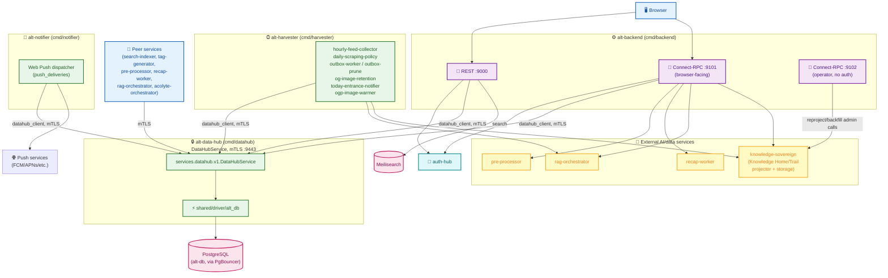

# Alt Backend

_Last reviewed: September 5, 2026_
_Split note added: July 31, 2026_

**Location:** `alt-backend/app`

> [!IMPORTANT]
> **このサービスは 3 プロセスに分割済み（[[000954]]）で、その後 4 本目のバイナリが
> 追加されている。**
>
> `alt-backend/app`（`module alt`）という 1 つの Go モジュールから、同じ
> `Dockerfile.backend` を `--build-arg BINARY=backend|harvester|datahub|notifier` で
> 切り替えて **4 つのコンテナ**をビルドする。
>
> | compose service | エントリポイント | 責務 | リスナー |
> |---|---|---|---|
> | `alt-backend` | `cmd/backend` | ユーザ向け API。BFF が叩く面 | REST `:9000` / Connect `:9101` / オペレータ `:9102` / ops `:9110` |
> | `alt-harvester` | `cmd/harvester` | `orchestrator/job/registry.go` の定期ジョブ | ops `:9110` のみ |
> | `alt-notifier` | `cmd/notifier` | Web Push 配信ディスパッチャ（`push_deliveries` をドレインして送信、VAPID 秘密鍵はこのコンテナにのみマウント） | ops `:9110` のみ |
> | `alt-data-hub` | `cmd/datahub` | **alt-db の唯一のオーナー**。`services.datahub.v1.DataHubService` を serve | mTLS `:9443` + ops `:9110`、publish ゼロ |
>
> `go build ./cmd/...` はこの 4 つに加えて `cmd/fix_article_titles`（one-shot の運用スクリプト、
> 常駐サービスではなくコンテナ化もされていない）もビルドする。「4 バイナリ」という記述は
> 常駐コンテナの数を指す。
>
> 本文を読むときに読み替えが必要な主な点:
>
> - **root `main.go` は存在しない。** `cmd/<binary>/main.go` の 4 本に置き換わり、
>   共通の起動処理は `internal/bootstrap` にある。
> - **`:9102` は admin Connect サービス専用のオペレータリスナー。**
>   `BackendInternalService` と `/v1/internal/*` REST は**削除済み**で、
>   その責務は alt-data-hub の `services.datahub.v1.DataHubService` に移った
>   （`GetSystemUser` / `ListRecentArticles` としてこのサービスに引き継がれている）。
> - **alt-backend / alt-harvester / alt-notifier は DB に触らない。** DB DSN と pgx を持つのは
>   alt-data-hub だけで、`di/import_boundary_test.go` が `go list -deps` で
>   リンクレベルに強制している。本文中の
>   `container.AltDBRepository` / `g.alt_db.…` を経由する記述はすべて
>   `shared/driver/datahub_client` 経由の DataHubService capability 呼び出しに置き換わっている。
> - **`X-Service-Token` / `SERVICE_SECRET` は存在しない。** [[000743]] で全サービスから
>   撤去され、サービス間認証は mTLS に一本化された。本文の
>   `middleware/service_auth_middleware.go` の記述は歴史的なものである。ブラウザ向け認証も
>   JWT 単独になり、`AUTH_SHARED_SECRET` によるヘッダーフォールバックは無くなっている。
> - **ディレクトリは `app/` 直下ではない。** [[000945]] 以降、レイヤは
>   `app/orchestrator/` `app/dataplane/` `app/shared/` の 3 package ファミリの下に並ぶ
>   （`rest/` → `orchestrator/rest/`、`connect/v2/<service>` → `orchestrator/connect/v2/<service>` など。
>   Connect-RPC のサーバ配線 `connect/v2/server.go` 自体は `app/` 直下に残る）。
> - **`tag-cloud-cache-warmer` ジョブは廃止された。** タグクラウドのキャッシュは
>   初回リクエスト時の遅延ウォームのみになった。
> - **Knowledge Home / Trail / Recall の実データは alt-db から退去済み。**
>   `knowledge_events` 系・`knowledge_trail_*` 系・`recall_*` 系のテーブルは
>   2026年3月〜6月の migration で alt-db から DROP され、`knowledge-sovereign-db`
>   （別サービス [[wiki/services/knowledge-sovereign]]）に一本化された。
>   Connect-RPC の `KnowledgeHomeService` / `KnowledgeTrailService` は alt-backend に残るが、
>   projector・backfill・reproject の実行主体とストレージは knowledge-sovereign 側にある。
>
> 詳細と判断根拠は [[000954]]、レイヤの現行配置は `alt-backend/CLAUDE.md` を参照。

## Purpose
- Serve as the Compose-first back end for Alt’s RSS/LLM stack, routing authenticated requests from the frontend and dashboards to the clean-architecture layers that orchestrate feed ingestion, summarization, search, and recap data. The scheduled-job and database-owning halves now live in the sibling `alt-harvester` / `alt-data-hub` binaries built from the same module (see the callout above).
- Protect every entry point with the guardrails in `orchestrator/rest/routes.go` so requests flow through request-ID, recovery, a 2MB body limit, secure headers, CORS, DOS protection, CSRF, timeouts, validation, logging, and compression before hitting business logic.
- Reach every other capability (PostgreSQL, search, summarization, recap, RAG, auth) through `di/container.go`'s `ApplicationComponents` so each usecase sees only the adapters it needs; PostgreSQL itself is reached indirectly, through `shared/driver/datahub_client`'s Connect-RPC calls to alt-data-hub, not through a local driver.

## Architecture Overview

### Clean Architecture Layers
- `orchestrator/rest/` owns HTTP handlers, `orchestrator/usecase/` (plus `shared/usecase/`) contains business orchestrators, `orchestrator/port/` defines stable contracts, `orchestrator/gateway/` adapts to external APIs, `orchestrator/driver/` handles search/recap/pre-processor HTTP clients, and `orchestrator/job/` runs the background loops built into `cmd/harvester` and `cmd/notifier`. Wiring for `cmd/backend` happens in `di/container_backend.go` (the `ApplicationComponents` type itself is declared in `di/container.go`).
- Domain entities live in `domain/`, infrastructure helpers in `utils/`, dependency wiring in `di/`, and `cmd/backend/main.go` bootstraps the backend's components, starts the REST server (port 9000), the browser-facing Connect-RPC server (port 9101), the loopback operator Connect-RPC server (port 9102), and the shared ops listener (port 9110). It starts no background jobs — those run only inside `cmd/harvester` / `cmd/notifier`.

### Listener Architecture
- `cmd/backend` exposes four listeners: a REST/Echo server on port 9000 for browser clients, a Connect-RPC server on port 9101 carrying the JWT-guarded user-facing services, a loopback operator Connect-RPC server on port 9102 carrying the unauthenticated admin services (`KnowledgeHomeAdminService`, and `AdminMonitorService` when `ADMIN_MONITOR_ENABLED=true`), and an ops listener on port 9110 serving `/health` and `/metrics` on all four binaries, plus `/health/deep` on `cmd/backend` only (it probes alt-data-hub reachability; `internal/bootstrap/ops.go`'s `WithDeepHealth`). alt-data-hub also exposes `/health/deep`, but on its mTLS `:9443` listener rather than on :9110 — `cmd/harvester` and `cmd/notifier` mount neither route on :9110. Only 9000 and 9101 are meant to be reachable beyond the container; 9102 defaults to a loopback bind and reaches only as far as compose's port publish widens it, and 9110 is scraped over the internal network. `BackendInternalService` and `/v1/internal/*` no longer exist anywhere in this binary.
- Connect-RPC server wiring lives in `connect/v2/server.go`; the individual service handlers live under `orchestrator/connect/v2/<service>/` and share the same usecases, gateways, and drivers as the REST layer via `di/container.go`.
- All four of `cmd/backend`'s servers (REST, browser Connect-RPC, operator Connect-RPC, ops) start under one supervisor in `cmd/backend/main.go` with graceful shutdown handling.

### Request Pipeline
- `orchestrator/rest/routes.go` configures Echo middleware (request ID → panic recovery → 2MB body limit, skipped for SSE/stream paths → secure headers → CORS → DOS protection → CSRF → timeout → validation → logging → gzip) and registers route families for security, feeds, morning-letter, articles, images (fetch + signed proxy), scraping-domain admin, dashboards, and the Augur RAG bridge.
- Authentication is JWT-only, provided via `middleware/auth_middleware.go` / `middleware/jwt_middleware.go`: a JWT issued by auth-hub (`BACKEND_TOKEN_SECRET`/`BACKEND_TOKEN_ISSUER`/`BACKEND_TOKEN_AUDIENCE`) is required before `domain.UserContext` is attached. The earlier `X-Alt-*` header + `AUTH_SHARED_SECRET` fallback has been removed.
- The old internal service-to-service surface (`X-Service-Token` / `SERVICE_SECRET`, `middleware/service_auth_middleware.go`) no longer exists; the endpoints it used to guard (recap article fetch, the internal article API) have moved to `services.datahub.v1.DataHubService`'s mTLS-only listener on alt-data-hub.

## API Surface

### Security & Observability
- `/v1/health`, `/v1/csrf-token`, and `/security/csp-report` are wired in `orchestrator/rest/security_handlers.go`. `/v1/health` is a pure liveness check (no DB reachability implied — DB liveness is alt-data-hub's concern, surfaced there via `/health/deep`); `CSRFTokenUsecase` issues tokens; the CSP report endpoint always replies with 204 (even for malformed JSON) while logging the payload for investigation.
- Health and CSP routes (plus `/v1/feeds/summarize/stream` and `/v1/images/proxy/`) are whitelisted in the DOS protection config so the rate limiter cannot block these probes or long-lived streams.

### Feeds & Summaries
- The `/v1/feeds` bucket enforces `RequireAuth` and exposes listing, cursor-based pagination, unread statistics, tag lookups, favorite registration, RSS feed link registration/export/import (OPML), and summary fetching per `orchestrator/rest/rest_feeds/routes.go`.
- Tiered summarization lives alongside those routes: the legacy synchronous `/summarize` call, the SSE `/summarize/stream` which proxies to the pre-processor and flushes chunks back to the client, the async `/summarize/queue` which enqueues work, and `/summarize/status/:job_id` which polls job state — all under `orchestrator/rest/rest_feeds/summarization/`.
- The rest of summarization shares helpers in `orchestrator/rest/rest_feeds/summarization/helpers.go` to call `PRE_PROCESSOR_URL`, validate/normalize articles, save summaries, and scrub HTML via `IsAllowedURL` (`orchestrator/rest/rest_feeds/utils.go`).
- Feed listing optimizes payloads via helpers such as `OptimizeFeedsResponse` (`orchestrator/rest/rest_feeds/utils.go`), enforces SSRF-free URLs, and caches results, while batch article fetching (`BatchArticleFetcher` in `alt-backend/app/utils/batch_article_fetcher/batch_article_fetcher.go`) fills “missing” articles used by `/fetch/summary`.
- The `summary_fetch` handler (`orchestrator/rest/rest_feeds/summary_fetch.go`) validates up to 50 URLs, fetches missing content through the batch fetcher, calls the pre-processor, and normalizes summaries with `CleanSummaryContent`.

### Article & Search Endpoints
- `/v1/articles/fetch/content`, `/v1/articles/fetch/cursor`, `/v1/articles/by-tag`, `/v1/articles/:id/tags`, `/v1/articles/archive`, and `/v1/articles/search` live in `orchestrator/rest/article_handlers.go`: all require authentication, and fetch escapes HTML via `html_parser` before returning JSON to keep responses UTF‑8/`nosniff`.
- Article search delegates to Meilisearch through `ArticleSearchUsecase` and the HTTP driver in `orchestrator/driver/search_indexer/api.go`, which hits `http://search-indexer:9300/v1/search` using `alt-backend/1.0` as the user agent and supports user-scoped queries. A separate Connect-RPC search-indexer client (`orchestrator/driver/search_indexer_connect/`, `SEARCH_INDEXER_CONNECT_URL`) exists alongside it.
- `/articles/archive` accepts a URL, validates it with `IsAllowedURL`, and persists it via `ArchiveArticleUsecase`.

### Image Proxy
- `/v1/images/fetch` proxies authenticated image requests through `orchestrator/rest/image_handlers.go`, re-validating URLs, applying SSRF guards, and returning COEP/CORS headers so the frontend can embed remote assets safely.
- `/v1/images/proxy/:sig/:url` (`orchestrator/rest/image_proxy_handlers.go`) is a separate, signature-gated proxy that serves the OG-image/Visual-Preview pipeline (`IMAGE_PROXY_*` config); it is exempted from the DOS rate limiter and from the request-timeout middleware like the SSE/stream paths.

### Recap & Morning Signals
- There is no `/v1/recap/*` REST route any more. `/v1/recap/articles` (the old `X-Service-Token`-guarded endpoint) and `/v1/recap/7days` have both been removed; their functionality now lives on the browser-facing `RecapService` Connect-RPC (`GetSevenDayRecap`, `GetThreeDayRecap`, `GetEveningPulse`, `SearchRecapsByTag` — see Connect-RPC Services below) and on `services.datahub.v1.DataHubService/ListRecapArticles` for service-to-service callers. The old `X-Genre-Draft-Id` header has likewise been replaced by an explicit `draft_id` field on the Connect-RPC request; `RECAP_CLUSTER_DRAFT_PATH` still configures the draft file both surfaces load.
- `/v1/morning-letter/updates` (`orchestrator/rest/morning_handlers.go`, `RequireAuth`) is unchanged: it pulls morning article groups from `recap-worker` via `orchestrator/gateway/morning_gateway/morning_gateway.go` and joins them with article data reached through `shared/driver/datahub_client`.
- Recap data for the Connect-RPC service and the dashboard proxy comes from `recap-worker` through `orchestrator/gateway/recap_gateway/recap_gateway.go`.
- Dashboard endpoint `/v1/dashboard/recap_jobs` proxies to `recap-worker` via `orchestrator/rest/dashboard_handlers.go` and `orchestrator/driver/recap_job_driver/recap_job_driver.go`; `RECAP_WORKER_URL` defaults to `http://recap-worker:9005`.

### Augur (RAG) REST
- `GET /v1/rag/context` (`RequireAuth`) retrieves RAG context via `RetrieveContextUsecase`.
- `POST /sse/v1/rag/answer` (`RequireAuth` applied per-route, not through the `/v1` group) streams a chat answer via `AnswerChatUsecase`. It stays root-mounted by design — the `BodyLimit`, `Timeout`, and `Gzip` skippers in `orchestrator/rest/routes.go` key off `strings.Contains(c.Path(), "/sse/")`, so moving this route under `/v1` would silently re-impose the 2MB body limit and gzip framing on an SSE response.
- Both are registered by `RegisterAugurRoutes` (`orchestrator/rest/augur_handler.go`), called from `orchestrator/rest/routes.go`.

### Dashboards & Admin
- `/v1/admin/scraping-domains` (list / get / `PATCH` update / refresh-robots) requires both `RequireAuth` and `RequireAdmin` via `orchestrator/rest/scraping_domain_handlers.go`. Responses include flags like `AllowFetchBody`, `AllowMLTraining`, `ForceRespectRobots`, cached robots.txt metadata, and crawl-delay hints.
- `/v1/dashboard/*` (metrics, overview, logs, jobs, recap_jobs) also requires `RequireAuth` + `RequireAdmin`, proxying to `recap-worker` via `orchestrator/rest/dashboard_handlers.go`.
- The daily scraping policy job (see Background Jobs) ensures the `scraping_domains` table contains every domain referenced by `feed_links` and refreshes robots.txt for each entry every 24 hours.

### SSE & Stats
- The REST `/v1/sse/feeds/stats` endpoint specifically has been removed — it is not the only SSE REST route left (see Augur (RAG) REST above for `/sse/v1/rag/answer`). The same feed/article counters (feed amount, unsummarized count, total article count) are now served as a Connect-RPC server stream, `FeedService.StreamFeedStats` on port 9101, alongside `GetFeedStats` / `GetDetailedFeedStats` / `GetUnreadCount` as unary calls. `SERVER_SSE_INTERVAL` still paces the stream tick.

## Connect-RPC Services

`cmd/backend` opens two Connect-RPC listeners with two different handler sets. Both are wired from the top-level `connect/v2/` package (`server.go`, `middleware/auth_interceptor.go`); each service's handler lives under `orchestrator/connect/v2/<service>/`. Both listeners also answer their own `/health` (`muxutil.RegisterHealth`, called from `CreateConnectServer` and `CreateOperatorConnectServer`) independent of the ops listener on :9110 — a health probe against 9101 or 9102 works without going through :9110.

### Browser-facing services (port 9101, JWT-guarded via `SetupConnectHandlers`)

- **FeedService** (`orchestrator/connect/v2/feeds/`, `gen/proto/alt/feeds/v2`): `GetAllFeeds`, `GetUnreadFeeds`, `GetReadFeeds`, `GetFavoriteFeeds`, `SearchFeeds`, `ListSubscriptions`, `Subscribe`, `Unsubscribe`, `MarkAsRead`, `GetFeedTags`, `GetFeedStats`, `GetDetailedFeedStats`, `GetUnreadCount`, `StreamFeedStats`, `StreamSummarize`, `ResolveOgImages`.
- **ArticleService** (`orchestrator/connect/v2/articles/`, `gen/proto/alt/articles/v2`): `FetchArticleContent`, `ArchiveArticle`, `FetchArticlesCursor`, `FetchArticlesByTag`, `FetchArticleTags`, `FetchRandomFeed`, `StreamArticleTags`, `FetchTagCloud`, `BatchPrefetchImages`, `FetchArticleSummary`, `GetArticleSourceURL`, `BatchPrefetchArticleContent`.
- **RSSService** (`orchestrator/connect/v2/rss/`, `gen/proto/alt/rss/v2`): `RegisterRSSFeed`, `ListRSSFeedLinks`, `DeleteRSSFeedLink`, `RegisterFavoriteFeed`, `RemoveFavoriteFeed`, `RandomSubscription`.
- **AugurService** (`orchestrator/connect/v2/augur/`, `gen/proto/alt/augur/v2`): `StreamChat`, `RetrieveContext`, `ListConversations`, `GetConversation`, `DeleteConversation` — RAG-based Q&A over the user's article corpus, bridged to rag-orchestrator.
- **MorningLetterService** + **MorningLetterReadService** (`orchestrator/connect/v2/morning_letter/`, `gen/proto/alt/morning_letter/v2`): `StreamChat`, `GetLatestLetter`, `GetLetterByDate`, `GetLetterEnrichment`, `RegenerateLatest`, `GetLetterSources`.
- **RecapService** (`orchestrator/connect/v2/recap/`, `gen/proto/alt/recap/v2`): `GetSevenDayRecap`, `GetThreeDayRecap`, `GetEveningPulse`, `SearchRecapsByTag`.
- **KnowledgeHomeService** (`orchestrator/connect/v2/knowledge_home/`, `gen/proto/alt/knowledge_home/v1`): `GetKnowledgeHome`, `StreamKnowledgeHomeUpdates`, `TrackHomeItemsSeen`, `TrackHomeAction`, `CreateLens`, `UpdateLens`, `DeleteLens`, `ListLenses`, `SelectLens`. The proto still defines `GetRecallRail` / `TrackRecallAction` / `StreamRecallRailUpdates` messages, but the current handler does not implement them — the recall-rail RPCs are not part of the served interface today.
- **KnowledgeTrailService** (`orchestrator/connect/v2/knowledge_trail/`, `gen/proto/alt/knowledge_trail/v1`): `GetTrail`, `SearchTrail`, `GetItemBranches`, `ResolveBranch`, `EmitTrailOutcome` — the footprint-spine read API; wiring state for `EmitTrailOutcome`/`SearchTrail`/`GetItemBranches` is logged loudly at startup per CLAUDE.md rule 8.
- **PushService** (`orchestrator/connect/v2/push/`, `gen/proto/alt/push/v1`): `GetPushConfig`, `RegisterSubscription`, `UpdatePreferences`, `DeleteSubscription` — the browser-facing Web Push surface; mounted unconditionally and refuses to build without its dependencies.
- **GlobalSearchService** (`orchestrator/connect/v2/global_search/`, `gen/proto/alt/search/v2`): `SearchEverything` — mounted only when the search usecase is wired (`container.Search != nil`).

### Operator services (port 9102, loopback / widened by compose, no auth — `SetupOperatorConnectHandlers`)

- **KnowledgeHomeAdminService** (`orchestrator/connect/v2/knowledge_home_admin/`): `EmitArticleUrlBackfill`, `TriggerBackfill`, `PauseBackfill`, `ResumeBackfill`, `GetBackfillStatus`, `GetProjectionHealth`, `GetFeatureFlags`, `StartReproject`, `GetReprojectStatus`, `ListReprojectRuns`, `CompareReproject`, `SwapReproject`, `RollbackReproject`, `GetSLOStatus`, `RunProjectionAudit`, `GetSystemMetrics`. It uses a custom JSON codec (`connect/v2/codec`) so zero-valued proto3 fields survive on the wire. Note: the projection/backfill/reproject work these RPCs describe now runs against `knowledge-sovereign-db`, not alt-db (see the callout at the top of this document).
- **AdminMonitorService** (`orchestrator/connect/v2/admin_monitor/`): `Catalog`, `Snapshot`, `Watch` — Prometheus-backed observability for the admin UI, gated by `ADMIN_MONITOR_ENABLED` (default `false`); the BFF is expected to have already validated the caller's JWT and admin role before forwarding here, since this listener itself authenticates nobody.

The old `BackendInternalService` (`services.backend.v1.BackendInternalService`, `X-Service-Token`-guarded Phase 1-3 RPCs for search-indexer / pre-processor / tag-generator) has been removed entirely, along with `/v1/internal/*` REST. Its capabilities live on now as procedures of `services.datahub.v1.DataHubService` on alt-data-hub's mTLS listener — a much larger surface than the old three phases (article/tag/summary CRUD, tag cloud, recap article listing, system user, recent articles, and more), implemented in `dataplane/connect/datahubapi/`.

### Tag Cloud (Tag Verse)
- **RPC**: `FetchTagCloud` in ArticleService — returns tag names, article counts, and pre-computed 3D positions
- **Parameters**: `limit` (default 300, max 500)
- **Usecase**: `shared/usecase/fetch_tag_cloud_usecase/usecase.go` — fetches tags + co-occurrences, computes 3D layout, caches results
- **Layout**: `shared/usecase/fetch_tag_cloud_usecase/layout.go` — force-directed graph with Barnes-Hut O(n log n) optimization (`layout_octree.go`), 300 iterations, deterministic seed (42)
- **Cache**: In-memory TTL cache (30 min) with `sync.RWMutex`; returns deep copy for mutation safety
- **Port/Gateway**: `shared/port/fetch_tag_cloud_port` / `dataplane/gateway/fetch_tag_cloud_gateway`; the co-occurrence query itself now runs inside alt-data-hub (`FetchTagCloud` on `services.datahub.v1.DataHubService`), reached from this usecase via `shared/driver/datahub_client` rather than a local `driver/alt_db` query.

## Background Jobs

All scheduled jobs run inside **`cmd/harvester`** (and one inside `cmd/notifier`), not `cmd/backend`. They share a generic `orchestrator/job.JobScheduler` / `Job{}` (`orchestrator/job/scheduler.go`) instead of one runner type per job; the active set is wired in `RegisterHarvesterJobs` (`orchestrator/job/registry.go`):

- **hourly-feed-collector** (1h) — `CollectFeedsJob` (`orchestrator/job/job_runner.go`) fetches the RSS feed-link list through `container.FeedCollectorGateway` (alt-data-hub, not a local DB query), spins a host-aware rate limiter, and calls `CollectMultipleFeeds` (`orchestrator/job/feed_collector.go`) to validate, rate-limit, and parse feeds before persisting them back through the same gateway.
- **daily-scraping-policy** (24h) — `ScrapingPolicyJob` (`orchestrator/job/daily_scraping_policy_job.go`) ensures `scraping_domains` contains every domain referenced by `feed_links` and refreshes robots.txt for each entry.
- **outbox-worker** (ticks every 5s, 5min timeout) — `OutboxWorkerJob` (`orchestrator/job/outbox_worker.go`) claims `outbox_events` rows and upserts `ARTICLE_UPSERT` payloads to the RAG Orchestrator, reporting outcomes back through `SovereignClient`.
- **og-image-retention** (6h) — `OgImageRetentionJob` purges expired OG image cache entries.
- **outbox-prune** (24h) — `OutboxPruneJob` deletes processed `outbox_events` rows.
- **today-entrance-notifier** — registered unconditionally; ticks every 10 minutes but only fires once per UTC day (at a fixed trigger hour), calling `TodayEntranceNotificationJob` via `SovereignClient` and `PushDeliveryGateway` to enqueue the "today's entrance is ready" push notification. It is not the only enqueuer of `push_deliveries`: knowledge-sovereign (`recall_echo_ready` / `trail_branch_proposed` notifications) and acolyte-orchestrator (relaying its own `notification_outbox`) enqueue there too, through `services.datahub.v1.DataHubService` directly rather than through this binary — see `docs/services/alt-db.md`.
- **ogp-image-warmer** (1h) — registered only when `IMAGE_PROXY_ENABLED=true`; if the image proxy is disabled the harvester logs `harvester.image_jobs_disabled` and registers neither this job nor the OGP pipeline it warms.
- **tag-cloud-cache-warmer** is deliberately **not registered** any more (`logTagCloudWarmerDisabled`): the tag-cloud cache is process-local, so warming it from the harvester could never reach the readers in `cmd/backend`. The lazy warm-on-first-read inside `FetchTagCloudUsecase` is unchanged.

Inside **`cmd/notifier`**, `RegisterNotifierJobs` runs the Web Push dispatcher that drains `push_deliveries` and posts each row to its device's push service — split out as its own binary rather than an eighth harvester job (see the top-of-file callout).

Note: the earlier per-job runner types (`job.HourlyJobRunner`, `job.DailyScrapingPolicyJobRunner`, `job.OutboxWorkerRunner`) and the Knowledge Home projector/backfill/reproject jobs that used to run here have moved out of `orchestrator/job/`: projection, backfill, and reproject now execute inside the separate knowledge-sovereign service against `knowledge-sovereign-db` (see the callout at the top of this document).

## Integrations & Data Flow
- PostgreSQL is not reached directly from `cmd/backend` or `cmd/harvester` — every read/write goes through `shared/driver/datahub_client`'s Connect-RPC calls to alt-data-hub (mTLS, port 9443), which is the only binary linking `shared/driver/alt_db` and `pgx` (enforced at the link level by `di/import_boundary_test.go`).
- Search operations route through `orchestrator/driver/search_indexer/api.go` to `search-indexer:9300`, which in turn writes to Meilisearch. All feed list/search handlers call `OptimizeFeedsResponse*` helpers in `orchestrator/rest/rest_feeds/utils.go`.
- Summarization hits the pre-processor service both over REST (`PRE_PROCESSOR_URL`, default `http://pre-processor:9200`) via helper functions in `orchestrator/rest/rest_feeds/summarization/`, and over Connect-RPC (`PRE_PROCESSOR_CONNECT_URL`) via `container.PreProcessorConnectClient`.
- Recap data comes from `recap-worker`: the `RecapGateway` at `orchestrator/gateway/recap_gateway/recap_gateway.go`, the `MorningGateway` at `orchestrator/gateway/morning_gateway/morning_gateway.go`, and the dashboard proxy (`orchestrator/rest/dashboard_handlers.go`) all honor `RECAP_WORKER_URL`.
- Batch article fetching for summary generation uses `utils/batch_article_fetcher/batch_article_fetcher.go`, grouping URLs by host, applying `rate_limiter.HostRateLimiter`, and deduplicating the extracted text before it is stored (via alt-data-hub).
- Scraping-domain administration (`orchestrator/rest/scraping_domain_handlers.go`) and the daily-scraping-policy job ensure the set of domains is aligned with the ingestion pipeline while allowing admin operators to patch policies and refresh robots.txt on demand.
- `FeedService.StreamFeedStats` and its unary siblings pull their counts from dedicated usecases (`FeedAmountUsecase`, `UnsummarizedArticlesCountUsecase`, `TotalArticlesCountUsecase`) that reach alt-data-hub through the same datahub client, modulo caching timeouts.

## Configuration

| Environment | Purpose | Default / Notes |
| --- | --- | --- |
| `SERVER_PORT`, `SERVER_{READ,WRITE,IDLE}_TIMEOUT`, `SERVER_SSE_INTERVAL` | Controls the REST server timeouts and the Connect-RPC stream tick interval (`StreamFeedStats`, `StreamKnowledgeHomeUpdates`) | Port 9000, timeouts 300s, stream tick 5s. |
| `CONNECT_PORT` | Browser-facing Connect-RPC listener port | `9101`. |
| `RATE_LIMIT_EXTERNAL_API_INTERVAL`, `RATE_LIMIT_FEED_FETCH_LIMIT` | Host-based rate limiting for external feed fetches | Defaults: 7.5s interval, 100 feeds. |
| `HOST_RATE_LIMITER_REDIS_URL` | When set, coordinates the host rate limiter across `cmd/backend` / `cmd/harvester` via Redis instead of a process-local guarantee | No default (process-local only). |
| `DOS_PROTECTION_*` | DOS guard used by `orchestrator/rest/routes.go` | Enabled by default (rate 100, burst 200, window 1m). |
| `CACHE_FEED_EXPIRY`, `CACHE_SEARCH_EXPIRY` | Controls caching headers in feed handlers | 300s / 900s respectively. |
| `IMAGE_PROXY_ENABLED`, `IMAGE_PROXY_SECRET`/`_FILE`, `IMAGE_PROXY_CACHE_TTL_MINUTES`, `IMAGE_PROXY_MAX_WIDTH`, `IMAGE_PROXY_WEBP_QUALITY` | Gates `/v1/images/proxy/:sig/:url` and the `ogp-image-warmer` harvester job | `IMAGE_PROXY_ENABLED` defaults to **true** (`config/config.go`) — an unset value is treated as misconfiguration, not an opt-out, so a deployment that runs neither the proxy nor its warmer (e.g. `cmd/notifier`, `cmd/datahub`) must set it to `"false"` explicitly or startup fails demanding a signing secret it will never use. |
| `PRE_PROCESSOR_URL`, `PRE_PROCESSOR_CONNECT_URL`, `PRE_PROCESSOR_ENABLED` | Summarization backend (REST + Connect-RPC) | Default to `http://pre-processor:9200` / `:9202`. |
| `SEARCH_INDEXER_CONNECT_URL` | Search-indexer Connect-RPC URL | `http://search-indexer:9301`. |
| `RECAP_*` (`DEFAULT_PAGE_SIZE`, `MAX_PAGE_SIZE`, `MAX_RANGE_DAYS`, `MAX_ARTICLE_BYTES`, `RATE_LIMIT_RPS`, `RATE_LIMIT_BURST`, `WORKER_URL`, `CLUSTER_DRAFT_PATH`) | Configures the Connect-RPC `RecapService` and `services.datahub.v1.DataHubService/ListRecapArticles`, worker URL, and cluster-draft attachment | e.g. `MAX_RANGE_DAYS` default `8`. There is no `/v1/recap/*` REST route left to rate-limit. |
| `BACKEND_TOKEN_SECRET`/`_FILE`, `BACKEND_TOKEN_ISSUER`, `BACKEND_TOKEN_AUDIENCE` | JWT validation for browser-facing auth (`middleware/jwt_middleware.go`) — the sole authentication method; there is no `AUTH_SHARED_SECRET` header fallback | Issuer/audience default to `auth-hub` / `alt-backend`. |
| `ADMIN_MONITOR_ENABLED`, `ADMIN_MONITOR_PROMETHEUS_URL`, `ADMIN_MONITOR_QUERY_TIMEOUT`, `ADMIN_MONITOR_CACHE_TTL`, `ADMIN_MONITOR_RATE_LIMIT_*`, `ADMIN_MONITOR_STREAM_INTERVAL` | Gates and configures the operator-listener `AdminMonitorService` | Disabled (`false`) by default. |
| `VAPID_PUBLIC_KEY`/`_FILE` | Web Push public key; required by `cmd/backend` (`ValidateBackendConfig`) — `PushService.GetPushConfig` hands it to the browser as `applicationServerKey` | No default; `cmd/backend` refuses to start `PushService` without it. |
| `VAPID_PRIVATE_KEY`/`_FILE`, `VAPID_SUBJECT` | Web Push signing key + contact URI; required by `cmd/notifier` only (`ValidateNotifierConfig`) | No default; the subject must be a `mailto:` or `https:` URI (RFC 8292 §2) or `cmd/notifier` exits non-zero at startup. |
| `LOG_LEVEL`, `LOG_FORMAT`, `HTTP_*` | Controls structured logging and outbound HTTP clients | `info` / `json`. |
| `RAG_ORCHESTRATOR_URL` | RAG Orchestrator HTTP URL for article indexing | `http://rag-orchestrator:9010`. |
| `RAG_ORCHESTRATOR_CONNECT_URL` | RAG Orchestrator Connect-RPC URL | `http://rag-orchestrator:9011`. |
| `AUTH_HUB_URL` | Auth Hub URL for authentication | `http://auth-hub:8888`. |
| `SOVEREIGN_URL` | knowledge-sovereign Connect-RPC URL, used by `SovereignClient` for Knowledge Home/Trail append and admin calls | No default. |
| `MQHUB_ENABLED`, `MQHUB_CONNECT_URL` | MQ-Hub event publishing toggle and Connect-RPC URL | `false`, `http://mq-hub:9500`. |
| `CIRCUIT_BREAKER_*` | Circuit breaker settings for DOS protection (`ENABLED`, `FAILURE_THRESHOLD`, `TIMEOUT_DURATION`, `RECOVERY_TIMEOUT`) | Enabled by default (threshold 10, timeout 30s, recovery 60s). |

### Knowledge Home Configuration

| Environment | Purpose | Default / Notes |
| --- | --- | --- |
| `KNOWLEDGE_HOME_ENABLE_PAGE`, `KNOWLEDGE_HOME_ENABLE_TRACKING`, `KNOWLEDGE_HOME_ENABLE_PROJECTION_V2`, `KNOWLEDGE_HOME_ENABLE_LENS`, `KNOWLEDGE_HOME_ENABLE_STREAM_UPDATES`, `KNOWLEDGE_HOME_ENABLE_SUPERSEDE_UX` | Feature flags surfaced through `GetFeatureFlags` (`orchestrator/gateway/feature_flag_gateway/`) and gating `KnowledgeHomeService` operations | All default `false`. |
| `KNOWLEDGE_HOME_ROLLOUT_PERCENTAGE`, `KNOWLEDGE_HOME_ALLOWED_USER_IDS`, `KNOWLEDGE_HOME_RECALL_WEIGHT_SET` | Rollout gating / recall scoring weight set | Default `0`, empty, `v1_fixed`. |
| `KNOWLEDGE_HOME_PROJECTOR_*` (`POLL_INTERVAL`, `TIMEOUT`, `BATCH_SIZE`, `NOTIFY_CHANNEL`, `DIRECT_DB_HOST`, `DIRECT_DB_PORT`) | Declared and startup-validated in this module's config (a non-positive poll interval / timeout / batch size, or an empty notify channel, fails startup — `config/validation.go`'s `validateKnowledgeHomeConfig`, run unconditionally on every binary) — but no projection loop consumes them here; projection, backfill, and reproject run in the separate knowledge-sovereign service against its own configuration. | Defaults 5s / 25s / 500 / `knowledge_projector`. |

### Knowledge Home Observability

**OTel Metrics** (`utils/otel/knowledge_home_metrics.go`):

| Category | Metric | Type |
|----------|--------|------|
| Projector | `alt.home.projector.events_processed` | Counter |
| Projector | `alt.home.projector.lag_seconds` | Gauge |
| Projector | `alt.home.projector.batch_duration_ms` | Histogram |
| Projector | `alt.home.projector.errors` | Counter |
| Handler | `alt.home.page.served` | Counter |
| Handler | `alt.home.page.degraded` | Counter |
| Tracking | `alt.home.items.exposed` / `opened` / `dismissed` | Counter |
| Backfill | `alt.home.backfill.events_generated` | Counter |
| SLI-A | `alt_home_requests_total`, `alt_home_request_duration_seconds`, `alt_home_degraded_responses_total`, `alt_home_projection_age_seconds` | Counter/Histogram/Gauge |
| SLI-C | `alt_home_tracking_received_total`, `alt_home_tracking_persisted_total`, `alt_home_tracking_failed_total` | Counter |
| SLI-D | `alt_home_stream_connections_total`, `alt_home_stream_disconnects_total`, `alt_home_stream_reconnects_total`, `alt_home_stream_update_lag_seconds` | Counter/Gauge |
| SLI-E | `alt_home_empty_responses_total`, `alt_home_malformed_why_total`, `alt_home_orphan_items_total`, `alt_home_supersede_mismatch_total` | Counter |
| Reproject | `alt_home_reproject_events_total` | Counter |

**SLO Framework** (`domain/knowledge_slo.go`):

| SLI | Target | Window |
|-----|--------|--------|
| availability | 99.9% | 30 days |
| freshness | 300s (5min) | 30 days |
| action_durability | 99.99% | 30 days |
| stream_continuity | 99.5% | 30 days |
| correctness_proxy | 99.0% | 30 days |

Overall health: breaching > at_risk > healthy. Multi-window multi-burn-rate alerting (`observability/prometheus/rules/knowledge-home-slo-alerts.yml`).

## Operational Notes
- Start the stack with `altctl up` (Compose builds Go+Python/Rust services) and run all four binaries' tests with `cd alt-backend/app && go test ./...`.
- `cmd/backend/main.go` initializes logging and the DI container, validates listener config (rejecting a stale `MTLS_LISTEN`/`MTLS_PORT` set on this binary), then starts the REST, browser Connect-RPC, operator Connect-RPC, and ops servers under one supervisor with graceful shutdown hooks. It opens no database pool and starts no background jobs — those belong to `cmd/datahub` and `cmd/harvester`/`cmd/notifier` respectively.
- Health and CSP probes are available at `/v1/health` and `/security/csp-report`; `/v1/csrf-token` issues CSRF tokens used by the frontend. `/health/deep` on the ops listener additionally probes reachability of alt-data-hub.
- There is no `X-Service-Token`/`SERVICE_SECRET` surface any more. Frontend-authenticated paths require a JWT forwarded by Auth Hub; service-to-service callers authenticate to alt-data-hub with mTLS instead.
- `FeedService.StreamFeedStats` (Connect-RPC, port 9101) is the successor to the removed REST SSE endpoint; it paces its updates by `SERVER_SSE_INTERVAL`.
- All remote fetches (feeds, articles, images, summarization) re-validate URLs with `IsAllowedURL` to block private IPs before touching `security.SSRFValidator`.
- Docker image uses `gcr.io/distroless/static-debian12:nonroot` runtime (UID 65532) for minimal attack surface, for all four binaries.

## Known failure patterns

Cross-cutting incident patterns are catalogued in [[runbooks/crystallized-knowledge]].

- Streams cut at a fixed interval (~30s/100s) or never show output → Go `http.Server.WriteTimeout` (and any unary `http.Client` timeout) kills the entire stream; streaming servers need `WriteTimeout: 0`, first-byte-immediately heartbeats covering all phases, and context-deadline lifetime management → PM-2026-004, [[000478]] [[000553]], checklist: [[connect-rpc-streaming-checklist]].
- 326 items missing / 1,947 stale for 4 days after a reproject → `SwapReproject` did not reset the projector checkpoint; checkpoints must be bound to the projection version, and version activation + checkpoint reset are inseparable → PM-2026-010, [[000598]].
- `StartReproject` returned persistent 502 for months → nil `json.RawMessage` is sent as explicit NULL by pgx, and `NOT NULL DEFAULT '{}'` only fires on column omission; absorb with a driver-layer `emptyJSONIfNil` helper and integration-test every DB-touching path → PM-2026-040, [[000454]].
- `knowledge_home_items.link` empty on all rows only after reproject → producer `json:"url"` vs consumer `json:"link"` struct-tag drift, hidden live by the merge-safe CASE preserve; wire-form contract tests must marshal raw `map[string]any`, not self round-trip the consumer struct → PM-2026-041, [[000865]] [[000867]].
- Intermittent 634ms spikes on unrelated endpoints (MarkAsRead) → cache TTL expiry triggered a fan-out N+1 that exhausted the shared PgBouncer pool; evaluate caches with miss-time fan-out cost and shared-pool side effects included → PM-2026-019.
- Image proxy returned 502 long-term → manually set `Accept-Encoding` disables Go's transparent decompression, so gzip bytes reached `image.Decode`; log magic bytes + upstream metadata on decode failures → PM-2026-022.
- Wrong summary shown after fast article navigation → async streaming callbacks lacked a stale-response guard and two read queries lacked `user_id` scope; capture-and-compare IDs, and keep read-query scope aligned with UNIQUE constraints → PM-2026-003, [[000552]].
- Feature "implemented" but no data flows, everything healthy → unwired optional DI dependency swallowed by `if x == nil { return nil }`; wiring state must surface via loud `*_enabled`/`*_disabled` startup logs and panic in business paths (Critical Rule 8), and producer wiring PRs need Pact CDC RED first (Critical Rule 7) → PM-2026-045, [[000928]].
- Projector output differs between live and replay → `time.Now()` or latest-state reads in projector code make reproject non-deterministic; business time comes from `event.OccurredAt` only, pinned by a "two clocks, byte-identical" invariants test → [[000919]] [[000924]] [[000933]].

## Diagram

The diagram below reflects the post-split (ADR-000954) topology: four binaries built from this one module, with alt-data-hub as the sole path to PostgreSQL.

```mermaid
flowchart TB
    Browser["🖥️ Browser"]
    Services["🔗 Peer services\n(search-indexer, tag-generator,\npre-processor, recap-worker,\nrag-orchestrator, acolyte-orchestrator)"]

    subgraph AB ["⚙️ alt-backend (cmd/backend)"]
        direction LR
        REST["📡 REST :9000"]
        CRPC["📡 Connect-RPC :9101\n(browser-facing)"]
        OP["🔧 Connect-RPC :9102\n(operator, no auth)"]
    end

    subgraph AH2 ["⏰ alt-harvester (cmd/harvester)"]
        JOBS["hourly-feed-collector\ndaily-scraping-policy\noutbox-worker / outbox-prune\nog-image-retention\ntoday-entrance-notifier\nogp-image-warmer"]
    end

    subgraph AN ["🔔 alt-notifier (cmd/notifier)"]
        NOTIFY["Web Push dispatcher\n(push_deliveries)"]
    end

    subgraph ADH ["🔒 alt-data-hub (cmd/datahub)\nDataHubService, mTLS :9443"]
        DHAPI["services.datahub.v1.DataHubService"]
        DR["⚡ shared/driver/alt_db"]
    end

    PG[("PostgreSQL\n(alt-db, via PgBouncer)")]
    MS[("Meilisearch")]
    PushSvc["🌐 Push services\n(FCM/APNs/etc.)"]

    subgraph AI ["🤖 External AI/data services"]
        PP["pre-processor"]
        RW["recap-worker"]
        RAG["rag-orchestrator"]
        SOV["knowledge-sovereign\n(Knowledge Home/Trail\nprojector + storage)"]
    end

    AHUB["🔐 auth-hub"]

    %% Client entry points
    Browser --> REST
    Browser --> CRPC
    Services -->|mTLS| DHAPI

    %% alt-backend outbound
    REST --> AHUB
    CRPC --> AHUB
    REST -->|datahub_client, mTLS| DHAPI
    CRPC -->|datahub_client, mTLS| DHAPI
    CRPC --> PP & RW & RAG & SOV
    REST -->|search| MS
    OP -->|reproject/backfill admin calls| SOV

    %% alt-harvester outbound
    JOBS -->|datahub_client, mTLS| DHAPI
    JOBS --> RAG
    JOBS --> SOV

    %% alt-notifier outbound
    NOTIFY -->|datahub_client, mTLS| DHAPI
    NOTIFY --> PushSvc

    %% alt-data-hub outbound (the only DB path)
    DHAPI --> DR --> PG

    %% Styling
    classDef client fill:#e3f2fd,stroke:#1565c0,stroke-width:2px,color:#0d47a1
    classDef ca fill:#e8f5e9,stroke:#2e7d32,stroke-width:2px,color:#1b5e20
    classDef data fill:#fce4ec,stroke:#c2185b,stroke-width:2px,color:#880e4f
    classDef ai fill:#fff9c4,stroke:#f9a825,stroke-width:2px,color:#f57f17
    classDef auth fill:#e0f7fa,stroke:#00838f,stroke-width:2px,color:#006064
    classDef job fill:#e0f2f1,stroke:#00796b,stroke-width:2px,color:#004d40
    classDef connect fill:#f3e5f5,stroke:#7b1fa2,stroke-width:2px,color:#4a148c

    class Browser,Services client
    class REST,CRPC,OP connect
    class DHAPI,DR,JOBS,NOTIFY ca
    class PG,MS data
    class PP,RW,RAG,SOV ai
    class AHUB auth
```
