# Alt Backend

_Last reviewed: February 15, 2026_

**Location:** `alt-backend/app`

## Purpose
- Serve as the Compose-first back end for Alt’s RSS/LLM stack, routing authenticated requests from the frontend, inner services, and dashboards to the clean-architecture layers that orchestrate feed ingestion, summarization, search, and recap data.
- Protect every entry point with the guardrails in `rest/routes.go:15` so requests flow through request-ID, recovery, secure headers, CORS, DOS protection, validation, logging, timeouts, and compression before hitting business logic.
- Maintain shared infrastructure (PostgreSQL, Meilisearch via search-indexer, recap-worker, pre-processor, auth hub) through `di/container.go:110` so each usecase sees only the adapters it needs.

## Architecture Overview

### Clean Architecture Layers
- `rest/` owns HTTP handlers, `usecase/` contains business orchestrators, `port/` defines stable contracts, `gateway/` adapts to external APIs, `driver/` handles Postgres/search/recap clients, and `job/` runs background loops—wiring happens in `di/container.go:1`.
- Domain entities live in `domain/`, infrastructure helpers in `utils/`, dependency wiring in `di/`, and `main.go:25` bootstraps all components, starts the Echo server (port 9000), the Connect-RPC server (port 9101), and launches the background jobs.

### Dual Server Architecture
- The backend exposes two server interfaces: a REST/Echo server on port 9000 for browser clients and legacy integrations, and a Connect-RPC server on port 9101 for efficient service-to-service communication.
- Connect-RPC handlers live in `connect/v2/` and share the same usecases, gateways, and drivers as the REST layer via `di/container.go`.
- Both servers start in `main.go:110-127` with graceful shutdown handling.

### Request Pipeline
- `rest/routes.go:15` configures Echo middleware (request ID → secure headers → CORS → DOS → timeout → validation → logging → gzip) and registers route families for security, feeds, articles, images, SSE, recaps, scraping-domain admin, dashboards, and internal helpers.
- Authentication is provided via `middleware/auth_middleware.go:17`; it first tries JWT tokens, then falls back to `X-Alt-*` headers + `AUTH_SHARED_SECRET` before attaching `domain.UserContext`.
- Internal service-to-service endpoints (e.g., `/v1/recap/articles`) require `X-Service-Token` backed by `SERVICE_SECRET` per `middleware/service_auth_middleware.go:12`.

## API Surface

### Security & Observability
- `/v1/health`, `/v1/csrf-token`, and `/security/csp-report` are wired in `rest/security_handlers.go:15`; health performs a quick DB ping, `CSRFTokenUsecase` issues tokens, and the CSP report endpoint always replies with 204 (even for malformed JSON) while logging the payload for investigation.
- Health and CSP routes are whitelisted in the DOS protection config so the aggressive rate limiter configured in `config/config.go:62` cannot block these probes.

### Feeds & Summaries
- The `/v1/feeds` bucket enforces `RequireAuth` and exposes listing, cursor-based pagination, unread statistics, tag lookups, favorite registration, and summary fetching per `rest/rest_feeds/routes.go:13`.
- Tiered summarization lives alongside those routes: the synchronous `/summarize` call caches in `container.AltDBRepository`, the SSE `/summarize/stream` proxies to the pre-processor and flushes chunks back to the client (`rest/rest_feeds/summarization/stream_handlers.go:14`), the async `/summarize/queue` enqueues work (`rest/rest_feeds/summarization/request_handlers.go:85`), and `/summarize/status/:job_id` polls job state (`rest/rest_feeds/summarization/status_handlers.go:1`).
- The rest of summarization shares helpers in `rest/rest_feeds/summarization/helpers.go:56` to call `PRE_PROCESSOR_URL`, validate/normalize articles, save summaries, and scrub HTML via `IsAllowedURL` (`rest/rest_feeds/utils.go:111`).
- Feed listing optimizes payloads via helpers such as `OptimizeFeedsResponse` (`rest/rest_feeds/utils.go:133`), enforces SSRF-free URLs, and caches results, while batch article fetching (`BatchArticleFetcher` in `alt-backend/app/utils/batch_article_fetcher/batch_article_fetcher.go:27`) fills “missing” articles used by `/fetch/summary`.
- The `summary_fetch` handler (`rest/rest_feeds/summary_fetch.go:146`) validates up to 50 URLs, fetches missing content through the batch fetcher, calls the pre-processor, and normalizes summaries with `CleanSummaryContent` (see `rest/rest_feeds/utils.go:633`).

### Article & Search Endpoints
- `/v1/articles/fetch/content` and `/v1/articles/search` live in `rest/article_handlers.go:21`: both require authentication, and fetch escapes HTML via `html_parser` before returning JSON to keep responses UTF‑8/`nosniff`.
- Article search delegates to Meilisearch through `ArticleSearchUsecase` and the HTTP driver in `driver/search_indexer/api.go:16`, which hits `http://search-indexer:9300/v1/search` using `alt-backend/1.0` as the user agent and supports user-scoped queries.
- `/v1/articles/fetch/cursor` mirrors the feed cursor with pagination metadata and caching headers for authenticated clients.
- `/articles/archive` accepts a URL, validates it with `IsAllowedURL`, and persists it via `ArchiveArticleUsecase`.

### Image Proxy
- `/v1/images/fetch` proxies authenticated image requests through `rest/image_handlers.go:17`, re-validating URLs, applying SSRF guards, and returning COEP/CORS headers so the frontend can embed remote assets safely.

### Recap & Morning Signals
- `/v1/recap/articles` (protected by `middleware/service_auth_middleware.go:12`) enforces service tokens, returns `X-RateLimit-*` headers, and limits requests with the token bucket configured in `config/config.go:34–43` via `newRecapRateLimiter` in `rest/recap_handlers.go:22`.
- `/v1/recap/7days` is public; `rest/recap_handler.go:15` attaches an optional `X-Genre-Draft-Id` cluster draft to the response by loading `cfg.Recap.ClusterDraftPath` if the header is present.
- Recap data is pulled from `recap-worker` through `gateway/recap_gateway/recap_gateway.go:16` and `gateway/morning_gateway/morning_gateway.go:19`, which also fetches morning article groups and joins them with Postgres articles before returning them via `/v1/morning-letter/updates`.
- Dashboard endpoints `/v1/dashboard/*` proxy to `recap-worker` (metrics, overview, logs, jobs) via `rest/dashboard_handlers.go:15` and `driver/recap_job_driver/recap_job_driver.go:15`; `RECAP_WORKER_URL` default is `http://recap-worker:9005` per `config/config.go:42`.

### Dashboards & Admin
- The admin group under `/v1/admin/scraping-domains` lists, inspects, updates, and refreshes scraping policies via `rest/scraping_domain_handlers.go:15`. Responses include flags like `AllowFetchBody`, `AllowMLTraining`, `ForceRespectRobots`, cached robots.txt metadata, and crawl-delay hints.
- The daily scraping policy job (`job/daily_scraping_policy_job.go:16`) ensures this table contains every domain referenced by `feed_links` and refreshes robots.txt for each entry every 24 hours.

### SSE & Stats
- `/v1/sse/feeds/stats` keeps a heartbeat, reuses the same CORS policy as the REST stack, and pushes feed/article counters every `SERVER_SSE_INTERVAL` (default 5s) from the three usecases identified in `rest/sse_handlers.go:14`: feed amount, unsummarized count, and total article count.

### Internal Helpers
- `/v1/internal/system-user` reads the first user from Postgres via `container.AltDBRepository` for system tasks that need a user context (`rest/internal_handlers.go:11`).

## Connect-RPC Services (Port 9101)

Connect-RPC provides a modern, type-safe RPC layer for service-to-service communication. All services are registered in `connect/v2/server.go:32` with authentication via `connect/v2/middleware/auth_interceptor.go`.

### FeedService
- **Handler**: `connect/v2/feeds/handler.go`
- **Proto**: `gen/proto/alt/feeds/v2`
- Operations: `ListFeeds`, `GetFeed`, `CreateFeed`, `UpdateFeed`, `DeleteFeed`, `SubscribeFeed`, `UnsubscribeFeed`

### ArticleService
- **Handler**: `connect/v2/articles/handler.go`
- **Proto**: `gen/proto/alt/articles/v2`
- Operations: `ListArticles`, `GetArticle`, `SearchArticles`, `MarkAsRead`, `MarkAsUnread`

### RSSService
- **Handler**: `connect/v2/rss/handler.go`
- **Proto**: `gen/proto/alt/rss/v2`
- Operations: `ValidateRSS`, `PreviewFeed` - validates RSS/Atom URLs and returns feed metadata

### AugurService
- **Handler**: `connect/v2/augur/handler.go`
- **Proto**: `gen/proto/alt/augur/v2`
- Operations: `RetrieveContext`, `AnswerChat` - RAG-based Q&A over user's article corpus

### MorningLetterService
- **Handler**: `connect/v2/morning_letter/handler.go`
- **Proto**: `gen/proto/alt/morning_letter/v2`
- Operations: `GenerateMorningLetter` - generates personalized daily digest

### RecapService
- **Handler**: `connect/v2/recap/handler.go`
- **Proto**: `gen/proto/alt/recap/v2`
- Operations: `GetWeeklyRecap`, `GetRecapArticles` - weekly summary and article aggregation with optional cluster draft headers

### BackendInternalService (Internal API)
- **Handler**: `connect/v2/internal/handler.go`
- **Proto**: `proto/services/backend/v1/internal.proto`
- **Authentication**: `service_auth_interceptor` — `X-Service-Token` ヘッダーによる共有シークレット検証
- **Purpose**: search-indexer, pre-processor, tag-generator への内部データアクセス API (ADR-000241)
- **Architecture**: Handler → Port (`port/internal_*_port/`) → Gateway (`gateway/internal_article_gateway/`) → Driver (`driver/alt_db/`)
- Phase 1 (search-indexer): `ListArticlesWithTags`, `ListArticlesWithTagsForward`, `ListDeletedArticles`, `GetLatestArticleTimestamp`, `GetArticleByID`
- Phase 2 (pre-processor): `CheckArticleExists`, `CreateArticle`, `SaveArticleSummary`, `GetArticleContent`, `GetFeedID`, `ListFeedURLs`
- Phase 3 (tag-generator): `UpsertArticleTags`, `BatchUpsertArticleTags`, `ListUntaggedArticles`
- **HandlerOption pattern**: `WithPhase2Ports`, `WithPhase3Ports` で Phase ごとに Port を注入

## Background Jobs
- `job.HourlyJobRunner` (`job/job_runner.go:13`) loads RSS URLs from Postgres, spins a host-aware rate limiter (5s per host), and loops every hour, calling `CollectMultipleFeeds` (`job/feed_collector.go:18`) to validate, rate-limit, and parse feeds before persisting them through `AltDBRepository`.
- `job.DailyScrapingPolicyJobRunner` (`job/daily_scraping_policy_job.go:16`) immediately materializes domains from `feed_links`, refreshes robots.txt, and repeats every 24 hours to keep scraping rules up to date.
- `job.OutboxWorkerRunner` (`job/outbox_worker.go:12`) polls the `outbox_events` table every 5 seconds, processing `ARTICLE_UPSERT` events by upserting articles to the RAG Orchestrator via `RagIntegrationPort`. This ensures eventual consistency for RAG indexing even if the initial direct call fails.

## Integrations & Data Flow
- PostgreSQL (constructed via `driver/alt_db` and exposed through `AltDBRepository` in `di/container.go:110`) stores feeds, articles, summaries, summaries, and policy metadata consumed by every usecase.
- Search operations route through `driver/search_indexer/api.go:16` to `search-indexer:9300`, which in turn writes to Meilisearch. All feed list/search handlers call `OptimizeFeedsResponse*` helpers in `rest/rest_feeds/utils.go:133`.
- Summarization hits the pre-processor service (`PRE_PROCESSOR_URL`, default `http://pre-processor:9200` per `config/config.go:29`) via helper functions in `rest/rest_feeds/summarization/helpers.go:56`, `stream_handlers.go:14`, and `status_handlers.go:1`.
- Recap data comes from `recap-worker`: the `RecapGateway` at `gateway/recap_gateway/recap_gateway.go:16`, the `MorningGateway` at `gateway/morning_gateway/morning_gateway.go:19`, and dashboard proxies (`rest/dashboard_handlers.go:15`) all honor `RECAP_WORKER_URL`.
- Batch article fetching for summary generation uses `utils/batch_article_fetcher/batch_article_fetcher.go:27`, grouping URLs by host, applying `rate_limiter.HostRateLimiter`, and deduplicating the extracted text before storing it in the DB.
- Scraping-domain administration (`rest/scraping_domain_handlers.go:42`) and the daily job ensure the set of domains is aligned with the ingestion pipeline while allowing operators to patch policies and refresh robots.txt on demand.
- SSE stats pull their counts from dedicated usecases (`FeedAmountUsecase`, `UnsummarizedArticlesCountUsecase`, `TotalArticlesCountUsecase`) that interact with Postgres modulo caching timeouts in `config/config.go:92`.

## Configuration

| Environment | Purpose | Default / Notes |
| --- | --- | --- |
| `SERVER_PORT`, `SERVER_{READ,WRITE,IDLE}_TIMEOUT`, `SERVER_SSE_INTERVAL` | Controls the HTTP server timeouts and SSE tick interval for `rest/sse_handlers.go:14` | Defaults in `config/config.go:54` (port 9000, timeouts 300s, SSE 5s). |
| `RATE_LIMIT_EXTERNAL_API_INTERVAL`, `RATE_LIMIT_FEED_FETCH_LIMIT` | Host-based rate limiting for external calls referenced in `di/container.go:124` and `job/job_runner.go:22` | Defaults: 5s interval, 100 feeds. |
| `DOS_PROTECTION_*` | DOS guard used by `rest/routes.go:39` | Defaults at `config/config.go:70`. |
| `CACHE_FEED_EXPIRY`, `CACHE_SEARCH_EXPIRY` | Controls caching headers in feed handlers (`rest/rest_feeds/fetch.go`) | 300s / 900s respectively (`config/config.go:92`). |
| `PRE_PROCESSOR_URL`, `PRE_PROCESSOR_ENABLED` | Summarization backend referenced in `rest/rest_feeds/summarization/helpers.go:56` | Defaults to `http://pre-processor:9200` (`config/config.go:29`). |
| `RECAP_*` (`DEFAULT_PAGE_SIZE`, `MAX_PAGE_SIZE`, `RATE_LIMIT_RPS`, `BURST`, `WORKER_URL`, `CLUSTER_DRAFT_PATH`) | Controls `/v1/recap/articles` rate limiting (`rest/recap_handlers.go:22`), worker URL, and draft attachment | Defaults in `config/config.go:34`. |
| `AUTH_SHARED_SECRET`, `AUTH_SHARED_SECRET_FILE`, `BACKEND_TOKEN_*` | Headers consumed by `middleware/auth_middleware.go:17` / JWT fallback | Config lines `45–52`. |
| `SERVICE_SECRET` / `SERVICE_SECRET_FILE` | Protects service routes (`middleware/service_auth_middleware.go:12`) | No default; absence logs a warning and rejects requests. |
| `DB_MAX_CONNECTIONS`, `DB_CONNECTION_TIMEOUT` | Controls the `pgxpool` connection pool used by `AltDBRepository` | Defaults in `config/config.go:87`. |
| `LOG_LEVEL`, `LOG_FORMAT`, `HTTP_*` | Controls structured logging and outbound HTTP clients | Defaults in `config/config.go:123` and `config/config.go:128`. |
| `RAG_ORCHESTRATOR_URL` | RAG Orchestrator HTTP URL for article indexing | `http://rag-orchestrator:9010` (`config/config.go:55`). |
| `RAG_ORCHESTRATOR_CONNECT_URL` | RAG Orchestrator Connect-RPC URL | `http://rag-orchestrator:9011` (`config/config.go:56`). |
| `AUTH_HUB_URL` | Auth Hub URL for authentication | `http://auth-hub:8888` (`config/config.go:60`). |
| `MQHUB_ENABLED`, `MQHUB_CONNECT_URL` | MQ-Hub event publishing toggle and Connect-RPC URL | `false`, `http://mq-hub:9500` (`config/config.go:64-68`). |
| `PRE_PROCESSOR_CONNECT_URL` | Pre-processor Connect-RPC URL | `http://pre-processor:9202` (`config/config.go:36`). |
| `SEARCH_INDEXER_CONNECT_URL` | Search Indexer Connect-RPC URL | `http://search-indexer:9301` (`config/config.go:40`). |
| `RECAP_MAX_ARTICLE_BYTES` | Maximum article size for recap processing | `2097152` (2MB) (`config/config.go:49`). |
| `RECAP_MAX_RANGE_DAYS` | Maximum range in days for recap queries | `8` (`config/config.go:46`). |
| `CIRCUIT_BREAKER_*` | Circuit breaker settings for DOS protection (`ENABLED`, `FAILURE_THRESHOLD`, `TIMEOUT_DURATION`, `RECOVERY_TIMEOUT`) | Various defaults in `config/config.go:106-111`. |

## Operational Notes
- Start the stack with `altctl up` (Compose builds Go+Python/Rust services) and run `ALt` back end tests with `cd alt-backend/app && go test ./...`.
- The Echo server in `main.go:20` initializes logging, the DB pool, dependency container, the hourly/daily jobs, a custom HTTP error handler, then starts the server with graceful shutdown hooks.
- Health and CSP probes are available at `/v1/health` and `/security/csp-report`; `/v1/csrf-token` issues CSRF tokens used by the frontend.
- Service requests (recap articles, queueing from other services) must include `X-Service-Token` matching `SERVICE_SECRET`; frontend-authenticated paths expect `X-Alt-*` headers or JWT tokens forwarded by Auth Hub.
- SSE connections at `/v1/sse/feeds/stats` keep heartbeats, respect the same CORS whitelist as the rest of the API, and flush cached counts every `SERVER_SSE_INTERVAL`.
- All remote fetches (feeds, articles, images, summarization) re-validate URLs with `IsAllowedURL` to block private IPs before touching `security.SSRFValidator`.

## Diagram

```mermaid
flowchart TB
    subgraph Clients ["🌐 Clients"]
        direction LR
        Browser["🖥️ Browser"] ~~~ Services["🔗 Services\n(search-indexer, tag-generator, pre-processor)"]
    end

    subgraph Backend ["⚙️ Alt Backend"]
        direction TB
        subgraph REST_Server ["REST Server (port 9000)"]
            direction LR
            subgraph MW ["Middleware"]
                M1["ReqID"] --> M2["CORS"] --> M3["DOS"] --> M4["Gzip"]
            end
            REST["📡 REST"]
        end

        subgraph Connect_Server ["Connect-RPC Server (port 9101)"]
            CRPC["📡 Connect-RPC"]
        end

        subgraph CA ["Clean Architecture"]
            UC["💼 Usecase"] --> GW["🔌 Gateway"] --> DR["⚡ Driver"]
        end
    end

    subgraph Services_Row ["External Services"]
        direction LR
        subgraph Data ["💾 Data Stores"]
            PG[("PostgreSQL")]
            MS[("Meilisearch")]
        end

        subgraph AI ["🤖 AI"]
            PP["pre-processor"]
            RW["recap-worker"]
            RAG["rag-orch"]
        end

        subgraph Auth ["🔐"]
            AH["auth-hub"]
        end

        subgraph Jobs ["⏰"]
            HJ["Hourly"]
            DJ["Daily"]
            OW["Outbox"]
        end
    end

    %% Connections
    Browser --> MW --> REST
    Services --> CRPC
    REST --> UC
    CRPC --> UC
    DR --> PG
    GW --> PP & RW & RAG
    GW -->|search| MS
    REST --> AH
    HJ & DJ --> PG
    OW --> RAG

    %% Styling
    classDef client fill:#e3f2fd,stroke:#1565c0,stroke-width:2px,color:#0d47a1
    classDef mw fill:#fff3e0,stroke:#ef6c00,stroke-width:2px,color:#e65100
    classDef ca fill:#e8f5e9,stroke:#2e7d32,stroke-width:2px,color:#1b5e20
    classDef data fill:#fce4ec,stroke:#c2185b,stroke-width:2px,color:#880e4f
    classDef ai fill:#fff9c4,stroke:#f9a825,stroke-width:2px,color:#f57f17
    classDef auth fill:#e0f7fa,stroke:#00838f,stroke-width:2px,color:#006064
    classDef job fill:#e0f2f1,stroke:#00796b,stroke-width:2px,color:#004d40
    classDef connect fill:#f3e5f5,stroke:#7b1fa2,stroke-width:2px,color:#4a148c

    class Browser,Services client
    class M1,M2,M3,M4 mw
    class REST,UC,GW,DR ca
    class PG,MS data
    class PP,RW,RAG ai
    class AH auth
    class HJ,DJ,OW job
    class CRPC connect
```

