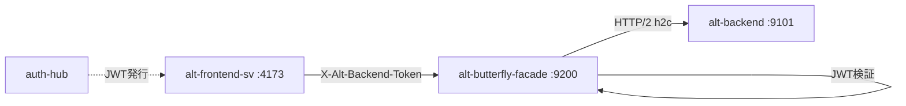

# Alt Butterfly Facade

_Last reviewed: January 22, 2026_

**Location:** `alt-butterfly-facade`

## Role
- Backend for Frontend (BFF) サービス。`alt-frontend-sv` と `alt-backend` 間の透過的プロキシ
- HTTP/2 (h2c) を使用した Connect-RPC リクエストの中継
- JWT トークン検証による認証ゲートウェイ

## Architecture & Flow

| Component | Responsibility |
| --- | --- |
| `main.go` | エントリポイント、サーバー起動 |
| `config/config.go` | 環境変数からの設定読み込み |
| `internal/client/backend_client.go` | HTTP/2 クライアント (alt-backend 向け) |
| `internal/handler/proxy_handler.go` | 透過的プロキシハンドラー |
| `internal/middleware/auth_interceptor.go` | JWT 検証ミドルウェア |
| `internal/server/server.go` | HTTP サーバー + h2c セットアップ |



## Endpoints & Behavior
- `GET /health` - ヘルスチェック
- `/* (proxy)` - 全 Connect-RPC リクエストを alt-backend へ転送

### Streaming Procedures
以下のプロシージャは拡張タイムアウト (5分) で処理:
- `/alt.feeds.v2.FeedService/StreamFeedStats`
- `/alt.feeds.v2.FeedService/StreamSummarize`
- `/alt.augur.v2.AugurService/StreamChat`
- `/alt.morning_letter.v2.MorningLetterService/StreamChat`

## Configuration & Env

| Variable | Default | Description |
|----------|---------|-------------|
| `BFF_PORT` | 9200 | サービスポート |
| `BACKEND_CONNECT_URL` | http://alt-backend:9101 | バックエンド URL |
| `BACKEND_TOKEN_SECRET_FILE` | - | JWT シークレットファイルパス |
| `BACKEND_TOKEN_SECRET` | - | JWT シークレット (フォールバック) |
| `BACKEND_TOKEN_ISSUER` | auth-hub | 期待する JWT issuer |
| `BACKEND_TOKEN_AUDIENCE` | alt-backend | 期待する JWT audience |
| `BFF_REQUEST_TIMEOUT` | 30s | 単発リクエストタイムアウト |
| `BFF_STREAMING_TIMEOUT` | 5m | ストリーミングタイムアウト |
| `AUTH_HUB_INTERNAL_URL` | http://auth-hub:8888 | Auth Hub 内部 URL |
| `LOG_LEVEL` | info | ログレベル (debug, info, warn, error) |

### JWT Claims Structure

`BackendClaims` (from `internal/middleware/auth_interceptor.go:33-38`):

```go
type BackendClaims struct {
    Email string `json:"email"`
    Role  string `json:"role"`
    Sid   string `json:"sid"`
    jwt.RegisteredClaims
}
```

### UserContext Fields

`UserContext` (from `internal/domain/user_context.go:20-28`):

| Field | Type | Description |
|-------|------|-------------|
| `UserID` | uuid.UUID | ユーザー ID (JWT subject から取得) |
| `Email` | string | メールアドレス |
| `Role` | string | ユーザーロール |
| `TenantID` | uuid.UUID | テナント ID (single-tenant では UserID と同値) |
| `SessionID` | string | セッション ID (JWT sid claim) |
| `LoginAt` | time.Time | ログイン日時 (JWT iat から取得) |
| `ExpiresAt` | time.Time | 有効期限 (JWT exp から取得) |

## Testing & Tooling
```bash
# テスト実行
go test ./...

# ビルド
go build -o alt-butterfly-facade .

# Docker ヘルスチェック
./alt-butterfly-facade healthcheck
```

**テストパターン:**
- `NewBackendClientWithTransport(url, timeout, streamingTimeout, http.DefaultTransport)` を使用
- `http.DefaultTransport` は HTTP/1.1 互換で `httptest.NewServer` と連携

## Operational Runbook
1. `docker compose -f compose/bff.yaml up -d` でサービス起動
2. `curl http://localhost:9200/health` でヘルスチェック
3. ログ確認: `docker compose logs -f alt-butterfly-facade`
4. JWT 検証エラー時は issuer/audience/expiration を確認

## Observability
- 構造化ログ: `log/slog` JSON フォーマット
- ログには request_id, method, path, latency_ms, status_code を含む
- rask.group ラベル: `alt-bff`

## Performance Targets

| Metric | Target |
|--------|--------|
| P50 Latency (proxy overhead) | <5ms |
| Memory Usage | <128MB |
| Connection pooling | Via http.Client |

## LLM Notes
- 透過的プロキシのため、proto 定義のインポートは不要
- `replace` ディレクティブは使用せず、BFF 独自の型を定義
- h2c (HTTP/2 cleartext) が Connect-RPC ストリーミングに必須
- JWT トークンは auth-hub が発行、BFF で検証後バックエンドへ転送
