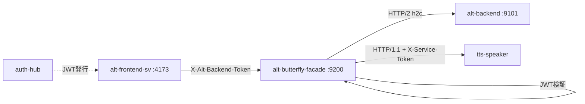

# Alt Butterfly Facade

_Last reviewed: February 28, 2026_

**Location:** `alt-butterfly-facade`

## Role
- Backend for Frontend (BFF) サービス。`alt-frontend-sv` と `alt-backend` 間の透過的プロキシ
- HTTP/2 (h2c) を使用した Connect-RPC リクエストの中継
- JWT トークン検証による認証ゲートウェイ
- TTS サービスへの Connect-RPC ルーティング (HTTP/1.1)
- レスポンスキャッシュ、リクエスト重複排除、サーキットブレーカー、エラー正規化

## Architecture & Flow

| Component | Responsibility |
| --- | --- |
| `main.go` | エントリポイント、サーバー起動 |
| `config/config.go` | 環境変数からの設定読み込み |
| `internal/client/backend_client.go` | HTTP/2 クライアント (alt-backend 向け) |
| `internal/handler/proxy_handler.go` | 透過的プロキシハンドラー |
| `internal/handler/bff_handler.go` | BFF 機能統合ハンドラー (キャッシュ・重複排除・CB・エラー正規化) |
| `internal/handler/dedup_handler.go` | リクエスト重複排除 |
| `internal/handler/error_normalizer.go` | エラーレスポンス正規化 |
| `internal/handler/aggregation_handler.go` | 複数クエリ並列集約ハンドラー |
| `internal/cache/response_cache.go` | インメモリレスポンスキャッシュ (LRU) |
| `internal/resilience/circuit_breaker.go` | サーキットブレーカーパターン実装 |
| `internal/middleware/auth_interceptor.go` | JWT 検証ミドルウェア |
| `internal/server/server.go` | HTTP サーバー + h2c セットアップ + ルーティング |



## Endpoints & Behavior
- `GET /health` - ヘルスチェック
- `GET /v1/bff/stats` - BFF 機能統計 (キャッシュ hit/miss、サーキットブレーカー状態)
- `POST /v1/aggregate` - 複数クエリ並列集約 (最大 10 クエリ)
- `/alt.tts.v1.TTSService/*` - TTS サービスへのルーティング (TTS_CONNECT_URL 設定時のみ)
- `/* (proxy)` - 全 Connect-RPC リクエストを alt-backend へ転送

### Streaming Procedures
以下のプロシージャは拡張タイムアウト (5分) で処理:
- `/alt.feeds.v2.FeedService/StreamFeedStats`
- `/alt.feeds.v2.FeedService/StreamSummarize`
- `/alt.augur.v2.AugurService/StreamChat`
- `/alt.morning_letter.v2.MorningLetterService/StreamChat`
- `/alt.tts.v1.TTSService/SynthesizeStream`

## Configuration & Env

**Port**: デフォルト `9200` (`config/config.go`)。Compose では `9250` にオーバーライド (`compose/bff.yaml`: `BFF_PORT=9250`, ポートマッピング `9250:9250`)。

| Variable | Default | Description |
|----------|---------|-------------|
| `BFF_PORT` | 9200 | サービスポート (Compose override: 9250) |
| `BACKEND_CONNECT_URL` | http://alt-backend:9101 | バックエンド URL |
| `BACKEND_TOKEN_SECRET_FILE` | - | JWT シークレットファイルパス |
| `BACKEND_TOKEN_SECRET` | - | JWT シークレット (フォールバック) |
| `BACKEND_TOKEN_ISSUER` | auth-hub | 期待する JWT issuer |
| `BACKEND_TOKEN_AUDIENCE` | alt-backend | 期待する JWT audience |
| `BFF_REQUEST_TIMEOUT` | 30s | 単発リクエストタイムアウト |
| `BFF_STREAMING_TIMEOUT` | 5m | ストリーミングタイムアウト |
| `TTS_CONNECT_URL` | (empty) | TTS サービス URL (例: http://tts-external:9700)。空の場合 TTS ルーティング無効 |
| `TTS_SERVICE_SECRET` | (empty) | TTS サービス認証用共有シークレット (X-Service-Token ヘッダーに設定) |
| `AUTH_HUB_INTERNAL_URL` | http://auth-hub:8888 | Auth Hub 内部 URL |
| `LOG_LEVEL` | info | ログレベル (debug, info, warn, error) |

### Feature Flags

全てデフォルト有効 (`config/config.go` でハードコード)。

| Flag | Default | Description |
|------|---------|-------------|
| `EnableCache` | true | レスポンスキャッシュを有効化 |
| `EnableCircuitBreaker` | true | サーキットブレーカーパターンを有効化 |
| `EnableDedup` | true | リクエスト重複排除を有効化 |
| `EnableErrorNormalization` | true | エラーレスポンス正規化を有効化 |

全フラグが無効の場合、レガシーの `ProxyHandler` にフォールバックする。

### JWT Claims Structure

`BackendClaims` (from `internal/middleware/auth_interceptor.go:33-38`):

```go
type BackendClaims struct {
    Email string `json:"email"`
    Role  string `json:"role"`
    Sid   string `json:"sid"`
    jwt.RegisteredClaims
}
```

### UserContext Fields

`UserContext` (from `internal/domain/user_context.go:20-28`):

| Field | Type | Description |
|-------|------|-------------|
| `UserID` | uuid.UUID | ユーザー ID (JWT subject から取得) |
| `Email` | string | メールアドレス |
| `Role` | string | ユーザーロール |
| `TenantID` | uuid.UUID | テナント ID (single-tenant では UserID と同値) |
| `SessionID` | string | セッション ID (JWT sid claim) |
| `LoginAt` | time.Time | ログイン日時 (JWT iat から取得) |
| `ExpiresAt` | time.Time | 有効期限 (JWT exp から取得) |

## TTS Integration

TTS (Text-to-Speech) サービスへの Connect-RPC リクエストを中継する。

- **ルーティング**: `/alt.tts.v1.TTSService/` プレフィックスのリクエストを `TTS_CONNECT_URL` へ転送
- **プロトコル**: HTTP/1.1 (tts-speaker の uvicorn が h2c 非対応のため)
- **認証**: `TTS_SERVICE_SECRET` が設定されている場合、`X-Service-Token` ヘッダーを付与
- **タイムアウト**: `BFF_STREAMING_TIMEOUT` (デフォルト 5分) を使用 (音声合成は時間がかかるため)
- **有効化条件**: `TTS_CONNECT_URL` が空でない場合のみルーティング登録
- **Compose 設定**: `compose/bff.yaml` で `TTS_CONNECT_URL` と `TTS_SERVICE_SECRET` を環境変数として渡し、`extra_hosts` で `tts-external` を解決

## Request Deduplication

同一リクエストの同時実行を排除し、バックエンドへの重複リクエストを防止する。

- **キー生成**: `userID:method:path:bodyHash(SHA-256)` で同一性を判定 (`BuildDedupKey`)
- **動作**: 同一キーのリクエストが処理中の場合、後続リクエストは完了を待ち同じ結果を受け取る
- **結果共有**: `DedupResult.Clone()` でディープコピーを返すため、レスポンスの干渉なし
- **対象**: POST リクエストのみ (Connect-RPC は POST を使用)
- **ウィンドウ**: 100ms (ハードコードデフォルト)
- **フラグ**: `EnableDedup`

## Error Normalization

バックエンドからのエラーレスポンスをフロントエンド向けに統一フォーマットへ変換する。

- **レスポンス形式**: `NormalizedError` 構造体 (`code`, `message`, `is_retryable`, `retry_after`, `request_id`)
- **HTTP ステータスマッピング**:
  - `502` -> `BACKEND_UNAVAILABLE` (リトライ可, 5s)
  - `503` -> `SERVICE_UNAVAILABLE` (リトライ可, 10s)
  - `429` -> `RATE_LIMIT_EXCEEDED` (リトライ可, 60s)
  - `401` -> `INVALID_TOKEN` (リトライ不可)
  - `403` -> `ACCESS_DENIED` (リトライ不可)
  - `500` -> `INTERNAL_ERROR` (リトライ可, 5s)
  - `504` -> `GATEWAY_TIMEOUT` (リトライ可, 10s)
- **ネットワークエラー**: バックエンド到達不可時は `NETWORK_ERROR` (リトライ可, 5s)
- **Retry-After ヘッダー**: バックエンドの `Retry-After` ヘッダーがあれば優先使用
- **フラグ**: `EnableErrorNormalization`

## Circuit Breaker

バックエンドの障害時にリクエストを遮断し、カスケード障害を防止する。

- **状態遷移**: `CLOSED` -> `OPEN` -> `HALF_OPEN` -> `CLOSED`
- **デフォルト設定**:
  - `FailureThreshold`: 5 (連続失敗でサーキットオープン)
  - `SuccessThreshold`: 2 (半開状態で連続成功するとクローズ)
  - `OpenTimeout`: 30s (オープン状態の持続時間)
- **動作**:
  - CLOSED: 全リクエスト通過、連続失敗をカウント
  - OPEN: 全リクエスト拒否 (`503 SERVICE_UNAVAILABLE`)。OpenTimeout 経過後に HALF_OPEN へ
  - HALF_OPEN: テストリクエストを許可。成功なら CLOSED、失敗なら再度 OPEN
- **統計**: `/v1/bff/stats` エンドポイントで状態・成功/失敗カウントを確認可能
- **フラグ**: `EnableCircuitBreaker`

## Response Cache

読み取り専用エンドポイントのレスポンスをインメモリキャッシュする。

- **方式**: LRU eviction、最大 1000 エントリ
- **キャッシュ対象エンドポイントとTTL**:
  - `/alt.feeds.v2.FeedService/GetDetailedFeedStats`: 30s
  - `/alt.feeds.v2.FeedService/GetUnreadCount`: 15s
  - `/alt.feeds.v2.FeedService/GetFeedStats`: 30s
- **除外**: ストリーミングエンドポイント、ミューテーション操作 (Create/Update/Delete/Mark 等)
- **キャッシュキー**: `userID:endpoint:bodyHash(SHA-256)`
- **ヘッダー**: `X-Cache: HIT` または `X-Cache: MISS` をレスポンスに付与
- **フラグ**: `EnableCache`

## Testing & Tooling
```bash
# テスト実行
go test ./...

# ビルド
go build -o alt-butterfly-facade .

# Docker ヘルスチェック
./alt-butterfly-facade healthcheck
```

**テストパターン:**
- `NewBackendClientWithTransport(url, timeout, streamingTimeout, http.DefaultTransport)` を使用
- `http.DefaultTransport` は HTTP/1.1 互換で `httptest.NewServer` と連携

## Operational Runbook
1. `docker compose -f compose/bff.yaml up -d` でサービス起動
2. `curl http://localhost:9250/health` でヘルスチェック (Compose ポート 9250)
3. `curl http://localhost:9250/v1/bff/stats` で BFF 機能統計を確認
4. ログ確認: `docker compose logs -f alt-butterfly-facade`
5. JWT 検証エラー時は issuer/audience/expiration を確認
6. サーキットブレーカーが OPEN の場合、バックエンドの健全性を確認

## Observability
- 構造化ログ: `log/slog` JSON フォーマット (trace context 対応)
- ログには request_id, method, path, latency_ms, status_code を含む
- rask.group ラベル: `alt-bff`
- BFF 統計エンドポイント: `/v1/bff/stats` (キャッシュ hit/miss、サーキットブレーカー状態)

## Performance Targets

| Metric | Target |
|--------|--------|
| P50 Latency (proxy overhead) | <5ms |
| Memory Usage | <128MB |
| Connection pooling | Via http.Client |

## LLM Notes
- 透過的プロキシのため、proto 定義のインポートは不要
- `replace` ディレクティブは使用せず、BFF 独自の型を定義
- h2c (HTTP/2 cleartext) が Connect-RPC ストリーミングに必須
- JWT トークンは auth-hub が発行、BFF で検証後バックエンドへ転送
- TTS ルーティングは HTTP/1.1 (uvicorn が h2c 非対応)
- BFF 機能フラグが全て無効の場合、レガシー ProxyHandler にフォールバック
- Dockerfile は `gcr.io/distroless/static-debian12:nonroot` ベース、EXPOSE 9200
