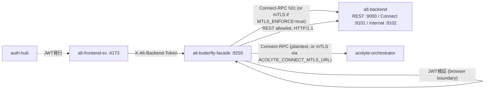

# Alt Butterfly Facade

_Last reviewed: September 5, 2026_

**Location:** `alt-butterfly-facade`

## Role
- Backend for Frontend (BFF) サービス。`alt-frontend-sv` と `alt-backend` / `acolyte-orchestrator` 間の透過的プロキシ
- HTTP/2 (h2c) を使用した Connect-RPC リクエストの中継。REST (`/v1/*`) はホワイトリスト化した prefix のみ HTTP/1.1 で別クライアントとして中継
- JWT トークン検証による認証ゲートウェイ (ブラウザ向け)。east-west (BFF → alt-backend / acolyte-orchestrator) は mTLS peer identity 側で担保する設計へ移行済みだが、`MTLS_ENFORCE` はデフォルト無効 (下記 Configuration 参照)
- レスポンスキャッシュ、リクエスト重複排除、依存クラス別サーキットブレーカー、エラー正規化
- in-process な PKI enrollment (`internal/pki/`): step-ca からリーフ証明書を自前で取得・更新する

## Architecture & Flow

| Component | Responsibility |
| --- | --- |
| `main.go` | エントリポイント、サーバー起動、mTLS/plaintext トランスポートの選択 |
| `config/config.go` | 環境変数からの設定読み込み |
| `internal/client/backend_client.go` | HTTP/2 クライアント (alt-backend / acolyte-orchestrator 向け) |
| `internal/handler/proxy_handler.go` | 透過的プロキシハンドラー、ストリーミングプロシージャ判定 |
| `internal/handler/bff_handler.go` | BFF 機能統合ハンドラー (キャッシュ・重複排除・CB・エラー正規化) |
| `internal/handler/dedup_handler.go` | リクエスト重複排除 |
| `internal/handler/error_normalizer.go` | エラーレスポンス正規化 |
| `internal/handler/aggregation_handler.go` | 複数クエリ並列集約ハンドラー |
| `internal/handler/rest_proxy_handler.go` | REST (`/v1/*`) 用プロキシハンドラー (allowlist 済み) |
| `internal/handler/admin_proxy_handler.go` | Knowledge Home Admin 用プロキシハンドラー |
| `internal/handler/admin_monitor_proxy_handler.go` | AdminMonitorService 用プロキシハンドラー (長時間 Watch ストリームに対応、短いタイムアウトを課さない) |
| `internal/cache/response_cache.go` | インメモリレスポンスキャッシュ (LRU) |
| `internal/resilience/circuit_breaker.go` | サーキットブレーカーパターン実装 |
| `internal/resilience/dependency_class.go` | エンドポイントを依存クラス (Mutation/Projection/ExternalContent/Telemetry/NonCritical) に分類し、CB 予算を分離 |
| `internal/middleware/auth_interceptor.go` | JWT 検証ミドルウェア |
| `internal/pki/` | in-process 証明書ライフサイクル (step-ca enrollment、リロード) |
| `internal/server/server.go` | HTTP サーバー + h2c セットアップ + ルーティング |


```mermaid
flowchart LR
    FE[alt-frontend-sv :4173]
    BFF[alt-butterfly-facade :9250]
    BE[alt-backend<br/>REST :9000 / Connect :9101 / internal :9102]
    AC[acolyte-orchestrator]
    AH[auth-hub]

    FE -->|"X-Alt-Backend-Token"| BFF
    BFF -->|"JWT検証 (browser boundary)"| BFF
    BFF -->|"Connect-RPC h2c (or mTLS if MTLS_ENFORCE=true)"| BE
    BFF -->|"REST allowlist, HTTP/1.1"| BE
    BFF -->|"Connect-RPC (plaintext, or mTLS via ACOLYTE_CONNECT_MTLS_URL)"| AC
    AH -.->|"JWT発行"| FE
```

## Endpoints & Behavior
- `GET /health` - ヘルスチェック (認証不要)
- `GET /metrics` - Prometheus scrape 用エンドポイント (認証不要。`/health` と同じリスナー `:9250` 上で公開されるため、edge がブラウザに `/metrics` を露出しないよう別途ガードする必要がある)
- `GET /v1/bff/stats` - BFF 機能統計 (キャッシュ hit/miss、依存クラス別サーキットブレーカー状態)。**admin ロールの JWT (`X-Alt-Backend-Token`) が必須**、それ以外は 403
- `POST /v1/aggregate` - 複数クエリ並列集約 (最大 10 クエリ)
- `/v1/*` (それ以外) - REST proxy。[[000729]] Phase 3 でアーキテクチャ上の allowlist に載っている prefix/pattern のみ alt-backend の plaintext Echo listener (`:9000`) へ中継、それ以外は 404
- `/alt.knowledge_home.v1.KnowledgeHomeAdminService/*` - Knowledge Home Admin API routing。呼び出し元 JWT の admin role check を BFF 境界で行い、alt-backend の internal listener (`BACKEND_INTERNAL_CONNECT_URL`, デフォルト `:9102`) へ転送
- `/alt.admin_monitor.v1.AdminMonitorService/*` - システム監視 (Prometheus 由来メトリクス)。同じく internal listener 宛、admin role check あり。長時間の `Watch` ストリーム向けに短いリクエストタイムアウトを課さない
- `/alt.acolyte.v1.AcolyteService/*` - acolyte-orchestrator への Connect-RPC 中継 (`ACOLYTE_CONNECT_URL` が設定されている場合のみ有効)。認証は TLS transport layer (mTLS) 側に委ねる設計
- `/* (proxy)` - それ以外の Connect-RPC は、生成済みの正の allowlist (`(alt.api.v1.visibility)` proto option 由来) に載っているサービスのみ alt-backend へ転送。allowlist 外は 404

### Streaming Procedures
以下のプロシージャはハードコードされたリストで判定され、拡張タイムアウトで処理される（`BFF_STREAMING_TIMEOUT`、デフォルト 40 分。上限は `maxStreamingTimeout` = 40 分）:
- `/alt.feeds.v2.FeedService/StreamFeedStats`
- `/alt.feeds.v2.FeedService/StreamSummarize`
- `/alt.augur.v2.AugurService/StreamChat`
- `/alt.morning_letter.v2.MorningLetterService/StreamChat`
- `/alt.knowledge_home.v1.KnowledgeHomeService/StreamKnowledgeHomeUpdates`

`StreamRecallRailUpdates` はこのリストに **含まれない**。RPC 自体は deprecated のまま alt-backend 側で稼働中だが ([[knowledge-loop-recall-deprecation]])、BFF のストリーミング判定には登録されていない。新しい streaming RPC を追加する際は、この一覧と proxy_handler.go の `streamingProcedures` マップの両方を更新すること — 片方だけ更新するとバッファリングまたはタイムアウトで静かに壊れる ([[000555]])。

## Configuration & Env

**Port**: デフォルト `9200` (`config/config.go`)。Compose では `9250` にオーバーライド (`compose/bff.yaml`: `BFF_PORT=9250`, ポートマッピング `9250:9250`)。

| Variable | Default | Description |
|----------|---------|-------------|
| `BFF_PORT` | 9200 | サービスポート (Compose override: 9250) |
| `BACKEND_CONNECT_URL` | http://alt-backend:9101 | alt-backend の browser-facing Connect-RPC URL |
| `BACKEND_INTERNAL_CONNECT_URL` | http://alt-backend:9102 | alt-backend の internal listener (Knowledge Home Admin / AdminMonitor 専用) |
| `BACKEND_REST_URL` | http://alt-backend:9000 | alt-backend の REST (Echo) listener |
| `ACOLYTE_CONNECT_URL` | - (空なら Acolyte ルーティング無効) | acolyte-orchestrator の Connect-RPC URL |
| `BACKEND_TOKEN_SECRET_FILE` | - | JWT シークレットファイルパス |
| `BACKEND_TOKEN_SECRET` | - | JWT シークレット (フォールバック) |
| `BACKEND_TOKEN_ISSUER` | auth-hub | 期待する JWT issuer |
| `BACKEND_TOKEN_AUDIENCE` | alt-backend | 期待する JWT audience |
| `BFF_REQUEST_TIMEOUT` | 30s | 単発リクエストタイムアウト |
| `BFF_STREAMING_TIMEOUT` | 40m | ストリーミングタイムアウト (Compose でも明示的に `40m` を設定) |
| `AUTH_HUB_INTERNAL_URL` | http://auth-hub:8888 | Auth Hub 内部 URL |
| `LOG_LEVEL` | info | ログレベル (debug, info, warn, error) |

### mTLS (east-west, オプトイン)

| Variable | Default | Description |
|----------|---------|-------------|
| `MTLS_ENFORCE` | false | `true` で alt-backend / acolyte-orchestrator への outbound を mTLS transport に切り替える (fail-closed: 証明書ロード失敗時は起動しない)。**現状は動作しない opt-in**: `true` にすると `newMTLSBackendTransport` が `AllowHTTP` 未設定の `http2.Transport` を使うため plaintext `http://` upstream URL を拒否し、alt-backend 向けの全 Connect RPC が失敗する。cmd/backend は mTLS listener を持たず (`config.RejectBackendMTLSListenerEnv` が起動時エラーにする)、cmd/datahub は `DataHubService` 以外全て 404 を返すため、ブラウザ/admin 向け Connect サーフェスに応答できる mTLS ターゲットが存在しない。Compose (`compose/bff.yaml`) はこれを明示的に `false` にしたまま運用中 — [[000954]] の 3-binary split が Wave 2 で peer を付け替えるまで有効化してはならない |
| `BACKEND_CONNECT_MTLS_URL` | - | 意図的に未設定。かつての宛先だった alt-backend `:9443` は 3-binary split で撤去済みで、代替の mTLS ターゲットはまだ存在しない — `MTLS_ENFORCE=true` にしても使い物にならない (上記参照) |
| `ACOLYTE_CONNECT_MTLS_URL` | - | `MTLS_ENFORCE=true` のとき `ACOLYTE_CONNECT_URL` の代わりに使う mTLS URL (例: `https://acolyte-orchestrator:9443`) |
| `MTLS_CERT_FILE` / `MTLS_KEY_FILE` / `MTLS_CA_FILE` | - | outbound mTLS transport 用のクライアント証明書一式 |
| `MTLS_LISTEN` | true (Compose default) | `true` で BFF 自身が inbound mTLS HTTPS listener を張る |
| `MTLS_PORT` | 9443 | inbound mTLS listener のポート |

REST プロキシは `MTLS_ENFORCE` の影響を受けない — alt-backend の Echo listener (`:9000`) は常に plaintext なので、REST 用トランスポートは常に別扱い。

### Feature Flags

全てデフォルト有効 (`config/config.go` でハードコード)。

| Flag | Default | Description |
|------|---------|-------------|
| `EnableCache` | true | レスポンスキャッシュを有効化 |
| `EnableCircuitBreaker` | true | サーキットブレーカーパターンを有効化 |
| `EnableDedup` | true | リクエスト重複排除を有効化 |
| `EnableErrorNormalization` | true | エラーレスポンス正規化を有効化 |

全フラグが無効の場合、レガシーの `ProxyHandler` にフォールバックする。

### JWT Claims Structure

`BackendClaims` (from `internal/middleware/auth_interceptor.go:33-38`):

```go
type BackendClaims struct {
    Email string `json:"email"`
    Role  string `json:"role"`
    Sid   string `json:"sid"`
    jwt.RegisteredClaims
}
```

### UserContext Fields

`UserContext` (from `internal/domain/user_context.go:20-28`):

| Field | Type | Description |
|-------|------|-------------|
| `UserID` | uuid.UUID | ユーザー ID (JWT subject から取得) |
| `Email` | string | メールアドレス |
| `Role` | string | ユーザーロール |
| `TenantID` | uuid.UUID | テナント ID (single-tenant では UserID と同値) |
| `SessionID` | string | セッション ID (JWT sid claim) |
| `LoginAt` | time.Time | ログイン日時 (JWT iat から取得) |
| `ExpiresAt` | time.Time | 有効期限 (JWT exp から取得) |

## Request Deduplication

同一リクエストの同時実行を排除し、バックエンドへの重複リクエストを防止する。

- **キー生成**: `userID:method:path:bodyHash(SHA-256)` で同一性を判定 (`BuildDedupKey`)
- **動作**: 同一キーのリクエストが処理中の場合、後続リクエストは完了を待ち同じ結果を受け取る
- **結果共有**: `DedupResult.Clone()` でディープコピーを返すため、レスポンスの干渉なし
- **対象**: POST リクエストのみ (Connect-RPC は POST を使用)
- **ウィンドウ**: 100ms (ハードコードデフォルト)
- **フラグ**: `EnableDedup`

## Error Normalization

バックエンドからのエラーレスポンスをフロントエンド向けに統一フォーマットへ変換する。

- **レスポンス形式**: `NormalizedError` 構造体 (`code`, `message`, `is_retryable`, `retry_after`, `request_id`)
- **HTTP ステータスマッピング**:
  - `502` -> `BACKEND_UNAVAILABLE` (リトライ可, 5s)
  - `503` -> `SERVICE_UNAVAILABLE` (リトライ可, 10s)
  - `429` -> `RATE_LIMIT_EXCEEDED` (リトライ可, 60s)
  - `401` -> `INVALID_TOKEN` (リトライ不可)
  - `403` -> `ACCESS_DENIED` (リトライ不可)
  - `500` -> `INTERNAL_ERROR` (リトライ可, 5s)
  - `504` -> `GATEWAY_TIMEOUT` (リトライ可, 10s)
- **ネットワークエラー**: バックエンド到達不可時は `NETWORK_ERROR` (リトライ可, 5s)
- **Retry-After ヘッダー**: バックエンドの `Retry-After` ヘッダーがあれば優先使用
- **フラグ**: `EnableErrorNormalization`

## Circuit Breaker

バックエンドの障害時にリクエストを遮断し、カスケード障害を防止する。エンドポイントは `internal/resilience/dependency_class.go` により依存クラスへ分類され、**クラスごとに独立した予算**を持つ（1 つの障害クラスが他のクラス全体を巻き込まない）。

- **依存クラス**:
  - `ClassCriticalMutation` — Critical Feed Mutations (MarkAsRead / MarkAsUnread など)
  - `ClassUnreadProjection` — Unread Projection Reads (list/count 系)
  - `ClassExternalContent` — クラスタ外 (サードパーティ publisher サイトなど) に出るホップ
  - `ClassTelemetry` — fire-and-forget な analytics 書き込み。結果を誰も待たないため **サーキットブレーカーのゲーティング対象外**
  - `ClassNonCritical` — 上記以外のデフォルト。分類されなかった残り全てを受け止めるオープンエンドな集合で、意図的に共有予算にしない。BFFHandler がエンドポイントごとに独立したサーキットブレーカーインスタンスを生成するため、このラベルは log/metrics 用のグルーピングにすぎない (`internal/resilience/dependency_class.go:146-156`)
- **状態遷移**: `CLOSED` -> `OPEN` -> `HALF_OPEN` -> `CLOSED`
- **デフォルト設定** (CriticalMutation / UnreadProjection が各クラス 1 つの breaker を共有。NonCritical は同じ閾値だがエンドポイントごとに独立した breaker インスタンス — クラスラベルは log/metrics 用のグルーピングにすぎない):
  - `FailureThreshold`: 5 (連続失敗でサーキットオープン)
  - `SuccessThreshold`: 2 (半開状態で連続成功するとクローズ)
  - `OpenTimeout`: 30s (オープン状態の持続時間)
- **ExternalContent 専用の緩い予算**: `FailureThreshold` 20 / `OpenTimeout` 5s。サードパーティ publisher のレート制限やペイウォールを alt-backend 障害と混同しないための意図的な差。再プローブも早い (次の記事は別 publisher のことが多いため)
- **動作**:
  - CLOSED: 全リクエスト通過、連続失敗をカウント
  - OPEN: 全リクエスト拒否 (`503 SERVICE_UNAVAILABLE`)。OpenTimeout 経過後に HALF_OPEN へ
  - HALF_OPEN: テストリクエストを許可。成功なら CLOSED、失敗なら再度 OPEN
- **統計**: `/v1/bff/stats` エンドポイント (admin JWT 必須) でクラスごとの状態・成功/失敗/拒否カウントを確認可能
- **フラグ**: `EnableCircuitBreaker`

## Response Cache

読み取り専用エンドポイントのレスポンスをインメモリキャッシュする。

- **方式**: LRU eviction、最大 1000 エントリ
- **キャッシュ対象エンドポイントとTTL**:
  - `/alt.feeds.v2.FeedService/GetDetailedFeedStats`: 30s
  - `/alt.feeds.v2.FeedService/GetUnreadCount`: 15s
  - `/alt.feeds.v2.FeedService/GetFeedStats`: 30s
- **除外**: ストリーミングエンドポイント、ミューテーション操作 (Create/Update/Delete/Mark 等)
- **キャッシュキー**: `userID:endpoint:bodyHash(SHA-256)`
- **ヘッダー**: `X-Cache: HIT` または `X-Cache: MISS` をレスポンスに付与
- **フラグ**: `EnableCache`

## Testing & Tooling
```bash
# テスト実行
go test ./...

# ビルド
go build -o alt-butterfly-facade .

# Docker ヘルスチェック
./alt-butterfly-facade healthcheck
```

**テストパターン:**
- `NewBackendClientWithTransport(url, timeout, streamingTimeout, http.DefaultTransport)` を使用
- `http.DefaultTransport` は HTTP/1.1 互換で `httptest.NewServer` と連携

## Operational Runbook
1. `docker compose -f compose/bff.yaml up -d` でサービス起動
2. `curl http://localhost:9250/health` でヘルスチェック (Compose ポート 9250)
3. `curl -H "X-Alt-Backend-Token: <admin JWT>" http://localhost:9250/v1/bff/stats` で BFF 機能統計を確認 (admin role の JWT が無いと 403)
4. ログ確認: `docker compose logs -f alt-butterfly-facade`
5. JWT 検証エラー時は issuer/audience/expiration を確認
6. サーキットブレーカーが OPEN の場合、対応する依存クラス (Mutation/Projection/ExternalContent/NonCritical) の下流の健全性を確認
7. `MTLS_ENFORCE=true` は現状サポートされていない設定 (上記 Configuration の mTLS セクション参照)。[[000954]] Wave 2 で mTLS ターゲットの付け替えが完了した環境で `tls: handshake failure` が出た場合は証明書 rotate と trust store の不一致を疑う

## Observability
- 構造化ログ: `log/slog` JSON フォーマット (trace context 対応)
- ログには request_id, method, path, latency_ms, status_code を含む
- rask.group ラベル: `alt-bff`
- BFF 統計エンドポイント: `/v1/bff/stats` (admin JWT 必須。キャッシュ hit/miss、依存クラス別サーキットブレーカー状態)
- `/metrics` (Prometheus, `/health` と同じ `:9250` リスナー上、認証なし) — compose network 越しに scrape される想定

## Performance Targets

| Metric | Target |
|--------|--------|
| P50 Latency (proxy overhead) | <5ms |
| Memory Usage | <128MB |
| Connection pooling | Via http.Client |

## Known failure patterns

Cross-cutting incident patterns are catalogued in [[crystallized-knowledge]].

- Streaming stalled even after nginx/heartbeat fixes (nginx was the edge at the time; it is now Plecto, [[wiki/services/nginx]]) → BFF `io.ReadAll` buffered whole responses ("the final boss"); streaming RPCs must bypass cache, dedup, and circuit breaker, detected by `application/connect+` content-type prefix match → PM-2026-004, [[000295]] [[000554]].
- Downstream JSON parse errors on proxied responses → forwarding the client's `Accept-Encoding` disables Go transport auto-decompression, so gzip bytes flow raw to the backend/frontend; never forward that header from a proxy → [[000084]].
- Streams still died at a fixed timeout after the edge proxy's timeout was extended → `http.Client.Timeout` caps the whole stream lifetime (body read included); streaming clients need `Timeout: 0` with context-deadline management, keep unary abuse-guard and streaming cap as separate timeouts, and flush explicitly via `http.Flusher` without a context timeout → [[000478]] [[000704]].
- A newly added streaming RPC silently breaks (buffered or timed out) → the streaming-procedure list here (`proxy_handler.go`'s `streamingProcedures` map) and the edge proxy's streaming route declarations are both hardcoded per procedure; adding a streaming service requires updating both, guarded by config-verification tests → [[000555]], checklist: [[connect-rpc-streaming-checklist]]. The edge was nginx's regex `location` block when this was written; it is now Plecto's per-service `path_prefix` routes in `plecto/manifest.toml` (Plecto has no regex catch-all, so each new streaming service needs its own explicit route there too).
- Streams reconnect every ~5 minutes → JWT TTL shorter than intended stream lifetime; silent because HTTP stays 200 — track body size / stream count / reconnect interval as SLIs → PM-2026-045, [[000929]].
- "Page opens but every API call is 403" → role claims must propagate through the whole pipeline (Kratos traits → auth-hub → JWT claim → BFF → FE layout); fixing only one side splits page and API authorization → [[000405]] [[000407]].

## LLM Notes
- 透過的プロキシのため、proto 定義のインポートは不要
- `replace` ディレクティブは使用せず、BFF 独自の型を定義
- h2c (HTTP/2 cleartext) が Connect-RPC の browser-facing/plaintext ストリーミングに必須。`MTLS_ENFORCE=true` にすると east-west (alt-backend / acolyte-orchestrator 向け) はその代わり mTLS transport を使う
- JWT トークンは auth-hub が発行、BFF で検証後バックエンドへ転送 (browser boundary の認証)。east-west 認証はかつて `X-Service-Token` + `SERVICE_SECRET` だったが撤去済み (commit `5d148ce25`) — `Config.LoadServiceSecret` は現在 no-op スタブ。east-west は mTLS peer identity へ寄せる設計だが、`MTLS_ENFORCE` がデフォルト無効なため、admin ルートは現状 BFF 境界の JWT role check のみで backend 側の service-level auth が無い状態（起動ログで明示的に warn される）
- BFF 機能フラグが全て無効の場合、レガシー ProxyHandler にフォールバック
- Dockerfile は `gcr.io/distroless/static-debian12:nonroot` ベース、EXPOSE 9200
