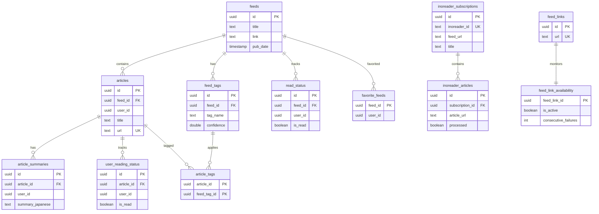
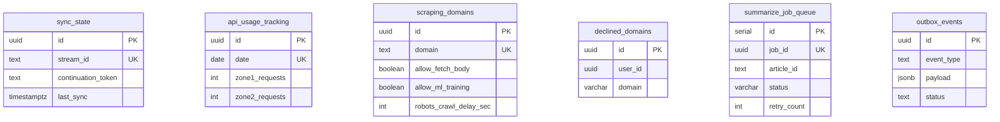

# alt-db (Main PostgreSQL Database)

PostgreSQL 17 database serving as the central data store for RSS feeds, articles, user status, and related data.

## Overview

| Property | Value |
|----------|-------|
| Image | PostgreSQL 17 |
| Port | 5432 |
| Migration Tool | Atlas |
| Migration Directory | `migrations-atlas/` |

## Services Accessing This Database

| Service | DB User | Access Purpose |
|---------|---------|----------------|
| alt-backend | `DB_USER` | Core API operations |
| pre-processor | `PRE_PROCESSOR_DB_USER` | Article processing |
| pre-processor-sidecar | `PRE_PROCESSOR_SIDECAR_DB_USER` | RSS/Inoreader sync |
| search-indexer | `SEARCH_INDEXER_DB_USER` | Index data retrieval |
| tag-generator | `DB_TAG_GENERATOR_USER` | Tag management |

## ER Diagram

### Main Tables (with relationships)

### Standalone Tables (no FK relationships)

## Table Categories

| Category | Tables | Description |
|----------|--------|-------------|
| Core | `feeds`, `feed_links`, `articles`, `article_summaries` | RSS feed and article base data |
| Tags | `feed_tags`, `article_tags` | Tag system (M:N relationship) |
| User Status | `read_status`, `user_reading_status`, `favorite_feeds` | User reading state tracking |
| Inoreader | `inoreader_subscriptions`, `inoreader_articles`, `sync_state`, `api_usage_tracking` | Inoreader API sync |
| Domain | `scraping_domains`, `declined_domains` | Domain management and scraping policy |
| Jobs | `summarize_job_queue`, `outbox_events`, `feed_link_availability` | Async job queues |

## Table Details

### Core Tables

#### feeds
Primary RSS feed metadata table.

| Column | Type | Constraints | Description |
|--------|------|-------------|-------------|
| id | UUID | PK, DEFAULT gen_random_uuid() | Primary key |
| title | TEXT | NOT NULL | Feed title |
| description | TEXT | NOT NULL | Feed description |
| link | TEXT | NOT NULL | Feed URL |
| pub_date | TIMESTAMP | NOT NULL | Publication date |
| created_at | TIMESTAMP | NOT NULL, DEFAULT NOW() | Record creation time |
| updated_at | TIMESTAMP | NOT NULL, DEFAULT NOW() | Last update time |

#### feed_links
Unique feed URL registry.

| Column | Type | Constraints | Description |
|--------|------|-------------|-------------|
| id | UUID | PK, DEFAULT gen_random_uuid() | Primary key |
| url | TEXT | UNIQUE, NOT NULL | Feed URL |

#### articles
Individual articles from RSS feeds.

| Column | Type | Constraints | Description |
|--------|------|-------------|-------------|
| id | UUID | PK, DEFAULT gen_random_uuid() | Primary key |
| feed_id | UUID | FK → feeds(id) ON DELETE CASCADE | Source feed |
| user_id | UUID | NOT NULL | Owner user (multi-tenant) |
| title | TEXT | NOT NULL | Article title |
| content | TEXT | NOT NULL | Article content |
| url | TEXT | UNIQUE, NOT NULL | Article URL |
| deleted_at | TIMESTAMP | | Soft delete timestamp |
| created_at | TIMESTAMP | NOT NULL, DEFAULT NOW() | Record creation time |

#### article_summaries
AI-generated Japanese summaries for articles.

| Column | Type | Constraints | Description |
|--------|------|-------------|-------------|
| id | UUID | PK, DEFAULT gen_random_uuid() | Primary key |
| article_id | UUID | FK → articles(id) ON DELETE CASCADE | Target article |
| user_id | UUID | NOT NULL | Owner user |
| article_title | TEXT | NOT NULL | Article title snapshot |
| summary_japanese | TEXT | NOT NULL | Japanese summary |
| created_at | TIMESTAMP | NOT NULL, DEFAULT NOW() | Generation time |

**Unique Constraint:** `(article_id, user_id)` - One summary per article per user

### Tag System

#### feed_tags
Tags assigned to feeds (auto-generated or manual).

| Column | Type | Constraints | Description |
|--------|------|-------------|-------------|
| id | UUID | PK, DEFAULT gen_random_uuid() | Primary key |
| feed_id | UUID | FK → feeds(id) ON DELETE CASCADE | Tagged feed |
| tag_name | TEXT | NOT NULL | Tag name |
| confidence | DOUBLE PRECISION | NOT NULL, DEFAULT 0 | ML confidence score |
| tag_type | VARCHAR(50) | DEFAULT 'auto' | Tag source (auto/manual) |
| created_at | TIMESTAMP | NOT NULL, DEFAULT NOW() | Creation time |
| updated_at | TIMESTAMP | NOT NULL, DEFAULT NOW() | Last update |

**Unique Constraint:** `(feed_id, tag_name)` - One tag per name per feed

#### article_tags
Junction table linking articles to feed tags (M:N).

| Column | Type | Constraints | Description |
|--------|------|-------------|-------------|
| article_id | UUID | PK, FK → articles(id) ON DELETE CASCADE | Tagged article |
| feed_tag_id | UUID | PK, FK → feed_tags(id) ON DELETE CASCADE | Applied tag |
| created_at | TIMESTAMPTZ | NOT NULL, DEFAULT NOW() | Assignment time |

### User Status Tables

#### read_status
Feed-level read status tracking per user.

| Column | Type | Constraints | Description |
|--------|------|-------------|-------------|
| id | UUID | PK, DEFAULT gen_random_uuid() | Primary key |
| feed_id | UUID | FK → feeds(id) ON DELETE CASCADE | Feed reference |
| user_id | UUID | NOT NULL | User reference |
| is_read | BOOLEAN | NOT NULL, DEFAULT FALSE | Read flag |
| read_at | TIMESTAMP | NOT NULL, DEFAULT NOW() | Read timestamp |
| created_at | TIMESTAMP | NOT NULL, DEFAULT NOW() | Record creation |

**Unique Constraint:** `(feed_id, user_id)` - One status per feed per user

#### user_reading_status
Article-level read status tracking per user.

| Column | Type | Constraints | Description |
|--------|------|-------------|-------------|
| id | UUID | PK, DEFAULT gen_random_uuid() | Primary key |
| user_id | UUID | NOT NULL | User reference |
| article_id | UUID | FK → articles(id) ON DELETE CASCADE | Article reference |
| is_read | BOOLEAN | NOT NULL, DEFAULT TRUE | Read flag |
| read_at | TIMESTAMP | NOT NULL, DEFAULT NOW() | Read timestamp |
| created_at | TIMESTAMP | NOT NULL, DEFAULT NOW() | Record creation |

**Unique Constraint:** `(user_id, article_id)` - One status per article per user

#### favorite_feeds
User's favorite/starred feeds.

| Column | Type | Constraints | Description |
|--------|------|-------------|-------------|
| feed_id | UUID | PK, FK → feeds(id) ON DELETE CASCADE | Favorited feed |
| user_id | UUID | | User reference |
| created_at | TIMESTAMPTZ | NOT NULL, DEFAULT NOW() | Favorite time |

### Inoreader Sync Tables

#### inoreader_subscriptions
Feed subscriptions synchronized from Inoreader.

| Column | Type | Constraints | Description |
|--------|------|-------------|-------------|
| id | UUID | PK, DEFAULT gen_random_uuid() | Primary key |
| inoreader_id | TEXT | UNIQUE, NOT NULL | Inoreader feed ID |
| feed_url | TEXT | NOT NULL | RSS feed URL |
| title | TEXT | | Feed title |
| category | TEXT | | Feed category/folder |
| synced_at | TIMESTAMPTZ | DEFAULT NOW() | Last sync time |
| created_at | TIMESTAMPTZ | DEFAULT NOW() | Record creation |

#### inoreader_articles
Articles fetched from Inoreader stream.

| Column | Type | Constraints | Description |
|--------|------|-------------|-------------|
| id | UUID | PK, DEFAULT gen_random_uuid() | Primary key |
| inoreader_id | TEXT | UNIQUE, NOT NULL | Inoreader article ID |
| subscription_id | UUID | FK → inoreader_subscriptions(id) ON DELETE CASCADE | Source subscription |
| article_url | TEXT | NOT NULL | Article URL |
| title | TEXT | | Article title |
| author | TEXT | | Article author |
| content | TEXT | | Full article content |
| content_length | INTEGER | DEFAULT 0 | Content character count |
| content_type | VARCHAR(50) | DEFAULT 'html' | Content type (html/text) |
| published_at | TIMESTAMPTZ | | Original publication time |
| fetched_at | TIMESTAMPTZ | DEFAULT NOW() | Fetch time |
| processed | BOOLEAN | DEFAULT FALSE | Processing status |

#### sync_state
Pagination state for Inoreader stream sync.

| Column | Type | Constraints | Description |
|--------|------|-------------|-------------|
| id | UUID | PK, DEFAULT gen_random_uuid() | Primary key |
| stream_id | TEXT | UNIQUE, NOT NULL | Stream identifier |
| continuation_token | TEXT | | Pagination token |
| last_sync | TIMESTAMPTZ | DEFAULT NOW() | Last sync timestamp |
| created_at | TIMESTAMPTZ | DEFAULT NOW() | Record creation |

#### api_usage_tracking
Daily Inoreader API usage monitoring.

| Column | Type | Constraints | Description |
|--------|------|-------------|-------------|
| id | UUID | PK, DEFAULT gen_random_uuid() | Primary key |
| date | DATE | UNIQUE, DEFAULT CURRENT_DATE | Tracking date |
| zone1_requests | INTEGER | DEFAULT 0 | Zone 1 API calls (read) |
| zone2_requests | INTEGER | DEFAULT 0 | Zone 2 API calls (write) |
| last_reset | TIMESTAMPTZ | DEFAULT NOW() | Counter reset time |
| rate_limit_headers | JSONB | DEFAULT '{}' | Rate limit response headers |

### Domain Management Tables

#### scraping_domains
Domain-level scraping policy and robots.txt cache.

| Column | Type | Constraints | Description |
|--------|------|-------------|-------------|
| id | UUID | PK, DEFAULT gen_random_uuid() | Primary key |
| domain | TEXT | UNIQUE, NOT NULL | Domain name |
| scheme | TEXT | NOT NULL, DEFAULT 'https' | Protocol (http/https) |
| allow_fetch_body | BOOLEAN | NOT NULL, DEFAULT TRUE | Allow body fetching |
| allow_ml_training | BOOLEAN | NOT NULL, DEFAULT TRUE | Allow ML usage |
| allow_cache_days | INTEGER | NOT NULL, DEFAULT 7 | Cache retention days |
| force_respect_robots | BOOLEAN | NOT NULL, DEFAULT TRUE | Respect robots.txt |
| robots_txt_url | TEXT | | robots.txt URL |
| robots_txt_content | TEXT | | Cached robots.txt |
| robots_txt_fetched_at | TIMESTAMPTZ | | Last fetch time |
| robots_txt_last_status | INTEGER | | Last HTTP status |
| robots_crawl_delay_sec | INTEGER | | Crawl-delay directive |
| robots_disallow_paths | JSONB | DEFAULT '[]' | Disallow paths list |
| created_at | TIMESTAMPTZ | NOT NULL, DEFAULT NOW() | Record creation |
| updated_at | TIMESTAMPTZ | NOT NULL, DEFAULT NOW() | Last update |

#### declined_domains
Domains explicitly declined by users.

| Column | Type | Constraints | Description |
|--------|------|-------------|-------------|
| id | UUID | PK, DEFAULT gen_random_uuid() | Primary key |
| user_id | UUID | NOT NULL | User reference |
| domain | VARCHAR(255) | NOT NULL | Declined domain |
| created_at | TIMESTAMPTZ | DEFAULT NOW() | Decline time |

### Job Queue Tables

#### summarize_job_queue
Async article summarization job queue.

| Column | Type | Constraints | Description |
|--------|------|-------------|-------------|
| id | SERIAL | PK | Auto-increment ID |
| job_id | UUID | UNIQUE, NOT NULL, DEFAULT gen_random_uuid() | Job identifier |
| article_id | TEXT | NOT NULL | Target article ID |
| status | VARCHAR(20) | NOT NULL, DEFAULT 'pending' | Job status |
| summary | TEXT | | Generated summary |
| error_message | TEXT | | Error details |
| retry_count | INTEGER | NOT NULL, DEFAULT 0 | Retry attempts |
| max_retries | INTEGER | NOT NULL, DEFAULT 3 | Max retry limit |
| created_at | TIMESTAMPTZ | NOT NULL, DEFAULT NOW() | Creation time |
| started_at | TIMESTAMPTZ | | Processing start |
| completed_at | TIMESTAMPTZ | | Processing end |

**Status Values:** `pending`, `running`, `completed`, `failed`

#### outbox_events
Event outbox for reliable event publishing.

| Column | Type | Constraints | Description |
|--------|------|-------------|-------------|
| id | UUID | PK, DEFAULT gen_random_uuid() | Primary key |
| event_type | TEXT | NOT NULL | Event type name |
| payload | JSONB | NOT NULL | Event payload |
| status | TEXT | NOT NULL, DEFAULT 'PENDING' | Event status |
| created_at | TIMESTAMPTZ | NOT NULL, DEFAULT NOW() | Creation time |
| processed_at | TIMESTAMPTZ | | Processing time |
| error_message | TEXT | | Error details |

#### feed_link_availability
Feed URL health monitoring.

| Column | Type | Constraints | Description |
|--------|------|-------------|-------------|
| feed_link_id | UUID | PK, FK → feed_links(id) ON DELETE CASCADE | Feed link reference |
| is_active | BOOLEAN | NOT NULL, DEFAULT TRUE | Active status |
| consecutive_failures | INTEGER | NOT NULL, DEFAULT 0 | Failure count |
| last_failure_at | TIMESTAMP | | Last failure time |
| last_failure_reason | TEXT | | Failure reason |

## Key Relationships

### Primary Relationships

| Parent | Child | Cardinality | ON DELETE |
|--------|-------|-------------|-----------|
| feeds | articles | 1:N | CASCADE |
| feeds | feed_tags | 1:N | CASCADE |
| feeds | read_status | 1:N | CASCADE |
| feeds | favorite_feeds | 1:N | CASCADE |
| articles | article_summaries | 1:N | CASCADE |
| articles | user_reading_status | 1:N | CASCADE |
| articles | article_tags | 1:N | CASCADE |
| feed_tags | article_tags | 1:N | CASCADE |
| inoreader_subscriptions | inoreader_articles | 1:N | CASCADE |
| feed_links | feed_link_availability | 1:1 | CASCADE |

### Many-to-Many Relationships

| Table A | Junction Table | Table B | Description |
|---------|----------------|---------|-------------|
| articles | article_tags | feed_tags | Article-tag associations |

## Indexes

Key performance indexes (see individual migration files for complete list):

- `idx_feeds_created_at` - Feed listing by date
- `idx_articles_user_created` - User's articles by date
- `idx_articles_feed_id` - Articles by feed
- `idx_feed_tags_feed_id` - Tags lookup by feed
- `idx_article_tags_feed_tag_id` - Tag usage lookup
- `idx_read_status_user_feed_read` - User read status queries
- `idx_inoreader_articles_processed` - Unprocessed article queue

## Related Documentation

- [Database Patterns Analysis](../review/03-database-patterns.md)
- [Microservices Reference](./MICROSERVICES.md)
- [Migration README](../../migrations-atlas/README.md)
