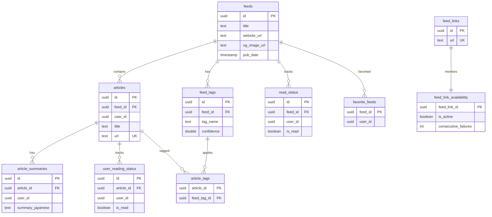
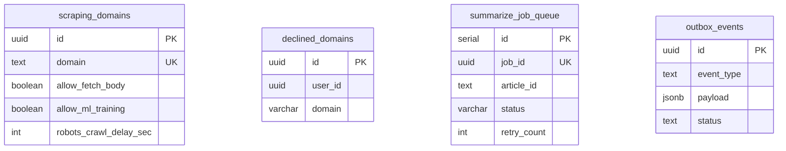

# alt-db (Main PostgreSQL Database)

_Last reviewed: September 5, 2026_

PostgreSQL 17 database serving as the central data store for RSS feeds, articles, user status, and related data.

## Overview

| Property | Value |
|----------|-------|
| Image | PostgreSQL 17 |
| Port | 5432 |
| Migration Tool | Atlas |
| Migration Directory | `migrations-atlas/` |

## Services Accessing This Database

| Service | DB User | Access Purpose |
|---------|---------|----------------|
| **alt-data-hub** | `DB_USER` | **唯一のデータオーナー。alt-db に接続する唯一のプロセス** |
| migrate | `DB_USER` | Atlas migration の one-shot 実行 |

> **Note ([[000954]]):** [[000241]] の「唯一のデータオーナー」は、alt-backend という
> 名前のプロセスから **alt-data-hub** へ移った。alt-backend / alt-harvester / alt-notifier を含む
> 全 consumer は `services.datahub.v1.DataHubService`（Connect-RPC、mTLS `:9443`）経由でのみ
> alt-db に触れる。DB DSN を持つ env アンカー (`x-alt-db-env` in `compose/core.yaml`) の
> consumer は alt-data-hub 1 つだけで、alt-backend / alt-harvester のイメージには
> そもそも DB ドライバが含まれていない（`alt-backend/app/di/import_boundary_test.go` が
> `go list -deps` でリンクレベルに強制）。
>
> pre-processor と pre-processor-sidecar は **alt-db ではなく `pre-processor-db`**
> を使う（[[000246]]）。search-indexer / tag-generator / recap-worker /
> rag-orchestrator も DB 直接接続は持たず、DataHubService 経由でアクセスする。

## ER Diagram

### Main Tables (with relationships)

```mermaid
erDiagram
    feeds ||--o{ articles : "contains"
    feeds ||--o{ feed_tags : "has"
    feeds ||--o{ read_status : "tracks"
    feeds ||--o{ favorite_feeds : "favorited"
    articles ||--o{ article_summaries : "has"
    articles ||--o{ user_reading_status : "tracks"
    articles ||--o{ article_tags : "tagged"
    feed_tags ||--o{ article_tags : "applies"
    feed_links ||--|| feed_link_availability : "monitors"

    feeds {
        uuid id PK
        text title
        text website_url
        text og_image_url
        timestamp pub_date
    }

    articles {
        uuid id PK
        uuid feed_id FK
        uuid user_id
        text title
        text url UK
    }

    article_summaries {
        uuid id PK
        uuid article_id FK
        uuid user_id
        text summary_japanese
    }

    feed_tags {
        uuid id PK
        uuid feed_id FK
        text tag_name
        double confidence
    }

    article_tags {
        uuid article_id PK
        uuid feed_tag_id PK
    }

    read_status {
        uuid id PK
        uuid feed_id FK
        uuid user_id
        boolean is_read
    }

    user_reading_status {
        uuid id PK
        uuid article_id FK
        uuid user_id
        boolean is_read
    }

    favorite_feeds {
        uuid feed_id PK
        uuid user_id
    }

    feed_links {
        uuid id PK
        text url UK
    }

    feed_link_availability {
        uuid feed_link_id PK
        boolean is_active
        int consecutive_failures
    }
```

> Inoreader sync tables (`inoreader_subscriptions`, `inoreader_articles`, `sync_state`, `api_usage_tracking`) were dropped from alt-db by `20260317000000_drop_pre_processor_legacy_tables.sql` — they live exclusively in `pre-processor-db` now ([[000246]]). No process reads or writes them from alt-db.

### Standalone Tables (no FK relationships)

```mermaid
erDiagram
    scraping_domains {
        uuid id PK
        text domain UK
        boolean allow_fetch_body
        boolean allow_ml_training
        int robots_crawl_delay_sec
    }

    declined_domains {
        uuid id PK
        uuid user_id
        varchar domain
    }

    summarize_job_queue {
        serial id PK
        uuid job_id UK
        text article_id
        varchar status
        int retry_count
    }

    outbox_events {
        uuid id PK
        text event_type
        jsonb payload
        text status
    }
```

### Knowledge Home / Trail tables have moved out

alt-db held the Knowledge Home event-sourcing/CQRS tables (`knowledge_events`, `knowledge_home_items`, `knowledge_user_events`, `knowledge_projection_checkpoints`, `knowledge_backfill_jobs`, `knowledge_projection_versions`, `knowledge_lenses`, `knowledge_lens_versions`, `knowledge_current_lens`, `knowledge_reproject_runs`, `knowledge_projection_audits`), the recall tables (`recall_signals`, `recall_candidate_view`), `today_digest_view`, and (briefly) the Knowledge Trail tables (`knowledge_trail_footprints`, `knowledge_trail_branches`). All of them were `DROP TABLE`'d from alt-db — `20260323100000_drop_sovereign_tables.sql` and `20260611000002_drop_misplaced_trail_tables.sql` — and now live exclusively in `knowledge-sovereign-db`, owned by the separate [[wiki/services/knowledge-sovereign]] service. No process reads or writes these tables in alt-db any more; alt-backend's Connect-RPC `KnowledgeHomeService`/`KnowledgeTrailService` reach them through `SovereignClient`, not through alt-data-hub.

## Table Categories

| Category | Tables | Description |
|----------|--------|-------------|
| Core | `feeds`, `feed_links`, `articles`, `article_summaries`, `article_heads` | RSS feed and article base data (`article_heads` caches `<head>`/OGP metadata for Visual Preview) |
| Tags | `feed_tags`, `article_tags` | Tag system (M:N relationship) |
| User Status | `read_status`, `user_reading_status`, `favorite_feeds`, `user_feed_subscriptions` | User reading state and subscription tracking |
| Domain | `scraping_domains`, `declined_domains` | Domain management and scraping policy |
| Jobs | `summarize_job_queue`, `outbox_events` (now with a lease column), `feed_link_availability` | Async job queues |
| Images | `feed_og_images`, `image_proxy_cache` | OG-image / image-proxy caching for the Visual Preview and image-proxy pipelines |
| Versioned artifacts | `summary_versions`, `tag_set_versions` | Append-first versioned summaries/tag-sets (immutable data model) |
| Push | `push_subscriptions`, `push_deliveries` | Web Push device registrations and `cmd/notifier`'s delivery queue. `push_deliveries` has more than one enqueuer: alt-harvester's `today-entrance-notifier` job, knowledge-sovereign (`recall_echo_ready` / `trail_branch_proposed` notifications — [[000970]] [[000973]] [[000974]] [[000977]]), and acolyte-orchestrator (relaying its own `notification_outbox` — see [[wiki/services/acolyte-db]]), all through `services.datahub.v1.DataHubService` |
| Acolyte reports (unused) | `reports`, `report_versions`, `report_change_items`, `report_jobs`, `report_runs`, `report_sections`, `report_section_versions` | Created by `20260409000000_create_acolyte_tables.sql` and never dropped, but dead: Acolyte's live report storage is `acolyte-db` (its own Atlas directory, `acolyte-migration-atlas/` — see [[wiki/services/acolyte-db]]), and no alt-data-hub capability reads or writes this alt-db copy |

Inoreader sync tables and every Knowledge Home / Trail / Recall table have been removed from alt-db entirely — see the notes above and in the ER diagrams.

## Table Details

### Core Tables

#### feeds
Primary RSS feed metadata table.

| Column | Type | Constraints | Description |
|--------|------|-------------|-------------|
| id | UUID | PK, DEFAULT gen_random_uuid() | Primary key |
| title | TEXT | NOT NULL | Feed title |
| description | TEXT | NOT NULL | Feed description |
| website_url | TEXT | NOT NULL, UNIQUE | Website URL of the feed channel (RSS `<channel><link>`); renamed from `link` 2026-04-28 |
| og_image_url | TEXT | | OGP image URL scraped from the feed's website (added 2026-03-01) |
| pub_date | TIMESTAMP | NOT NULL | Publication date |
| created_at | TIMESTAMP | NOT NULL, DEFAULT NOW() | Record creation time |
| updated_at | TIMESTAMP | NOT NULL, DEFAULT NOW() | Last update time |

#### feed_links
Unique feed URL registry.

| Column | Type | Constraints | Description |
|--------|------|-------------|-------------|
| id | UUID | PK, DEFAULT gen_random_uuid() | Primary key |
| url | TEXT | UNIQUE, NOT NULL | Feed URL |

#### articles
Individual articles from RSS feeds.

| Column | Type | Constraints | Description |
|--------|------|-------------|-------------|
| id | UUID | PK, DEFAULT gen_random_uuid() | Primary key |
| feed_id | UUID | FK → feeds(id) ON DELETE CASCADE | Source feed |
| user_id | UUID | NOT NULL | Owner user (multi-tenant) |
| title | TEXT | NOT NULL | Article title |
| content | TEXT | NOT NULL | Article content |
| url | TEXT | UNIQUE, NOT NULL | Article URL |
| deleted_at | TIMESTAMP | | Soft delete timestamp |
| created_at | TIMESTAMP | NOT NULL, DEFAULT NOW() | Record creation time |

#### article_summaries
AI-generated Japanese summaries for articles.

| Column | Type | Constraints | Description |
|--------|------|-------------|-------------|
| id | UUID | PK, DEFAULT gen_random_uuid() | Primary key |
| article_id | UUID | FK → articles(id) ON DELETE CASCADE | Target article |
| user_id | UUID | NOT NULL | Owner user |
| article_title | TEXT | NOT NULL | Article title snapshot |
| summary_japanese | TEXT | NOT NULL | Japanese summary |
| created_at | TIMESTAMP | NOT NULL, DEFAULT NOW() | Generation time |

**Unique Constraint:** `(article_id, user_id)` - One summary per article per user

### Tag System

#### feed_tags
Tags assigned to feeds (auto-generated or manual).

| Column | Type | Constraints | Description |
|--------|------|-------------|-------------|
| id | UUID | PK, DEFAULT gen_random_uuid() | Primary key |
| feed_id | UUID | FK → feeds(id) ON DELETE CASCADE | Tagged feed |
| tag_name | TEXT | NOT NULL | Tag name |
| confidence | DOUBLE PRECISION | NOT NULL, DEFAULT 0 | ML confidence score |
| tag_type | VARCHAR(50) | DEFAULT 'auto' | Tag source (auto/manual) |
| created_at | TIMESTAMP | NOT NULL, DEFAULT NOW() | Creation time |
| updated_at | TIMESTAMP | NOT NULL, DEFAULT NOW() | Last update |

**Unique Constraint:** `(feed_id, tag_name)` - One tag per name per feed

#### article_tags
Junction table linking articles to feed tags (M:N).

| Column | Type | Constraints | Description |
|--------|------|-------------|-------------|
| article_id | UUID | PK, FK → articles(id) ON DELETE CASCADE | Tagged article |
| feed_tag_id | UUID | PK, FK → feed_tags(id) ON DELETE CASCADE | Applied tag |
| created_at | TIMESTAMPTZ | NOT NULL, DEFAULT NOW() | Assignment time |

### User Status Tables

#### read_status
Feed-level read status tracking per user.

| Column | Type | Constraints | Description |
|--------|------|-------------|-------------|
| id | UUID | PK, DEFAULT gen_random_uuid() | Primary key |
| feed_id | UUID | FK → feeds(id) ON DELETE CASCADE | Feed reference |
| user_id | UUID | NOT NULL | User reference |
| is_read | BOOLEAN | NOT NULL, DEFAULT FALSE | Read flag |
| read_at | TIMESTAMP | NOT NULL, DEFAULT NOW() | Read timestamp |
| created_at | TIMESTAMP | NOT NULL, DEFAULT NOW() | Record creation |

**Unique Constraint:** `(feed_id, user_id)` - One status per feed per user

#### user_reading_status
Article-level read status tracking per user.

| Column | Type | Constraints | Description |
|--------|------|-------------|-------------|
| id | UUID | PK, DEFAULT gen_random_uuid() | Primary key |
| user_id | UUID | NOT NULL | User reference |
| article_id | UUID | FK → articles(id) ON DELETE CASCADE | Article reference |
| is_read | BOOLEAN | NOT NULL, DEFAULT TRUE | Read flag |
| read_at | TIMESTAMP | NOT NULL, DEFAULT NOW() | Read timestamp |
| created_at | TIMESTAMP | NOT NULL, DEFAULT NOW() | Record creation |

**Unique Constraint:** `(user_id, article_id)` - One status per article per user

#### favorite_feeds
User's favorite/starred feeds.

| Column | Type | Constraints | Description |
|--------|------|-------------|-------------|
| feed_id | UUID | PK, FK → feeds(id) ON DELETE CASCADE | Favorited feed |
| user_id | UUID | | User reference |
| created_at | TIMESTAMPTZ | NOT NULL, DEFAULT NOW() | Favorite time |

> Inoreader sync tables (`inoreader_subscriptions`, `inoreader_articles`, `sync_state`, `api_usage_tracking`) no longer exist in alt-db — see the note above under "Main Tables".

### Domain Management Tables

#### scraping_domains
Domain-level scraping policy and robots.txt cache.

| Column | Type | Constraints | Description |
|--------|------|-------------|-------------|
| id | UUID | PK, DEFAULT gen_random_uuid() | Primary key |
| domain | TEXT | UNIQUE, NOT NULL | Domain name |
| scheme | TEXT | NOT NULL, DEFAULT 'https' | Protocol (http/https) |
| allow_fetch_body | BOOLEAN | NOT NULL, DEFAULT TRUE | Allow body fetching |
| allow_ml_training | BOOLEAN | NOT NULL, DEFAULT TRUE | Allow ML usage |
| allow_cache_days | INTEGER | NOT NULL, DEFAULT 7 | Cache retention days |
| force_respect_robots | BOOLEAN | NOT NULL, DEFAULT TRUE | Respect robots.txt |
| robots_txt_url | TEXT | | robots.txt URL |
| robots_txt_content | TEXT | | Cached robots.txt |
| robots_txt_fetched_at | TIMESTAMPTZ | | Last fetch time |
| robots_txt_last_status | INTEGER | | Last HTTP status |
| robots_crawl_delay_sec | INTEGER | | Crawl-delay directive |
| robots_disallow_paths | JSONB | DEFAULT '[]' | Disallow paths list |
| created_at | TIMESTAMPTZ | NOT NULL, DEFAULT NOW() | Record creation |
| updated_at | TIMESTAMPTZ | NOT NULL, DEFAULT NOW() | Last update |

#### declined_domains
Domains explicitly declined by users.

| Column | Type | Constraints | Description |
|--------|------|-------------|-------------|
| id | UUID | PK, DEFAULT gen_random_uuid() | Primary key |
| user_id | UUID | NOT NULL | User reference |
| domain | VARCHAR(255) | NOT NULL | Declined domain |
| created_at | TIMESTAMPTZ | DEFAULT NOW() | Decline time |

### Job Queue Tables

#### summarize_job_queue
Async article summarization job queue.

| Column | Type | Constraints | Description |
|--------|------|-------------|-------------|
| id | SERIAL | PK | Auto-increment ID |
| job_id | UUID | UNIQUE, NOT NULL, DEFAULT gen_random_uuid() | Job identifier |
| article_id | TEXT | NOT NULL | Target article ID |
| status | VARCHAR(20) | NOT NULL, DEFAULT 'pending' | Job status |
| summary | TEXT | | Generated summary |
| error_message | TEXT | | Error details |
| retry_count | INTEGER | NOT NULL, DEFAULT 0 | Retry attempts |
| max_retries | INTEGER | NOT NULL, DEFAULT 3 | Max retry limit |
| created_at | TIMESTAMPTZ | NOT NULL, DEFAULT NOW() | Creation time |
| started_at | TIMESTAMPTZ | | Processing start |
| completed_at | TIMESTAMPTZ | | Processing end |

**Status Values:** `pending`, `running`, `completed`, `failed`

#### outbox_events
Event outbox for reliable event publishing.

| Column | Type | Constraints | Description |
|--------|------|-------------|-------------|
| id | UUID | PK, DEFAULT gen_random_uuid() | Primary key |
| event_type | TEXT | NOT NULL | Event type name |
| payload | JSONB | NOT NULL | Event payload |
| status | TEXT | NOT NULL, DEFAULT 'PENDING' | Event status (PENDING/PROCESSING/PROCESSED/FAILED) |
| created_at | TIMESTAMPTZ | NOT NULL, DEFAULT NOW() | Creation time |
| processed_at | TIMESTAMPTZ | | Processing time |
| error_message | TEXT | | Error details |
| next_attempt_at | TIMESTAMPTZ | NOT NULL, DEFAULT now() | Claim lease (added 2026-08-14): a `PROCESSING` row past this instant is claimable again, so a crashed harvester recovers its batch with no separate reclaim sweeper |

#### feed_link_availability
Feed URL health monitoring.

| Column | Type | Constraints | Description |
|--------|------|-------------|-------------|
| feed_link_id | UUID | PK, FK → feed_links(id) ON DELETE CASCADE | Feed link reference |
| is_active | BOOLEAN | NOT NULL, DEFAULT TRUE | Active status |
| consecutive_failures | INTEGER | NOT NULL, DEFAULT 0 | Failure count |
| last_failure_at | TIMESTAMP | | Last failure time |
| last_failure_reason | TEXT | | Failure reason |

## Key Relationships

### Primary Relationships

| Parent | Child | Cardinality | ON DELETE |
|--------|-------|-------------|-----------|
| feeds | articles | 1:N | CASCADE |
| feeds | feed_tags | 1:N | CASCADE |
| feeds | read_status | 1:N | CASCADE |
| feeds | favorite_feeds | 1:N | CASCADE |
| articles | article_summaries | 1:N | CASCADE |
| articles | user_reading_status | 1:N | CASCADE |
| articles | article_tags | 1:N | CASCADE |
| feed_tags | article_tags | 1:N | CASCADE |
| feed_links | feed_link_availability | 1:1 | CASCADE |

### Many-to-Many Relationships

| Table A | Junction Table | Table B | Description |
|---------|----------------|---------|-------------|
| articles | article_tags | feed_tags | Article-tag associations |

## Indexes

Key performance indexes (see individual migration files for complete list):

- `idx_feeds_created_at` - Feed listing by date
- `idx_articles_user_created` - User's articles by date
- `idx_articles_feed_id` - Articles by feed
- `idx_feed_tags_feed_id` - Tags lookup by feed
- `idx_article_tags_feed_tag_id` - Tag usage lookup
- `idx_read_status_user_feed_read` - User read status queries
- `idx_outbox_events_claim` - Partial index over `outbox_events(created_at) WHERE status IN ('PENDING','PROCESSING')`, the outbox claim query

The `feeds`-table indexes that used to be named `idx_feeds_link*` / `unique_feeds_link` were renamed to `idx_feeds_website_url*` / `unique_feeds_website_url` alongside the `link` → `website_url` column rename.

## Known failure patterns

Distilled from the ADR / postmortem corpus (see `docs/runbooks/crystallized-knowledge.md`). Most services reach this database through PgBouncer (transaction pooling), which is the root of several patterns below.

- **JSONB encoding inverts with the connection path** — via PgBouncer + pgx simple protocol, `[]byte` is encoded as bytea hex and fails with SQLSTATE 22P02: pass `string(json.Marshal(...))` ([[000417]], [[000470]]); direct pgx connections want `[]byte` instead ([[000577]]). Never hand-roll a new path — reuse the existing driver helpers and cover with an integration test.
- **Empty/nil `json.RawMessage` breaks JSONB writes** — empty slice → 22P02, Go nil zero-value → explicit NULL that bypasses `NOT NULL DEFAULT`; use the shared driver helper (`len==0 → "{}"`) ([[000454]], PM-2026-040).
- **`[]uuid.UUID` parameters fail under simple protocol** — pass `[]string` + `ANY($1::uuid[])` ([[000379]]).
- **DDL and session-level locks must bypass PgBouncer** — Atlas and kratos-migrate connect directly to the database, never through the pooler ([[000327]]).
- **Short `idle_in_transaction_session_timeout` cascades** — a 30s value caused FATAL disconnects that rippled across the shared pool and halted all queries; keep it long (5 min) as a last-resort guard only ([[000328]]).
- **`FOR UPDATE SKIP LOCKED` in autocommit releases the lock immediately** — dequeue from `summarize_job_queue` / `outbox_events` must be a single atomic statement: `UPDATE ... WHERE id IN (SELECT ... FOR UPDATE SKIP LOCKED) RETURNING` ([[000282]], [[000509]]).
- **Atlas cannot run `CREATE INDEX CONCURRENTLY`** (migrations run inside a transaction) — adding an index to a large table takes a lock; schedule off-peak ([[000282]], [[000422]]).
- **Missing `shm_size` kills PostgreSQL under load** — Docker's 64 MB default collides with work_mem dynamic shared memory (SQLSTATE 53100); set it explicitly on every PostgreSQL container ([[000521]]).
- **Cache-miss fan-out exhausts the shared pool** — a TTL expiry triggering N parallel queries degraded unrelated writes via PgBouncer; evaluate caches with miss-time fan-out cost × shared-pool side effects, and prefer existing optimized single-SQL paths (PM-2026-019, [[000624]]).

## Related Documentation

- [Database Patterns Analysis](../review/03-database-patterns.md)
- [Microservices Reference](./MICROSERVICES.md)
- [Pre-processor DB](./MICROSERVICES.md) — Separate PostgreSQL 17 instance (port 5437) for pre-processor feed data
- [Migration README](../../migrations-atlas/README.md)
