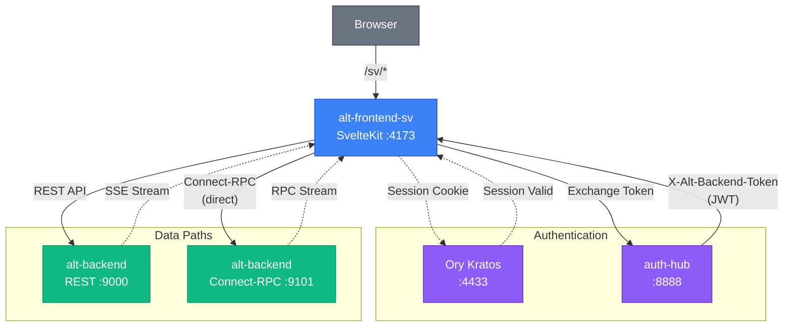

# Alt Frontend SV

_Last reviewed: February 28, 2026_

**Location:** `alt-frontend-sv`
**Base Path:** `/sv`

## Role
- **Next-Gen Frontend**: A SvelteKit (Svelte 5 Runes) + Vite application serving as the modern, high-performance interface for the platform.
- **Unified Interface**: Serves both desktop (dashboard) and mobile (feed reader) experiences with a focus on speed and interaction.
- **Auth Consumer**: Integrated with Ory Kratos for identity management, using `auth-hub` for backend token exchange.

## Architecture Snapshot

| Layer | Details |
| --- | --- |
| **Routing** | File-system based routing in `src/routes`. Served under **`/sv`** base path (configured in `svelte.config.js`). |
| **State Management** | **Svelte 5 Runes** (`$state`, `$derived`, `$effect`) for reactive state. `src/lib/stores` contains global stores (e.g., `auth.svelte.ts`). |
| **Data Fetching** | `src/lib/api.ts` wraps `fetch` for REST. `src/lib/connect/` handles Connect-RPC directly to alt-backend:9101. TanStack Svelte Query (`src/lib/queries/`) for caching. Token exchange with `auth-hub` provides `X-Alt-Backend-Token` (JWT). |
| **Real-time** | SSE (Server-Sent Events) via `src/lib/api/sse.ts` for REST streams. Connect-RPC streaming via `streamingAdapter.ts` for typed streams. |
| **Styling** | **TailwindCSS v4** (using the new Vite plugin) with `bits-ui` for primitives and `lucide-svelte` for icons. |
| **Middleware** | `src/hooks.server.ts` validates Ory sessions, populates `event.locals.User` / `Session`, and handles redirects for protected routes. |
| **Feature Flags** | `src/lib/features/flags.ts` controls gradual migration from REST to Connect-RPC per feature area. |

### Data Path Overview

| Protocol | Path | Use Case |
|----------|------|----------|
| **REST** | Frontend → alt-backend:9000 | Legacy endpoints, SSE streams |
| **Connect-RPC** | Frontend → alt-backend:9101 | Typed RPC, streaming procedures (direct connection) |



## Route Table

The app uses SvelteKit file-system routing under the `/sv` base path. The `(app)` route group applies the responsive layout (desktop/mobile detection via `ResponsiveLayout`).

### Page Routes

| Route (under `/sv`) | Description | Layout Group |
|----------------------|-------------|--------------|
| `/` | Landing page with auth status and login/register links | root |
| `/home` | Home dashboard (mobile: feed stats with SSE; desktop: redirects) | root |
| `/login` | Ory Kratos login flow | root |
| `/auth/login` | Alternative Ory Kratos login flow | root |
| `/register` | Ory Kratos registration flow | root |
| `/error` | Error display page | root |
| `/feeds` | Feed list (desktop: grid + modal; mobile: swipe cards) | `(app)` |
| `/feeds/search` | Full-text feed search with infinite scroll | `(app)` |
| `/feeds/favorites` | Favorite/bookmarked feeds | `(app)` |
| `/feeds/viewed` | Previously viewed feeds | `(app)` |
| `/feeds/swipe` | Swipe-based feed reader | `(app)` |
| `/feeds/swipe/visual-preview` | Visual preview for swipe cards | `(app)` |
| `/feeds/tag-trail` | Tag-based feed browsing | `(app)` |
| `/settings/feeds` | RSS feed management (add/remove/subscribe) | `(app)` |
| `/augur` | AI chat interface (Ask Augur) | `(app)` |
| `/recap` | 3-day / 7-day recap viewer | `(app)` |
| `/recap/morning-letter` | Morning letter recap | `(app)` |
| `/recap/evening-pulse` | Evening pulse recap | `(app)` |
| `/recap/job-status` | Recap generation job status | `(app)` |
| `/dashboard` | System admin dashboard (desktop only; mobile redirects to feeds) | `(app)` |
| `/stats` | Feed analytics and trend charts | `(app)` |
| `/eval-dashboard` | Evaluation metrics dashboard (classification, clustering, summarization) | root |
| `/[...path]` | Catch-all: redirects unknown paths to `/home` | root |

### API / Server Routes

| Route (under `/sv`) | Method | Description |
|----------------------|--------|-------------|
| `/health` | GET | Health check (returns `OK` plain text) |
| `/logout` | POST | Ory Kratos logout |
| `/api/auth/csrf` | GET | CSRF token for auth flows |
| `/api/v1/feeds/*` | Various | BFF proxy: feed stats, cursor fetch, read status, trends |
| `/api/v1/rss-feed-link/*` | Various | BFF proxy: RSS feed link CRUD |
| `/api/v1/dashboard/*` | Various | BFF proxy: admin dashboard data (overview, metrics, logs, jobs) |
| `/api/v1/generate/recaps/*` | POST | BFF proxy: trigger recap generation |
| `/api/feeds/random` | GET | Random feed selection |
| `/api/articles/*` | Various | BFF proxy: article tags |
| `/api/v2/[...path]` | Various | Connect-RPC proxy (passthrough to alt-backend:9101) |

> **Legacy routes**: `/sv/desktop/*` and `/sv/mobile/*` routes still exist alongside the unified `(app)` group but are being phased out in favor of the responsive `(app)` layout.

## Key Directories

- `src/routes`:
    - `(app)/feeds`: Unified feed views (responsive desktop/mobile).
    - `(app)/augur`: AI chat interface.
    - `(app)/recap/*`: Recap views (7-day, morning letter, evening pulse, job status).
    - `(app)/settings/feeds`: Feed management.
    - `(app)/dashboard`: System administration (desktop-only).
    - `(app)/stats`: Analytics and trend charts.
    - `/home`: Mobile home dashboard.
    - `/login`, `/register`: Authentication pages.
    - `/health`: Health check endpoint.
    - `/api/v2/[...path]`: Connect-RPC proxy endpoint.
    - `desktop/*`, `mobile/*`: Legacy device-specific routes (being migrated to `(app)`).
- `src/lib`:
    - `api.ts`: REST API client. Handles token exchange and error normalization.
    - `connect/`: Connect-RPC transport and client setup (direct to alt-backend:9101).
    - `gen/`: Generated protobuf definitions (feeds, articles, augur, rss, recap, morning_letter, etc.).
    - `features/`: Feature flag system for gradual Connect-RPC migration.
    - `queries/`: TanStack Svelte Query hooks for data fetching and caching.
    - `actions/`: Svelte actions (swipe, infinite-scroll).
    - `schema/`: Validation schemas using Valibot.
    - `components/`: Reusable UI components (Atomic design-ish).
    - `stores/`: Global state using Runes (e.g., `auth.svelte.ts`).
    - `hooks/`: Custom Svelte hooks (e.g., `useSSEFeedsStats.svelte.ts`).

## Connect-RPC Modules

Located in `src/lib/connect/`:

| Module | Description |
|--------|-------------|
| `feeds.ts` | Feed stats, unread/read/favorite feeds, search, streaming, mark-as-read |
| `articles.ts` | Article operations (fetch, update, favorite) |
| `recap.ts` | 7-day recap generation and retrieval |
| `augur.ts` | AI chat streaming interface |
| `rss.ts` | RSS feed management (add, remove, import OPML) |
| `morning_letter.ts` | Morning letter generation and retrieval |
| `streamingAdapter.ts` | Streaming support utilities for Connect-RPC |

## Feature Flags

The feature flag system (`src/lib/features/flags.ts`) enables gradual migration from REST to Connect-RPC:

| Flag | Environment Variable | Description |
|------|---------------------|-------------|
| `use_connect_feeds` | `PUBLIC_USE_CONNECT_FEEDS` | Use Connect-RPC for feed operations |
| `use_connect_articles` | `PUBLIC_USE_CONNECT_ARTICLES` | Use Connect-RPC for article operations |
| `use_connect_rss` | `PUBLIC_USE_CONNECT_RSS` | Use Connect-RPC for RSS management |

## Components Overview

### Desktop Components (`src/lib/components/desktop/`)
- `augur/`: AI chat interface components
- `dashboard/`: Admin dashboard panels
- `feeds/`: Feed list and article display
- `layout/`: Page layouts and navigation
- `morning-letter/`: Morning letter display
- `recap/`: Recap display components
- `settings/`: User settings
- `stats/`: Statistics visualizations

### Mobile Components (`src/lib/components/mobile/`)
- `feeds/`: Mobile feed reader with swipe
- `morning-letter/`: Mobile morning letter
- `recap/`: Mobile recap views
- `search/`: Mobile search interface

### Dashboard Tabs (`src/lib/components/dashboard/`)
- `OverviewTab`: System overview
- `ClassificationTab`: Article classification metrics
- `ClusteringTab`: Clustering metrics
- `SummarizationTab`: Summarization metrics
- `AdminJobsTab`: Admin job management
- `LogAnalysisTab`: Log analysis
- `RecapJobsTab`: Recap job monitoring
- `SystemMonitorTab`: System health monitoring

### UI Primitives (`src/lib/components/ui/`)
Based on `bits-ui`: button, card, input, label, dialog, sheet, accordion, textarea, system-loader, etc.

## XSS Prevention

The frontend implements a **two-layer sanitization strategy** to protect against XSS attacks when rendering RSS feed content:

### Layer 1: Domain-Level Sanitization (`src/lib/domain/feed/sanitize.ts`)

All feed data from the backend is sanitized at the domain boundary before entering the view layer:

- **`sanitizeContent()`**: Strips all HTML tags, collapses whitespace, decodes HTML entities (`&amp;`, `&lt;`, `&#x27;`, etc.), and enforces max-length limits.
- **`sanitizeUrl()`**: Rejects URLs that do not start with `http://` or `https://`, blocking `javascript:`, `data:`, `vbscript:`, and `file:` protocols.
- **`sanitizeFeed()`**: Applies the above to all feed fields (title, description, author, link) before they reach components.

### Layer 2: HTML Sanitization (`src/lib/utils/sanitizeHtml.ts`)

For cases where rich HTML must be rendered via Svelte's `{@html}` directive (e.g., article content detail views), `isomorphic-dompurify` (v3.x) provides defense-in-depth:

- **Allowlist approach**: Only structural tags (`p`, `h1`-`h6`, `ul`, `ol`, `table`, `blockquote`, `pre`, `code`, etc.), text formatting (`strong`, `em`, `mark`), and links (`a`) are permitted. All other tags (including `<script>`, `<iframe>`, ``) are stripped.
- **`` intentionally excluded**: Image tags are blocked because Alt does not fetch images, and `` is a common XSS vector via `onerror`/`onload` event handlers.
- **Attribute allowlist**: Only `href`, `title`, `class`, `target`, and `rel` are allowed. No `src`, `style`, or event-handler attributes pass through.
- **Link hardening**: A DOMPurify `afterSanitizeAttributes` hook forces `target="_blank"` and `rel="noopener noreferrer"` on all `<a>` tags.
- **Protocol restriction**: A custom `ALLOWED_URI_REGEXP` limits `href` values to `http:` and `https:` schemes only.
- **Data attributes disabled**: `ALLOW_DATA_ATTR: false` prevents `data:` URI injection.

**Usage**: The `sanitizeHtml()` function is called in `RenderFeedDetails.svelte` (mobile) before passing article content to `{@html}`. Both layers are covered by unit tests (`sanitize.test.ts`, `sanitizeHtml.test.ts`).

## Configuration
- **Svelte Config** (`svelte.config.js`): Sets `kit.paths.base = '/sv'` and uses `adapter-node`.
- **Vite Config** (`vite.config.ts`): Configures proxying and aliases. Uses TailwindCSS v4 Vite plugin, oxc minifier, experimental native plugin v1.
- **Environment**:

| Variable | Default | Description |
|----------|---------|-------------|
| `BACKEND_BASE_URL` | http://alt-backend:9000 | REST API endpoint |
| `BACKEND_CONNECT_URL` | http://alt-backend:9101 | Connect-RPC endpoint (direct) |
| `AUTH_HUB_INTERNAL_URL` | http://auth-hub:8888 | Token exchange endpoint |
| `KRATOS_INTERNAL_URL` | http://kratos:4433 | Ory Kratos internal URL |
| `PUBLIC_USE_CONNECT_FEEDS` | false | Enable Connect-RPC for feeds |
| `PUBLIC_USE_CONNECT_ARTICLES` | false | Enable Connect-RPC for articles |
| `PUBLIC_USE_CONNECT_RSS` | false | Enable Connect-RPC for RSS |
| `PUBLIC_USE_CONNECT_STREAMING` | false | Enable Connect-RPC streaming features |

## Development

### Prerequisites
- Node.js 22+ (for SvelteKit)
- pnpm

### Commands
```bash
# Start development server
pnpm dev

# Build for production
pnpm build

# Type check
pnpm check

# Lint and Format (Biome)
pnpm lint
pnpm format

# Run unit tests (Vitest)
pnpm test

# Run E2E tests (Playwright)
pnpm test:e2e
```

### LLM / Dev Notes
- **Runes Mode**: This project strictly uses Svelte 5 Runes. Do not use legacy `export let` or `$:`. Use `$props()` and `$state()`.
- **Base Path**: Always remember the app runs under `/sv`. Links should be relative or account for this.
- **Tailwind v4**: No `tailwind.config.js` (mostly). Configuration is CSS-first in `src/app.css`.
- **SSR vs CSR**: Data loading happens in `+page.server.ts` (SSR) for initial state, but client-side interactions use `api.ts` (CSR).
- **Connect-RPC Direct**: All Connect-RPC calls go directly to alt-backend:9101 (not via BFF). The frontend handles JWT tokens from auth-hub.
- **Feature Flags for Migration**: Use feature flags (`PUBLIC_USE_CONNECT_*`) to gradually migrate from REST to Connect-RPC per feature area.
- **Dual Protocol**: REST calls go to alt-backend:9000, while Connect-RPC calls go to alt-backend:9101. This separation allows typed streaming via Connect-RPC while maintaining REST compatibility.
- **Generated Protobufs**: `src/lib/gen/` contains generated TypeScript from protobuf definitions. Do not edit manually.
