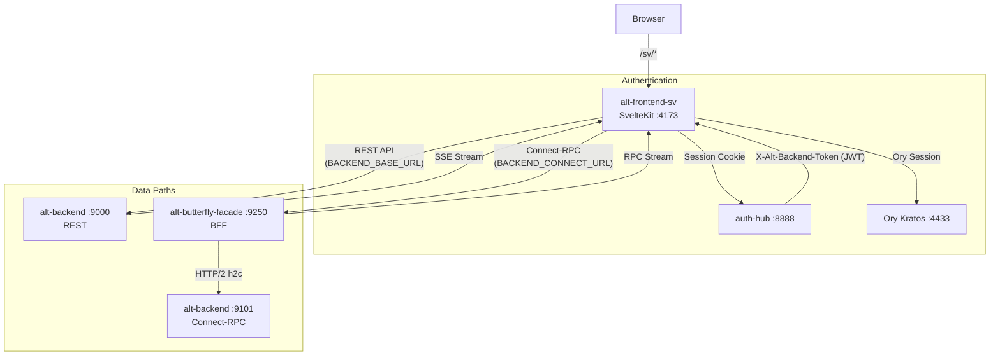

# Alt Frontend SV

_Last reviewed: January 13, 2026_

**Location:** `alt-frontend-sv`
**Base Path:** `/sv`

## Role
- **Next-Gen Frontend**: A SvelteKit (Svelte 5 Runes) + Vite application serving as the modern, high-performance interface for the platform.
- **Unified Interface**: Serves both desktop (dashboard) and mobile (feed reader) experiences with a focus on speed and interaction.
- **Auth Consumer**: Integrated with Ory Kratos for identity management, using `auth-hub` for backend token exchange.

## Architecture Snapshot

| Layer | Details |
| --- | --- |
| **Routing** | File-system based routing in `src/routes`. Served under **`/sv`** base path (configured in `svelte.config.js`). |
| **State Management** | **Svelte 5 Runes** (`$state`, `$derived`, `$effect`) for reactive state. `src/lib/stores` contains global stores (e.g., `auth.svelte.ts`). |
| **Data Fetching** | `src/lib/api.ts` wraps `fetch` for REST. `src/lib/connect/` handles Connect-RPC via BFF. Token exchange with `auth-hub` provides `X-Alt-Backend-Token` (JWT). |
| **Real-time** | SSE (Server-Sent Events) via `src/lib/api/sse.ts` for REST streams. Connect-RPC streaming via BFF for typed streams. |
| **Styling** | **TailwindCSS v4** (using the new Vite plugin) with `bits-ui` for primitives and `lucide-svelte` for icons. |
| **Middleware** | `src/hooks.server.ts` validates Ory sessions, populates `event.locals.User` / `Session`, and handles redirects for protected routes. |

### Data Path Overview

| Protocol | Path | Use Case |
|----------|------|----------|
| **REST** | Frontend → alt-backend:9000 | Legacy endpoints, SSE streams |
| **Connect-RPC** | Frontend → BFF:9250 → alt-backend:9101 | Typed RPC, streaming procedures |



## Key Directories

- `src/routes`:
    - `/sv/home`: Desktop dashboard (feeds, stats, system monitor).
    - `/sv/mobile`: Mobile-optimized feed reader (swipe interface).
    - `/sv/dashboard`: System administration and monitoring.
    - `/sv/login`, `/sv/register`: Authentication pages.
    - `/sv/api`: Internal SvelteKit API endpoints (proxy to backend).
- `src/lib`:
    - `api.ts`: REST API client. Handles token exchange and error normalization.
    - `connect/`: Connect-RPC transport and client setup (routes through BFF).
    - `components`: Reusable UI components (Atomic design-ish).
    - `stores`: Global state using Runes (e.g., `auth.svelte.ts`).
    - `hooks`: Custom Svelte hooks (e.g., `useSSEFeedsStats.svelte.ts`).

## Configuration
- **Svelte Config** (`svelte.config.js`): Sets `kit.paths.base = '/sv'` and uses `adapter-node`.
- **Vite Config** (`vite.config.ts`): Configures proxying and aliases.
- **Environment**:

| Variable | Default | Description |
|----------|---------|-------------|
| `BACKEND_BASE_URL` | http://alt-backend:9000 | REST API endpoint (direct) |
| `BACKEND_CONNECT_URL` | http://alt-butterfly-facade:9250 | Connect-RPC endpoint (via BFF) |
| `AUTH_HUB_INTERNAL_URL` | http://auth-hub:8888 | Token exchange endpoint |
| `KRATOS_INTERNAL_URL` | http://kratos:4433 | Ory Kratos internal URL |
| `PUBLIC_USE_CONNECT_STREAMING` | false | Enable Connect-RPC streaming features |

## Development

### Prerequisites
- Node.js 22+ (for SvelteKit)
- pnpm

### Commands
```bash
# Start development server
pnpm dev

# Build for production
pnpm build

# Type check
pnpm check

# Lint and Format (Biome)
pnpm lint
pnpm format
```

### LLM / Dev Notes
- **Runes Mode**: This project strictly uses Svelte 5 Runes. Do not use legacy `export let` or `$:`. Use `$props()` and `$state()`.
- **Base Path**: Always remember the app runs under `/sv`. Links should be relative or account for this.
- **Tailwind v4**: No `tailwind.config.js` (mostly). Configuration is CSS-first in `src/app.css`.
- **SSR vs CSR**: Data loading happens in `+page.server.ts` (SSR) for initial state, but client-side interactions use `api.ts` (CSR).
- **BFF for Connect-RPC**: All Connect-RPC calls route through `alt-butterfly-facade` (BFF). The BFF validates JWT tokens and proxies to alt-backend's Connect-RPC port (9101) via HTTP/2 h2c.
- **Dual Protocol**: REST calls go directly to alt-backend:9000, while Connect-RPC calls go through BFF:9250. This separation allows typed streaming via Connect-RPC while maintaining REST compatibility.
