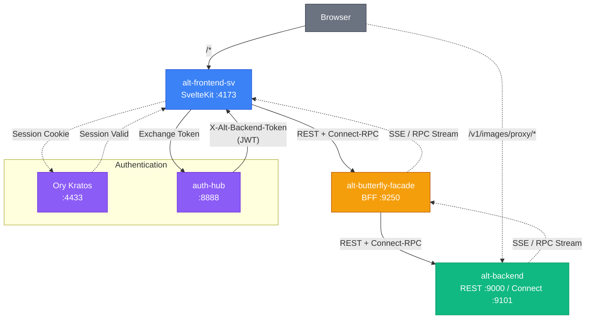

# Alt Frontend SV

_Last reviewed: September 5, 2026_

**Location:** `alt-frontend-sv`
**Base Path:** `/` (root). `svelte.config.js` sets `kit.paths.base = ""`. The app previously ran under `/sv`; that prefix now survives only as a small set of server-side redirect stubs (`/sv`, `/sv/home` → `/feeds`; `/sv/error`, `/sv/register`, `/sv/auth/login` → the equivalent root path) kept for old bookmarks and Kratos return URLs.

## Role
- **Next-Gen Frontend**: A SvelteKit (Svelte 5 Runes) + Vite application serving as the modern, high-performance interface for the platform.
- **Unified Interface**: Serves both desktop (dashboard) and mobile (feed reader) experiences with a focus on speed and interaction.
- **Auth Consumer**: Integrated with Ory Kratos for identity management, using `auth-hub` for backend token exchange.

## Architecture Snapshot

| Layer | Details |
| --- | --- |
| **Routing** | File-system based routing in `src/routes`. Served at the **root (`/`)** base path (configured in `svelte.config.js`). |
| **State Management** | **Svelte 5 Runes** (`$state`, `$derived`, `$effect`) for reactive state. `src/lib/stores` contains global stores (e.g., `auth.svelte.ts`). |
| **Data Fetching** | `src/lib/api.ts` wraps `fetch` for REST. `src/lib/connect/` handles Connect-RPC. Server-side calls (`transport-server.ts`, `backend-rest-client.ts`) target `BACKEND_CONNECT_URL` / `BACKEND_REST_URL`, which in the Compose deployment (`compose/core.yaml`) default to `alt-butterfly-facade:9250` — i.e. through the BFF, not straight to alt-backend. TanStack Svelte Query (`src/lib/queries/`) for caching. Token exchange with `auth-hub` provides `X-Alt-Backend-Token` (JWT). |
| **Real-time** | Connect-RPC server streaming via `src/lib/connect/streamingAdapter.ts` is now the typed stream path and has replaced the REST SSE fallback for feed stats (`useFeedStats.svelte.ts` delegates to `useStreamingFeedStats.svelte.ts`). Raw SSE parsing helpers remain at `src/lib/utils/sse-parser.ts` / `sse-processors.ts`; the only remaining `EventSource` consumer is the dashboard's `SystemMonitorTab.svelte`. |
| **Styling** | **TailwindCSS v4** (using the new Vite plugin) with `bits-ui` for primitives and `lucide-svelte` for icons. |
| **Middleware** | `src/hooks.server.ts` validates Ory sessions, populates `event.locals.User` / `Session`, and handles redirects for protected routes. |

### Data Path Overview

The browser's application data path (REST + Connect-RPC through this SvelteKit server's `/api/*` routes) is same-origin; the server then calls out server-side, and in the Compose stack (`compose/core.yaml`) that hop goes to `alt-butterfly-facade` (the BFF) on `:9250`, which forwards to alt-backend. Two edge routes are a deliberate exception: Plecto sends them browser-direct to alt-backend, bypassing both this server and the BFF — the signed `/v1/images/proxy/*` OG-image proxy (live, rendered as an `` in `VisualPreviewCard.svelte`) and the now-vestigial `/api/v1/sse/*` REST SSE fallback (`useFeedStats.svelte.ts` records that this path and alt-backend's `/v1/sse/feeds/stats` were retired in favor of Connect-RPC streaming). See `plecto/manifest.toml` routes 1 and 5. A leaner dev-only stack (`compose/dev.yaml`, no BFF container) only repoints `BACKEND_CONNECT_URL` at `alt-backend:9101`; it never sets `BACKEND_REST_URL`, so the REST client still resolves to its code default of `alt-butterfly-facade:9250` — a host that stack does not define (`dev.yaml` sets the dead `BACKEND_BASE_URL` instead, which nothing in `src/` reads).

| Protocol | Server-side target (prod default) | Use Case |
|----------|------------------------------------|----------|
| **REST** | `alt-butterfly-facade:9250` (BFF) | Legacy endpoints, SSE streams |
| **Connect-RPC** | `alt-butterfly-facade:9250` (BFF) | Typed RPC, streaming procedures |


```mermaid
flowchart TD
    Browser["Browser"]:::browser -->|"/*"| Frontend["alt-frontend-sv<br/>SvelteKit :4173"]:::frontend

    subgraph Auth["Authentication"]
        direction LR
        Ory["Ory Kratos<br/>:4433"]:::auth
        AuthHub["auth-hub<br/>:8888"]:::auth
    end

    BFF["alt-butterfly-facade<br/>BFF :9250"]:::bff
    Backend["alt-backend<br/>REST :9000 / Connect :9101"]:::backend

    %% Auth Flow
    Frontend -. "Session Cookie" .-> Ory
    Ory -. "Session Valid" .-> Frontend
    Frontend -- "Exchange Token" --> AuthHub
    AuthHub -- "X-Alt-Backend-Token<br/>(JWT)" --> Frontend

    %% Data Flow (default: server-side hop from Frontend through the BFF)
    Frontend -- "REST + Connect-RPC" --> BFF
    BFF -- "REST + Connect-RPC" --> Backend

    %% Edge exception: Plecto sends this route browser-direct to alt-backend,
    %% bypassing both the SvelteKit server and the BFF
    Browser -. "/v1/images/proxy/*" .-> Backend

    %% Streaming
    Backend -. "SSE / RPC Stream" .-> BFF
    BFF -. "SSE / RPC Stream" .-> Frontend

    %% Styles
    classDef browser fill:#6b7280,stroke:#374151,color:#fff
    classDef frontend fill:#3b82f6,stroke:#1d4ed8,color:#fff
    classDef auth fill:#8b5cf6,stroke:#6d28d9,color:#fff
    classDef bff fill:#f59e0b,stroke:#b45309,color:#fff
    classDef backend fill:#10b981,stroke:#059669,color:#fff
```

## Route Table

The app uses SvelteKit file-system routing at the root base path. The `(app)` route group applies the responsive layout (desktop/mobile detection via `ResponsiveLayout`).

### Page Routes

| Route | Description | Layout Group |
|-------|-------------|--------------|
| `/` | Landing page with auth status and login/register links | root |
| `/home` | Home dashboard (mobile: feed stats with SSE; desktop: redirects) | `(app)` |
| `/login` | Ory Kratos login flow | root |
| `/auth/login` | Alternative Ory Kratos login flow | root |
| `/register` | Ory Kratos registration flow | root |
| `/error` | Error display page | root |
| `/feeds` | Feed list (desktop: grid + modal; mobile: swipe cards) | `(app)` |
| `/feeds/search` | Full-text feed search with infinite scroll | `(app)` |
| `/feeds/favorites` | Favorite/bookmarked feeds | `(app)` |
| `/feeds/viewed` | Previously viewed feeds | `(app)` |
| `/feeds/swipe` | Swipe-based feed reader | `(app)` |
| `/feeds/swipe/visual-preview` | Visual preview for swipe cards | `(app)` |
| `/feeds/visual-preview` | Visual preview (non-swipe entry point) | `(app)` |
| `/feeds/tag-trail` | Tag-based feed browsing | `(app)` |
| `/feeds/tag-verse` | 3D tag cloud visualization (Tag Verse) | `(app)` |
| `/articles/[id]` | Article detail view | `(app)` |
| `/articles/by-tag` | Articles filtered by tag | `(app)` |
| `/settings/feeds` | RSS feed management (add/remove/subscribe) | `(app)` |
| `/settings/notifications` | Notification preferences | `(app)` |
| `/settings/knowledge-home-admin` | Redirects to `/admin/knowledge-home` | `(app)` |
| `/search` | Global search | `(app)` |
| `/augur` | AI chat interface (Ask Augur) | `(app)` |
| `/augur/[conversationId]` | Single Augur conversation | `(app)` |
| `/augur/history` | Augur conversation history | `(app)` |
| `/acolyte` | Acolyte report list | `(app)` |
| `/acolyte/new` | Start a new Acolyte report | `(app)` |
| `/acolyte/reports/[id]` | Acolyte report detail | `(app)` |
| `/knowledge/trail` | Your Trail (Knowledge Trail) | `(app)` |
| `/recap` | 3-day recap viewer | `(app)` |
| `/recap/morning-letter` | Morning letter recap | `(app)` |
| `/recap/evening-pulse` | Evening pulse recap | `(app)` |
| `/recap/job-status` | Recap generation job status | `(app)` |
| `/dashboard` | System admin dashboard (desktop only; mobile redirects to feeds) | `(app)` |
| `/stats` | Feed analytics and trend charts | `(app)` |
| `/menu` | Mobile menu / navigation hub | `(app)` |
| `/admin/knowledge-home` | Knowledge Home admin dashboard (SLO, Reproject, Backfill, Projection Health) | `(app)` |
| `/admin/monitor` | System monitor (Prometheus-backed, via `AdminMonitorService`) | `(app)` |
| `/eval-dashboard` | Evaluation metrics dashboard (classification, clustering, summarization) | root |
| `/[...path]` | Catch-all: redirects unknown paths to `/home` | root |

> **Legacy `/sv/*` redirects**: `/sv`, `/sv/home` (→ `/feeds`) and `/sv/error`, `/sv/register`, `/sv/auth/login` (→ the equivalent root path) are pure server-side redirect stubs (`+page.server.ts`, no UI) kept for old bookmarks and Kratos return URLs from when the app was served under `/sv`. There is no `/sv/desktop/*` or `/sv/mobile/*` — those legacy device-specific route trees have been removed; only the responsive `(app)` layout remains.

### API / Server Routes

| Route | Method | Description |
|-------|--------|-------------|
| `/health` | GET | Health check (returns `OK` plain text) |
| `/logout` | POST | Ory Kratos logout |
| `/api/auth/csrf` | GET | CSRF token for auth flows |
| `/api/v1/feeds/*` | Various | Backend proxy: feed stats, cursor fetch, read status, trends |
| `/api/v1/rss-feed-link/*` | Various | Backend proxy: RSS feed link CRUD (add/remove, OPML import/export) |
| `/api/v1/dashboard/*` | Various | Backend proxy: admin dashboard data (overview, metrics, logs, jobs) |
| `/api/v1/generate/recaps/*` | POST | Backend proxy: trigger recap generation |
| `/api/feeds/random` | GET | Random feed selection |
| `/api/feeds/[id]/tags` | Various | Per-feed tag operations |
| `/api/articles/*` | Various | Backend proxy: article tags |
| `/api/admin/knowledge-home` (+ `/sovereign`) | Various | Knowledge Home admin proxy |
| `/api/v2/alt.admin_monitor.v1.AdminMonitorService/[...path]` | Various | Connect-RPC proxy for the admin monitor service |
| `/api/v2/[...path]` | Various | Connect-RPC proxy (passthrough to `BACKEND_CONNECT_URL`, the BFF in production — see allowlist below) |

Most of these server routes call out to `BACKEND_CONNECT_URL` / `BACKEND_REST_URL`, which point at `alt-butterfly-facade:9250` in the Compose deployment (`compose/core.yaml`). Two families bypass the BFF and go direct: `/api/v1/generate/recaps/*` calls `RECAP_WORKER_BASE_URL` (default `http://recap-worker:9005`), and `/api/admin/knowledge-home*` calls `SOVEREIGN_METRICS_URL` (`http://knowledge-sovereign:9501`). `/api/v2/[...path]` additionally enforces a positive allowlist (`$lib/gen/allowlist`, generated from the `(alt.api.v1.visibility)` proto option) so only public Connect-RPC services are reachable through it.

## Key Directories

- `src/routes`:
    - `(app)/feeds`: Unified feed views (responsive desktop/mobile).
    - `(app)/augur`: AI chat interface.
    - `(app)/recap/*`: Recap views (3-day, morning letter, evening pulse, job status).
    - `(app)/settings/feeds`: Feed management.
    - `(app)/dashboard`: System administration (desktop-only).
    - `(app)/stats`: Analytics and trend charts.
    - `/home`: Mobile home dashboard.
    - `/login`, `/register`: Authentication pages.
    - `/health`: Health check endpoint.
    - `/api/v2/[...path]`: Connect-RPC proxy endpoint.
    - `/sv/*`: Legacy redirect stubs to the equivalent root-path route (no UI).
- `src/lib`:
    - `api.ts`: REST API client. Handles token exchange and error normalization.
    - `connect/`: Connect-RPC transport and client setup. `transport-server.ts` (server-side) and `backend-rest-client.ts` target `BACKEND_CONNECT_URL` / `BACKEND_REST_URL` — the BFF (`alt-butterfly-facade:9250`) in production.
    - `gen/`: Generated protobuf definitions (feeds, articles, augur, rss, recap, morning_letter, knowledge_home, admin_monitor, etc.).
    - `queries/`: TanStack Svelte Query hooks for data fetching and caching.
    - `actions/`: Svelte actions (swipe, infinite-scroll).
    - `schema/`: Validation schemas using Valibot.
    - `components/`: Reusable UI components (Atomic design-ish).
    - `stores/`: Global state using Runes (e.g., `auth.svelte.ts`).
    - `hooks/`: Custom Svelte hooks (e.g., `useFeedStats.svelte.ts` / `useStreamingFeedStats.svelte.ts`, `useKnowledgeHome.svelte.ts`, `useKnowledgeHomeAdmin.svelte.ts`).

## Connect-RPC Modules

Located in `src/lib/connect/`:

| Module | Description |
|--------|-------------|
| `feeds.ts` | Feed stats, unread/read/favorite feeds, search, streaming, mark-as-read |
| `articles.ts` | Article operations (fetch, update, favorite, fetchTagCloud) |
| `recap.ts` | Recap generation and retrieval (3-day) |
| `augur.ts` | AI chat streaming interface |
| `rss.ts` | RSS feed management (add, remove, import OPML) |
| `morning_letter.ts` | Morning letter generation and retrieval |
| `knowledge_home_admin.ts` | Knowledge Home Admin API client (projection health, feature flags, backfill, SLO, reproject operations) |
| `knowledge_home.ts` | KnowledgeHomeService client (Knowledge Home items) |
| `knowledge_trail.ts` | KnowledgeTrailService client (Knowledge Trail footprint spine) |
| `global_search.ts` | GlobalSearchService client |
| `evening_pulse.ts` | Evening Pulse client |
| `acolyte.ts` / `acolyteAutostart.ts` | Acolyte report client (REST wrapper over `/api/v2` pending proto codegen) and autostart/resume URL-param resolution |
| `admin_monitor.ts` | AdminMonitorService client (system monitor, Prometheus-backed) |
| `streamingAdapter.ts` | Streaming support utilities for Connect-RPC |

The REST-to-Connect-RPC migration described in earlier revisions of this document is complete: the gradual-migration feature flag system (`src/lib/features/flags.ts`) has been removed from the codebase, and `PUBLIC_USE_CONNECT_FEEDS` / `PUBLIC_USE_CONNECT_ARTICLES` / `PUBLIC_USE_CONNECT_RSS` are no longer read anywhere. `PUBLIC_USE_CONNECT_STREAMING` is still declared in `compose/core.yaml` but is likewise not read by any current source file — treat it as vestigial rather than a live switch.

## Components Overview

### Desktop Components (`src/lib/components/desktop/`)
- `articles/`: Article detail display
- `augur/`: AI chat interface components
- `dashboard/`: Admin dashboard panels
- `feeds/`: Feed list and article display
- `layout/`: Page layouts and navigation
- `morning-letter/`: Morning letter display
- `pulse/`: Evening Pulse display
- `recap/`: Recap display components
- `stats/`: Statistics visualizations
- `tag-trail/`: Tag-based feed browsing
- `tag-verse/`: Tag Verse 3D visualization (Three.js/Threlte v8, WebGPU with WebGL fallback, HUD panel)

### Mobile Components (`src/lib/components/mobile/`)
- `acolyte/`: Mobile Acolyte report list
- `articles/`: Mobile article detail display
- `feeds/`: Mobile feed reader with swipe
- `morning-letter/`: Mobile morning letter
- `pulse/`: Mobile Evening Pulse display
- `recap/`: Mobile recap views
- `search/`: Mobile search interface
- `tag-trail/`: Mobile tag-based feed browsing

### Other Top-Level Component Groups (`src/lib/components/`)
- `acolyte/`: Shared Acolyte report components
- `admin/monitor/`: System monitor panels (`/admin/monitor`)
- `knowledge-trail/`: Knowledge Trail (Your Trail) display
- `pulse/`: Shared Evening Pulse components (confidence indicator, rationale, role label, weekly highlight)
- `search/`: Shared global search components
- `why/`: `WhyTypography` — shared "why this was surfaced" text component

### Knowledge Home Components (`src/lib/components/knowledge-home/`)
- `KnowledgeCard` - Knowledge home item card
- `DegradedModeBanner` - Service quality degradation banner

### Knowledge Home Admin Components (`src/lib/components/knowledge-home-admin/`)
- `AdminTabNavigation` - Admin tab navigation
- `AlertStatusPanel` - Active alert display
- `DiffSummaryPanel` - Reproject version diff summary
- `ErrorBudgetGauge` - SLO error budget gauge
- `ReprojectActions` - Reproject workflow actions (start/compare/swap/rollback)
- `ReprojectRunsTable` - Reproject execution history table
- `SLOSummaryPanel` - SLO status summary panel

### Dashboard Tabs (`src/lib/components/dashboard/`)
- `OverviewTab`: System overview
- `ClassificationTab`: Article classification metrics
- `ClusteringTab`: Clustering metrics
- `SummarizationTab`: Summarization metrics
- `AdminJobsTab`: Admin job management
- `LogAnalysisTab`: Log analysis
- `RecapJobsTab`: Recap job monitoring
- `SystemMonitorTab`: System health monitoring

### UI Primitives (`src/lib/components/ui/`)
Based on `bits-ui`: button, card, input, label, dialog, sheet, accordion, textarea, system-loader, etc.

## XSS Prevention

The frontend implements a **two-layer sanitization strategy** to protect against XSS attacks when rendering RSS feed content:

### Layer 1: Domain-Level Sanitization (`src/lib/domain/feed/sanitize.ts`)

All feed data from the backend is sanitized at the domain boundary before entering the view layer:

- **`sanitizeContent()`**: Strips all HTML tags, collapses whitespace, decodes HTML entities (`&amp;`, `&lt;`, `&#x27;`, etc.), and enforces max-length limits.
- **`sanitizeUrl()`**: Rejects URLs that do not start with `http://` or `https://`, blocking `javascript:`, `data:`, `vbscript:`, and `file:` protocols.
- **`sanitizeFeed()`**: Applies the above to all feed fields (title, description, author, link) before they reach components.

### Layer 2: HTML Sanitization (`src/lib/utils/sanitizeHtml.ts`)

For cases where rich HTML must be rendered via Svelte's `{@html}` directive (e.g., article content detail views), `isomorphic-dompurify` (v3.x) provides defense-in-depth:

- **Allowlist approach**: Only structural tags (`p`, `h1`-`h6`, `ul`, `ol`, `table`, `blockquote`, `pre`, `code`, etc.), text formatting (`strong`, `em`, `mark`), and links (`a`) are permitted. All other tags (including `<script>`, `<iframe>`, ``) are stripped.
- **`` intentionally excluded**: Image tags are blocked because Alt does not fetch images, and `` is a common XSS vector via `onerror`/`onload` event handlers.
- **Attribute allowlist**: Only `href`, `title`, `class`, `target`, and `rel` are allowed. No `src`, `style`, or event-handler attributes pass through.
- **Link hardening**: A DOMPurify `afterSanitizeAttributes` hook forces `target="_blank"` and `rel="noopener noreferrer"` on all `<a>` tags.
- **Protocol restriction**: A custom `ALLOWED_URI_REGEXP` limits `href` values to `http:` and `https:` schemes only.
- **Data attributes disabled**: `ALLOW_DATA_ATTR: false` prevents `data:` URI injection.

**Usage**: The `sanitizeHtml()` function is called in `RenderFeedDetails.svelte` (mobile) before passing article content to `{@html}`. Both layers are covered by unit tests (`sanitize.test.ts`, `sanitizeHtml.test.ts`).

## Known failure patterns

- Self-refiring `$effect` fetch loop (30 fetches/s) → `$effect` tracks every reactive read across the whole call stack, so a guard flag read inside a called function re-triggers the effect. Gate with `untrack()` / `$derived` value-equality; write guard conditions directly in the effect condition. → [[000320]] [[000441]] PM-2026-039
- Fetch storm (`ERR_INSUFFICIENT_RESOURCES`, 50+ fetches in one ms) → unconditional `invalidateAll()` from a stream callback forms a positive feedback loop with `$effect` `data` tracking. Standard prescription: debounce (~600ms) + single-flight coalescer + scoped `invalidate(name)`; the backend also needs `singleflight.Group`. → [[000847]] [[000320]] PM-2026-039
- Infinite scroll stalls with `each_key_duplicate` crash → duplicate keys in keyed `{#each}` break Svelte reconcile with no warning; Meilisearch hybrid offset pagination violated the implicit "pages are disjoint" contract. Dedupe app-side (`appendUniqueById`). → [[000228]] PM-2026-044
- "Cannot Open Page" / broken app after deploy → stale HTML references old `_app/immutable/*` chunk hashes (404). Multi-layer self-healing: hooks.client chunk-error detection + `version.pollInterval` + `updated.current` monitoring, edge-proxy 404→200 reload stub (nginx originally; now the Plecto `stale-chunk-heal` filter on `/_app/immutable/`), capture-phase error listener in app.html, and `Cache-Control: no-cache` on SSR HTML. → [[000898]] [[000902]] [[000412]]
- Streaming UI dead while every request returns 200 (4-week latency) → four independent defects composed: JWT TTL (5m) shorter than stream lifetime, missing dedicated nginx streaming location (buffering; the edge is now Plecto, and each streaming service needs its own explicit `path_prefix` route in `plecto/manifest.toml` — Plecto has no regex catch-all either), reconnect race in catch handlers (check `signal.aborted` even there), and duplicate event firing. SLI on body size / stream count / reconnect interval; pre-flight with [[connect-rpc-streaming-checklist]]. → [[000929]] PM-2026-045
- Previous article's summary shown on the new article → AbortController alone is insufficient for streamed `$state` updates; capture the request-time URL/ID and compare it inside every async callback (stale-response guard). → [[000552]] PM-2026-003
- SSR-wide 429 from auth-hub → fetching `/session` per component tripped auth-hub rate limits; fetch once per request in `hooks.server.ts` and share via `locals`. → [[000305]]
- Button does nothing, no trace anywhere → empty-condition early returns (e.g. Open with empty link) are silent no-ops invisible to server monitoring; every such path needs user feedback (toast) at minimum. → PM-2026-011
- Infinite scroll never loads the next page → IntersectionObserver fires only on intersection *change*; if the trigger stays in the viewport it never refires. Pattern: unobserve → await callback → rAF → re-observe, reset loading flags in try/finally. → [[000226]]
- Client-side failures invisible to ops → during the fetch storm the server answered healthily in 5-11ms, so no latency/5xx alert fired; browser console errors never reach server logs. FE error tracking and a fetch-rate SLI are required. → PM-2026-039 PM-2026-044

## Configuration
- **Svelte Config** (`svelte.config.js`): Sets `kit.paths.base = ""` (root) and uses `adapter-node`. `version.name` is pinned to `PUBLIC_BUILD_ID` / `GIT_COMMIT_SHA` / `GITHUB_SHA` (falling back to the git SHA, then a timestamp) rather than SvelteKit's default per-build timestamp, so a no-op rebuild does not look like a new deploy; `version.pollInterval` is 5 minutes.
- **Vite Config** (`vite.config.ts`): Configures proxying and aliases. Uses TailwindCSS v4 Vite plugin, oxc minifier, experimental native plugin v1.
- **Environment** (defaults below are the values in code; `compose/core.yaml` overrides some of them for the production stack — see the Data Path Overview above):

| Variable | Default (in code) | Description |
|----------|---------|-------------|
| `BACKEND_REST_URL` | http://alt-butterfly-facade:9250 | REST API endpoint. Both `compose/core.yaml` and `compose/dev.yaml` leave this unset, so it always falls back to this code default; `dev.yaml` sets `BACKEND_BASE_URL` instead, which nothing in `src/` reads, so REST calls in that BFF-less stack resolve to a host (`alt-butterfly-facade:9250`) the stack does not define |
| `BACKEND_CONNECT_URL` | http://alt-backend:9101 (code default) | Connect-RPC endpoint. `compose/core.yaml` overrides this to `alt-butterfly-facade:9250` in production; `compose/dev.yaml` overrides it to `alt-backend:9101` |
| `AUTH_HUB_INTERNAL_URL` | http://auth-hub:8888 | Token exchange endpoint |
| `KRATOS_INTERNAL_URL` | http://kratos:4433 | Ory Kratos internal URL |
| `KRATOS_PUBLIC_URL` | http://localhost/ory | Ory Kratos public URL used to build browser-facing auth links |
| `RECAP_WORKER_BASE_URL` | http://recap-worker:9005 | recap-worker base URL for `/api/v1/generate/recaps/*`; a direct hop, bypasses the BFF |
| `SOVEREIGN_METRICS_URL` | http://knowledge-sovereign:9501 | knowledge-sovereign admin API base |
| `SOVEREIGN_ADMIN_TOKEN_FILE` / `SOVEREIGN_ADMIN_TOKEN` | - | Bearer token for knowledge-sovereign `/admin/*`; startup fails if neither is set unless `SOVEREIGN_ADMIN_AUTH=disabled` |

`BACKEND_BASE_URL` and the `PUBLIC_USE_CONNECT_*` feature flags (`PUBLIC_USE_CONNECT_FEEDS` / `_ARTICLES` / `_RSS` / `_STREAMING`) from earlier revisions of this document are no longer read by any source file — the REST→Connect-RPC migration they gated is complete. `compose/dev.yaml` and `compose/frontend-dev.yaml` still set `BACKEND_BASE_URL`, but nothing in `src/` consumes it.

`compose/core.yaml` also sets `BODY_SIZE_LIMIT=32M` on this container. The nginx→Plecto cutover dropped `client_max_body_size 32m`, and Plecto's manifest declares no body limit of its own, so this SvelteKit-level cap (adapter-node's request body limit) is now the only one standing between a POST under `/api/*` (e.g. OPML import) and the container's memory. `compose/dev.yaml` sets it to `Infinity`.

## Development

### Prerequisites
- Bun (runtime and package manager; `bun.lock` is the lockfile — there is no `pnpm-lock.yaml`)

### Commands
```bash
# Start development server
bun dev

# Build for production
bun run build

# Type check
bun run check

# Lint and Format (Biome)
bun run lint
bun run format

# Run unit tests (Vitest — not `bun test`, see alt-frontend-sv/CLAUDE.md)
bun run test

# Run E2E tests (Playwright)
bun run test:e2e
```

### LLM / Dev Notes
- **Runes Mode**: This project strictly uses Svelte 5 Runes. Do not use legacy `export let` or `$:`. Use `$props()` and `$state()`.
- **Base Path**: The app runs at the root (`/`), not `/sv`. Only a handful of `/sv/*` redirect stubs remain for backward compatibility.
- **Tailwind v4**: No `tailwind.config.js` (mostly). Configuration is CSS-first in `src/app.css`.
- **SSR vs CSR**: Data loading happens in `+page.server.ts` (SSR) for initial state, but client-side interactions use `api.ts` (CSR).
- **BFF Boundary**: Most server-side REST and Connect-RPC calls default to `BACKEND_REST_URL` / `BACKEND_CONNECT_URL`, which the Compose deployment (`compose/core.yaml`) points at `alt-butterfly-facade:9250` (the BFF) — except `/api/v1/generate/recaps/*` (→ recap-worker) and `/api/admin/knowledge-home*` (→ knowledge-sovereign), which go direct. The browser talks to this SvelteKit server's own `/api/*` routes for everything except two edge routes Plecto sends browser-direct to alt-backend: the signed `/v1/images/proxy/*` OG-image proxy and the vestigial `/api/v1/sse/*` fallback (see Data Path Overview above).
- **Generated Protobufs**: `src/lib/gen/` contains generated TypeScript from protobuf definitions. Do not edit manually.
