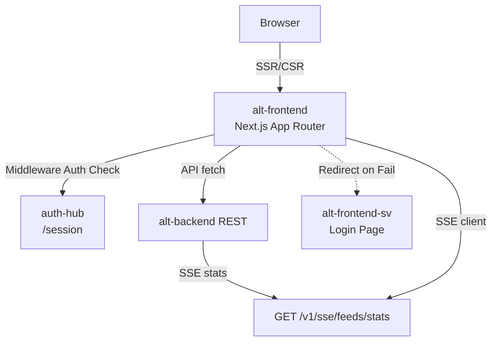

# Alt Frontend

_Last reviewed: January 13, 2026_

**Location:** `alt-frontend`

> **DEPRECATED**: このサービスは `alt-frontend-sv` (SvelteKit) に置き換えられました。
> 認証フローは `/sv/auth/login` にリダイレクトされ、新機能開発は alt-frontend-sv で行われます。
> 詳細は [docs/alt-frontend-sv.md](./alt-frontend-sv.md) を参照してください。

## Role
- **Next.js 16 + React 19 App Router**: プラットフォーム UI をレンダリングする Web アプリケーション
- **Unified Interface**: デスクトップ/モバイルダッシュボード、コマンドパレット、認証フロー
- **Gateway**: `alt-backend` への thin client、SSR、楽観的 UI、認証状態管理
- **Strict Compliance**: TypeScript 5.9 strict mode、WCAG 2.1 AA アクセシビリティ標準

## Architecture Snapshot

| Layer | Details |
| --- | --- |
| **Routing** | **App Router** (`src/app`). <br>- `(auth)`: Login/Register flows (→ SvelteKit にリダイレクト).<br>- `desktop`, `mobile`: デバイス別レイアウト.<br>- `api`: 内部 API routes.<br>- `public`: ランディングページ. |
| **State** | **SWR** for server state caching/revalidation. `src/hooks` contains custom hooks. Context providers in `src/providers.tsx` (Theme, Auth). |
| **Data Layer** | `src/lib/api/*`: centralized REST clients.<br>- `ApiClient`: Core HTTP client with `AuthInterceptor`.<br>- `serverFetch`: Server Components 用 cookie/header 転送ユーティリティ. |
| **Middleware** | `src/middleware.ts`: `ory_kratos_session` を `auth-hub` で検証. 無効な場合は `/sv/auth/login` (SvelteKit) にリダイレクト. |
| **Styling** | **Chakra UI** (React 19 compatible) + CSS Modules (`globals.css`). |



## Key Directories

- `src/app`:
    - `(auth)`: 認証関連ページ (deprecated/SV にリダイレクト).
    - `desktop`: デスクトップ専用ダッシュボードビュー.
    - `mobile`: モバイル専用ビュー (スワイプ可能なフィード).
    - `api`: Next.js API Routes (e.g., `/api/auth/logout`).
- `src/lib`:
    - `api`: Typed API clients (`ArticleApi`, `FeedApi`) wrapping `fetch`.
    - `hooks`: Custom React hooks (e.g., `useRecapData`).
- `src/middleware.ts`: 認証とルーティング保護の Edge middleware.

## Configuration & Env

| Variable | Default | Description |
|----------|---------|-------------|
| `NEXT_PUBLIC_API_BASE_URL` | /api | ブラウザ側バックエンド URL |
| `NEXT_PUBLIC_APP_ORIGIN` | - | リダイレクト用 public origin |
| `AUTH_HUB_INTERNAL_URL` | http://auth-hub:8888 | セッション検証用内部 URL |
| `INTERNAL_API_BASE_URL` | http://alt-backend:9000 | サーバー側バックエンド URL |
| `PORT` | 3000 | サービスポート |

## Testing & Tooling

```bash
# Start development server
pnpm dev

# Build for production
pnpm build

# Type check
pnpm typecheck

# Lint
pnpm lint

# E2E Tests (Playwright)
pnpm test:e2e:chrome
```

### Prerequisites
- Node.js 24 (as per `package.json` engines)
- pnpm 10+

## Operational Runbook
1. `docker compose -f compose/core.yaml up alt-frontend -d` で起動
2. `curl http://localhost:3000/api/health` でヘルスチェック
3. 認証エラー時は `/sv/auth/login` にリダイレクトされる
4. ログ確認: `docker compose logs -f alt-frontend`

## Observability
- Next.js ビルトインログ
- ヘルスエンドポイント: `/api/health`
- rask.group ラベル: (なし)

## LLM Notes
- **React 19**: 新しい hooks (`use`, `useActionState` 等) を使用可能だが、データフェッチには SWR パターンを推奨
- **Server Components**: デフォルトは Server Components. インタラクティブ機能が必要な場合のみ `'use client'` を追加
- **Auth Redirects**: middleware での認証失敗時は SvelteKit frontend (`/sv/auth/login`) にリダイレクト
- **API Clients**: raw `fetch` ではなく `src/lib/api/index.ts` の singleton インスタンス (`feedApi`, `articleApi`) を使用
- **DEPRECATED**: 新機能は alt-frontend-sv で実装すること
