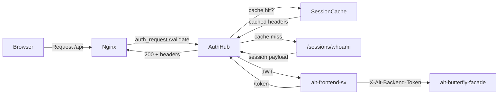

# Auth Hub

_Last reviewed: January 13, 2026_

**Location:** `auth-hub`

## Role
- Identity-Aware Proxy (IAP): Nginx `auth_request` と Ory Kratos `/sessions/whoami` のブリッジ
- セッション検証、アイデンティティキャッシュ、`X-Alt-*` ヘッダー発行
- バックエンドトークン (JWT) 発行による BFF 認証サポート
- 下流サービスの認証非依存化

## Architecture & Flow

| Component | Responsibility |
| --- | --- |
| `handler/validate_handler.go` | セッション検証、X-Alt-* ヘッダー設定 |
| `handler/session_handler.go` | セッション情報取得 (デバッグ用) |
| `handler/csrf_handler.go` | CSRF 検証 (スタブ) |
| `handler/health_handler.go` | ヘルスチェック |
| `handler/token_handler.go` | バックエンドトークン (JWT) 発行 |
| `cache/session_cache.go` | セッションキャッシュ (5分 TTL、RWMutex) |
| `client/kratos_client.go` | Kratos API クライアント |



## Endpoints & Behavior

| Endpoint | Method | Description |
|----------|--------|-------------|
| `/validate` | GET | セッション検証、X-Alt-* ヘッダー付与 |
| `/session` | GET | セッション情報 JSON 返却 |
| `/csrf` | POST | CSRF 検証 (スタブ) |
| `/health` | GET | ヘルスチェック (200 OK) |
| `/token` | POST | バックエンドトークン (JWT) 発行 |

### /validate
- `ory_kratos_session` cookie が存在する場合に 200 + identity headers
- キャッシュ TTL = `CACHE_TTL` (デフォルト 5m)
- Kratos 呼び出し削減

### /token (Backend Token Exchange)
- 有効なセッションに対して JWT を発行
- BFF (alt-butterfly-facade) がバックエンドへのリクエスト時に使用
- JWT は `BACKEND_TOKEN_SECRET` で署名
- issuer: `BACKEND_TOKEN_ISSUER`, audience: `BACKEND_TOKEN_AUDIENCE`

### X-Alt-* Headers
- `X-Alt-User-Id`: ユーザー ID
- `X-Alt-Tenant-Id`: テナント ID
- `X-Alt-User-Email`: ユーザーメールアドレス

## Configuration & Env

| Variable | Default | Description |
|----------|---------|-------------|
| `KRATOS_URL` | http://kratos:4433 | Kratos public URL |
| `KRATOS_ADMIN_URL` | http://kratos:4434 | Kratos admin URL |
| `PORT` | 8888 | サービスポート |
| `CACHE_TTL` | 5m | セッションキャッシュ TTL |
| `CSRF_SECRET_FILE` | - | CSRF シークレットファイル |
| `AUTH_SHARED_SECRET_FILE` | - | 共有シークレットファイル |
| `BACKEND_TOKEN_SECRET_FILE` | - | JWT シークレットファイル |
| `BACKEND_TOKEN_ISSUER` | auth-hub | JWT issuer |
| `BACKEND_TOKEN_AUDIENCE` | alt-backend | JWT audience |
| `BACKEND_TOKEN_TTL` | 5m | JWT 有効期限 |

## Testing & Tooling

```bash
# テスト実行
go test ./...

# ヘルスチェック (Docker)
./auth-hub healthcheck

# セッション検証テスト
curl -i http://localhost:8888/health
```

**Mocks:**
- `gomock` で Kratos レスポンスをシミュレート
- `session_handler_test.go`: キャッシュヒット/ミスのテスト
- `cache/session_cache_test.go`: クリーンアップループのテスト

## Operational Runbook

1. サービス起動:
   ```bash
   docker compose -f compose/auth.yaml up auth-hub -d
   ```

2. ヘルスチェック:
   ```bash
   curl -i http://localhost:8888/health
   ```

3. キャッシュウォームアップ: `/validate` を `ory_kratos_session` 付きで呼び出し

4. キャッシュフラッシュ: サービス再起動 (将来のエンドポイント計画あり)

5. `CACHE_TTL` 調整: recap-worker 負荷増加時は短縮 (鮮度 vs Kratos 負荷のトレードオフ)

## Observability
- 構造化ログ: `slog.NewJSONHandler`
- ログフィールド: `request_id`, `method`, `uri`, `latency_ms`, `cache_hit`
- rask.group ラベル: `alt-auth`
- 将来の `handler/metrics.go`: キャッシュヒット率、Kratos レイテンシ

## LLM Notes
- 編集対象のファイルを明示: `handler/validate_handler.go`, `cache/session_cache.go`, `client/kratos_client.go`
- cookie 名: `ory_kratos_session`
- 401 = 認証失敗、500 = インフラエラー
- バックエンドトークン (JWT) は BFF 経由の認証に使用
- 新ヘッダー追加時は `validate_handler` + Nginx `proxy_set_header` を同時更新
