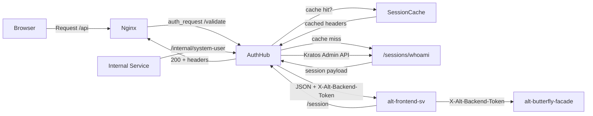

# Auth Hub

_Last reviewed: February 28, 2026_

**Location:** `auth-hub`

## Role
- Identity-Aware Proxy (IAP): Nginx `auth_request` と Ory Kratos `/sessions/whoami` のブリッジ
- セッション検証、アイデンティティキャッシュ、`X-Alt-*` ヘッダー発行
- バックエンドトークン (JWT) 発行による BFF 認証サポート (`/session` レスポンスに含む)
- 下流サービスの認証非依存化
- 内部サービス向けシステムユーザー ID 提供 (`/internal/system-user`)

## Architecture & Flow

### New `internal/` Domain-Driven Structure (Primary)

Clean Architecture with domain-driven layers (`cmd/auth-hub/main.go` がエントリーポイント + DI wiring):

| Layer | Path | Responsibility |
| --- | --- | --- |
| Domain | `internal/domain/session.go` | エンティティ (`Identity`, `CachedSession`) |
| Domain | `internal/domain/errors.go` | センチネルエラー (認証, トークン, 外部サービス, レート制限) |
| Domain | `internal/domain/port.go` | ポートインターフェース (`SessionValidator`, `SessionCache`, `TokenIssuer`, `CSRFTokenGenerator`, `IdentityProvider`) |
| Usecase | `internal/usecase/validate_session.go` | セッション検証 (cache-through 戦略) |
| Usecase | `internal/usecase/get_session.go` | セッション取得 + JWT 発行 |
| Usecase | `internal/usecase/generate_csrf.go` | CSRF トークン生成 |
| Usecase | `internal/usecase/get_system_user.go` | システムユーザー ID 取得 |
| Handler | `internal/adapter/handler/validate.go` | `/validate` ハンドラー |
| Handler | `internal/adapter/handler/session.go` | `/session` ハンドラー |
| Handler | `internal/adapter/handler/csrf.go` | `/csrf` ハンドラー |
| Handler | `internal/adapter/handler/health.go` | `/health` ハンドラー |
| Handler | `internal/adapter/handler/internal.go` | `/internal/system-user` ハンドラー |
| Handler | `internal/adapter/handler/error_mapper.go` | ドメインエラー -> HTTP ステータスマッピング |
| Gateway | `internal/adapter/gateway/kratos.go` | Kratos API クライアント (`SessionValidator`, `IdentityProvider` 実装) |
| Infra | `internal/infrastructure/cache/session_cache.go` | セッションキャッシュ (TTL 付きインメモリ, RWMutex, 自動クリーンアップ) |
| Infra | `internal/infrastructure/token/jwt.go` | JWT 発行 (HS256, `domain.TokenIssuer` 実装) |
| Infra | `internal/infrastructure/token/csrf.go` | CSRF トークン生成 (HMAC-SHA256, `domain.CSRFTokenGenerator` 実装) |

### Legacy Flat Handlers (Backward Compatibility)

後方互換性のため `handler/` に残存。`main.go` (ルートの旧エントリーポイント) から使用される。

| Component | Responsibility |
| --- | --- |
| `handler/validate_handler.go` | セッション検証、X-Alt-* ヘッダー設定 |
| `handler/session_handler.go` | セッション情報取得 |
| `handler/csrf_handler.go` | CSRF 検証 |
| `handler/health_handler.go` | ヘルスチェック |
| `handler/internal_handler.go` | システムユーザー ID 取得 |
| `cache/session_cache.go` | セッションキャッシュ (5分 TTL、RWMutex) |
| `client/kratos_client.go` | Kratos API クライアント |

### Middleware

| File | Responsibility |
| --- | --- |
| `middleware/security_headers.go` | セキュリティヘッダー (HSTS, CSP, X-Frame-Options 等) |
| `middleware/rate_limit.go` | IP ベースレート制限 (エンドポイントグループ別) |
| `middleware/internal_auth.go` | 共有シークレット認証 (`X-Internal-Auth` ヘッダー, constant-time 比較) |
| `middleware/otel_status_middleware.go` | OTel スパンステータス設定 (5xx = Error) |



## Endpoints & Behavior

| Endpoint | Method | Auth | Rate Limit | Description |
|----------|--------|------|------------|-------------|
| `/validate` | GET | Cookie | 100 req/min, burst 10 | セッション検証、X-Alt-* ヘッダー付与 |
| `/session` | GET | Cookie | 30 req/min, burst 5 | セッション情報 JSON + JWT 返却 |
| `/csrf` | POST | Cookie | 10 req/min, burst 3 | CSRF トークン生成 (HMAC-SHA256) |
| `/health` | GET | None | None | ヘルスチェック (200 OK) |
| `/internal/system-user` | GET | `X-Internal-Auth` | 10 req/min, burst 3 | システムユーザー ID 返却 |

### /validate
- `ory_kratos_session` cookie が存在する場合に 200 + identity headers
- キャッシュ TTL = `CACHE_TTL` (デフォルト 5m)
- Kratos 呼び出し削減 (cache-through 戦略)

### /session (Session Info + Backend Token)
- セッション検証 + バックエンドトークン (JWT) を一括発行
- `X-Alt-Backend-Token` レスポンスヘッダーに JWT を含む
- `X-Alt-Shared-Secret` レスポンスヘッダー (レガシー互換、`AUTH_SHARED_SECRET` 設定時のみ)
- BFF (alt-butterfly-facade) がバックエンドへのリクエスト時に使用

### /internal/system-user
- 内部サービス間通信用エンドポイント
- `AUTH_SHARED_SECRET` が設定されている場合、`X-Internal-Auth` ヘッダーによる認証が必要
- Kratos Admin API から最初の identity ID を取得して返却
- レスポンス: `{"user_id": "<kratos-identity-id>"}`

### X-Alt-* Headers
- `X-Alt-User-Id`: ユーザー ID
- `X-Alt-Tenant-Id`: テナント ID (シングルテナント: UserID と同値)
- `X-Alt-User-Email`: ユーザーメールアドレス
- `X-Alt-Backend-Token`: バックエンドトークン (JWT) -- `/session` レスポンスのみ

## JWT Token Generation

- 署名アルゴリズム: HS256 (`golang-jwt/jwt/v5`)
- Claims: `sub` (UserID), `email`, `role` ("user"), `sid` (SessionID), `iss`, `aud`, `iat`, `exp`
- `BACKEND_TOKEN_SECRET` で署名 (最低 32 文字必須)
- issuer: `BACKEND_TOKEN_ISSUER` (デフォルト: `auth-hub`)
- audience: `BACKEND_TOKEN_AUDIENCE` (デフォルト: `alt-backend`)
- TTL: `BACKEND_TOKEN_TTL` (デフォルト: 5m)

## Configuration & Env

| Variable | Default | Description |
|----------|---------|-------------|
| `KRATOS_URL` | http://kratos:4433 | Kratos public URL |
| `KRATOS_ADMIN_URL` | http://kratos:4434 | Kratos admin URL |
| `PORT` | 8888 | サービスポート |
| `CACHE_TTL` | 5m | セッションキャッシュ TTL |
| `CSRF_SECRET` | (required) | CSRF シークレット (最低 32 文字, `_FILE` サフィックス対応) |
| `AUTH_SHARED_SECRET` | (optional) | 内部 API 認証用共有シークレット (`_FILE` サフィックス対応) |
| `BACKEND_TOKEN_SECRET` | (required) | JWT 署名シークレット (最低 32 文字, `_FILE` サフィックス対応) |
| `BACKEND_TOKEN_ISSUER` | auth-hub | JWT issuer claim |
| `BACKEND_TOKEN_AUDIENCE` | alt-backend | JWT audience claim |
| `BACKEND_TOKEN_TTL` | 5m | JWT 有効期限 |
| `OTEL_ENABLED` | true | OpenTelemetry 有効/無効 |
| `OTEL_SERVICE_NAME` | auth-hub | OTel サービス名 |
| `OTEL_EXPORTER_OTLP_ENDPOINT` | http://localhost:4318 | OTLP HTTP エンドポイント |
| `SERVICE_VERSION` | 0.0.0 | サービスバージョン (OTel リソース) |
| `DEPLOYMENT_ENV` | development | デプロイ環境 (OTel リソース) |

> **Note:** すべてのシークレット変数は `_FILE` サフィックスでファイルパス指定が可能 (Docker secrets 対応)。例: `CSRF_SECRET_FILE=/run/secrets/csrf_secret`

## Rate Limiting

IP ベースの per-endpoint レート制限 (`golang.org/x/time/rate` トークンバケット):

| Endpoint Group | Rate | Burst | Rationale |
|---------------|------|-------|-----------|
| `/validate` | 100 req/min | 10 | Nginx auth_request の高頻度呼び出しに対応 |
| `/session` | 30 req/min | 5 | フロントエンドからのセッション取得 |
| `/csrf` | 10 req/min | 3 | CSRF トークン生成は低頻度 |
| `/internal/*` | 10 req/min | 3 | 内部サービス間通信 |

- 超過時: HTTP 429 + `Retry-After` ヘッダー
- IP ごとのリミッター自動クリーンアップ (5分未使用で削除、3分間隔チェック)

## OTel Integration

OpenTelemetry によるトレーシング + ログ出力 (`utils/otel/provider.go`):

- **Tracing**: `otelecho` ミドルウェアで全リクエストをスパン化 + OTLP/HTTP エクスポート
- **Log Bridge**: OTel Log SDK 経由で構造化ログを OTLP エクスポート
- **Span Status**: `OTelStatusMiddleware` が HTTP 5xx を `codes.Error` にマップ (4xx は Unset)
- **Propagation**: W3C TraceContext + Baggage
- **Sampler**: AlwaysSample (全リクエストトレース)
- **Graceful Shutdown**: `errgroup` で OTel プロバイダーのシャットダウンを並行実行 (5秒タイムアウト)
- 無効化: `OTEL_ENABLED=false` で OTel ミドルウェアをスキップ

## Distroless Docker

セキュリティ強化された最小コンテナイメージ:

- **Builder**: `golang:1.25-alpine` (マルチステージビルド)
- **Runtime**: `gcr.io/distroless/static-debian12:nonroot` (シェルなし、パッケージマネージャーなし)
- **User**: `nonroot:nonroot` (非 root 実行)
- **Build flags**: `CGO_ENABLED=0 -ldflags="-s -w"` (静的リンク, シンボル除去)
- **Healthcheck**: `./auth-hub healthcheck` サブコマンドで自己ヘルスチェック (distroless に curl がないため)
- **Entry point**: `cmd/auth-hub/main.go`

## Testing & Tooling

```bash
# テスト実行
go test ./...

# レースコンディション検出
go test ./... -race

# ヘルスチェック (Docker)
./auth-hub healthcheck

# 新アーキテクチャで起動
go run ./cmd/auth-hub

# レガシーエントリーポイントで起動
go run main.go

# セッション検証テスト
curl -i http://localhost:8888/health
```

**Mocks:**
- ドメインインターフェース (`SessionValidator`, `SessionCache`, `TokenIssuer`, `CSRFTokenGenerator`, `IdentityProvider`) をモック
- テーブル駆動テストで複数シナリオをカバー
- `internal/adapter/handler/error_mapper_test.go`: ドメインエラーマッピングのテスト
- `internal/infrastructure/cache/session_cache_test.go`: キャッシュ TTL / クリーンアップのテスト
- `internal/infrastructure/token/jwt_test.go`, `csrf_test.go`: トークン生成のテスト
- `middleware/*_test.go`: レート制限、OTel ステータス、内部認証、セキュリティヘッダーのテスト

## Operational Runbook

1. サービス起動:
   ```bash
   docker compose -f compose/auth.yaml up auth-hub -d
   ```

2. ヘルスチェック:
   ```bash
   curl -i http://localhost:8888/health
   ```

3. キャッシュウォームアップ: `/validate` を `ory_kratos_session` 付きで呼び出し

4. キャッシュフラッシュ: サービス再起動 (将来のエンドポイント計画あり)

5. `CACHE_TTL` 調整: recap-worker 負荷増加時は短縮 (鮮度 vs Kratos 負荷のトレードオフ)

## Observability
- 構造化ログ: `slog.NewJSONHandler` (OTel 有効時はトレースコンテキスト付き)
- ログフィールド: `method`, `uri`, `status`, `latency_ms`, `error`
- `/health` エンドポイントはログスキップ (ノイズ低減)
- rask.group ラベル: `alt-auth`
- OTel トレース: 全リクエストのスパン (`otelecho` + `OTelStatusMiddleware`)
- OTel ログ: OTLP/HTTP 経由で構造化ログをエクスポート

## LLM Notes
- 新アーキテクチャの主要ファイル: `internal/adapter/handler/*.go`, `internal/usecase/*.go`, `internal/adapter/gateway/kratos.go`, `internal/infrastructure/**/*.go`
- レガシーファイル: `handler/*.go`, `cache/*.go`, `client/*.go`
- cookie 名: `ory_kratos_session`
- 401 = 認証失敗、429 = レート制限、502 = Kratos 到達不可、500 = インフラエラー
- バックエンドトークン (JWT) は `/session` レスポンスで発行 (`/token` エンドポイントは廃止)
- 新ヘッダー追加時は `internal/adapter/handler/validate.go` + Nginx `proxy_set_header` を同時更新
- シークレットは `_FILE` サフィックスによるファイル読み込みに対応 (Docker secrets)
- `internal/domain/errors.go` のセンチネルエラーと `errors.Is()` を使用 (文字列マッチング禁止)
