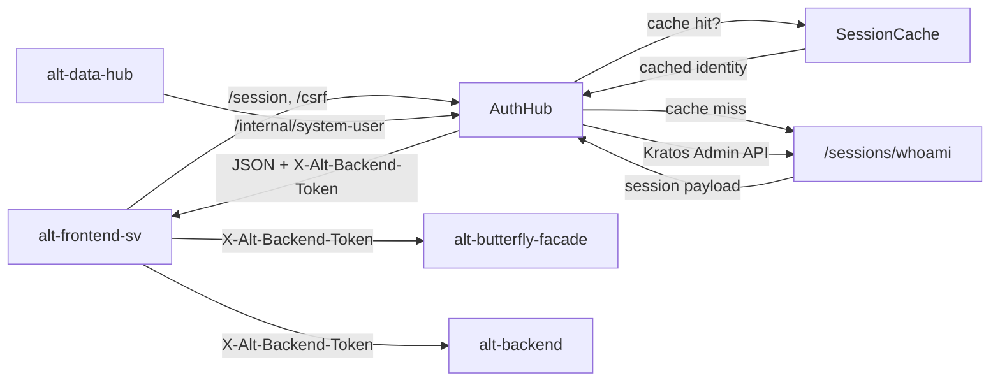

# Auth Hub

_Last reviewed: September 5, 2026_

**Location:** `auth-hub`

## Role
- Kratos セッション cookie (`ory_kratos_session`) を検証し、Ory Kratos `/sessions/whoami` の結果を Alt 内部の backend JWT (`X-Alt-Backend-Token`) に変換する唯一の翻訳点
- セッション検証、アイデンティティキャッシュ、`X-Alt-*` ヘッダー発行
- バックエンドトークン (JWT) 発行による BFF / alt-backend 認証サポート (`/session` レスポンスに含む)。alt-frontend-sv がサーバサイドで `/session` を直接呼び出し、取得した JWT を下流リクエストに付与する
- 下流サービスの認証非依存化 (alt-backend / alt-butterfly-facade は `backend_token_secret` で JWT を自前検証する)
- 内部サービス向けシステムユーザー ID 提供 (`/internal/system-user`、呼び出し元は alt-data-hub)
- `/validate` は元々 nginx `auth_request` 向けに実装されたが、edge proxy が PlectoProxy (`plecto-proxy`, `plecto/manifest.toml`) に切り替わった際に `/auth-validate` route は意図的に移植されておらず (manifest.toml のコメント参照)、ライブの認証経路ではない。`nginx/conf.d/default.conf` は本番 compose のどのサービスからも読み込まれない未使用のプロトタイプ設定として repo に残るのみ

## Architecture & Flow

### `internal/` Domain-Driven Structure

Clean Architecture with domain-driven layers (`cmd/auth-hub/main.go` がエントリーポイント + DI wiring)。旧フラット構成 (`main.go` ルート直下 + `handler/`/`cache/`/`client/`/`token/`) は未使用エントリーポイントとして削除済み — ビルドされるのは `cmd/auth-hub` のみ:

| Layer | Path | Responsibility |
| --- | --- | --- |
| Domain | `internal/domain/session.go` | エンティティ (`Identity`, `CachedSession`) |
| Domain | `internal/domain/errors.go` | センチネルエラー (認証, トークン, 外部サービス, レート制限) |
| Domain | `internal/domain/port.go` | ポートインターフェース (`SessionValidator`, `SessionCache`, `TokenIssuer`, `CSRFTokenGenerator`, `IdentityProvider`) |
| Usecase | `internal/usecase/validate_session.go` | セッション検証 (cache-through 戦略) |
| Usecase | `internal/usecase/get_session.go` | セッション取得 + JWT 発行 |
| Usecase | `internal/usecase/generate_csrf.go` | CSRF トークン生成 |
| Usecase | `internal/usecase/get_system_user.go` | システムユーザー ID 取得 |
| Handler | `internal/adapter/handler/validate.go` | `/validate` ハンドラー |
| Handler | `internal/adapter/handler/session.go` | `/session` ハンドラー |
| Handler | `internal/adapter/handler/csrf.go` | `/csrf` ハンドラー |
| Handler | `internal/adapter/handler/health.go` | `/health` ハンドラー |
| Handler | `internal/adapter/handler/internal.go` | `/internal/system-user` ハンドラー |
| Handler | `internal/adapter/handler/error_mapper.go` | ドメインエラー -> HTTP ステータスマッピング |
| Gateway | `internal/adapter/gateway/kratos.go` | Kratos API クライアント (`SessionValidator`, `IdentityProvider` 実装) |
| Infra | `internal/infrastructure/cache/session_cache.go` | セッションキャッシュ (TTL 付きインメモリ, RWMutex, 自動クリーンアップ) |
| Infra | `internal/infrastructure/token/jwt.go` | JWT 発行 (HS256, `domain.TokenIssuer` 実装) |
| Infra | `internal/infrastructure/token/csrf.go` | CSRF トークン生成 (HMAC-SHA256, `domain.CSRFTokenGenerator` 実装) |
| Infra | `internal/pki/` | east-west mTLS leaf の in-process enrollment/renewal (`pki.Start`)、`tlsutil/` は mTLS リスナー (`:9443`) の TLS 設定 |

### Middleware

| File | Responsibility |
| --- | --- |
| `middleware/security_headers.go` | セキュリティヘッダー (HSTS, CSP, X-Frame-Options 等) |
| `middleware/rate_limit.go` | IP ベースレート制限 (エンドポイントグループ別) |
| `middleware/internal_auth.go` | 共有シークレット認証 (`X-Internal-Auth` ヘッダー, constant-time 比較) |
| `middleware/otel_status_middleware.go` | OTel スパンステータス設定 (5xx = Error) |


```mermaid
flowchart LR
    FE[alt-frontend-sv]
    FE -->|"/session, /csrf"| AuthHub
    AuthHub -->|cache hit?| SessionCache
    SessionCache -->|cached identity| AuthHub
    AuthHub -->|cache miss| Kratos["/sessions/whoami"]
    Kratos -->|session payload| AuthHub
    AuthHub -->|JSON + X-Alt-Backend-Token| FE
    FE -->|X-Alt-Backend-Token| BFF[alt-butterfly-facade]
    FE -->|X-Alt-Backend-Token| Backend[alt-backend]

    DataHub[alt-data-hub] -->|/internal/system-user| AuthHub
    AuthHub -->|Kratos Admin API| Kratos
```

edge proxy (`plecto-proxy`, `plecto/manifest.toml`) には auth-hub 向けの upstream/route が
そもそも存在せず、`/validate` はどの経路からも呼ばれない (上記 Role 参照)。BFF
(`alt-butterfly-facade`) と `alt-backend` は受け取った `X-Alt-Backend-Token` を
`backend_token_secret` で自前検証する (edge proxy 経由の header injection には依存しない)。

## Endpoints & Behavior

| Endpoint | Method | Auth | Rate Limit | Description |
|----------|--------|------|------------|-------------|
| `/validate` | GET | Cookie | 100 req/min, burst 10 | セッション検証、X-Alt-* ヘッダー付与 (元々 nginx `auth_request` 向けだが現在未配線、下記参照) |
| `/session` | GET | Cookie | 30 req/min, burst 5 | セッション情報 JSON + JWT 返却 |
| `/csrf` | POST | Cookie | 100 req/s, burst 1000 | CSRF トークン生成 (HMAC-SHA256) |
| `/health` | GET | None | None | ヘルスチェック (200 OK) |
| `/internal/system-user` | GET | `X-Internal-Auth` | 10 req/min, burst 3 | システムユーザー ID 返却 |

### /validate
- `ory_kratos_session` cookie が存在する場合に 200 + identity headers
- キャッシュ TTL = `CACHE_TTL` (デフォルト 5m)
- Kratos 呼び出し削減 (cache-through 戦略)
- **現状**: 元々 nginx `auth_request` のターゲットとして実装・テストされたが、edge proxy が PlectoProxy に切り替わった際に `/auth-validate` route は意図的に移植されなかった (`plecto/manifest.toml` のコメント参照)。本番トラフィックはこのエンドポイントを経由しない。実際の認証強制は alt-frontend-sv が `/session` を直接呼んで得た JWT を alt-backend / alt-butterfly-facade が自前検証する形で行われている

### /session (Session Info + Backend Token)
- セッション検証 + バックエンドトークン (JWT) を一括発行
- `X-Alt-Backend-Token` レスポンスヘッダーに JWT を含む
- BFF (alt-butterfly-facade) がバックエンドへのリクエスト時に使用

### /internal/system-user
- 内部サービス間通信用エンドポイント
- `INTERNAL_AUTH_SECRET` (必須) を `X-Internal-Auth` ヘッダーで提示する。未設定なら auth-hub は起動時に exit 1 するので、認証が無効な状態は存在しない
- Kratos Admin API から最初の identity ID を取得して返却
- レスポンス: `{"user_id": "<kratos-identity-id>"}`

### X-Alt-* Headers
- `X-Alt-User-Id` / `X-Alt-Tenant-Id` / `X-Alt-User-Email`: `/validate` のレスポンスヘッダーとしてのみ設定される (`/validate` 自体がライブ経路から呼ばれないため現状未使用、上記参照)。edge proxy (`plecto/manifest.toml`) は auth-hub への route を持たず、これらのヘッダーを中継する仕組みもない。`/session` はこれらを JSON body (`user.id`/`user.tenantId`/`user.email`) で返す
- `X-Alt-Tenant-Id` はシングルテナント運用では UserID と同値
- `X-Alt-Backend-Token`: バックエンドトークン (JWT) -- `/validate` と `/session` の両方のレスポンスヘッダーに設定される

## JWT Token Generation

- 署名アルゴリズム: HS256 (`golang-jwt/jwt/v5`)
- Claims: `sub` (UserID), `email`, `role` (Kratos identity trait, 未設定なら "user"), `sid` (SessionID), `tenant_id` (未設定なら UserID と同値), `iss`, `aud`, `iat`, `exp`
- `BACKEND_TOKEN_SECRET` で署名 (最低 32 文字必須)
- issuer: `BACKEND_TOKEN_ISSUER` (デフォルト: `auth-hub`)
- audience: `BACKEND_TOKEN_AUDIENCE` (デフォルト: `alt-backend`)
- TTL: `BACKEND_TOKEN_TTL` (デフォルト: 5m)

## Configuration & Env

| Variable | Default | Description |
|----------|---------|-------------|
| `KRATOS_URL` | http://kratos:4433 | Kratos public URL |
| `KRATOS_ADMIN_URL` | http://kratos:4434 | Kratos admin URL |
| `PORT` | 8888 | サービスポート |
| `CACHE_TTL` | 5m | セッションキャッシュ TTL |
| `CSRF_SECRET` | (required) | CSRF シークレット (最低 32 文字, `_FILE` サフィックス対応) |
| `BACKEND_TOKEN_SECRET` | (required) | JWT 署名シークレット (最低 32 文字, `_FILE` サフィックス対応) |
| `INTERNAL_AUTH_SECRET` | (required) | `/internal` 共有ベアラ (最低 32 文字, `BACKEND_TOKEN_SECRET` と別値必須, `_FILE` サフィックス対応) |
| `BACKEND_TOKEN_ISSUER` | auth-hub | JWT issuer claim |
| `BACKEND_TOKEN_AUDIENCE` | alt-backend | JWT audience claim |
| `BACKEND_TOKEN_TTL` | 5m | JWT 有効期限 |
| `OTEL_ENABLED` | true | OpenTelemetry 有効/無効 |
| `OTEL_SERVICE_NAME` | auth-hub | OTel サービス名 |
| `OTEL_EXPORTER_OTLP_ENDPOINT` | http://localhost:4318 | OTLP HTTP エンドポイント |
| `SERVICE_VERSION` | 0.0.0 | サービスバージョン (OTel リソース) |
| `DEPLOYMENT_ENV` | development | デプロイ環境 (OTel リソース) |
| `VALIDATE_RATE_LIMIT` | 1.67 req/s (100 req/min) | `/validate` のレート制限 (requests per second) |
| `SESSION_RATE_LIMIT` | 0.5 req/s (30 req/min) | `/session` のレート制限 (requests per second) |
| `CSRF_RATE_LIMIT` | 100 req/s | `/csrf` のレート制限 (requests per second)。burst は `rate * 10` |
| `MTLS_LISTEN` | false (コード) / true (compose/auth.yaml の既定) | `true` で `:9443` (`MTLS_PORT`) に east-west mTLS リスナーを追加起動。Alt の compose 定義では既定で有効 |
| `MTLS_PORT` | 9443 | mTLS リスナーのポート |
| `MTLS_CERT_FILE` / `MTLS_KEY_FILE` / `MTLS_CA_FILE` | /certs/svc-cert.pem / /certs/svc-key.pem / /trust/ca-bundle.pem | mTLS リスナーのサーバ証明書・鍵・信頼ルート |
| `MTLS_ALLOWED_PEERS` | (制限なし) | client 証明書 CN の許可リスト (CSV) |
| `MTLS_CLIENT_AUTH` | (ClientAuth 未強制) | `require_and_verify` でクライアント証明書検証を強制。compose/auth.yaml でも既定は空 — 未設定時は `:9443` が接続を張れるが client 証明書を検証しない状態になり、起動時ログで警告が出る |
| `PKI_ENROLLMENT` | (無効) | `enabled` で `internal/pki` の in-process 証明書 enroll/renew を起動 ([[000978]]) |
| `CERT_SUBJECT` / `CERT_SANS` / `CERT_PATH` / `KEY_PATH` | auth-hub / auth-hub,localhost / /certs/svc-cert.pem / /certs/svc-key.pem | 発行する leaf 証明書の識別子と出力先 |
| `STEP_CA_URL` / `STEP_CA_ROOT_FILE` / `STEP_CA_PROVISIONER` / `STEP_CA_PROVISIONER_PASSWORD_FILE` | https://step-ca:9000 / /trust/ca-bundle.pem / pki-agent-auth-hub / (subject 別 docker secret) | step-ca 接続先と subject-scoped provisioner |
| `RENEW_AT_FRACTION` | 0.66 | 証明書有効期間のこの割合を過ぎたら renew |
| `OPS_LISTEN` | 127.0.0.1:9110 (コード既定) / :9110 (compose/auth.yaml で上書き) | PKI enrollment の Prometheus メトリクス (`pki_enrollment_*`)。ホストに publish しない内部リスナー |

> **Note:** すべてのシークレット変数は `_FILE` サフィックスでファイルパス指定が可能 (Docker secrets 対応)。例: `CSRF_SECRET_FILE=/run/secrets/csrf_secret`
>
> `INTERNAL_AUTH_SECRET` には専用の docker secret `auth_hub_internal_secret` を用意してある
> (`INTERNAL_AUTH_SECRET_FILE=/run/secrets/auth_hub_internal_secret`)。
> `BACKEND_TOKEN_SECRET` と同じ値を入れると起動時に exit 1 する — `/internal` ベアラは
> 平文の `X-Internal-Auth` ヘッダで流れ、アクセスログと OTel span attribute に残るため、
> JWT 署名鍵をそこに出さないことが分離の目的。呼び出し側 (alt-data-hub) にも同じ値を渡す。
>
> auth-hub は east-west mTLS leaf を in-process で enroll/renew する 14 parents の1つ
> ([[000978]])。`pki-agent` イメージ自体はもう compose workload としては動かず、CA 側の
> bootstrap / CN allowlist tooling として残るのみ。

## Rate Limiting

IP ベースの per-endpoint レート制限 (`golang.org/x/time/rate` トークンバケット):

| Endpoint Group | Rate | Burst | Rationale |
|---------------|------|-------|-----------|
| `/validate` | 100 req/min | 10 | (historical) 元々 nginx `auth_request` の高頻度呼び出しを想定した値。`/validate` route 自体は現在ライブ経路から呼ばれない (上記参照) |
| `/session` | 30 req/min | 5 | フロントエンドからのセッション取得 |
| `/csrf` | 100 req/s | 1000 | `CSRF_RATE_LIMIT` で調整可能 (requests per second) |
| `/internal/*` | 10 req/min | 3 | 内部サービス間通信 |

- 超過時: HTTP 429 + `Retry-After` ヘッダー
- IP ごとのリミッター自動クリーンアップ (5分未使用で削除、3分間隔チェック)

## OTel Integration

OpenTelemetry によるトレーシング + ログ出力 (`utils/otel/provider.go`):

- **Tracing**: `otelecho` ミドルウェアで全リクエストをスパン化 + OTLP/HTTP エクスポート
- **Log Bridge**: OTel Log SDK 経由で構造化ログを OTLP エクスポート
- **Span Status**: `OTelStatusMiddleware` が HTTP 5xx を `codes.Error` にマップ (4xx は Unset)
- **Propagation**: W3C TraceContext + Baggage
- **Sampler**: AlwaysSample (全リクエストトレース)
- **Graceful Shutdown**: `errgroup` で OTel プロバイダーのシャットダウンを並行実行 (5秒タイムアウト)
- 無効化: `OTEL_ENABLED=false` で OTel ミドルウェアをスキップ

## Distroless Docker

セキュリティ強化された最小コンテナイメージ:

- **Builder**: `golang:1.26-alpine` (マルチステージビルド)
- **Runtime**: `gcr.io/distroless/static-debian12:nonroot` (シェルなし、パッケージマネージャーなし)
- **User**: `nonroot:nonroot` (非 root 実行)
- **Build flags**: `CGO_ENABLED=0 -ldflags="-s -w"` (静的リンク, シンボル除去)
- **Healthcheck**: `./auth-hub healthcheck` サブコマンドで自己ヘルスチェック (distroless に curl がないため)
- **Entry point**: `cmd/auth-hub/main.go`

## Testing & Tooling

```bash
# テスト実行
go test ./...

# レースコンディション検出
go test ./... -race

# ヘルスチェック (Docker)
./auth-hub healthcheck

# 起動
go run ./cmd/auth-hub

# セッション検証テスト
curl -i http://localhost:8888/health
```

**Mocks:**
- ドメインインターフェース (`SessionValidator`, `SessionCache`, `TokenIssuer`, `CSRFTokenGenerator`, `IdentityProvider`) をモック
- テーブル駆動テストで複数シナリオをカバー
- `internal/adapter/handler/error_mapper_test.go`: ドメインエラーマッピングのテスト
- `internal/infrastructure/cache/session_cache_test.go`: キャッシュ TTL / クリーンアップのテスト
- `internal/infrastructure/token/jwt_test.go`, `csrf_test.go`: トークン生成のテスト
- `middleware/*_test.go`: レート制限、OTel ステータス、内部認証、セキュリティヘッダーのテスト

## Operational Runbook

1. サービス起動:
   ```bash
   docker compose -f compose/auth.yaml up auth-hub -d
   ```

2. ヘルスチェック:
   ```bash
   curl -i http://localhost:8888/health
   ```

3. キャッシュウォームアップ: `/validate` を `ory_kratos_session` 付きで呼び出し

4. キャッシュフラッシュ: サービス再起動 (将来のエンドポイント計画あり)

5. `CACHE_TTL` 調整: recap-worker 負荷増加時は短縮 (鮮度 vs Kratos 負荷のトレードオフ)

## Observability
- 構造化ログ: `slog.NewJSONHandler` (OTel 有効時はトレースコンテキスト付き)
- ログフィールド: `method`, `uri`, `status`, `latency_ms`, `error`
- `/health` エンドポイントはログスキップ (ノイズ低減)
- rask.group ラベル: `alt-auth`
- OTel トレース: 全リクエストのスパン (`otelecho` + `OTelStatusMiddleware`)
- OTel ログ: OTLP/HTTP 経由で構造化ログをエクスポート

## Known failure patterns

- Role-based 403 inconsistency ("page opens but every API call fails") → a role change must pierce the entire auth pipeline: Kratos traits → auth-hub → JWT claim → BFF → FE layout. FE reads traits directly while BFF-routed APIs read the JWT role, so fixing only one side breaks the other. → [[000405]] [[000407]]
- Only one of two code paths fixed during migration → while legacy flat handlers and the `internal/` Clean Architecture path coexist, logic added to a single path silently breaks the other. Normalize unknown roles via allowlist (`normalizeRole`: everything except admin falls back to user). → [[000407]]
- SSR totally down with 429 → SvelteKit SSR called `/session` 3 times per page load and tripped auth-hub's own rate limit. Fetch the session once per request and share it via request-scoped `locals`. → [[000305]]
- `uuid.Nil` flowing downstream → JWT claim parse errors were swallowed (`uuid.Parse` result discarded with `_`). Parse subject/tenant claims with helpers that reject both non-UUID and Nil; the `tenantID = userID` hardcode was promoted into a token claim so multi-tenancy needs only one populate point on the issuing side. → [[000717]] [[000718]]
- Session-cache race invisible to the race detector → RWMutex RLock→Lock upgrade is a TOCTOU anti-pattern; a single `sync.Mutex` critical section is the correct form. → [[000718]]
- Silent degradation of static shared secrets → replaced by short-lived JWTs; originally captured via nginx `auth_request_set` ([[000375]]), though that nginx wiring later went dead (alt-frontend-sv fetches the JWT from `/session` directly instead, and alt-backend/BFF verify it in-process). The same structural weakness later retired X-Service-Token in favor of mTLS. Never host-expose the Kratos admin port (4434). → [[000375]] [[000717]] [[000743]]
- Missing secret warn-and-limp → required secrets must abort startup (min 32 chars, no defaults), internal endpoints need app-layer auth with constant-time compare even when "protected by network policy", and an empty secret must fail closed (all requests 500), never silently succeed. → [[000197]] [[000200]] [[000719]] [[000720]]
- Auth bolted onto SSE → browser `EventSource` cannot send custom headers; use Connect-RPC streaming where interceptors apply auth transparently instead of retrofitting SSE. → [[000718]]

## LLM Notes
- 主要ファイル: `internal/adapter/handler/*.go`, `internal/usecase/*.go`, `internal/adapter/gateway/kratos.go`, `internal/infrastructure/**/*.go`
- east-west mTLS enrollment: `internal/pki/`, `tlsutil/` (ビルドされるエントリーポイントは `cmd/auth-hub` のみ)
- cookie 名: `ory_kratos_session`
- 401 = 認証失敗、429 = レート制限、502 = Kratos 到達不可、500 = インフラエラー
- バックエンドトークン (JWT) は `/session` レスポンスで発行 (`/token` エンドポイントは廃止)
- `X-Alt-*` ヘッダーを追加/変更する際は `internal/adapter/handler/validate.go` と `internal/adapter/handler/session.go` の両方を確認する (edge proxy にこれらのヘッダーを中継する仕組みは無く、`/validate` 自体もライブ経路から呼ばれない — 上記 Role/`/validate` 参照)
- シークレットは `_FILE` サフィックスによるファイル読み込みに対応 (Docker secrets)
- `internal/domain/errors.go` のセンチネルエラーと `errors.Is()` を使用 (文字列マッチング禁止)
