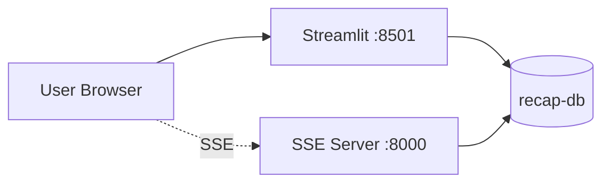

# Dashboard

_Last reviewed: January 13, 2026_

**Location:** `dashboard`

## Role
- Recap システム評価ダッシュボード
- Streamlit ベースのリアルタイムモニタリング UI
- SSE (Server-Sent Events) によるライブ更新

## Architecture & Flow

| Component | Responsibility |
| --- | --- |
| `app.py` | Streamlit アプリケーションエントリポイント |
| `tabs/overview.py` | 概要タブ |
| `tabs/classification.py` | ジャンル分類タブ |
| `tabs/clustering.py` | クラスタリングタブ |
| `tabs/summarization.py` | 要約タブ |
| `tabs/system_monitor_tab.py` | システムモニタータブ |
| `tabs/log_analysis.py` | ログ分析タブ |
| `tabs/admin_jobs.py` | 管理ジョブタブ |
| `tabs/recap_jobs.py` | Recap ジョブタブ |



## Tabs

| Tab | Description |
|-----|-------------|
| Overview | 全体サマリー、主要メトリクス |
| Classification | ジャンル分類精度、混同行列 |
| Clustering | クラスタリング品質、シルエットスコア |
| Summarization | 要約品質、ROUGE スコア |
| System Monitor | システムリソース監視 |
| Log Analysis | ログ分析、エラー追跡 |
| Admin Jobs | 管理ジョブ操作 |
| Recap Jobs | Recap ジョブ状態管理 |

## Endpoints & Behavior
- Streamlit UI: `http://localhost:8501`
- SSE Server: `http://localhost:8000`
  - `GET /health` - ヘルスチェック
  - SSE ストリームによるリアルタイム更新

## Configuration & Env

| Variable | Default | Description |
|----------|---------|-------------|
| `RECAP_DB_DSN` | postgresql://... | recap-db 接続文字列 |
| `SSE_PORT` | 8000 | SSE サーバーポート |

## Time Windows
- 4h: 過去4時間のデータ
- 24h: 過去24時間のデータ
- 3d: 過去3日間のデータ

## Testing & Tooling
```bash
# ローカル起動
streamlit run app.py

# Docker 起動
docker compose -f compose/recap.yaml up dashboard -d

# SSE ヘルスチェック
curl http://localhost:8000/health
```

## Operational Runbook
1. `docker compose -f compose/recap.yaml up dashboard -d` で起動
2. ブラウザで `http://localhost:8501` にアクセス
3. Time Range セレクターで表示期間を選択
4. 各タブでメトリクスを確認

## Observability
- Streamlit ネイティブのログ
- SSE サーバーのヘルスチェック
- rask.group ラベル: `dashboard`

## Dependencies
- recap-db (PostgreSQL 18) への接続必須
- GPU 予約あり (NVIDIA)

## LLM Notes
- Streamlit は Python ベースのダッシュボードフレームワーク
- SSE サーバーは別プロセスで起動 (ポート 8000)
- recap-db のクエリでパイプライン状態を可視化
- Time Window で表示期間を動的に変更可能
