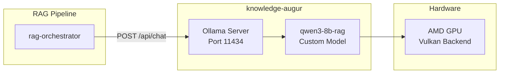

# Knowledge Augur

_Last reviewed: February 28, 2026_

**Location:** `knowledge-augur/`
**Port:** 11435 (external) → 11434 (internal Ollama)

## Role

- **RAG LLM Service**: An Ollama-based LLM service providing text generation capabilities for the RAG (Retrieval Augmented Generation) pipeline.
- **Answer Generation**: Generates grounded answers with citations based on retrieved context chunks from rag-orchestrator.
- **Query Expansion**: Assists in expanding user queries for improved retrieval accuracy.

## Architecture Overview



## Model Configuration

### Default Model

- **Model**: `qwen3:8b` (pulled from Ollama registry)
- **Custom Variant**: `qwen3-8b-rag` (RAG-optimized, created via Modelfile)

### Modelfile Parameters (`Modelfile.qwen3-8b-rag`)

| Parameter | Value | Description |
|-----------|-------|-------------|
| `num_ctx` | 8192 | Context window size (tokens) |
| `num_predict` | 512 | Maximum tokens to generate |
| `temperature` | 0.2 | Low temperature for deterministic outputs |
| `top_p` | 0.9 | Nucleus sampling parameter |
| `num_batch` | 512 | Batch size for prompt evaluation |
| `stop` | `<\|im_end\|>`, `<\|endoftext\|>` | qwen3-specific stop tokens |

### Legacy Models (Available for Rollback)

- `gpt-oss20b-igpu`: Previous default, iGPU-optimized
- `gpt-oss20b-cpu`: CPU-only variant

### Environment Variables (Dockerfile)

| Variable | Value | Description |
|----------|-------|-------------|
| `OLLAMA_HOST` | `0.0.0.0:11434` | Listen on all interfaces |
| `OLLAMA_ORIGINS` | `*` | Allow all CORS origins |
| `OLLAMA_KEEP_ALIVE` | `-1` | Keep model loaded indefinitely |
| `OLLAMA_MAX_LOADED_MODELS` | `1` | Single model in memory |
| `OLLAMA_NUM_PARALLEL` | `1` | Single parallel request |
| `OLLAMA_MAX_QUEUE` | `1` | Minimal request queue |
| `OLLAMA_FLASH_ATTENTION` | `1` | Enable flash attention optimization |
| `OLLAMA_KV_CACHE_TYPE` | `q8_0` | Quantized KV cache for memory efficiency |

## Directory Structure

```
knowledge-augur/
├── Dockerfile                  # Multi-stage build with Ollama base
├── Modelfile.qwen3-8b-rag     # RAG-optimized qwen3 configuration (default)
├── Modelfile.gpt-oss20b-igpu   # iGPU-optimized gpt-oss configuration (legacy)
├── Modelfile.gpt-oss20b-cpu    # CPU model configuration (legacy)
└── entrypoint.sh               # Startup script with GPU setup
```

## Compose Integration

### Separate Compose File (`compose.augur.yaml`)

knowledge-augur runs in a dedicated Compose file for GPU resource isolation:

```yaml
services:
  knowledge-augur:
    build:
      context: ./knowledge-augur
      dockerfile: Dockerfile
    ports:
      - "11435:11434"
    volumes:
      - knowledge_augur_models:/home/ollama-user/.ollama
    environment:
      - OLLAMA_VULKAN=1
    devices:
      - /dev/kfd
      - /dev/dri
    depends_on:
      knowledge-augur-volume-init:
        condition: service_completed_successfully
```

### Volume Initialization

A separate init container ensures proper permissions:

```yaml
knowledge-augur-volume-init:
  image: ollama/ollama:latest
  command: ["mkdir -p /home/ollama-user/.ollama && chown -R 2000:2000 /home/ollama-user/.ollama"]
  user: "0:0"
  volumes:
    - knowledge_augur_models:/home/ollama-user/.ollama
```

## GPU Support

### AMD GPU Configuration

- **Vulkan Backend**: Uses `OLLAMA_VULKAN=1` for AMD GPU acceleration
- **Device Mapping**: `/dev/kfd` and `/dev/dri` passed to container
- **Dynamic GID Setup**: entrypoint.sh detects GPU device GID and adds user to appropriate groups

### Entrypoint Sequence

1. Detect GPU device GID from `/dev/dri/renderD128` or `/dev/kfd`
2. Create render group and add `ollama-user`
3. Drop privileges from root to `ollama-user` using `gosu`
4. Start Ollama server in background
5. Wait for server readiness (up to 60 seconds)
6. Pull base models (`gpt-oss:20b`, `qwen3:8b`) if not present
7. Create custom models from Modelfiles (`qwen3-8b-rag`, `gpt-oss20b-igpu`, `gpt-oss20b-cpu`)
8. Preload configured model (default: `qwen3-8b-rag`, configurable via `AUGUR_KNOWLEDGE_MODEL`)

## API Integration

### rag-orchestrator Client

The `OllamaGenerator` in rag-orchestrator consumes knowledge-augur:

```go
// Configuration
KnowledgeAugurURL:   getEnv("AUGUR_EXTERNAL", "http://augur-external:11435")
KnowledgeAugurModel: getEnv("AUGUR_KNOWLEDGE_MODEL", "qwen3-8b-rag")

// Initialization
generator := rag_augur.NewOllamaGenerator(
    cfg.KnowledgeAugurURL,
    cfg.KnowledgeAugurModel,
    cfg.OllamaTimeout,
    log,
)
```

### Supported Methods

| Method | Endpoint | Description |
|--------|----------|-------------|
| `Generate` | `POST /api/chat` | Single-turn generation with streaming |
| `GenerateStream` | `POST /api/chat` | Streaming generation with chunked responses |
| `Chat` | `POST /api/chat` | Multi-turn conversation with structured JSON output |
| `ChatStream` | `POST /api/chat` | Streaming multi-turn conversation |

### Response Format

For Chat methods, knowledge-augur returns structured JSON:

```json
{
  "answer": "Generated answer text...",
  "citations": [
    {"chunk_id": "uuid-1", "reason": "Source reference"},
    {"chunk_id": "uuid-2", "reason": "Supporting evidence"}
  ],
  "fallback": false,
  "reason": "Explanation of answer generation"
}
```

### Think Parameter

The generator dynamically sets the "think" parameter based on model type and task complexity:

**qwen3 models:**
- **`false`** (boolean): Thinking mode disabled to avoid `<think>` blocks in output

**gpt-oss models:**
- **`low`**: Short tasks (maxTokens < 300), e.g., query expansion
- **`medium`**: Longer tasks, e.g., knowledge synthesis and answer generation

## Environment Variables

Configure via `.env` or `.env.template`:

| Variable | Default | Description |
|----------|---------|-------------|
| `AUGUR_EXTERNAL` | `http://augur-external:11435` | URL for rag-orchestrator to reach knowledge-augur |
| `AUGUR_EXTERNAL_HOST` | `0.0.0.0` | Host binding for extra_hosts resolution |
| `AUGUR_KNOWLEDGE_MODEL` | `qwen3-8b-rag` | Model name to use for generation |
| `OLLAMA_TIMEOUT` | `300` | Request timeout in seconds |

## Health Check

```yaml
healthcheck:
  test: ["CMD", "curl", "-f", "http://localhost:11434/api/tags"]
  interval: 30s
  timeout: 5s
  retries: 3
  start_period: 60s
```

### Manual Verification

```bash
# Check if service is running
curl http://localhost:11435/api/tags

# List loaded models
curl http://localhost:11435/api/tags | jq '.models[].name'

# Test generation
curl http://localhost:11435/api/chat \
  -d '{"model":"qwen3-8b-rag","messages":[{"role":"user","content":"Hello"}],"think":false}'
```

## Logging

```yaml
logging:
  driver: "json-file"
  options:
    max-size: "10m"
    max-file: "3"
```

## Related Services

| Service | Relationship |
|---------|-------------|
| `rag-orchestrator` | Primary consumer; sends prompts and receives generated answers |
| `knowledge-embedder` | Sibling service for vector embedding generation |
| `rag-db` | Stores chunks that provide context for generation |

## Troubleshooting

| Symptom | Cause | Resolution |
|---------|-------|------------|
| Model not found | Base model not pulled | Check `docker compose logs knowledge-augur` for pull errors; ensure network connectivity |
| GPU not detected | Device permissions | Verify `/dev/kfd` and `/dev/dri` exist on host; check GID mapping in logs |
| Slow inference | Model not preloaded | Wait for startup sequence; check `OLLAMA_KEEP_ALIVE=-1` is set |
| OOM errors | Insufficient VRAM | Reduce `num_ctx` or use CPU-only mode |
| Connection refused | Service not ready | Wait for health check; verify port 11435 is exposed |

## Development

### Starting the Service

```bash
# Start with GPU support
docker compose -f compose.augur.yaml up knowledge-augur -d

# View logs
docker compose -f compose.augur.yaml logs -f knowledge-augur

# Rebuild after Modelfile changes
docker compose -f compose.augur.yaml up --build knowledge-augur -d
```

### Updating the Model

To update Modelfile parameters:

1. Edit `knowledge-augur/Modelfile.qwen3-8b-rag`
2. Rebuild the container: `docker compose -f compose.augur.yaml up --build knowledge-augur -d`
3. The entrypoint will recreate the custom model on startup

### Rollback to Previous Model

To rollback to the previous gpt-oss model:

```bash
# Set environment variable
export AUGUR_KNOWLEDGE_MODEL=gpt-oss20b-igpu

# Restart rag-orchestrator
docker compose -f compose/compose.yaml -p alt up -d rag-orchestrator
```
