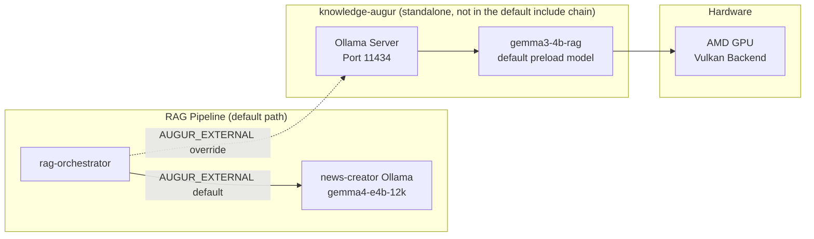

# Knowledge Augur

_Last reviewed: September 5, 2026_

**Location:** `knowledge-augur/`
**Port:** 11435 (external) → 11434 (internal Ollama)

## Role

`knowledge-augur` is a standalone Ollama container built for AMD GPU (Vulkan) hardware. It runs under its own `compose.augur.yaml` at the repo root, which is **not** part of the production `include:` chain in `compose/compose.yaml` (`docs/services/MICROSERVICES.md` lists it as an "optional overlay"). It is **not** the default RAG generation backend: `rag-orchestrator`'s `AUGUR_EXTERNAL` defaults to `http://news-creator-backend:11435` in code and in `.env.template`, but compose/rag.yaml's fallback (`http://news-creator:11434`, which wins because `.env` intentionally omits `AUGUR_EXTERNAL`) routes it through news-creator's FastAPI priority-queue proxy, which itself fronts news-creator-backend's Ollama on :11435 (see `docs/services/rag-orchestrator.md`). Either way, news-creator is where generation actually runs in the current topology ([[000951]], [[000943]] — the ADR-000943 hardware map records the equivalent remote-Mac Augur route as a "dormant hook"). This file documents `knowledge-augur` as it exists in the repo (image, Modelfiles, entrypoint) for whoever needs to stand it up as an alternate generation host; it does not describe the service `rag-orchestrator` talks to by default.

- **RAG LLM Service**: An Ollama-based LLM service that can provide text generation for the RAG pipeline when `AUGUR_EXTERNAL` is pointed at it.
- **Answer Generation**: Would generate grounded answers with citations based on retrieved context chunks from rag-orchestrator, if wired as the active backend.
- **Query Expansion**: Same, for query expansion.

## Architecture Overview


```mermaid
flowchart LR
    subgraph "RAG Pipeline (default path)"
        RagOrch[rag-orchestrator] -->|AUGUR_EXTERNAL default| NewsCreator[news-creator Ollama<br/>gemma4-e4b-12k]
    end

    subgraph "knowledge-augur (standalone, not in the default include chain)"
        Ollama[Ollama Server<br/>Port 11434]
        Model[gemma3-4b-rag<br/>default preload model]
    end

    subgraph Hardware
        GPU[AMD GPU<br/>Vulkan Backend]
    end

    RagOrch -.->|"AUGUR_EXTERNAL override"| Ollama
    Ollama --> Model
    Model --> GPU
```

## Model Configuration

### Default Model

- **Preload model**: `gemma3-4b-rag` (from `gemma3:4b-it-qat`; `entrypoint.sh` preloads `${AUGUR_KNOWLEDGE_MODEL:-gemma3-4b-rag}`)
- Base models pulled on startup: `gpt-oss:20b`, `qwen3:8b`, `gemma3:4b-it-qat`
- Custom models created from Modelfiles: `gpt-oss20b-cpu`, `gpt-oss20b-igpu`, `qwen3-8b-rag`, `gemma3-4b-rag`

### Modelfile Parameters (`Modelfile.gemma3-4b-rag`)

| Parameter | Value | Description |
|-----------|-------|-------------|
| `num_ctx` | 8192 | Context window size (tokens) |
| `num_predict` | 2048 | Maximum tokens to generate |
| `num_batch` | 512 | Batch size for prompt evaluation |
| `temperature` | 0.7 | Gemma 3-recommended sampling |
| `top_p` | 0.85 | Nucleus sampling parameter |
| `top_k` | 40 | Top-k sampling parameter |
| `repeat_penalty` | 1.15 | Repetition penalty |
| `stop` | `<end_of_turn>` | Gemma 3 stop token |

The comment in the Modelfile notes it targets response speed on an M4 Mac Mini deployment specifically, not the AMD Vulkan container this file otherwise documents.

### Other Models (available, not preloaded by default)

- `qwen3-8b-rag` (from `qwen3:8b`; see `Modelfile.qwen3-8b-rag` for its own parameters) — the previous default preload model
- `gpt-oss20b-igpu`: iGPU-optimized
- `gpt-oss20b-cpu`: CPU-only variant

### Environment Variables (Dockerfile)

| Variable | Value | Description |
|----------|-------|-------------|
| `OLLAMA_HOST` | `0.0.0.0:11434` | Listen on all interfaces |
| `OLLAMA_ORIGINS` | `http://localhost,http://127.0.0.1,http://knowledge-augur,http://news-creator,http://news-creator-backend,http://rag-orchestrator` | Explicit CORS allowlist |
| `OLLAMA_KEEP_ALIVE` | `-1` | Keep model loaded indefinitely |
| `OLLAMA_MAX_LOADED_MODELS` | `1` | Single model in memory |
| `OLLAMA_NUM_PARALLEL` | `1` | Single parallel request |
| `OLLAMA_MAX_QUEUE` | `1` | Minimal request queue |
| `OLLAMA_FLASH_ATTENTION` | `1` | Enable flash attention optimization |
| `OLLAMA_KV_CACHE_TYPE` | `q8_0` | Quantized KV cache for memory efficiency |

Base image is pinned to `ollama/ollama:0.32.14` (the volume-init container uses the same pinned tag) — an earlier `:latest` tag caused weeks of silent CPU fallback (see "Known failure patterns").

## Directory Structure

```
knowledge-augur/
├── Dockerfile                   # Ollama base image + Modelfiles + entrypoint
├── Modelfile.gemma3-4b-rag      # Gemma 3 4B QAT configuration (default preload)
├── Modelfile.qwen3-8b-rag       # qwen3 configuration (previous default)
├── Modelfile.gpt-oss20b-igpu    # iGPU-optimized gpt-oss configuration
├── Modelfile.gpt-oss20b-cpu     # CPU-only gpt-oss configuration
├── scripts/
└── entrypoint.sh                # Startup script with GPU setup
```

## Compose Integration

### Separate Compose File (`compose.augur.yaml`)

knowledge-augur runs in its own Compose file at the repo root, for GPU resource isolation and because it is a standalone overlay rather than a service in the production `include:` chain (`compose/compose.yaml` does not reference `compose.augur.yaml`):

```yaml
services:
  knowledge-augur:
    build:
      context: ./knowledge-augur
      dockerfile: Dockerfile
    ports:
      - "11435:11434"
    volumes:
      - knowledge_augur_models:/home/ollama-user/.ollama
    environment:
      - OLLAMA_VULKAN=1
    devices:
      - /dev/kfd
      - /dev/dri
    depends_on:
      knowledge-augur-volume-init:
        condition: service_completed_successfully
    networks:
      - augur-network
```

### Volume Initialization

A separate init container ensures proper permissions:

```yaml
knowledge-augur-volume-init:
  image: ollama/ollama:0.32.14
  entrypoint: ["/bin/sh", "-c"]
  command: ["mkdir -p /home/ollama-user/.ollama && chown -R 2000:2000 /home/ollama-user/.ollama"]
  user: "0:0"
  volumes:
    - knowledge_augur_models:/home/ollama-user/.ollama
```

## GPU Support

### AMD GPU Configuration

- **Vulkan Backend**: Uses `OLLAMA_VULKAN=1` for AMD GPU acceleration
- **Device Mapping**: `/dev/kfd` and `/dev/dri` passed to container
- **Dynamic GID Setup**: entrypoint.sh detects GPU device GID and adds user to appropriate groups

### Entrypoint Sequence

1. Detect GPU device GID from `/dev/dri/renderD128` or `/dev/kfd`
2. Create render group and add `ollama-user`
3. Drop privileges from root to `ollama-user` using `gosu`
4. Start Ollama server in background
5. Wait for server readiness (up to 60 seconds)
6. Pull base models (`gpt-oss:20b`, `qwen3:8b`, `gemma3:4b-it-qat`) if not present
7. Create custom models from Modelfiles (`gpt-oss20b-cpu`, `gpt-oss20b-igpu`, `qwen3-8b-rag`, `gemma3-4b-rag`)
8. Preload configured model (default: `gemma3-4b-rag`, configurable via `AUGUR_KNOWLEDGE_MODEL`)

## API Integration

### rag-orchestrator Client

rag-orchestrator's `OllamaGenerator` talks to whatever `AUGUR_EXTERNAL` names — by default that is news-creator's FastAPI priority-queue proxy on :11434 (fronting news-creator-backend's Ollama on :11435), not knowledge-augur. Pointing it at knowledge-augur means overriding the environment:

```bash
# rag-orchestrator env override — code default is news-creator-backend:11435,
# compose/rag.yaml's fallback (in effect today) is news-creator:11434
AUGUR_EXTERNAL=http://augur-external:11435
AUGUR_KNOWLEDGE_MODEL=gemma3-4b-rag   # or qwen3-8b-rag, gpt-oss20b-igpu, gpt-oss20b-cpu
```

`config.go`'s actual defaults (`AugurConfig.URL`/`.Model`) are `http://news-creator-backend:11435` / `gemma4-e4b-12k` — though compose/rag.yaml's `AUGUR_EXTERNAL` fallback of `http://news-creator:11434` wins in the deployed stack, since `.env` does not set `AUGUR_EXTERNAL`. See `docs/services/rag-orchestrator.md`.

### Supported Methods

| Method | Endpoint | Description |
|--------|----------|-------------|
| `Generate` | `POST /api/chat` | Single-turn generation with streaming |
| `GenerateStream` | `POST /api/chat` | Streaming generation with chunked responses |
| `Chat` | `POST /api/chat` | Multi-turn conversation with structured JSON output |
| `ChatStream` | `POST /api/chat` | Streaming multi-turn conversation |

### Response Format

For Chat methods, knowledge-augur returns structured JSON:

```json
{
  "answer": "Generated answer text...",
  "citations": [
    {"chunk_id": "uuid-1", "reason": "Source reference"},
    {"chunk_id": "uuid-2", "reason": "Supporting evidence"}
  ],
  "fallback": false,
  "reason": "Explanation of answer generation"
}
```

### Think Parameter

The generator dynamically sets the "think" parameter based on model type and task complexity:

**qwen3 models:**
- **`false`** (boolean): Thinking mode disabled to avoid `<think>` blocks in output

**gpt-oss models:**
- **`low`**: Short tasks (maxTokens < 300), e.g., query expansion
- **`medium`**: Longer tasks, e.g., knowledge synthesis and answer generation

## Environment Variables

These are rag-orchestrator-side variables (`.env`/`.env.template`) that only matter for knowledge-augur when `AUGUR_EXTERNAL` is deliberately pointed at it — the shipped `.env.template` default routes them at news-creator instead (see "Role" above and `docs/services/rag-orchestrator.md`):

| Variable | Default in `.env.template` | Description |
|----------|---------|-------------|
| `AUGUR_EXTERNAL` | `http://news-creator-backend:11435` | URL for rag-orchestrator to reach its LLM generation backend; set to `http://augur-external:11435` to reach knowledge-augur instead |
| `AUGUR_EXTERNAL_HOST` | `0.0.0.0` | Host binding for `extra_hosts` resolution when routing to a non-default (e.g. remote) backend |
| `AUGUR_KNOWLEDGE_MODEL` | `gemma4-e4b-12k` | Model name to use for generation; set to `gemma3-4b-rag` (or another knowledge-augur model) when routed here |
| `OLLAMA_TIMEOUT` | `300` | Request timeout in seconds |

## Health Check

```yaml
healthcheck:
  test: ["CMD", "curl", "-f", "http://localhost:11434/api/tags"]
  interval: 30s
  timeout: 5s
  retries: 3
  start_period: 60s
```

### Manual Verification

```bash
# Check if service is running
curl http://localhost:11435/api/tags

# List loaded models
curl http://localhost:11435/api/tags | jq '.models[].name'

# Test generation (gemma3-4b-rag is the default preload; qwen3-8b-rag also works)
curl http://localhost:11435/api/chat \
  -d '{"model":"gemma3-4b-rag","messages":[{"role":"user","content":"Hello"}]}'
```

## Logging

```yaml
logging:
  driver: "json-file"
  options:
    max-size: "10m"
    max-file: "3"
```

## Related Services

| Service | Relationship |
|---------|-------------|
| `rag-orchestrator` | Would send prompts and receive generated answers if `AUGUR_EXTERNAL` were pointed here; by default it talks to `news-creator` instead |
| `knowledge-embedder` | Sibling service (same `compose.augur.yaml`) for vector embedding generation on the same standalone overlay — distinct from `knowledge-embedder-local` in `compose/rag.yaml`, which is what rag-orchestrator's embedder actually points at by default ([[000951]]) |
| `rag-db` | Would store chunks that provide context for generation, same as with any Augur-compatible LLM backend |

## Troubleshooting

| Symptom | Cause | Resolution |
|---------|-------|------------|
| Model not found | Base model not pulled | Check `docker compose logs knowledge-augur` for pull errors; ensure network connectivity |
| GPU not detected | Device permissions | Verify `/dev/kfd` and `/dev/dri` exist on host; check GID mapping in logs |
| Slow inference | Model not preloaded | Wait for startup sequence; check `OLLAMA_KEEP_ALIVE=-1` is set |
| OOM errors | Insufficient VRAM | Reduce `num_ctx` or use CPU-only mode |
| Connection refused | Service not ready | Wait for health check; verify port 11435 is exposed |

## Known failure patterns

- **`latest` image tag is pinned at container creation**: weeks of CPU fallback at 12 tok/s (87% throughput lost) → the Ollama image was stale despite `latest`, and the health check verified model presence but not inference speed → recreate the container on image updates; make health checks performance-aware → PM-2026-005.
- **Stale model name from a consumer → immediate EOF**: Ask Augur down 67 min → rag-orchestrator was not rebuilt after a model migration and requested a nonexistent model → immediate EOF means "model not found"; rebuild all containers that reference `AUGUR_KNOWLEDGE_MODEL` via env → PM-2026-016.
- **`.env` overrides silently defeat fix ADRs**: a stale `AUGUR_EXTERNAL` in `.env` overrode compose defaults and re-broke routing after a fix landed → audit `.env` vs compose defaults on every wiring change → [[000571]], PM-2026-013 (same class).
- **Model migration needs a template/parameter checklist**: gpt-oss → qwen3 required `think:false` (else `<think>` blocks leak into output) and `num_predict` 4096→512 → verify chat-template token differences against primary sources before switching → [[000155]] [[000640]]. gpt-oss variants also emit literal `\n` (double-escaped), needing post-processing → [[000066]].
- **iGPU render GID is unstable across hosts**: GPU not detected despite correct device mappings → the host render GID varies, so the entrypoint must stat-detect the GID dynamically and drop privileges via gosu → [[000025]].
- **Model switch without profiling wastes effort**: identify the dominant bottleneck first — once retrieval is optimized, the model weight itself is next; keep quality requirements while moving to a lighter same-family variant → [[000428]].

## Development

### Starting the Service

```bash
# Start with GPU support
docker compose -f compose.augur.yaml up knowledge-augur -d

# View logs
docker compose -f compose.augur.yaml logs -f knowledge-augur

# Rebuild after Modelfile changes
docker compose -f compose.augur.yaml up --build knowledge-augur -d
```

### Updating the Model

To update Modelfile parameters:

1. Edit the relevant `knowledge-augur/Modelfile.*` (default preload: `Modelfile.gemma3-4b-rag`)
2. Rebuild the container: `docker compose -f compose.augur.yaml up --build knowledge-augur -d`
3. The entrypoint will recreate the custom model on startup

### Routing rag-orchestrator to knowledge-augur

`knowledge-augur` is not on rag-orchestrator's default generation path (see "Role" above). `compose.augur.yaml` runs `knowledge-augur` on a standalone `augur-network`, with no attachment to `alt-network` where rag-orchestrator runs — a compose service name will not resolve from rag-orchestrator in this configuration. Reaching it requires a published-port/host address (rag-orchestrator's `extra_hosts` entry keyed on `AUGUR_EXTERNAL_HOST`, see `compose/rag.yaml`), or adding an external-network attachment to both stacks. To point rag-orchestrator at it instead of news-creator:

```bash
# rag-orchestrator env
export AUGUR_EXTERNAL=http://augur-external:11435   # host/published-port address; the compose service name will not resolve, see above
export AUGUR_KNOWLEDGE_MODEL=gemma3-4b-rag           # or qwen3-8b-rag, gpt-oss20b-igpu, gpt-oss20b-cpu

# Restart rag-orchestrator
docker compose -f compose/compose.yaml -p alt up -d rag-orchestrator
```
