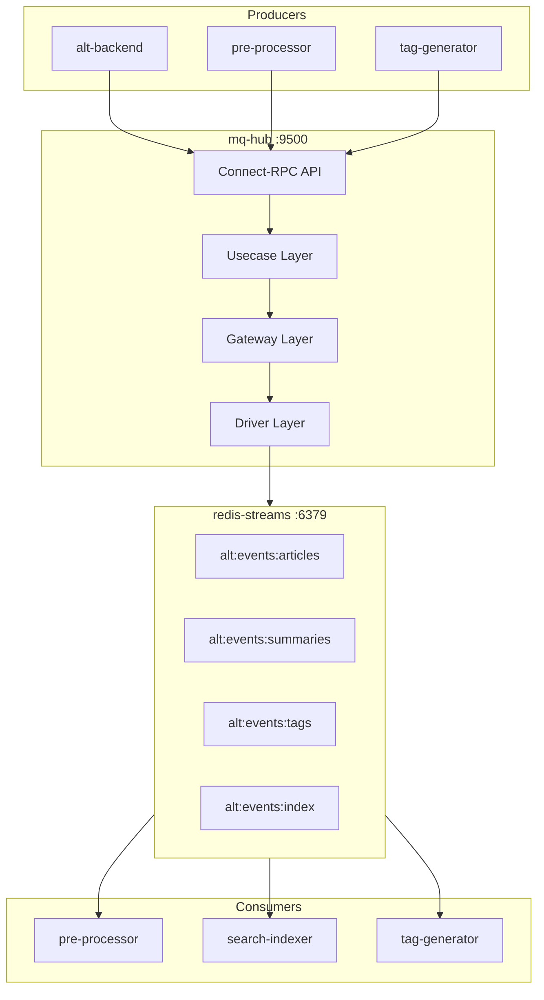

# MQ Hub

_Last reviewed: February 15, 2026_

**Location:** `mq-hub`

## Role
- Alt プラットフォームのメッセージキューハブサービス
- Redis 8.4 Streams を使用したイベントソーシング
- Connect-RPC によるイベント発行 API

## Architecture & Flow

| Component | Responsibility |
| --- | --- |
| Connect Handler | イベント発行 API (Connect-RPC) |
| Usecase | ストリーム操作のビジネスロジック |
| Port | インターフェース定義 (StreamPort) |
| Gateway | Redis への Anti-corruption layer |
| Driver | Redis Streams クライアント実装 |



## Event Types

| Event | Producer | Consumers | Note |
|-------|----------|-----------|------|
| ArticleCreated | alt-backend | pre-processor, search-indexer, tag-generator | Fat Event 対応 (下記参照) |
| SummarizeRequested | alt-backend | pre-processor | |
| ArticleSummarized | pre-processor | search-indexer | |
| TagsGenerated | tag-generator | search-indexer | |
| IndexArticle | search-indexer | search-indexer | |

## Event Structure

イベントは以下のフィールドを持つ:

| Field | Type | Description |
|-------|------|-------------|
| `EventID` | string | UUID v4 (自動生成) |
| `EventType` | string | イベント種別 (上記参照) |
| `Source` | string | イベント発行元サービス名 |
| `CreatedAt` | time.Time | イベント作成時刻 |
| `Payload` | []byte | イベント固有データ (JSON or protobuf) |
| `Metadata` | map[string]string | 追加コンテキスト (トレースID, correlation ID 等) |

### Fat Events (ADR-000241)

`ArticleCreated` イベントは Fat Event としてペイロードに記事データを含めることが可能:
- **Fat Event**: `content`, `tags` フィールドを含有。コンシューマーは追加の API/DB 呼び出し不要で直接処理可能
- **Thin Event**: `article_id` のみ。コンシューマーが別途データを取得

Fat Events により search-indexer は alt-backend への API 呼び出しなしでインデックス更新可能。

## Stream Keys

| Key | Purpose |
|-----|---------|
| `alt:events:articles` | 記事ライフサイクルイベント |
| `alt:events:summaries` | 要約イベント |
| `alt:events:tags` | タグ生成イベント |
| `alt:events:index` | インデックスコマンド |

## Consumer Groups

| Group | Service | Purpose |
|-------|---------|---------|
| `pre-processor-group` | pre-processor | 記事前処理・要約 |
| `tag-generator-group` | tag-generator | タグ生成 |
| `search-indexer-group` | search-indexer | 検索インデックス更新 |

## Connect-RPC API

Port 9500 で Connect-RPC API を提供。

### RPC Methods

| Method | Request | Response | Description |
|--------|---------|----------|-------------|
| `Publish` | PublishRequest | PublishResponse | 単一イベント発行 |
| `PublishBatch` | PublishBatchRequest | PublishBatchResponse | 複数イベント一括発行 |
| `CreateConsumerGroup` | CreateConsumerGroupRequest | CreateConsumerGroupResponse | コンシューマーグループ作成 |
| `GetStreamInfo` | StreamInfoRequest | StreamInfoResponse | ストリーム情報取得 |
| `HealthCheck` | HealthCheckRequest | HealthCheckResponse | ヘルスチェック |

### Endpoints
- `GET /health` - HTTP ヘルスチェック
- Connect-RPC (port 9500): 上記 RPC メソッド

## Configuration & Env

| Variable | Default | Description |
|----------|---------|-------------|
| `REDIS_URL` | redis://redis-streams:6379 | Redis Streams URL |
| `CONNECT_PORT` | 9500 | Connect-RPC ポート |
| `LOG_LEVEL` | info | ログレベル |

## Dependencies

| Package | Version | Purpose |
|---------|---------|---------|
| Go | 1.24+ | 言語ランタイム |
| connectrpc.com/connect | v1.19.1 | Connect-RPC フレームワーク |
| github.com/redis/go-redis/v9 | v9.17.2 | Redis クライアント |
| github.com/alicebob/miniredis/v2 | v2.34.0 | テスト用 Redis モック |
| go.opentelemetry.io/otel/trace | v1.39.0 | 分散トレーシング |
| google.golang.org/protobuf | v1.36.11 | Protocol Buffers |

## Redis 8.4 Features
- `XREADGROUP CLAIM` オプションによる効率的なメッセージ処理
- アイドル pending + 新規メッセージを1コマンドで消費
- 障害回復の簡素化
- 30% のスループット向上

## Testing & Tooling
```bash
# テスト実行
go test ./...

# カバレッジ付きテスト
go test -cover ./...

# Proto コード生成
cd ../proto && buf generate --template buf.gen.mq-hub.yaml

# サービス起動
go run main.go

# ヘルスチェック
curl http://localhost:9500/health
```

**テスト層:**
- Usecase: StreamPort をモック、ビジネスロジックテスト
- Gateway: ドライバーをモック、ドメイン変換テスト
- Driver: miniredis でユニットテスト
- Integration: 実 Redis 8.4 インスタンス

## Operational Runbook
1. `docker compose -f compose/mq.yaml up -d` でサービス起動
2. `curl http://localhost:9500/health` でヘルスチェック
3. Redis Streams 確認: `docker compose exec redis-streams redis-cli`
4. ストリーム一覧: `XINFO STREAMS`
5. コンシューマーグループ確認: `XINFO GROUPS alt:events:articles`

## Observability
- 構造化ログ: `log/slog`
- ログには stream_key, event_type, message_id を含む
- rask.group ラベル: `mq-hub`

## Common Pitfalls

| Issue | Solution |
|-------|----------|
| Redis connection failed | REDIS_URL とネットワーク確認 |
| BUSYGROUP error | コンシューマーグループ既存 (正常) |
| Slow publishing | Redis latency 確認、バッチ発行検討 |
| Memory issues | Redis maxmemory policy 設定 |

## LLM Notes
- イベント駆動アーキテクチャの中核サービス
- at-least-once 配信を前提に設計 (冪等性必須)
- Clean Architecture (5層) を採用
- Redis Streams の XREADGROUP CLAIM は Redis 8.4 の新機能
