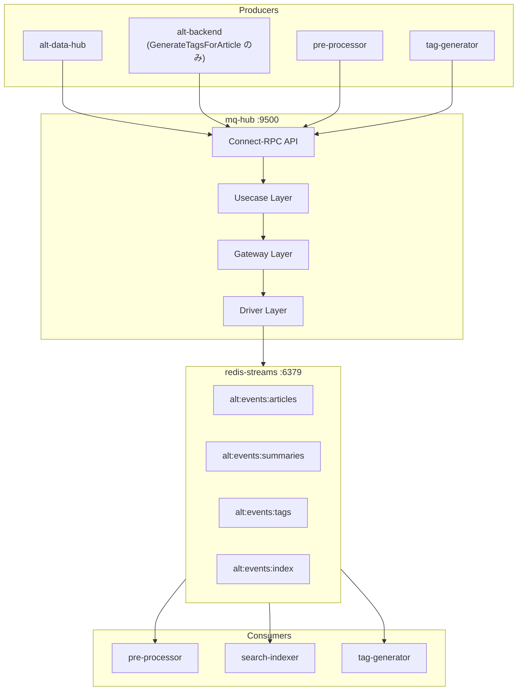

# MQ Hub

_Last reviewed: September 5, 2026_

**Location:** `mq-hub`

## Role
- Alt プラットフォームのメッセージキューハブサービス
- Redis 8.4 Streams を使用したイベントソーシング
- Connect-RPC によるイベント発行 API

## Architecture & Flow

| Component | Responsibility |
| --- | --- |
| Connect Handler | イベント発行 API (Connect-RPC) |
| Usecase | ストリーム操作のビジネスロジック |
| Port | インターフェース定義 (StreamPort) |
| Gateway | Redis への Anti-corruption layer |
| Driver | Redis Streams クライアント実装 |


```mermaid
flowchart TB
    subgraph Producers
        DH[alt-data-hub]
        BE["alt-backend\n(GenerateTagsForArticle のみ)"]
        PP[pre-processor]
        TG[tag-generator]
    end

    subgraph MQHub[mq-hub :9500]
        API[Connect-RPC API]
        UC[Usecase Layer]
        GW[Gateway Layer]
        DR[Driver Layer]
    end

    subgraph Redis[redis-streams :6379]
        S1[alt:events:articles]
        S2[alt:events:summaries]
        S3[alt:events:tags]
        S4[alt:events:index]
    end

    subgraph Consumers
        PP2[pre-processor]
        SI[search-indexer]
        TG2[tag-generator]
    end

    DH --> API
    BE --> API
    PP --> API
    TG --> API
    API --> UC --> GW --> DR --> Redis
    Redis --> PP2
    Redis --> SI
    Redis --> TG2
```

## Event Types

mq-hub 自体はどの stream にも `EventType` の意味を紐付けない、単なる `Publish(stream, event)` の
ルーター/ブローカーである。以下は各サービスの Connect-RPC クライアントが実際に使っている
組み合わせ:

| Event | Producer | Stream | Consumer | Note |
|-------|----------|--------|----------|------|
| ArticleCreated / ArticleUpdated | alt-data-hub (`cmd/datahub`, `DataHubService.CreateArticle`、[[000954]]) | `alt:events:articles` | search-indexer (自身の consumer group で購読)、pre-processor / tag-generator も同じストリームを別 consumer group で購読 (tag-generator は `tag-generator-group`。`alt:events:tags` 用の `tag-generator-tags-group` とは別グループ) | consumer 側 ([[000953]] 段階3) は完了。producer 側は段階4未実施で `content`/`tags` を今も同梱 (下記「Article payload」参照) |
| SummarizeRequested | alt-backend (client method のみ実装、呼び出し箇所なし) | `alt:events:articles` | pre-processor (ハンドラは存在するが、発火元がないため実質未使用) | `PublishSummarizeRequested` は client/gateway/port に実装済みだが、alt-backend / alt-data-hub のどこからも呼ばれていない (2026-09 時点) |
| ArticleSummarized | pre-processor — client method (`PublishArticleSummarized`) のみ実装、呼び出し箇所も DI 配線も見当たらない | `alt:events:summaries` | なし — `alt:events:summaries` を読むコンシューマーはリポジトリ全体に存在しない | producer・consumer とも実装だけで生きていない可能性が高い。publish されている確証はない |
| IndexArticle | alt-backend (client method のみ実装、呼び出し箇所なし) | `alt:events:index` | search-indexer は `consumer/event_handler.go` に `IndexArticle` ケースを持つが、デフォルトの consumer 設定は `alt:events:articles` のみを購読するため未到達 | `PublishIndexArticle` を実際に呼ぶプロダクションコードは無く、`alt:events:index` に生きた producer はいない (2026-09 時点) |
| TagGenerationRequested | mq-hub | `alt:events:tags` | tag-generator (`tag-generator-tags-group`。`alt:events:articles` 用の `tag-generator-group` とは別グループ) | 同期タグ生成の request-reply パターン (`GenerateTagsForArticle` RPC)。専用の返信ストリーム `alt:replies:tags:<correlation_id>` を都度作成し、応答後に削除する。削除失敗時や、遅れて返信が届き `XADD` でストリームが再生成された場合に備え、削除処理と同時に TTL 5m を必ず付与する (`REPLY_STREAM_SWEEP_ENABLED` の周期 sweep はこの TTL 付与を取りこぼしたストリームに再適用する保険) |
| TagGenerationCompleted | tag-generator | `alt:replies:tags:<correlation_id>` | mq-hub | `TagGenerationRequested` への応答。タイムアウトは `TimeoutMs` 未指定/0 のとき既定 60s、呼び出し側指定値でも 120s に clamp される (`usecase/generate_tags_usecase.go`) |

> **Note:** Knowledge Home events (`SummaryVersionCreated`, `TagSetVersionCreated`, etc.) are internal to alt-backend's event sourcing system (`knowledge_events` table) and do NOT flow through mq-hub or Redis Streams. They are created as side effects when `SaveArticleSummary` or `UpsertArticleTags` is called via the Internal API.

## Event Structure

イベントは以下のフィールドを持つ:

| Field | Type | Description |
|-------|------|-------------|
| `EventID` | string | UUID v4 (自動生成) |
| `EventType` | string | イベント種別 (上記参照) |
| `Source` | string | イベント発行元サービス名 |
| `CreatedAt` | time.Time | イベント作成時刻 |
| `Payload` | []byte | イベント固有データ (JSON or protobuf) |
| `Metadata` | map[string]string | 追加コンテキスト (トレースID, correlation ID 等) |

### Article payload: consumer 側は thin、producer 側は未完了 ([[000953]])

2026-07-31 の ADR-000953 は `alt:events:articles` の Fat Event (payload に `content`/`tags` を
同梱する方式) を廃止する 4 段階の移行計画だった。原因は `redis-streams` が `maxmemory` 1GB に
到達し `XADD` が全拒否された障害で、1 件 17.4KB の本文同梱が主因だった。**段階3 (consumer 切替)
は完了**しており、唯一の本文 consumer だった search-indexer は `article_id` だけをバッファリング
し、alt-data-hub ([[000954]]) へ都度問い合わせて本文を取得する (claim-check パターン。この参照は
"latest" 解決であり、イベント発生時点のバイト列を指すものではない)。**段階4 (producer から
`content`/`tags` を削除) は未実施** — producer である alt-data-hub は今も
`ArticleCreatedEvent.Content` / `.Tags` を payload に同梱しており、ストリームの 1 件あたり
バイト量はまだ縮んでいない。`redis-streams` の `maxmemory` 圧迫を調査する際は、この残存 fat
payload が実際の主要因であり続けている点に注意する。

## Stream Keys

| Key | Purpose |
|-----|---------|
| `alt:events:articles` | 記事ライフサイクルイベント |
| `alt:events:summaries` | 要約イベント |
| `alt:events:tags` | タグ生成イベント (同期 request-reply の request 側) |
| `alt:events:index` | インデックスコマンド |
| `alt:events:articles:dlq` | `alt:events:articles` の dead-letter。mq-hub 自身は書き込まず、各 consumer (pre-processor / search-indexer / tag-generator) が `MaxDeliveries` 超過メッセージを直接 `XADD` する。消費者が存在しないため、縮むのは各サービスの XADD 時 `MAXLEN` と下記の周期トリムのみ |

`domain.AllStreamKeys()` がこの 5 ストリームを保持し、周期トリム (下記) の対象を定義する。
コンシューマーは自分が読むストリームから `<stream>:dlq` を導出するため、これ以外の DLQ も
存在しうる — tag-generator の `alt:events:tags` 専用コンシューマーは `alt:events:tags:dlq` を
自分で作るが、これは `AllStreamKeys()` に含まれず周期 `XTRIM` の対象外。自身の `XADD MAXLEN`
だけが上限になる。

## Consumer Groups

mq-hub 自身は `XREADGROUP` を一切使わない (下記「Redis 8.4 の位置づけ」参照)。以下は mq-hub の
`CreateConsumerGroup` RPC か各サービスのプロビジョニング手段で作られるグループ。pre-processor /
tag-generator は起動時に自分でグループを作るが、search-indexer は作らず存在確認のみを行い、
無ければ起動を失敗させる (`search-indexer provision-consumer-group` サブコマンド、または mq-hub
の `CreateConsumerGroup` RPC で事前に作る必要がある):

| Group | Service | Stream | Purpose |
|-------|---------|--------|---------|
| `pre-processor-group` | pre-processor | `alt:events:articles` | 記事前処理・要約 |
| `tag-generator-group` | tag-generator | `alt:events:articles` | 記事作成をトリガにした非同期タグ生成 |
| `tag-generator-tags-group` | tag-generator | `alt:events:tags` | 同期タグ生成 (`GenerateTagsForArticle`) の request 受け (グループ名は `TAGS_CONSUMER_GROUP` で上書き可) |
| `search-indexer-group` | search-indexer | `alt:events:articles` | 検索インデックス更新 |

## Connect-RPC API

Port 9500 で Connect-RPC API を提供。

### RPC Methods

| Method | Request | Response | Description |
|--------|---------|----------|-------------|
| `Publish` | PublishRequest | PublishResponse | 単一イベント発行 |
| `PublishBatch` | PublishBatchRequest | PublishBatchResponse | 複数イベント一括発行 (MAX_BATCH_SIZE 制限) |
| `CreateConsumerGroup` | CreateConsumerGroupRequest | CreateConsumerGroupResponse | コンシューマーグループ作成 |
| `GetStreamInfo` | StreamInfoRequest | StreamInfoResponse | ストリーム情報取得 |
| `HealthCheck` | HealthCheckRequest | HealthCheckResponse | ヘルスチェック |
| `GenerateTagsForArticle` | GenerateTagsRequest | GenerateTagsResponse | 同期タグ生成 (request-reply パターン。`TimeoutMs` 未指定/0 のとき既定 60s、指定値も 120s に clamp) |

### Endpoints
- `GET /health` - HTTP ヘルスチェック
- `GET /metrics` - Prometheus メトリクス
- Connect-RPC (port 9500): 上記 RPC メソッド

## Configuration & Env

| Variable | Default | Description |
|----------|---------|-------------|
| `REDIS_URL` | redis://redis-streams:6379 | Redis Streams URL |
| `CONNECT_PORT` | 9500 | Connect-RPC ポート |
| `LOG_LEVEL` | info | ログレベル |
| `REDIS_POOL_SIZE` | 10 | Redis コネクションプールサイズ |
| `MAX_BATCH_SIZE` | 1000 | バッチ発行の最大イベント数 |
| `STREAM_MAX_LEN` | 10000 | `XADD` 時に `MAXLEN ~` で付与する近似上限 (0 でトリムなし) |
| `STREAM_HARD_MAX_LEN` | 50000 | 周期トリムパスが強制する絶対上限。`STREAM_MAX_LEN` より十分大きく取り、発火自体を異常のシグナルとして扱う (0 で周期トリム無効) |
| `STREAM_TRIM_INTERVAL_SECONDS` | 60 | 周期トリムパス (`TrimStreamsUsecase`) とリプライストリーム安全策 sweep の実行間隔 |
| `REPLY_STREAM_SWEEP_ENABLED` | true | `alt:replies:tags:*` の TTL 再付与 sweep の有効化 |

## Dependencies

| Package | Version | Purpose |
|---------|---------|---------|
| Go | 1.26+ | 言語ランタイム |
| connectrpc.com/connect | v1.20.0 | Connect-RPC フレームワーク |
| github.com/redis/go-redis/v9 | v9.21.0 | Redis クライアント |
| github.com/prometheus/client_golang | v1.23.2 | Prometheus メトリクス |
| github.com/alicebob/miniredis/v2 | v2.38.0 | テスト用 Redis モック |
| github.com/google/uuid | v1.6.0 | UUID 生成 |
| github.com/pact-foundation/pact-go/v2 | v2.5.1 | Pact CDC テスト |
| github.com/stretchr/testify | v1.11.1 | テストアサーション |
| go.opentelemetry.io/otel/trace | v1.44.0 | 分散トレーシング |
| google.golang.org/protobuf | v1.36.11 | Protocol Buffers |

## Redis 8.4 の位置づけ

mq-hub 自身は publish (`XADD`) と consumer group 作成 (`XGroupCreateMkStream`)、周期 `XTRIM`、
自前のリプライストリームに対する `XRead` のみを行い、**`XREADGROUP` は一度も呼ばない**
(それを行うのは pre-processor / search-indexer / tag-generator 側の個別コンシューマー)。
`redis:8.4.5-alpine` に固定している理由はスループットではなく正確性: 8.4.0〜8.4.3 系には
`MAXLEN ~` の近似トリムを `Mode: "ACKED"` 戦略と組み合わせると何も削除されない不具合があり、
`compose/mq.yaml` のコメントに記録されている通り 8.4.4 で修正された。マルチスレッド I/O
(`--io-threads 4 --io-threads-do-reads yes`) は有効化しているが、これは mq-hub 固有の効果測定を
伴わない汎用設定である。

## Testing & Tooling
```bash
# テスト実行
go test ./...

# カバレッジ付きテスト
go test -cover ./...

# Proto コード生成
cd ../proto && buf generate --template buf.gen.mq-hub.yaml

# サービス起動
go run main.go

# ヘルスチェック
curl http://localhost:9500/health
```

**テスト層:**
- Usecase: StreamPort をモック、ビジネスロジックテスト
- Gateway: ドライバーをモック、ドメイン変換テスト
- Driver: miniredis でユニットテスト
- Contract: Pact CDC (`driver/contract/`)、consumer 側の期待をピン留め

## Operational Runbook
1. `docker compose -f compose/mq.yaml up -d` でサービス起動
2. `curl http://localhost:9500/health` でヘルスチェック
3. Redis Streams 確認: `docker compose exec redis-streams redis-cli`
4. ストリーム一覧: `XINFO STREAMS`
5. コンシューマーグループ確認: `XINFO GROUPS alt:events:articles`

## Observability
- 構造化ログ: `log/slog`
- ログには stream_key, event_type, message_id を含む
- rask.group ラベル: `mq-hub`
- Prometheus メトリクス (`/metrics`):
  - `mqhub_publish_total` (counter): 発行操作の合計 (labels: stream, status)
  - `mqhub_publish_duration_seconds` (histogram): 発行操作の所要時間 (labels: stream)
  - `mqhub_batch_size` (histogram): バッチサイズ分布 (labels: stream)
  - `mqhub_errors_total` (counter): エラー合計 (labels: operation, error_type)
  - `mqhub_redis_connection_status` (gauge): Redis 接続状態 (1=接続, 0=切断)

## Known failure patterns

Cross-cutting incident patterns are catalogued in [[crystallized-knowledge]].

- Crashed-consumer messages lost forever, DLQ conditions never fire → consumers that XACK on buffer-in (before the side effect is durable) or lack an XAUTOCLAIM reclaim loop silently drop work; ACK only after durable write, and every XREADGROUP consumer must run a reclaim loop (Critical Rule 10) → [[000083]] [[000089]], PM-2026-027 (false dead_letter).
- Redis connection pool exhausted → a request-reply RPC (blocking reply wait 60s × parallel callers) drained the pool of 10 while the consumer was down; size the pool as "parallelism × hold time", and bound reply waits → [[000319]].
- Duplicate processing storm on consumers → at-least-once redelivery enqueued the same `article_id` up to 895 times; consumers must be idempotent (`INSERT ... WHERE NOT EXISTS`, Meilisearch upsert, dedupe keys) → [[000387]] [[000083]].
- "Event-driven feature implemented" but no events flow → publisher, consumer, and streams all existed; the single event-publish call in the producer was never wired, and nil-guards hid it. Producer wiring PRs need Pact CDC RED first (Critical Rule 7) and loud wiring-state startup logs (Critical Rule 8) → [[000249]] [[000928]].
- Consumer code merged but never executes → the handler was added to `main.py` while the container entrypoint was `auth_service.py`; "tests pass + container healthy" does not prove the code is on the execution path → [[000319]].

## Common Pitfalls

| Issue | Solution |
|-------|----------|
| Redis connection failed | REDIS_URL とネットワーク確認 |
| BUSYGROUP error | コンシューマーグループ既存 (正常) |
| Slow publishing | Redis latency 確認、バッチ発行検討 |
| Memory issues | Redis maxmemory policy 設定 |

## LLM Notes
- イベント駆動アーキテクチャの中核サービス。ただし mq-hub 自身は publish 専業のブローカーで、`XREADGROUP` は使わない
- at-least-once 配信を前提に設計 (冪等性必須)
- Clean Architecture (5層) を採用
- `alt:events:articles` の payload: consumer 側 (search-indexer) は `article_id` 参照のみを読み、fat event 分岐を復活させない ([[000953]] 段階3)。producer 側 (alt-data-hub) は段階4が未実施で `content`/`tags` を今も同梱している (未解決の既知ギャップ)
