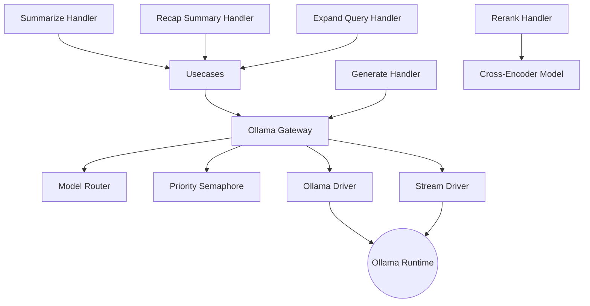

# News Creator

_Last reviewed: January 22, 2026_

**Location:** `news-creator/app`

## Role
- FastAPI service (Python 3.11+) that synthesizes article summaries and recap blurbs via an Ollama LLM while preserving Clean Architecture boundaries.
- Keeps handlers thin and testable; orchestrates summarization, recap summary generation, query expansion, and cross-encoder re-ranking.
- Addresses the `ollama` Compose profile, wired into the recap-worker pipeline and callable by ad-hoc clients via authenticated service tokens.
- **Key Capabilities**:
  - Automatic handling of large inputs via **Map-Reduce** hierarchical summarization with recursive reduce
  - **Model Bucket Routing** (12K/60K) for VRAM optimization
  - **Priority Semaphore** for streaming request prioritization
  - **Cross-Encoder Re-ranking** for RAG retrieval quality improvement
  - **Query Expansion** for diverse search coverage

## Architecture & Flow
| Layer | Components |
| --- | --- |
| Handler | `create_summarize_router`, `create_generate_router`, `create_recap_summary_router`, `create_expand_query_router`, `create_rerank_router`, `create_health_router` (FastAPI routers with Pydantic schemas). |
| Usecase | `SummarizeUsecase`, `RecapSummaryUsecase`, `ExpandQueryUsecase`, `RerankUsecase` (business logic, orchestrates prompts + metadata). |
| Port | `LLMProviderPort`, `AuthPort`, `UserPreferencesPort`, `CachePort` (ABCs for external dependencies). |
| Gateway | `OllamaGateway` adapts ports to `driver` calls. Includes `ModelRouter` (selects 12K/60K model), `OOMDetector` (handles VRAM errors), and `PrioritySemaphore` (streaming prioritization). |
| Driver | `OllamaDriver` (aiohttp client for non-streaming), `OllamaStreamDriver` (streaming support), handles retries, precision timeouts, metadata. |
| Config | `NewsCreatorConfig` (env-driven values for service secret, LLM endpoint, prompt params, thresholds). |



## Key Features

### 1. Model Bucket Routing & Optimization
To balance performance and VRAM usage on consumer GPUs (e.g., RTX 4060 Ti 16GB), the service uses a **2-Bucket System**:
- **Standard (12K Context)**: Used for normal summaries and small inputs. Default model with 24h keep-alive.
- **Large (60K Context)**: Used for massive recap tasks. Loaded on-demand with 15m keep-alive to free up resources quickly. Disabled by default (`MODEL_60K_ENABLED=false`).
- **Auto-Routing**: `ModelRouter` analyzes input token count + options to select the most efficient model automatically.
- **2x Rule**: Model switching only occurs when the bucket size difference is 2x or more, preventing frequent model swaps.

### 2. Map-Reduce Hierarchical Summarization
For extremely large inputs (multiple article clusters) that exceed the context window:
1. **Map Phase**: Splits clusters into chunks (config: `HIERARCHICAL_CHUNK_MAX_CHARS`, default ~10K chars) with 15% overlap and generates intermediate summaries in parallel.
2. **Recursive Reduce**: If intermediate summaries exceed `RECURSIVE_REDUCE_MAX_CHARS` (default ~10K), recursively reduces them (up to `RECURSIVE_REDUCE_MAX_DEPTH=3`).
3. **Final Reduce Phase**: Combines intermediate summaries into a final structured recap.
4. **Thresholds**: Triggered if input > `HIERARCHICAL_THRESHOLD_CHARS` (default ~12K) or > `HIERARCHICAL_THRESHOLD_CLUSTERS` (default 5).

### 3. Priority Semaphore for Request Prioritization
The `PrioritySemaphore` ensures streaming (on-time) requests bypass batch processing queues:
- **High Priority Queue**: Streaming requests from `alt-frontend-sv` get immediate attention.
- **Low Priority Queue**: Batch requests from `pre-processor` wait for high-priority completion.
- **Concurrency Control**: Limits concurrent Ollama requests to prevent VRAM thrashing (`OLLAMA_REQUEST_CONCURRENCY`).

### 4. Resilience & Zero-Trust
- **OOM Recovery**: `OOMDetector` catches "Out of Memory" errors or timeouts and automatically retries with a smaller model or fallback strategy.
- **Repetition Detection**: `detect_repetition()` scans outputs for loops. If detected, retries with higher `repeat_penalty` and lower `temperature`.
- **Zero-Trust Cleaning**: `html_cleaner` strips HTML tags before processing to prevent token waste and injection, even if input claims to be text.
- **Retry Logic**: Exponential backoff with jitter for transient failures (up to 3 retries).

### 5. Query Expansion (RAG Support)
For improved vector search coverage in rag-orchestrator:
- **Endpoint**: `POST /api/v1/expand-query`
- **Function**: Generates diverse query variations in Japanese and English from a user query.
- **Model**: Uses lightweight `gemma3-4b-12k` model for fast expansion.
- **Parameters**: Configurable Japanese/English variation counts.

### 6. Cross-Encoder Re-ranking (RAG Support)
Research-backed re-ranking for improved retrieval quality:
- **Endpoint**: `POST /v1/rerank`
- **Model**: `BAAI/bge-reranker-v2-m3` (multilingual, 568M params) via sentence-transformers.
- **Research Basis**: +15-30% NDCG@10 improvement (Pinecone), -35% LLM hallucinations (ZeroEntropy).
- **Lazy Loading**: Model loaded on first request to avoid startup overhead.
- **No Ollama Dependency**: Uses local cross-encoder, independent of Ollama service.

## Handlers & Contracts

### Summarization
- `POST /api/v1/summarize`
  - Request: `SummarizeRequest` (`article_id`, `content`, `stream`, `priority`)
  - Response: `SummarizeResponse` (`summary`, `model`, token counts)
  - Features: Streaming support with SSE format and heartbeat, priority-based queue bypass.
  - Validation: Rejects content < 100 characters.

### Generic Generation
- `POST /api/generate`
  - Forwards arbitrary prompts to `Gateway.generate`.

### Recap Summary
- `POST /v1/summary/generate`
  - Request: `RecapSummaryRequest` (`job_id`, `genre`, `clusters`, `genre_highlights`, `options`)
  - Response: `RecapSummaryResponse` (Structured JSON with `title`, `bullets`, `references`)
  - Features: Hierarchical map-reduce for large inputs, fallback from clusters if LLM fails.

- `POST /v1/summary/generate/batch`
  - Request: `BatchRecapSummaryRequest` (list of `RecapSummaryRequest`)
  - Response: `BatchRecapSummaryResponse` (successful responses + errors)
  - Purpose: Reduces "chatty microservices" anti-pattern by batching multiple genres.

### Query Expansion
- `POST /api/v1/expand-query`
  - Request: `ExpandQueryRequest` (`query`, `japanese_count`, `english_count`)
  - Response: `ExpandQueryResponse` (`expanded_queries`, `original_query`, `model`, `processing_time_ms`)

### Re-ranking
- `POST /v1/rerank`
  - Request: `RerankRequest` (`query`, `candidates`, `model`, `top_k`)
  - Response: `RerankResponse` (`results` with index/score, `model`, `processing_time_ms`)

### Health
- `GET /v1/health`: Checks `OllamaGateway` readiness.

## Configuration & Environment

### Core
| Variable | Default | Description |
| --- | --- | --- |
| `SERVICE_SECRET` | (required) | Authentication secret |
| `LLM_SERVICE_URL` | `http://localhost:11435` | Ollama API endpoint |
| `LLM_MODEL` | `gemma3:4b-it-qat` | Default model name |
| `LLM_TIMEOUT_SECONDS` | `300` | Request timeout (5 min) |

### Concurrency
| Variable | Default | Description |
| --- | --- | --- |
| `OLLAMA_REQUEST_CONCURRENCY` | (fallback to `OLLAMA_NUM_PARALLEL`, then 1) | Max concurrent LLM requests |

### Model Routing
| Variable | Default | Description |
| --- | --- | --- |
| `MODEL_ROUTING_ENABLED` | `true` | Enable automatic model selection |
| `MODEL_12K_NAME` | `gemma3-4b-12k` | 12K context model |
| `MODEL_60K_NAME` | `gemma3-4b-60k` | 60K context model |
| `MODEL_60K_ENABLED` | `false` | Enable 60K model (otherwise 12K-only mode) |
| `LLM_KEEP_ALIVE_12K` | `24h` | Keep-alive for 12K model |
| `LLM_KEEP_ALIVE_60K` | `15m` | Keep-alive for 60K model |
| `WARMUP_ENABLED` | `true` | Preload model on startup |

### Generation Parameters
| Variable | Default | Description |
| --- | --- | --- |
| `LLM_NUM_CTX` | `12288` | Default context window |
| `LLM_NUM_BATCH` | `1024` | Batch size (RTX 4060 optimized) |
| `LLM_NUM_PREDICT` | `1200` | Max tokens to generate |
| `LLM_TEMPERATURE` | `0.7` | Generation temperature (Gemma3 CJK optimized) |
| `LLM_REPEAT_PENALTY` | `1.15` | Repetition penalty |
| `SUMMARY_NUM_PREDICT` | `1000` | Summary-specific max tokens |

### Map-Reduce Settings
| Variable | Default | Description |
| --- | --- | --- |
| `HIERARCHICAL_THRESHOLD_CHARS` | `12000` | Trigger map-reduce above this |
| `HIERARCHICAL_THRESHOLD_CLUSTERS` | `5` | Trigger map-reduce above this count |
| `HIERARCHICAL_CHUNK_MAX_CHARS` | `10000` | Max chars per chunk |
| `HIERARCHICAL_CHUNK_OVERLAP_RATIO` | `0.15` | Overlap between chunks (15%) |
| `RECURSIVE_REDUCE_MAX_CHARS` | `10000` | Trigger recursive reduce above this |
| `RECURSIVE_REDUCE_MAX_DEPTH` | `3` | Max recursion depth |

### Resilience
| Variable | Default | Description |
| --- | --- | --- |
| `MAX_REPETITION_RETRIES` | `3` | Retry count on repetition detection |
| `REPETITION_THRESHOLD` | `0.3` | Repetition detection threshold |
| `OOM_DETECTION_ENABLED` | `true` | Enable OOM detection and recovery |

### Cache (Optional)
| Variable | Default | Description |
| --- | --- | --- |
| `CACHE_ENABLED` | `false` | Enable Redis caching |
| `CACHE_REDIS_URL` | `redis://localhost:6379/0` | Redis connection URL |
| `CACHE_TTL_SECONDS` | `86400` | Cache TTL (24 hours) |

## Integration & Data Flow
- `DependencyContainer` in `main.py` wires all components via constructor injection.
- `OllamaGateway` enforces concurrency via `PrioritySemaphore` to prevent VRAM thrashing.
- **Observability**: Structured logs with ADR 98 compliant business context (`article_id`, `job_id`, `ai_pipeline`, `processing_stage`).
- **OpenTelemetry**: Full instrumentation with `opentelemetry-instrumentation-fastapi`.
- **Metrics Logged**: `token_per_second`, `load_duration`, `prompt_eval_duration` (prefill speed), `ttft_seconds` (Time To First Token breakdown).

## Prompt Templates
- Located in `prompts/recap_summary.jinja`
- Uses Jinja2 templating with conditional logic for intermediate vs. final summaries.
- Output schema enforces JSON structure with `title`, `bullets` (3-7 items), `references`.
- Each bullet requires 4 elements: who/what, action, background, impact/future.

## Dependencies
```toml
fastapi>=0.100.0
uvicorn>=0.20.0
aiohttp>=3.9.0
pydantic>=2.0.0
jinja2>=3.1.0
json-repair>=0.27.0
bleach>=6.0.0
sentence-transformers>=3.0.0  # Cross-encoder for re-ranking
opentelemetry-sdk>=1.29.0
opentelemetry-instrumentation-fastapi>=0.50b0
```

## Operational Notes
1. **Startup**: `docker compose --profile ollama up news-creator`.
2. **Warmup**: Service attempts to ping the 12K model on boot to load weights into VRAM.
3. **Monitoring**: Watch logs for:
   - `ABNORMAL PROMPT SIZE` warnings (>100K chars)
   - `Slow LLM generation` alerts (<30 tokens/sec)
   - `COLD_START detected` warnings (load_duration > 0.1s)
4. **VRAM Management**: The service aggressively manages `keep_alive` to ensure the 60K model unloads after use, preventing OOMs during subsequent standard tasks.
5. **Testing**: `tests/` contains unit tests for handlers, usecases, and gateways. Use `SERVICE_SECRET=test-secret uv run pytest`.
6. **Re-ranking**: First rerank request may be slow due to lazy model loading (~2-5s). Subsequent requests are fast (~150ms for 50 candidates).
