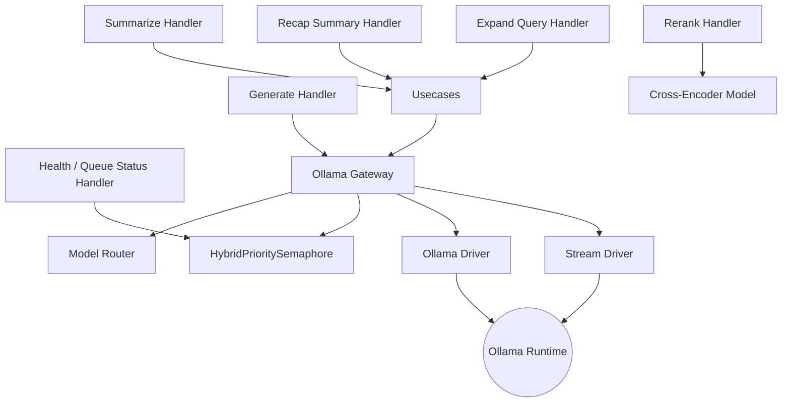

# News Creator

_Last reviewed: September 5, 2026_

**Location:** `news-creator/app`
**Port:** 11434 (plaintext FastAPI proxy, loopback-published) / 9443 (inbound mTLS, `INBOUND_MTLS=true`) / news-creator-backend `:11435` (Ollama runtime, NVIDIA GPU). The actual Ollama runtime is a separate container, `news-creator-backend` — `news-creator` never runs inference itself.

## Role
- FastAPI service (Python 3.14+) that synthesizes article summaries and recap blurbs via an Ollama LLM while preserving Clean Architecture boundaries.
- Keeps handlers thin and testable; orchestrates summarization, recap summary generation, query expansion, and cross-encoder re-ranking.
- Defined in `compose/ai.yaml` (wired via Compose `include:`, not a Compose profile), wired into the recap-worker pipeline and callable by pre-processor, acolyte-orchestrator, rag-orchestrator and recap-evaluator over the plaintext `:11434`, and by recap-worker over the mTLS `:9443` (`NEWS_CREATOR_BASE_URL=https://news-creator:9443`). `MTLS_ALLOWED_PEERS` lists recap-worker/acolyte-orchestrator/rag-orchestrator/recap-evaluator and does not include pre-processor.
- **Key Capabilities**:
  - Automatic handling of large inputs via **Map-Reduce** hierarchical summarization with recursive reduce
  - **Model Bucket Routing** (8K/60K) for VRAM optimization
  - **HybridPrioritySemaphore** for RT/BE scheduling with aging, preemption, and guaranteed bandwidth
  - **Queue Saturation Fix** (Layer 1-3) for backpressure propagation across service boundaries
  - **Cross-Encoder Re-ranking** for RAG retrieval quality improvement
  - **Query Expansion** for diverse search coverage

## Architecture & Flow
| Layer | Components |
| --- | --- |
| Handler | `create_summarize_router`, `create_generate_router`, `create_recap_summary_router`, `create_expand_query_router`, `create_rerank_router`, `create_plan_query_router`, `create_chat_router`, `create_morning_letter_router`, `create_health_router` (FastAPI routers with Pydantic schemas). |
| Usecase | `SummarizeUsecase`, `RecapSummaryUsecase`, `ExpandQueryUsecase`, `RerankUsecase`, `PlanQueryUsecase`, `MorningLetterUsecase` (business logic, orchestrates prompts + metadata). The chat proxy calls `OllamaGateway.chat_generate()` directly, with no dedicated usecase layer. |
| Port | `LLMProviderPort`, `AuthPort`, `UserPreferencesPort`, `CachePort` (ABCs for external dependencies). |
| Gateway | `OllamaGateway` adapts ports to `driver` calls. Includes `ModelRouter` (selects 8K/60K model), `OOMDetector` (handles VRAM errors), and `HybridPrioritySemaphore` (RT/BE scheduling with aging and preemption). Also provides `hold_slot()` context manager and `generate_raw()` for semaphore-aware retry loops. |
| Driver | `OllamaDriver` (aiohttp client for non-streaming), `OllamaStreamDriver` (streaming support), handles retries, precision timeouts, metadata. |
| Config | `NewsCreatorConfig` (env-driven values for LLM endpoint, model routing, prompt params, thresholds). |


```mermaid
flowchart TD
    Summarize[Summarize Handler]
    Generate[Generate Handler]
    Recap[Recap Summary Handler]
    Expand[Expand Query Handler]
    Rerank[Rerank Handler]
    Health[Health / Queue Status Handler]
    UseCase[Usecases]
    Gate[Ollama Gateway]
    Router[Model Router]
    HybridSem[HybridPrioritySemaphore]
    Driver[Ollama Driver]
    StreamDriver[Stream Driver]
    CrossEncoder[Cross-Encoder Model]
    Ollama((Ollama Runtime))

    Summarize --> UseCase
    Recap --> UseCase
    Expand --> UseCase
    UseCase --> Gate
    Gate --> Router
    Gate --> HybridSem
    Gate --> Driver --> Ollama
    Gate --> StreamDriver --> Ollama
    Generate --> Gate
    Rerank --> CrossEncoder
    Health --> HybridSem
```

## Key Features

### 1. Model Bucket Routing & Optimization
The code supports a **2-Bucket System** to balance performance and VRAM usage (`MODEL_ROUTING_ENABLED`, default `true`):
- **Standard (8K Context)**: Used for normal summaries and small inputs. Default model (`MODEL_8K_NAME`, code default `gemma4-e4b-q4km`) with 24h keep-alive.
- **Large (60K Context)**: Used for massive recap tasks. Default model `MODEL_60K_NAME` (`gemma4-e4b-60k`), loaded on-demand with 15m keep-alive. Disabled by default (`MODEL_60K_ENABLED=false`).
- **RAG query model**: A separate `MODEL_RAG_QUERY_NAME` (default `gemma4-e4b-12k`) is used for query expansion and query planning, independent of the summarization buckets.
- **Auto-Routing**: `ModelRouter` analyzes input token count + options to select the most efficient model automatically.
- **2x Rule**: Model switching only occurs when the bucket size difference is 2x or more, preventing frequent model swaps.
- **Currently deployed default is single-model, routing off**: `compose/ai.yaml` sets `MODEL_ROUTING_ENABLED=false` and pins `LLM_MODEL=gemma4-e4b-12k` — the same model and `LLM_NUM_CTX=12288` that acolyte-orchestrator and the Ask Augur proxy use, so the one shared Ollama runner never reloads weights when alternating between callers (see the "Single shared model + COLD_START" failure pattern below).
- `LLM_NUM_GPU` (default `99`) is always sent explicitly in the Ollama `options`; Ollama only forwards `--n-gpu-layers` when `num_gpu` is present in the request, and without it llama.cpp auto-splits layers across CPU/GPU — gemma4 aborts at load in that configuration.

### 2. Map-Reduce Hierarchical Summarization
For extremely large inputs (multiple article clusters) that exceed the context window:
1. **Map Phase**: Splits clusters into chunks (config: `HIERARCHICAL_CHUNK_MAX_CHARS`, default ~6K chars / ~1.5K tokens) with 15% overlap and generates intermediate summaries in parallel.
2. **Recursive Reduce**: If intermediate summaries exceed `RECURSIVE_REDUCE_MAX_CHARS` (default ~6K), recursively reduces them (up to `RECURSIVE_REDUCE_MAX_DEPTH=3`).
3. **Final Reduce Phase**: Combines intermediate summaries into a final structured recap.
4. **Thresholds**: Triggered if input > `HIERARCHICAL_THRESHOLD_CHARS` (default ~8K) or > `HIERARCHICAL_THRESHOLD_CLUSTERS` (default 5).

### 3. HybridPrioritySemaphore for RT/BE Scheduling
The `HybridPrioritySemaphore` replaces the original `PrioritySemaphore` with a research-backed hybrid scheduler:
- **Reserved Slots**: RT (streaming) requests get dedicated reserved slots (`SCHEDULING_RT_RESERVED_SLOTS=1`). BE (batch) requests use remaining slots.
- **Aging Mechanism**: BE requests waiting longer than `SCHEDULING_AGING_THRESHOLD_SECONDS` (60s) get progressively boosted priority, preventing starvation.
- **Priority Promotion**: BE requests promoted to RT queue after `SCHEDULING_PRIORITY_PROMOTION_THRESHOLD_SECONDS` (120s) to guarantee they complete before upstream timeouts (300s).
- **Guaranteed Bandwidth**: After `SCHEDULING_GUARANTEED_BE_RATIO` (5) consecutive RT releases, the next slot is forcibly given to a BE request (80% RT / 20% BE guaranteed).
- **Application-Level Preemption**: When no RT slots are available and RT requests are queued, the oldest BE request receives a cancel signal (`PreemptedException`), freeing a slot for the RT request.
- **RT Scheduling Mode**: Configurable FIFO (default) or LIFO (`SCHEDULING_RT_MODE=lifo`). LIFO optimizes for swipe-feed UIs where the user's current view should get priority.
- **Queue Depth Limit**: `MAX_QUEUE_DEPTH` (10) rejects new requests with `QueueFullError` when the queue is full, enabling backpressure propagation (see Queue Saturation Fix).
- **Leak Detection**: Tracks acquired slots and warns if any slot is held longer than 5 minutes.
- **References**: [Hybrid RT/BE Scheduling](https://arxiv.org/html/2504.09590v1), [LLM Performance Request Queueing](https://huggingface.co/blog/tngtech/llm-performance-request-queueing), [QLLM Preemption](https://arxiv.org/html/2503.09304v1).

### 4. Resilience & Zero-Trust
- **OOM Recovery**: `OOMDetector` catches "Out of Memory" errors or timeouts and automatically retries with a smaller model or fallback strategy.
- **Repetition Detection**: `detect_repetition()` scans outputs for loops. If detected, retries with higher `repeat_penalty` and lower `temperature`.
- **Zero-Trust Cleaning**: `html_cleaner` strips HTML tags before processing to prevent token waste and injection, even if input claims to be text.
- **Retry Logic**: Exponential backoff with jitter for transient failures (up to 3 retries).

### 5. Query Expansion (RAG Support)
For improved vector search coverage in rag-orchestrator:
- **Endpoint**: `POST /api/v1/expand-query`
- **Function**: Generates diverse query variations in Japanese and English from a user query.
- **Model**: Uses `MODEL_RAG_QUERY_NAME` (default `gemma4-e4b-12k`); the same model backs query planning for Ask Augur.
- **Parameters**: Configurable Japanese/English variation counts.

### 6. Cross-Encoder Re-ranking (RAG Support)
Research-backed re-ranking for improved retrieval quality:
- **Endpoint**: `POST /v1/rerank`
- **Model**: `BAAI/bge-reranker-v2-m3` (multilingual, 568M params) via sentence-transformers.
- **Research Basis**: +15-30% NDCG@10 improvement (Pinecone), -35% LLM hallucinations (ZeroEntropy).
- **Lazy Loading**: Model loaded on first request to avoid startup overhead.
- **No Ollama Dependency**: Uses local cross-encoder, independent of Ollama service.

### 7. Queue Saturation Fix (Layer 1-3)
A multi-layer backpressure mechanism that prevents unbounded queue growth and propagates overload signals across service boundaries:

**Layer 1 - QueueFullError + MAX_QUEUE_DEPTH (news-creator)**:
- `HybridPrioritySemaphore` enforces `MAX_QUEUE_DEPTH=10`. When the combined RT+BE queue exceeds this limit and no slot is immediately available, `QueueFullError` is raised.
- Summarize handler catches `QueueFullError` and returns **HTTP 429** with `Retry-After: 30` header.

**Layer 2 - hold_slot() + generate_raw() (news-creator)**:
- `OllamaGateway.hold_slot()` is an async context manager that acquires the semaphore **once** and holds it for the entire retry loop.
- `OllamaGateway.generate_raw()` performs LLM generation **without** re-acquiring the semaphore (used inside `hold_slot()`).
- This prevents retries from re-entering the queue (previously retries waited 3500s+ in the queue again).
- `SummarizeUsecase` uses `hold_slot()` + `generate_raw()` for repetition-detection retry loops.

**Layer 3 - ErrServiceOverloaded propagation (pre-processor, Go)**:
- `summarizer_api.go` driver detects HTTP 429 from news-creator and returns `domain.ErrServiceOverloaded`.
- `summarize_queue_worker.go` checks for `ErrServiceOverloaded` and immediately aborts the current batch, skipping remaining jobs.
- `job_handler.go` configures exponential backoff via `orchestrator.JobRunner`: initial interval 15s, max backoff 5min, triggered on `ErrServiceOverloaded`.
- Normal polling interval (10s) is restored on the next successful `ProcessQueue`.

### 8. Distributed BE Dispatch (opt-in, disabled by default)
`DistributingGateway` decorates `OllamaGateway`. When `DISTRIBUTED_BE_ENABLED=true`:
- BE (batch, `priority=low`) `hold_slot()` requests are intercepted and dispatched to a healthy remote Ollama instance from `DISTRIBUTED_BE_REMOTES`, **bypassing the local `HybridPrioritySemaphore` entirely**.
- RT (`priority=high`) requests always stay on the local instance — `chat_generate()` and `generate()` are never distributed.
- `RemoteHealthChecker` polls remotes on `DISTRIBUTED_BE_HEALTH_INTERVAL_SECONDS` (default 30s); an unhealthy remote is skipped for `DISTRIBUTED_BE_COOLDOWN_SECONDS` (default 60s).
- Remote model defaults to `DISTRIBUTED_BE_REMOTE_MODEL` (`gemma4-e4b-q4km`); `DISTRIBUTED_BE_MODEL_OVERRIDES` allows a per-remote override.
- When disabled, or when every remote is unhealthy, behavior is identical to using `OllamaGateway` directly (all requests stay local).

## Handlers & Contracts

### Summarization
- `POST /api/v1/summarize`
  - Request: `SummarizeRequest` (`article_id`, `content`, `stream`, `priority`)
  - Response: `SummarizeResponse` (`summary`, `model`, token counts)
  - Features: Streaming support with SSE format and heartbeat, priority-based queue bypass.
  - Validation: Rejects content < 100 characters.

### Generic Generation
- `POST /api/generate`
  - Forwards arbitrary prompts to `Gateway.generate`.

### Recap Summary
- `POST /v1/summary/generate`
  - Request: `RecapSummaryRequest` (`job_id`, `genre`, `clusters`, `genre_highlights`, `options`)
  - Response: `RecapSummaryResponse` (Structured JSON with `title`, `bullets`, `references`)
  - Features: Hierarchical map-reduce for large inputs, fallback from clusters if LLM fails.

- `POST /v1/summary/generate/batch`
  - Request: `BatchRecapSummaryRequest` (list of `RecapSummaryRequest`)
  - Response: `BatchRecapSummaryResponse` (successful responses + errors)
  - Purpose: Reduces "chatty microservices" anti-pattern by batching multiple genres.

### Query Expansion
- `POST /api/v1/expand-query`
  - Request: `ExpandQueryRequest` (`query`, `japanese_count`, `english_count`)
  - Response: `ExpandQueryResponse` (`expanded_queries`, `original_query`, `model`, `processing_time_ms`)

### Re-ranking
- `POST /v1/rerank`
  - Request: `RerankRequest` (`query`, `candidates`, `model`, `top_k`)
  - Response: `RerankResponse` (`results` with index/score, `model`, `processing_time_ms`)

### Query Planning
- `POST /api/v1/plan-query`
  - Request: `PlanQueryRequest` (`query`, `conversation_history`, `article_id`)
  - Response: `PlanQueryResponse` (`plan`, `original_query`, `model`, `processing_time_ms`)
  - Caller: rag-orchestrator's `QueryPlannerClient` (Ask Augur). Classifies intent and produces a structured `QueryPlan` via `/api/chat` with thinking enabled (HIGH priority by default), falling back to a heuristic plan on LLM failure.

### Chat Proxy
- `POST /api/chat`
  - Proxies Ollama's `/api/chat` through `HybridPrioritySemaphore`. Used by Ask Augur answer generation (rag-orchestrator's `OllamaGenerator`) and by rag-orchestrator's morning-letter feature — both call this proxy instead of Ollama directly so batch summarization jobs cannot monopolize the GPU (PM-2026-006).
  - Defaults to HIGH priority for non-streaming calls (`chat_generate`); streaming calls are always high priority.

### Queue Status
- `GET /queue/status`
  - Response: `{ rt_queue, be_queue, total_slots, available_slots, accepting, max_queue_depth, acquired_slots }`
  - Purpose: Backpressure monitoring. The `accepting` field indicates whether the service will accept new requests (based on queue depth vs. `MAX_QUEUE_DEPTH`). Used by upstream callers (e.g., pre-processor) to implement client-side throttling.

### Health
- `GET /health`: Cheap liveness only, no upstream I/O — always returns `{"status": "healthy", ...}`. Used by the compose healthcheck.
- `GET /health/deep`: Dependency reachability — probes `OllamaGateway.list_models()`. Compose probes must not hit this path.

### Morning Letter
- `POST /v1/morning-letter/generate`
  - Request: `MorningLetterRequest` / Response: `MorningLetterResponse` (`MorningLetterUsecase`).
  - Document-first morning briefing generation, independent of the summarize/recap paths above.

## Configuration & Environment

### Core
Inbound auth is mTLS peer identity, not a shared secret — there is no `SERVICE_SECRET` in this
service's config. `INBOUND_MTLS=true` binds an additional in-process mTLS listener on `:9443`
(`INBOUND_MTLS_PORT`); `:11434` stays plaintext and is always bound (published loopback-only in
`compose/ai.yaml`). The caller identity on the mTLS listener is the verified client certificate CN,
checked against `MTLS_ALLOWED_PEERS` (default
`recap-worker,acolyte-orchestrator,rag-orchestrator,recap-evaluator`). The allowlist is captured but
not enforced: `PeerIdentityMiddleware` is constructed with `strict=False` hardcoded (`main.py:239`)
and news-creator has no env var to flip it, unlike acolyte-orchestrator's `PEER_IDENTITY_STRICT`.
`PEER_IDENTITY_TRUSTED=off` is a separate switch that governs only whether a sidecar-injected
`X-Alt-Peer-Identity` header is honoured.

| Variable | Default | Description |
| --- | --- | --- |
| `LLM_SERVICE_URL` | `http://localhost:11435` | Ollama API endpoint |
| `LLM_MODEL` | `gemma4-e4b-q4km` | Default model name (compose overrides to `gemma4-e4b-12k`) |
| `LLM_TIMEOUT_SECONDS` | `300` | Request timeout (5 min) |
| `LLM_NUM_GPU` | `99` | GPU offload layers sent explicitly in every request; without it gemma4 aborts at load |

### Concurrency
| Variable | Default | Description |
| --- | --- | --- |
| `OLLAMA_NUM_PARALLEL` | `1` (set in `entrypoint-backend.sh`, matched in `compose/ai.yaml`) | Ollama parallel request slots; also used as fallback for request concurrency |
| `OLLAMA_REQUEST_CONCURRENCY` | (fallback to `OLLAMA_NUM_PARALLEL`, then 1) | Max concurrent LLM requests (overrides `OLLAMA_NUM_PARALLEL` if set) |

### Model Routing
| Variable | Default | Description |
| --- | --- | --- |
| `MODEL_ROUTING_ENABLED` | `true` | Enable automatic model selection (compose overrides to `false` — see 2-Bucket note above) |
| `MODEL_BASE_NAME` | `gemma4-e4b-q4km` | Base/default model when routing picks neither bucket |
| `MODEL_8K_NAME` | `gemma4-e4b-q4km` | 8K context model |
| `MODEL_60K_NAME` | `gemma4-e4b-60k` | 60K context model |
| `MODEL_RAG_QUERY_NAME` | `gemma4-e4b-12k` | Model for query expansion + query planning (independent of the buckets above) |
| `MODEL_60K_ENABLED` | `false` | Enable 60K model (otherwise 8K-only mode) |
| `LLM_KEEP_ALIVE_8K` | `24h` | Keep-alive for 8K model |
| `LLM_KEEP_ALIVE_60K` | `15m` | Keep-alive for 60K model |
| `WARMUP_ENABLED` | `true` | Preload model on startup |

### Distributed BE Dispatch
| Variable | Default | Description |
| --- | --- | --- |
| `DISTRIBUTED_BE_ENABLED` | `false` | Dispatch BE (`priority=low`) requests to a remote Ollama instance, bypassing the local semaphore; RT always stays local |
| `DISTRIBUTED_BE_REMOTES` | (empty) | Remote Ollama URLs to dispatch to |
| `DISTRIBUTED_BE_HEALTH_INTERVAL_SECONDS` | `30` | Remote health-poll interval |
| `DISTRIBUTED_BE_TIMEOUT_SECONDS` | `300` | Per-request timeout on a remote |
| `DISTRIBUTED_BE_COOLDOWN_SECONDS` | `60` | Skip an unhealthy remote for this long |
| `DISTRIBUTED_BE_REMOTE_MODEL` | `gemma4-e4b-q4km` | Model requested on the remote |
| `DISTRIBUTED_BE_MODEL_OVERRIDES` | (empty) | Per-remote model override map |

### Generation Parameters
| Variable | Default | Description |
| --- | --- | --- |
| `LLM_NUM_CTX` | `8192` | Default context window |
| `LLM_NUM_BATCH` | `1024` | Batch size (tuned for the deployed consumer GPU; see the private hardware note) |
| `LLM_NUM_PREDICT` | `1200` | Max tokens to generate |
| `LLM_TEMPERATURE` | `0.7` | Generation temperature (CJK optimized) |
| `LLM_REPEAT_PENALTY` | `1.15` | Repetition penalty |
| `SUMMARY_NUM_PREDICT` | `1000` | Summary-specific max tokens |

### Map-Reduce Settings
| Variable | Default | Description |
| --- | --- | --- |
| `HIERARCHICAL_THRESHOLD_CHARS` | `8000` | Trigger map-reduce above this (~2K tokens, reduced for 8K-only) |
| `HIERARCHICAL_THRESHOLD_CLUSTERS` | `5` | Trigger map-reduce above this count |
| `HIERARCHICAL_CHUNK_MAX_CHARS` | `6000` | Max chars per chunk (~1.5K tokens, fits in 8K context) |
| `HIERARCHICAL_CHUNK_OVERLAP_RATIO` | `0.15` | Overlap between chunks (15%) |
| `RECURSIVE_REDUCE_MAX_CHARS` | `6000` | Trigger recursive reduce above this (~1.5K tokens, safe for 8K context) |
| `RECURSIVE_REDUCE_MAX_DEPTH` | `3` | Max recursion depth |

### Resilience
| Variable | Default | Description |
| --- | --- | --- |
| `MAX_REPETITION_RETRIES` | `2` | Retry count on repetition detection |
| `REPETITION_THRESHOLD` | `0.3` | Repetition detection threshold |
| `OOM_DETECTION_ENABLED` | `true` | Enable OOM detection and recovery |

### Cache (Optional)
| Variable | Default | Description |
| --- | --- | --- |
| `CACHE_ENABLED` | `false` | Enable Redis caching |
| `CACHE_REDIS_URL` | `redis://localhost:6379/0` | Redis connection URL |
| `CACHE_TTL_SECONDS` | `86400` | Cache TTL (24 hours) |

### Scheduling & Backpressure
| Variable | Default | Description |
| --- | --- | --- |
| `SCHEDULING_RT_RESERVED_SLOTS` | `1` | Slots reserved exclusively for RT (streaming) requests |
| `SCHEDULING_RT_MODE` | `fifo` | RT queue ordering: `fifo` (default) or `lifo` (swipe-feed optimization) |
| `SCHEDULING_AGING_THRESHOLD_SECONDS` | `60.0` | Time after which BE priority begins boosting |
| `SCHEDULING_AGING_BOOST` | `0.5` | Priority boost factor applied after aging threshold |
| `SCHEDULING_PREEMPTION_ENABLED` | `true` | Enable application-level preemption for RT priority |
| `SCHEDULING_PREEMPTION_WAIT_THRESHOLD_SECONDS` | `2.0` | Min RT queue wait before triggering preemption |
| `SCHEDULING_PRIORITY_PROMOTION_THRESHOLD_SECONDS` | `120.0` | BE promoted to RT queue after this wait (must be < backend timeout 300s) |
| `SCHEDULING_GUARANTEED_BE_RATIO` | `5` | Force BE after this many consecutive RT releases (0 to disable) |
| `MAX_QUEUE_DEPTH` | `10` | Reject new requests with QueueFullError/HTTP 429 when queue exceeds this |

## Integration & Data Flow
- `DependencyContainer` in `main.py` wires all components via constructor injection.
- `OllamaGateway` enforces concurrency via `HybridPrioritySemaphore` to prevent VRAM thrashing.
- **Observability**: Structured logs with ADR 98 compliant business context (`article_id`, `job_id`, `ai_pipeline`, `processing_stage`).
- **OpenTelemetry**: Full instrumentation with `opentelemetry-instrumentation-fastapi`.
- **Metrics Logged**: `token_per_second`, `load_duration`, `prompt_eval_duration` (prefill speed), `ttft_seconds` (Time To First Token breakdown).

## Prompt Templates
- Located in `prompts/recap_summary.jinja`
- Uses Jinja2 templating with conditional logic for intermediate vs. final summaries.
- Output schema enforces JSON structure with `title`, `bullets` (3-7 items), `references`.
- Each bullet requires 4 elements: who/what, action, background, impact/future.

## Dependencies
```toml
fastapi>=0.135.0
uvicorn>=0.20.0
aiohttp>=3.14.3
pydantic>=2.12.5
jinja2>=3.1.0
json-repair>=0.27.0
nh3>=0.3.6  # HTML sanitizer (replaces bleach) for Zero-Trust Cleaning
sentence-transformers>=3.0.0  # Cross-encoder for re-ranking
opentelemetry-sdk>=1.29.0
opentelemetry-instrumentation-fastapi>=0.50b0
```

## Operational Notes
1. **Startup**: `docker compose -f compose/compose.yaml -p alt up -d news-creator news-creator-backend`.
2. **Warmup**: Service attempts to ping the 8K model on boot to load weights into VRAM.
3. **Monitoring**: Watch logs for:
   - `ABNORMAL PROMPT SIZE` warnings (>100K chars)
   - `Slow LLM generation` alerts (<30 tokens/sec)
   - `COLD_START detected` warnings (load_duration > 0.1s)
4. **VRAM Management**: The service aggressively manages `keep_alive` to ensure the 60K model unloads after use, preventing OOMs during subsequent standard tasks.
5. **Testing**: `tests/` contains unit tests for handlers, usecases, and gateways. Run with `uv run pytest`.
6. **Re-ranking**: First rerank request may be slow due to lazy model loading (~2-5s). Subsequent requests are fast (~150ms for 50 candidates).

## Known failure patterns

Distilled from postmortems and ADRs; see [[crystallized-knowledge]] §8 (LLM / GPU / Ollama) for the full pattern class.

- **HybridPrioritySemaphore slot leaks (4 independent paths)**: RT requests block while the GPU sits idle, or `SLOT INVARIANT VIOLATION` logs appear → preempted slots migrated pools without ownership tracking, `call_soon_threadsafe` raced future cancellation, and slots "in transit" to a cancelled waiter were never reclaimed → PM-2026-012/013/014/015, [[000601]] [[000606]] [[000610]] [[000612]]. Track `home_pool`/`slot_id` explicitly; CancelledError handlers must reclaim transferred slots.
- **Semaphore bypass is forbidden**: chat success rate 0% (300s timeouts) while batch summaries completed → rag-orchestrator called the inference server directly, so batch jobs monopolized the Ollama FIFO → every shared-GPU client must go through the `/api/chat` proxy at HIGH priority → PM-2026-006.
- **Ollama options mismatch causes model reload ping-pong**: chat TTFT up to 259s → chat and batch carried different `options` (num_batch etc.), forcing runner reconfiguration per request → all LLM paths share base options via `config.get_llm_options()`, callers only overlay specifics → PM-2026-008.
- **Single shared model + COLD_START**: TTFT degrades 0.65s → 100s+ on any model switch → with `OLLAMA_MAX_LOADED_MODELS=1`, a model-name mismatch anywhere (default, env, hardcode, stale binary) triggers a swap; PM-2026-014 saw 610 COLD_STARTs from an un-rebuilt pre-processor → [[000151]] [[000152]].
- **Queue saturation needs all 3 layers**: retries re-entered the queue and waited 3500s+ → downstream 429 + Retry-After, `hold_slot()` during retry loops, and upstream exponential backoff exist because each alone was insufficient → [[000185]]. Degenerate output (whitespace-only) must be classified non-retryable or GPU time is burned forever → [[000203]] [[000214]].
- **`.env` drift silently overrides compose defaults**: stale `OLLAMA_NUM_PARALLEL` / old model names in `.env` negated fixes shipped via compose → audit `.env` vs compose defaults after wiring changes → PM-2026-013/014, [[000609]].
- **Outbound mTLS enforcement vs plain-HTTP listener asymmetry**: recap-worker with `https_only(true)` failed before sending because news-creator's listener was plain HTTP → pair `MTLS_ENFORCE` changes with server-side mTLS on every callee; assert URL schemes at startup → PM-2026-033.
