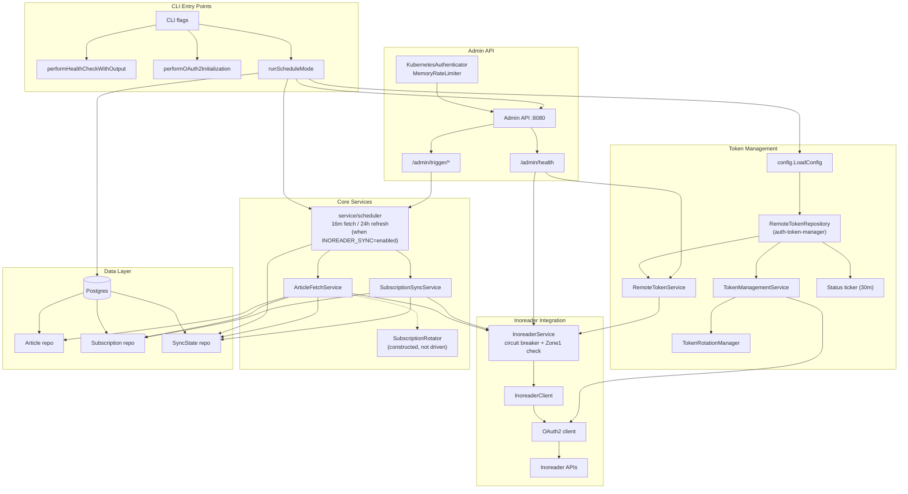

# Pre-processor Sidecar

_Last reviewed: September 5, 2026_

**Location:** `pre-processor-sidecar/app`

## Purpose
- Orchestrates Inoreader ingestion for the pre-processor by pairing a scheduler loop with a resilient OAuth2 token system (`cmd/main.go`, `service/simple_token_service.go`).
- Bridges a token repository (file-backed in the shipped Compose config; the code also supports a Kubernetes Secret) with `auth-token-manager` so Inoreader calls stay within quota while rotating tokens safely (`service/token_management_service.go`, `repository`).
- Provides HTTP hooks (`/admin/oauth2/*`, `/admin/trigger/*`, `/admin/health`) for observability, manual fetch/sync runs, and token status without restarting the process (`handler/admin_api_handler.go`, `handler/health_handler.go`, `cmd/main.go`).

## Execution Modes & CLI
- `--health-check`: runs `performHealthCheckWithOutput` (config validation, DB connectivity, auth-token-manager and OAuth2 reachability), prints the result as JSON, and exits non-zero unless the overall status is `healthy` (`cmd/health_check.go`).
- `--oauth2-init`: waits for the Linkerd proxy (`ProxyInitWait`), pings Postgres with retries, and exits (`performOAuth2Initialization`).
- No flag or `--schedule-mode`: both run `runScheduleMode`, which starts the scheduler, token rotation monitoring, and the admin API, then stays in the foreground until SIGINT/SIGTERM. The flag only adds a startup log line; it does not change which loops run.

## Architecture Overview
`runScheduleMode` wires together configuration, remote token access, the Inoreader scheduler, token rotation monitoring, and the admin HTTP surface. The diagram below summarizes the live data paths.

## Configuration & Secrets
- `INOREADER_SYNC` (`enabled` / `disabled`) gates the scheduler outright: `scheduler.ParseSyncMode` treats an unset variable as `enabled` (the historical default), but `compose/workers.yaml` sets `INOREADER_SYNC=${INOREADER_SYNC:-disabled}` — so **as shipped, Inoreader sync is off**. With `disabled`, `Scheduler.Start` logs `inoreader_sync_disabled` and returns before either ticker is created, and `/admin/trigger/article-fetch` / `/subscription-sync` both return `ErrSyncDisabled` instead of running (`service/scheduler/scheduler.go`, `cmd/main.go`). All cadence and quota figures below describe the service only when `INOREADER_SYNC=enabled`.
- `config.LoadConfig()` layers service metadata, DB, Inoreader endpoints, proxy settings, rate limits, OAuth2 details, HTTP client tuning, retry/circuit breaker parameters, monitoring flags, and rotation/content guards (`config/config.go`).
- Token storage respects `TOKEN_STORAGE_TYPE` (defaults to `kubernetes_secret`) plus overrides for `TOKEN_STORAGE_PATH`. Kubernetes mode also uses `OAUTH2_TOKEN_SECRET_NAME`.
- `ENABLE_SECRET_WATCH` causes `SimpleTokenService` to watch both the Kubernetes secret and configured token repository so tokens are reloaded without API calls when `auth-token-manager` rotates them.
- Rotation and batch behavior are controlled via `ROTATION_INTERVAL_MINUTES`, `MAX_DAILY_ROTATIONS`, `BATCH_SIZE`, and the rotation sub-config (`config.Rotation`), while content processing toggles (`CONTENT_EXTRACTION_ENABLED`, `CONTENT_TRUNCATION_ENABLED`, etc.) live in `config.Content`.
- Proxy/environment overrides (`HTTPS_PROXY`, `NO_PROXY`) and client-sensitive env vars (`INOREADER_CLIENT_ID`, `INOREADER_CLIENT_SECRET`, optional `INOREADER_REFRESH_TOKEN`, `PRE_PROCESSOR_SIDECAR_DB_PASSWORD`) are loaded either directly from secrets or from files (`getSecretOrEnv` helper).

## Scheduler & Rotation
- `service/scheduler` is the only scheduling authority. `cmd/main.go` builds it with `scheduler.NewScheduler(syncStateRepo, subscriptionSyncService, articleFetchService, logger)` and starts it with `scheduler.DefaultConfig()`: a 16‑minute article-fetch ticker (~90 of the 100 daily Zone1 requests) and a 24‑hour subscription-refresh ticker — provided `INOREADER_SYNC=enabled` (see Configuration & Secrets; compose ships with it `disabled`).
- Each fetch tick takes the `SyncState` with the oldest `last_sync` (`SyncStateRepository.GetOldestOne`), calls `ArticleFetchService.FetchArticles(ctx, streamID, 100)`, and persists the continuation token. Each refresh tick calls `SubscriptionSyncService.SyncSubscriptionsNew`.
- The `/admin/trigger/*` endpoints call `TriggerFetchNow` / `TriggerRefreshNow` on that same scheduler. Manual and ticker-driven runs share `fetchRunMu` / `refreshRunMu`, so they can never overlap and double-spend the daily quota; a trigger that arrives during a run returns HTTP 409 and a skipped tick logs a warning.
- `ArticleFetchService` delegates UUID resolution to `usecase.ArticleUUIDResolutionUseCase`, filters to Tier1, and writes via `ArticleRepository.CreateBatch`. If any article on a page fails to persist, the continuation token is held so the page is refetched, while `last_sync` still advances so the scheduler does not pin itself to one stream. Permanently unresolvable articles are dropped, logged individually, and counted in `DroppedUnresolvable`.
- `SubscriptionRotator` (`ROTATION_INTERVAL_MINUTES`, `MAX_DAILY_ROTATIONS`, timezone-aware day reset, shuffling, batch slicing) is constructed by `ArticleFetchService`, but no live path enables it: `rotationEnabled` stays `false`, and the rotation entry points on `ArticleFetchService` have no callers in the running binary. Rotation is inert — treat the rotation env vars as configured-but-unused until something drives it.
- `SubscriptionSyncService.SyncSubscriptionsNew` saves subscriptions (`subscriptionRepo.SaveSubscriptions`), ensures sync state rows exist, refreshes the in-memory cache used for UUID lookups, and keeps stats (`SubscriptionSyncStats`) for observability and metrics.

## Rate Limiting
There is no rate-limit manager component. Three mechanisms bound Inoreader usage:
1. **Scheduler cadence** — when `INOREADER_SYNC=enabled`, the 16‑minute fetch ticker plus the 24‑hour refresh ticker is what actually keeps the service inside the 100 requests/day Zone1 budget, and the fetch/refresh mutexes stop admin triggers from adding concurrent calls. With the compose default (`disabled`), neither ticker runs and there is nothing to bound.
2. **`InoreaderService.CheckAPIRateLimit`** — refuses a call once `Zone1Usage` reaches `Zone1Limit` minus a 10-request safety buffer, checked before every subscription-list and stream-contents fetch.
3. **`utils.CircuitBreaker`** — 3 consecutive failures open the breaker, 60 s later it moves to HALF_OPEN, 2 successes close it. Wraps `FetchSubscriptions` and `FetchStreamContents`.

Caveat worth knowing before relying on (2): `Zone1Usage` never advances in the running binary. `UpdateAPIUsageFromHeaders` is a no-op that always returns `nil`, so the local fallback increment never fires, and `processAPIUsageHeaders` — the only writer of both `updateRateLimitInfoFromHeaders` and the Postgres `api_usage_tracking` rows — has no callers. The counter therefore stays at 0 and the check always allows. Cadence, not accounting, is the live guard.

The Admin API has its own, unrelated limiter: `security.MemoryRateLimiter` at 5 requests/hour per client.

## Token Lifecycle & Recovery
- `SimpleTokenService` initializes `InMemoryTokenManager`, `RecoveryManager`, and optional `OAuth2SecretService`. It prefers the configured repository, falls back to Kubernetes secret or env vars, enables secret watching (`onSecretUpdate`/`ReloadFromSecret`), and logs all refresh/health events with structured metadata (`service/simple_token_service.go`).
- The `TokenManagementService` wraps that system for the scheduler: it loads tokens, applies a 30‑minute `refreshBuffer`, validates only when <2 hours from expiry, retries refresh up to three times (longer backs off on rate limits), and deduplicates refreshes using `golang.org/x/sync/singleflight`. It also tracks metrics such as refresh counts, single-flight hits, and rotation detection (`service/token_management_service.go`).
- `TokenRotationManager` keeps an eye on rotation health by proactively refreshing every 10 minutes, running a more extensive health check every 30 minutes, flagging tokens that expire within 30 minutes, and exposing `RotationHealthStatus` for dashboards (`service/token_rotation_manager.go`).
- Admin traffic reaches the token system through `RemoteAdminTokenManager` (`cmd/main.go`), a thin adapter over `RemoteTokenService`: `/admin/oauth2/token-status` reports remote-managed status, while `/admin/oauth2/refresh-token` is rejected outright — rotation is owned by `auth-token-manager`, not by this service.

## Admin API & Security Controls
- The Admin API runs on `:8080` with `/admin/oauth2/refresh-token`, `/admin/oauth2/token-status`, `/admin/health`, `/admin/trigger/article-fetch`, and `/admin/trigger/subscription-sync` handlers (`handler/admin_api_handler.go`, `handler/health_handler.go`, `cmd/main.go`). The trigger endpoints are wrapped in `RequireAdmin`, so they share the authenticator, rate limiter, and HTTPS enforcement of the rest of the surface.
- Access requires Kubernetes service account tokens validated by `security.KubernetesAuthenticator` (checks JWT claims, CA-based signing, and known admin subjects/namespaces) and rate limiting via `security.MemoryRateLimiter`. This is a vestigial path from an earlier Kubernetes deployment: `KubernetesAuthenticator` reads its CA certificate from `/var/run/secrets/kubernetes.io/serviceaccount/ca.crt` by default, `compose/workers.yaml` mounts no such file and sets none of the `SERVICE_ACCOUNT_*_PATH` overrides, so `initialize()` fails at startup in the shipped Compose deployment and every Admin API request is rejected as unauthenticated — the trigger endpoints are effectively unreachable unless that path is wired up separately.
- Inputs, especially refresh tokens, pass through `security.OWASPInputValidator`, which enforces regex patterns, controls SQL/XSS/path traversal threats, strips control characters, and escapes HTML entities before token updates are accepted.
- `SimpleAdminAPIMetricsCollector` logs request durations, rate limit hits, and auth failures so the admin surface is observable without a full metrics stack.

## Observability & Monitoring
- Structured JSON logs include fields such as `component`, `interval`, `subscription_sync_interval`, `article_fetch_interval`, `token_status`, error reasons, and rotation stats; the status ticker logs `SimpleTokenService.GetServiceStatus()` every 30 minutes (`cmd/main.go`).
- `utils.Monitor` (used by `InoreaderService`) instruments API requests, circuit breaker transitions, article processing, and token refreshes; `SimpleTokenService` reports metrics through `SimpleServiceStatus`.
- The scheduler logs every run: stream id, articles found, new articles saved, whether a continuation token remains, and a warning when a tick is skipped because a fetch or refresh is already in progress.
- `ArticleFetchService` logs each dropped article with its reason and each held continuation token, so quota burn and data loss are diagnosable from the log stream alone.

## Operational Runbook
1. Run `go run ./cmd --health-check` (or `cmd/main.go --health-check`) after deployments to verify config, DB connectivity, and OAuth2 readiness.
2. Use `cmd/main.go --oauth2-init` once per environment to bootstrap tokens, waiting ~10 seconds for Linkerd and ensuring Postgres is reachable.
3. `runScheduleMode` keeps the scheduler, token rotation monitoring, and admin API in the foreground until SIGINT/SIGTERM, with or without `--schedule-mode`.
4. Manual triggers are available via `POST http://<pod>:8080/admin/trigger/article-fetch` and `/subscription-sync` (JSON responses include timestamps).
5. Rotate `auth-token-manager` secrets by writing to the Kubernetes secret referenced by `OAUTH2_TOKEN_SECRET_NAME`; `ENABLE_SECRET_WATCH=true` instructs `SimpleTokenService` to reload immediately (`onSecretUpdate` avoids calling Inoreader APIs during rotation).
6. Check logs for `TOKEN_REFRESH`, `SECRET_UPDATED`, and `rate limit hit` warnings; the latter suggests bumping `MAX_DAILY_ROTATIONS` or lengthening `CheckInterval`.

## Testing & Tooling
- `GO_TEST`: `go test ./...` exercises unit tests, mocks (`mocks/`), and logic under `service/`, `handler/`, `repository/`, `security/`.
- Integration coverage lives in `test/` (e.g., `token_rotation_integration_test.go`, `configuration_integration_test.go`, `monitoring_integration_test.go`, `integration_test.go`) to exercise DB-backed flows.
- When dependencies change, regenerate mocks with `make generate-mocks`; tests rely on clean `mockgen` artifacts under `mocks/`.

## Security & Compliance
- Admin access is gated by `security.KubernetesAuthenticator`, `MemoryRateLimiter`, and OWASP-aware sanitization; `MemoryRateLimiter` enforces 5 requests/hour by default.
- Secrets and tokens stay out of logs (`security/sanitizer.go` and `utils.Sanitizer` ensure sensitive fields are removed).
- Circuit breaker (`utils.CircuitBreaker`) around `InoreaderService` stops hammering the API during outages; the Zone1 safety buffer is applied by `InoreaderService.CheckAPIRateLimit` (see Rate Limiting for why the counter behind it is inert).

## Known failure patterns

Cross-cutting incident patterns are catalogued in [[runbooks/crystallized-knowledge]].

- Inoreader ingestion silently stopped for 65 hours → a non-atomic write during disk exhaustion truncated `oauth2_token.env` to 0 bytes; auth-token-manager returned 404 and the circuit breaker flapped OPEN↔HALF_OPEN forever. Token persistence must be tmpfile + rename + fsync → PM-2026-043.
- Health check reported `token_manager_available: true` throughout that outage → "process is up" and "responses are correct" are separate responsibilities; opaque string errors block both tests and alerts — use typed sentinels (`ErrTokenUnavailable`) and expose functional health (`/admin/health` with `ingestion_silent`) → PM-2026-043.
- Duplicate feeds reappeared after a dedupe fix → zero-trust URL normalization was applied at `RegisterFeeds` but not on the sidecar ingestion route; normalization must run at save time on every write path → [[000049]] [[000052]].
- Long TTD is structural for this service → the sidecar is a supplemental, low-frequency path, so failures surface only via user reports; staleness metrics (e.g. `last_sync` age) are required, not optional ("unused features rot") → PM-2026-043.

## LLM Notes
- Mention `SimpleTokenService`, `TokenManagementService`, and `TokenRotationManager` when summarizing token logic; include env names `ENABLE_SECRET_WATCH`, `OAUTH2_TOKEN_SECRET_NAME`, `MAX_DAILY_ROTATIONS`, `ROTATION_INTERVAL_MINUTES`, `BATCH_SIZE`, `INOREADER_CLIENT_ID`, `INOREADER_CLIENT_SECRET`, `INOREADER_REFRESH_TOKEN`, `HTTPS_PROXY`, and `NO_PROXY` so prompts resolve to the right switches.
- Point at `service/scheduler` as the single scheduling authority: both the ticker loops and the `/admin/trigger/*` endpoints run through it, and its 16‑minute cadence owns the steady ~90-request/day budget — only when `INOREADER_SYNC=enabled`; the shipped compose default is `disabled`, which stops the tickers and makes `/admin/trigger/*` return `ErrSyncDisabled`. `SubscriptionRotator` exists but nothing drives it, so do not describe rotation as an active path.
