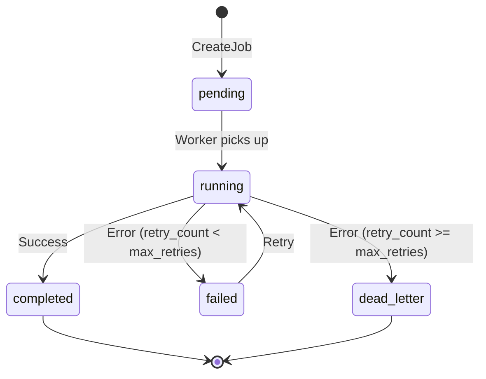

# Pre-processor

_Last reviewed: February 28, 2026_

**Location:** `pre-processor/app`

## What it does
- **Go 1.24 Clean Architecture service** that wires Echo handlers, repository adapters, and drivers around a rich background-job loop defined in `main.go` and `handler/job_handler.go`.
- **HTTP surface** exposes synchronous (`POST /api/v1/summarize`), streaming (`POST /api/v1/summarize/stream`), asynchronous queue (`POST /api/v1/summarize/queue` / `GET /api/v1/summarize/status/:job_id`), and health endpoints plus a one-off `--health-check` CLI flag used in readiness probes.
- **Connect-RPC surface** exposes summarization and job status via gRPC/Connect protocol on a separate port for internal service-to-service communication.
- **Redis Streams consumer** listens for `ArticleCreated` and `SummarizeRequested` events, enabling event-driven article processing.
- **LLM orchestration** funnels every summary request (sync, stream, queue worker, batch summarizer, quality gate) through `news-creator`, applying zero-trust sanitation at the handler, worker, and driver levels before material reaches the model.
- **Background jobs** keep article ingestion, summarization, and quality monitoring in sync with Postgres tables (`articles`, `article_summaries`, `summarize_job_queue`) while a dedicated queue worker drives retries.
- **Quality gating** uses the `qualitychecker` helper to score summaries with another Ollama prompt and automatically deletes low‑quality entries, re-fetching the article from the web for reprocessing.

## Architecture & flow

| Component | Reference |
| --- | --- |
| HTTP API layer | `handler/summarize_handler.go`, `handler/health_handler.go`, Echo middleware and request logging. |
| Connect-RPC layer | `connect/v2/server.go`, `connect/v2/preprocessor/handler.go`, HTTP/2 with h2c for internal RPC. |
| Redis Streams consumer | `consumer/redis_consumer.go`, `consumer/event_handler.go`, consumer group pattern with auto-claiming. |
| Repository + driver | `driver/backend_api/` (Connect-RPC client for articles, feeds, summaries via alt-backend)、`driver/*` (Postgres for job queue + Inoreader tables)、`repository/*` (news-creator HTTP calls, `summarize_job_queue` access, `ArticleSummarizerAPIClient`/`StreamArticleSummarizerAPIClient`). |
| Background orchestration | `handler/job_handler.go` launches summarization, quality check, article sync, and queue worker loops; `service/*` implements the business logic. |
| External clients | `repository/external_api_repository.go` wraps `news-creator`, `alt-backend`, and `qualitychecker`, while `service/http_client_factory.go` + `utils/http_client_manager.go` centralize HTTP configuration and optional Envoy routing. |
| Health & metrics | `service/health_checker.go` vets `news-creator` before jobs run; `service/health_metrics.go` keeps SLA/error rate counters for internal diagnostics. |

```mermaid
flowchart TB
    subgraph HTTPLayer["HTTP Layer"]
        direction LR
        Client[Client / RecapWorker]
        API["Echo HTTP API"]
        Handler["SummarizeHandler"]
        Client -->|POST /summarize*| API --> Handler
    end

    subgraph ConnectRPCLayer["Connect-RPC Layer"]
        direction LR
        InternalService[Internal Services]
        ConnectServer["Connect-RPC Server\n(port 9202)"]
        ConnectHandler["PreProcessorService"]
        InternalService -->|gRPC/Connect| ConnectServer --> ConnectHandler
    end

    subgraph RedisStreamsLayer["Redis Streams Layer"]
        direction LR
        RedisStreams[(Redis Streams\nalt:events:articles)]
        Consumer["Redis Consumer"]
        EventHandler["EventHandler"]
        RedisStreams -->|XREADGROUP| Consumer --> EventHandler
    end

    subgraph QueueSystem["Queue System"]
        direction LR
        Queue[(summarize_job_queue)]
        QueueWorker["SummarizeQueueWorker"]
        Queue --> QueueWorker
        QueueWorker -->|status updates| Queue
    end

    subgraph BackgroundJobs["Background Jobs"]
        direction LR
        ArticleSummarizer["Batch summarizer\n(10s)"]
        QualityChecker["Quality checker\n(5m)"]
        ArticleSync["Article sync\n(hourly)"]
    end

    subgraph HealthGate["Health Gate"]
        HealthChecker["HealthChecker"]
    end

    subgraph External["External Services"]
        direction LR
        NewsCreator["news-creator"]
        AltBackend["alt-backend"]
        Inoreader["Inoreader"]
    end

    subgraph DataLayer["Data Layer"]
        AltBackendAPI["alt-backend\n(Internal API :9101)"]
        Postgres[(Postgres\njob queue + inoreader)]
    end

    %% HTTP flow
    Handler -->|articles/feeds/summaries| AltBackendAPI
    Handler -->|job queue| Postgres
    Handler -->|queue job| Queue
    Handler -->|LLM calls| NewsCreator

    %% Connect-RPC flow
    ConnectHandler -->|articles/feeds/summaries| AltBackendAPI
    ConnectHandler -->|job queue| Postgres
    ConnectHandler -->|queue job| Queue
    ConnectHandler -->|LLM calls| NewsCreator

    %% Redis Streams flow
    EventHandler -->|queue job| Queue

    %% Queue worker flow
    QueueWorker -->|writes summary| Postgres
    QueueWorker -->|LLM calls| NewsCreator

    %% Background jobs
    ArticleSummarizer -->|pull unsummarized| Postgres
    ArticleSummarizer -->|LLM calls| NewsCreator
    QualityChecker -->|fetch/delete| Postgres
    QualityChecker -->|score| NewsCreator
    ArticleSync -->|inoreader tables| Postgres
    ArticleSync -->|articles/summaries| AltBackendAPI
    ArticleSync -->|system user| AltBackend

    %% Health gating
    HealthChecker -->|healthy?| NewsCreator
    HealthChecker -->|ready| ArticleSummarizer & QualityChecker & QueueWorker

    %% Styling
    style Client fill:#e1f5fe,stroke:#01579b,color:#01579b
    style API fill:#e1f5fe,stroke:#01579b,color:#01579b
    style Handler fill:#e1f5fe,stroke:#01579b,color:#01579b

    style InternalService fill:#e3f2fd,stroke:#1565c0,color:#1565c0
    style ConnectServer fill:#e3f2fd,stroke:#1565c0,color:#1565c0
    style ConnectHandler fill:#e3f2fd,stroke:#1565c0,color:#1565c0

    style RedisStreams fill:#ffebee,stroke:#c62828,color:#c62828
    style Consumer fill:#ffebee,stroke:#c62828,color:#c62828
    style EventHandler fill:#ffebee,stroke:#c62828,color:#c62828

    style Queue fill:#fff3e0,stroke:#e65100,color:#e65100
    style QueueWorker fill:#fff3e0,stroke:#e65100,color:#e65100

    style ArticleSummarizer fill:#e8f5e9,stroke:#2e7d32,color:#2e7d32
    style QualityChecker fill:#e8f5e9,stroke:#2e7d32,color:#2e7d32
    style ArticleSync fill:#e8f5e9,stroke:#2e7d32,color:#2e7d32

    style HealthChecker fill:#fce4ec,stroke:#c2185b,color:#c2185b

    style NewsCreator fill:#ede7f6,stroke:#512da8,color:#512da8
    style AltBackend fill:#ede7f6,stroke:#512da8,color:#512da8
    style Inoreader fill:#ede7f6,stroke:#512da8,color:#512da8

    style Postgres fill:#eceff1,stroke:#455a64,color:#455a64
```

## HTTP surface

- **POST /api/v1/summarize** (`handler/summarize_handler.go`):
  - Requires `article_id`; `content`/`title` optional. Missing text is fetched from Postgres, passed through `html_parser.ExtractArticleText`, and re-extracted if `<`/`>` linger.
  - All requests use the same `models.Article` → `repository.ExternalAPIRepository.SummarizeArticle`, which duplicates the HTML clean-up before `news-creator`.
  - The response always returns the Japanese summary and saves it to `article_summaries` (`summaryRepo.Create`), but saves are non-blocking—failure is logged and the user still receives the summary.

- **POST /api/v1/summarize/stream**:
  - Mirrors the synchronous handler's validation but streams using `repo.StreamSummarizeArticle`.
  - Responds with `text/event-stream; charset=utf-8`, `Cache-Control: no-cache`, and `X-Accel-Buffering: no` so Nginx/Envoy flushes chunks immediately.
  - Uses a 128-byte buffer, flushes after every chunk, and logs the first few chunks for debugging.
  - `driver.ErrContentTooShort` (content < 100 characters after extraction) becomes `400 Bad Request` with a human-friendly message.

- **POST /api/v1/summarize/queue** and **GET /api/v1/summarize/status/:job_id**:
  - The queue endpoint stores a job in `summarize_job_queue` (`repository.SummarizeJobRepository.CreateJob`) and returns `202 Accepted` with a UUID job ID.
  - Status responses expose `summary`, `error_message`, and the current `status` (`pending`, `running`, `completed`, `failed`, `dead_letter`).
  - The backend uses `UpdateJobStatus` to set `started_at`, `completed_at`, and `retry_count` safely inside a `ReadCommitted` transaction; pending jobs are constantly polled with `FOR UPDATE SKIP LOCKED`.

- **GET /api/v1/health**:
  - Lightweight handler defined directly in `main.go` that returns `{"status":"healthy"}`. The `--health-check` flag hits this endpoint and exits 0/1 for container probes.

## Connect-RPC surface

The Connect-RPC server provides an alternative interface for internal service-to-service communication using gRPC/Connect protocol.

| Setting | Value |
| --- | --- |
| Port | `9202` (default, configurable via `CONNECT_PORT`) |
| Protocol | HTTP/2 with h2c (cleartext HTTP/2) |
| Path | `/connect/v2/` |
| Service | `PreProcessorService` |

**Endpoints:**

- **Summarize**: Synchronous summarization via Connect protocol
- **StreamSummarize**: Server-streaming summarization
- **QueueSummarize**: Queue a job for async processing
- **GetJobStatus**: Check status of a queued job

**Health check:**

- `GET /health` returns `{"status":"healthy","service":"connect-rpc"}`

The server is created in `connect/v2/server.go` and uses `h2c.NewHandler` to support HTTP/2 without TLS for internal cluster communication.

## Redis Streams consumer

The Redis Streams consumer enables event-driven article processing, listening for events published by other services.

| Setting | Default |
| --- | --- |
| Package | `consumer/` |
| Stream key | `alt:events:articles` |
| Consumer group | `pre-processor-group` |
| Batch size | 10 |
| Block timeout | 5s |
| Claim idle time | 30s |
| Enabled | `false` (opt-in) |

**Event types:**

| Event | Payload | Action |
| --- | --- | --- |
| `ArticleCreated` | `article_id`, `user_id`, `feed_id`, `title`, `url`, `published_at` | Queue article for summarization |
| `SummarizeRequested` | `article_id`, `user_id`, `title`, `streaming` | Process summarization request |

**Consumer group pattern:**

- Uses `XREADGROUP` with consumer groups for at-least-once delivery
- Failed messages remain pending and can be claimed by other consumers after `ClaimIdleTime`
- Successfully processed messages are acknowledged with `XACK`
- Unknown event types are silently ignored (logged at debug level)

## Background jobs

| Job | Purpose | Schedule | Notes |
| --- | --- | --- | --- |
| Article synchronization (`service/article_sync_service.go`) | Reads Inoreader rows from the last 24 hours, sanitizes with `utils.Sanitizer`, requires a non-empty title, tags them with the system user (`externalAPIRepo.GetSystemUserID`), and upserts into `articles`. | Once on startup, then every hour (ticker in `jobHandler.runArticleSyncLoop`). | Relies on Alt backend's `/v1/internal/system-user`. |
| Batch summarizer (`service/article_summarizer.go`) | Pulls unsummarized articles via `articleRepo.FindForSummarization`, runs `news-creator`, writes summaries, and inserts a Japanese placeholder when content is too short. | Ticker every 10 seconds. | Waits for `HealthChecker.WaitForHealthy` before starting. |
| Quality checker (`service/quality_checker.go`) | Streams summaries plus source through `qualitychecker.JudgeArticleQuality`, deletes summaries scoring < 7, and optionally re-fetches the article URL for reprocessing. | Ticker every 5 minutes. | Tracks `RemovedCount` / `RetainedCount` and waits for `news-creator` to be healthy first. |
| Summarize queue worker (`service/summarize_queue_worker.go`) | Pulls pending UUID jobs in batches of 40, sanitizes again, calls `news-creator`, stores each summary, and flips job statuses to `running` → `completed`/`failed`. | Ticker every 10 seconds (`jobHandler.runSummarizeQueueLoop`). | Job loop also waits for `news-creator` health and keeps logging durations. |
| Feed processor | Fully disabled for ethical compliance—`feedProcessorService.ProcessFeeds` short-circuits and logs the same message that the job handler also logs before the goroutine would have started. |

## Async queue & job state

The queue job table `summarize_job_queue` stores:

- UUID `job_id`, `article_id`, `status` (`pending`, `running`, `completed`, `failed`, `dead_letter`), `summary`, `error_message`, `retry_count`, `max_retries`, `started_at`, `completed_at`.
- `CreateJob` inserts a pending row and returns the UUID; `GetPendingJobs` selects pending rows ordered by `created_at` with `FOR UPDATE SKIP LOCKED`.
- `SummarizeQueueWorker` flips a job to `running`, enforces HTML extraction, and sends the article to `news-creator` via `ExternalAPIRepository`.
- On success it writes the summary to `article_summaries`, updates the job to `completed`, and records the duration. On failure it increments `retry_count` and records the error message (`max_retries` defaults to 3 via config).
- Jobs that exceed `max_retries` are moved to `dead_letter` status and will not be retried.
- The status handler returns `summary` when available and `error_message` when a job terminally failed, so callers can decide whether to retry.

**Job state machine:**

**Helper methods** (`models/summarize_job.go`):

| Method | Description |
| --- | --- |
| `IsTerminal()` | Returns `true` if status is `completed`, `failed`, or `dead_letter` |
| `CanRetry()` | Returns `true` if status is `failed` and `retry_count < max_retries` |

## Zero trust & sanitization

Every summary path re-extracts text to make sure no HTML reaches the LLM:

1. `SummarizeHandler` runs `html_parser.ExtractArticleText` inside handler logic, re-extracts if `<`/`>` remain, and only uses plain text for the `models.Article`.
2. `SummarizeQueueWorker` doubles down with the same extractor before calling the repository.
3. `driver.ArticleSummarizerAPIClient`/`StreamArticleSummarizerAPIClient` re-run extraction and enforce a hard minimum of 100 characters (`ErrContentTooShort`).
4. `ArticleSyncService` sanitizes Inoreader payloads via `utils.Sanitizer.SanitizeHTMLAndTrim` before saving.

Short articles trigger a Japanese placeholder summary inside `ArticleSummarizerService` and a `400` (sync/stream) or a failed job (queue) elsewhere.

## Quality gating

`QualityCheckerService` relies on `qualitychecker.JudgeArticleQuality` to:

- Send a strict prompt (`JudgeTemplate` with `modelName = "gemma3-4b-16k"`) to `http://news-creator:11434/api/generate`.
- Parse the `<score>X</score>` response, falling back to regex extraction and an "emergency" parser. `scoreSummaryWithRetry` retries up to three times with 500ms backoff; connection errors are skipped to avoid false deletions.
- Consider scores < 7 as failures, delete the summary inside a `RepeatableRead` transaction (`tx.Exec DELETE FROM article_summaries`), and re-fetch the original article via an HTTP GET with `User-Agent: Mozilla/5.0 (compatible; AltBot/1.0; +https://alt.example.com/bot)`.
- Track `RemovedCount` vs `RetainedCount` to see how often low scores hit production.

## Article synchronization

`ArticleSyncService`:

- Fetches Inoreader records created in the past 24 hours (`since := time.Now().Add(-24 * time.Hour)`).
- Sanitizes with `utils.Sanitizer` and skips articles that lose their title or content.
- Adds the `system` user (cached from `alt-backend`'s `/v1/internal/system-user`) before calling `articleRepo.UpsertArticles`.
- Logs every decision so operators can trace why an article was skipped.

## Data Access Mode (ADR-000241)

`bootstrap/wire.go` が `BACKEND_API_URL` 環境変数で動作モードを自動判定:
- **API モード**: `driver/backend_api/` の Connect-RPC クライアントが articles, feeds, article_summaries を alt-backend Internal API 経由で操作。`readSecret()` ヘルパーで Docker Secrets からトークン読み込み
- **Legacy DB モード** (未設定): 従来の PostgreSQL 直接アクセス

**注意**: API モードでも `summarize_job_queue` と `inoreader_articles` テーブルへの DB 直接アクセスは維持。これらは pre-processor 固有のテーブルであり alt-backend の管轄外 (ADR-000244 参照)。

## Dependencies & health gating

- **Postgres** hosts `summarize_job_queue` and Inoreader テーブル (`inoreader_articles` 等)。articles, feeds, article_summaries は `BACKEND_API_URL` 設定時に alt-backend Internal API 経由でアクセス。Repositories live under `repository/` and rely on `driver/db_*` helpers.
- **news-creator** (`NEWS_CREATOR_HOST`, default `http://news-creator:11434`): summarization (`/api/v1/summarize`), streaming, and quality scoring (`/api/generate`). `HealthChecker` polls `/health`, requires `models` array, and gates job startup.
- **alt-backend** (`ALT_BACKEND_HOST`, default `http://alt-backend:8080`) only for `externalAPIRepo.GetSystemUserID`.
- **Redis Streams** (`REDIS_STREAMS_URL`, default `redis://redis-streams:6379`): event-driven article processing when `CONSUMER_ENABLED=true`.
- **Envoy** (optional when `USE_ENVOY_PROXY=true`): handled by `service/http_client_factory.go`, which switches between direct and proxy clients for job loops and health checks.
- **Rate limiting & retries**: `utils.DomainRateLimiter` enforces at least 5s between hits to the same domain; `retry` helpers wrap HTTP calls with exponential backoff.
- `HealthMetricsCollector` (configured with SLA target 99.9%) powers `handler/health_handler.go` for internal diagnostics and keeps error rate / latency info for Go telemetry.

## Configuration

| Env var | Purpose | Default |
| --- | --- | --- |
| `HTTP_PORT` | Port for the Echo server and health-check CLI | `9200` |
| `CONNECT_PORT` | Port for the Connect-RPC server | `9202` |
| `HTTP_TIMEOUT`, `HTTP_MAX_IDLE_CONNS`, `HTTP_MIN_CONTENT_LENGTH`, `HTTP_ENABLE_BROWSER_HEADERS`, `HTTP_USER_AGENT_ROTATION` | HTTP client tuning for feed, queue, and summarizer calls | Various defaults in `config/types.go` (`30s`, `10`, `500`, `true`, `true`). |
| `USE_ENVOY_PROXY`, `ENVOY_PROXY_URL`, `ENVOY_PROXY_PATH`, `ENVOY_TIMEOUT` | Route through Envoy for observability and shared certificates | Disabled by default; URL `http://envoy-proxy.alt-apps.svc.cluster.local:8080`. |
| `NEWS_CREATOR_HOST`, `NEWS_CREATOR_API_PATH`, `NEWS_CREATOR_MODEL`, `NEWS_CREATOR_TIMEOUT` | Target news-creator endpoints | `http://news-creator:11434`, `/api/v1/summarize`, `gemma3:4b`, `600s`. |
| `SUMMARIZE_QUEUE_WORKER_INTERVAL`, `SUMMARIZE_QUEUE_MAX_RETRIES`, `SUMMARIZE_QUEUE_POLLING_INTERVAL` | Tuning for the queue worker loop and retry accounting (`max_retries` populates `summarize_job_queue`). | `10s`, `3`, `5s`. |
| `ALT_BACKEND_HOST`, `ALT_BACKEND_TIMEOUT` | Source for the cached system user | `http://alt-backend:8080`, `10s`. |
| `BACKEND_API_URL` | alt-backend Internal API URL (設定時は API モード) | - |
| `SERVICE_TOKEN_FILE` | サービス認証トークンファイル (Docker Secrets) | - |
| `REDIS_STREAMS_URL` | Redis connection URL for event consumer | `redis://redis-streams:6379` |
| `CONSUMER_GROUP` | Consumer group name for Redis Streams | `pre-processor-group` |
| `CONSUMER_NAME` | Consumer instance name within the group | `pre-processor-1` |
| `CONSUMER_ENABLED` | Enable Redis Streams consumer | `false` |
| `RETRY_*`, `RATE_LIMIT_*` | Exponential retry/backoff and domain pacing | Defaults in `config/types.go` (`MaxAttempts=3`, `Backoff=2.0`, `DefaultInterval=5s`, `BurstSize=1`). |
| `DLQ_*` | File-based dead letter queue paths/timeouts (the DLQ helper lives in `dlq/file_dlq.go`). | Base `/var/dlq/pre-processor`, `timeout 10s`, `retry_enabled true`. |
| `METRICS_*` | Metrics exporter defaults (enabled, port `9201`, path `/metrics`, update interval `10s`). | `true`, `9201`, `/metrics`. |

## Observability & resilience

- **Structured logging:** `utils/logger` wraps `slog`, so every handler and job logs context (`article_id`, `job_id`, durations).
- **Health metrics:** `service.HealthMetricsCollector` tracks logs per second, average latency, error rate, memory, SLA compliance (99.9%), and exposes alerts for high error rates, memory, or goroutine spikes. `handler/health_handler.go` wires these metrics into helper methods used internally and in tests.
- **HTTP client management:** `utils.HTTPClientManager` shares optimized clients (`SummaryClient` timeout 120s, `FeedClient` timeout 15s), while `service.HTTPClientFactory` builds Envoy-aware clients whenever the config flips `USE_ENVOY_PROXY`.
- **Rate limiting & retries:** `utils.DomainRateLimiter` holds 5s intervals, `retry.Retrier` applies exponential backoff, and SQL transactions use `ReadCommitted` with `FOR UPDATE SKIP LOCKED`.
- **Quality scoring:** `qualitychecker` includes emergency parsing and fallback heuristics so a missing `<score>` still yields a deletion decision.
- **Health gating:** `jobHandler` only starts summarization/quality/queue loops after `HealthChecker.WaitForHealthy`, protecting the service from hitting `news-creator` while it's still warming up.
- **Readiness probe:** Running `pre-processor --health-check` pings `/api/v1/health` and exits non-zero if the handler is unreachable.

## Operational runbook

1. Start the stack (`altctl up` or `docker compose up`). Pre-processor binds to `HTTP_PORT` (default `9200`) and `CONNECT_PORT` (default `9202`), logs `Starting background jobs`, and waits for news-creator before launching summarization, quality, and queue loops.
2. Submit jobs:
   - `curl -X POST http://localhost:9200/api/v1/summarize/queue -d '{"article_id":"abc"}'` to queue and see the 202 response with `job_id`.
   - `curl http://localhost:9200/api/v1/summarize/status/<job_id>` to follow lifecycle; inspect logs for `processing queued summarization jobs`.
   - Use `curl -N` against `/api/v1/summarize/stream` to confirm SSE behavior.
3. Monitor job logs for keywords (`processing summarization job`, `removed low quality summary`, `article sync job stopped`, `Summarization job completed`) to diagnose delays.
4. Check `news-creator` health separately (`http://localhost:11434/health`) and confirm models appear in the `models` array.
5. Optionally run `pre-processor --health-check` in the container to mirror readiness probes.
6. For Connect-RPC health: `curl http://localhost:9202/health` should return `{"status":"healthy","service":"connect-rpc"}`.

## Testing & validation

- Unit and integration tests live under `handler/`, `service/`, `repository/`, and `quality-checker/`. Run `go test ./...` from `pre-processor/app`.
- `make generate-mocks` refreshes GoMock fixtures when repository interfaces change.
- Synthetic regression: queue a job via `curl`, then run `SELECT * FROM summarize_job_queue` to confirm `status` transitions and `summary` persistence.

## Known constraints / TODOs

- Feed processing is explicitly disabled for ethical compliance: `jobHandler.runFeedProcessingLoop` and `feedProcessorService.ProcessFeeds` only log that the job was skipped.
- `metrics/collector.go` contains a JSON/Prometheus server, but the collector is not wired into `main.go`.
- `handler/job_scheduler.go` can schedule arbitrary intervals, yet no jobs are registered in `main.go` today.
- `dlq/file_dlq.go` and the `DLQConfig` exist for writing failed articles to disk, but nothing currently instantiates that manager; the setter remains available for future ingestion work.
