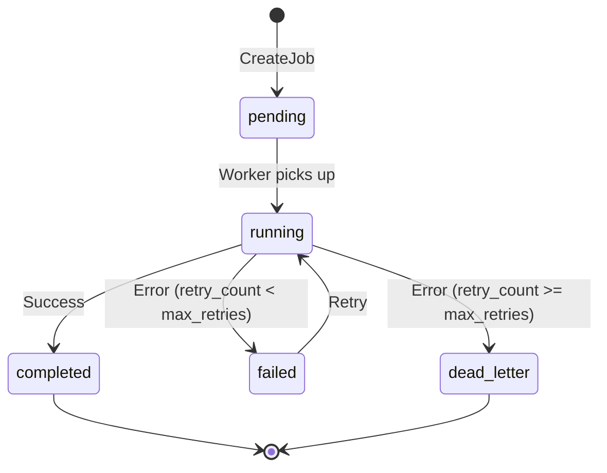

# Pre-processor

_Last reviewed: September 5, 2026_

**Location:** `pre-processor/app`

## What it does
- **Go 1.26 Clean Architecture service** that wires Echo handlers, repository adapters, and drivers around a background-job loop started from `bootstrap.Run` (`main.go` delegates to `bootstrap/lifecycle.go`, jobs live in `handler/job_handler.go`).
- **HTTP surface** exposes synchronous (`POST /api/v1/summarize`), streaming (`POST /api/v1/summarize/stream`), asynchronous queue (`POST /api/v1/summarize/queue` / `GET /api/v1/summarize/status/:job_id`), and health endpoints plus a one-off `--health-check` CLI flag used in readiness probes.
- **Connect-RPC surface** exposes summarization and job status via gRPC/Connect protocol — a plaintext h2c listener for in-cluster callers plus an optional mTLS HTTPS listener (`MTLS_LISTEN=true`) for internal service-to-service communication.
- **Redis Streams consumer** listens for `ArticleCreated` and `SummarizeRequested` events, enabling event-driven article processing, with a DLQ stream for messages that exceed their max delivery count.
- **LLM orchestration** funnels every summary request (sync, stream, queue worker, quality gate) through `news-creator`, applying zero-trust sanitation at the handler, worker, and driver levels before material reaches the model.
- **Background jobs** keep article ingestion, the summarize job queue, and quality monitoring moving: article sync/backfill and repository calls go out to **alt-data-hub** over mTLS Connect-RPC (ADR-000954), while `summarize_job_queue`, the Inoreader staging tables, and `notification_outbox` live in the dedicated `pre-processor-db` Postgres instance.
- **Quality gating** uses the `qualitychecker` helper to score summaries with another Ollama prompt and automatically deletes low‑quality entries, re-fetching the article from the web for reprocessing.
- **Notification relay** drains a `notification_outbox` table (written when a job completes) and forwards "summary ready" notifications to alt-data-hub at least once, on its own 15s loop.

## Architecture & flow

| Component | Reference |
| --- | --- |
| HTTP API layer | `handler/summarize_handler.go`, `handler/health_handler.go`, Echo middleware and request logging. |
| Connect-RPC layer | `connect/v2/server.go`, `connect/v2/preprocessor/handler.go`, HTTP/2 h2c on `CONNECT_PORT` (default `9202`) plus an optional mTLS HTTPS listener on `MTLS_PORT` (default `9443`, `bootstrap/server.go`). |
| Redis Streams consumer | `consumer/redis_consumer.go`, `consumer/dlq.go`, `consumer/event_handler.go`, consumer group pattern with auto-claiming and DLQ routing after `CONSUMER_MAX_DELIVERIES`. |
| Repository + driver | `driver/backend_api/` — despite the package name, this is a Connect-RPC client for **alt-data-hub**'s `services.datahub.v1.DataHubService` (articles, feeds, summaries, system user; the move off `alt-backend` is ADR-000954, though the shipped namespace `services.datahub.v1` differs from D7's decided `alt.datahub.v1` — the docs here follow the code, not the ADR text); `driver/*` (pgx pool for `pre-processor-db`: job queue, Inoreader staging tables, notification outbox); `repository/*` (news-creator HTTP calls, `summarize_job_queue` access, `ArticleSummarizerAPIClient`/`StreamArticleSummarizerAPIClient`). |
| Background orchestration | `handler/job_handler.go` launches article sync, backfill, the summarize-queue enqueue sweep, quality check, the queue worker, and the notification relay; `service/*` implements the business logic. |
| External clients | `repository/external_api_repository.go` wraps `news-creator`, **alt-data-hub**, and `qualitychecker`, while `service/http_client_factory.go` + `utils/http_client_manager.go` centralize HTTP configuration and optional Envoy routing. |
| Health & metrics | `service/health_checker.go` vets `news-creator` before jobs run; `service/health_metrics.go` keeps SLA/error rate counters; `metrics/collector.go` runs a dedicated Prometheus listener (`METRICS_PORT`, default `9201`) that startup fails without. |
| PKI / mTLS | `internal/pki/` handles step-ca enrollment (`bootstrap/lifecycle.go` calls `startEnrollment` before building dependencies) and the shared ops listener (`/health`, `/metrics`) used by all three split alt-backend binaries' peers. |

```mermaid
flowchart TB
    subgraph HTTPLayer["HTTP Layer"]
        direction LR
        Client[Client / RecapWorker]
        API["Echo HTTP API\n(:9200)"]
        Handler["SummarizeHandler"]
        Client -->|POST /summarize*| API --> Handler
    end

    subgraph ConnectRPCLayer["Connect-RPC Layer"]
        direction LR
        InternalService[Internal Services]
        ConnectServer["Connect-RPC Server\nh2c :9202 / mTLS :9443"]
        ConnectHandler["PreProcessorService"]
        InternalService -->|gRPC/Connect| ConnectServer --> ConnectHandler
    end

    subgraph RedisStreamsLayer["Redis Streams Layer"]
        direction LR
        RedisStreams[(Redis Streams\nalt:events:articles)]
        Consumer["Redis Consumer"]
        EventHandler["EventHandler"]
        DLQ[(DLQ stream)]
        RedisStreams -->|XREADGROUP| Consumer --> EventHandler
        Consumer -->|max deliveries exceeded| DLQ
    end

    subgraph QueueSystem["Queue System"]
        direction LR
        Queue[(summarize_job_queue)]
        QueueWorker["SummarizeQueueWorker\n(10s, batches of 10)"]
        Queue --> QueueWorker
        QueueWorker -->|status updates| Queue
    end

    subgraph BackgroundJobs["Background Jobs"]
        direction LR
        EnqueueSweep["Enqueue sweep\n(5m safety net)"]
        QualityChecker["Quality checker\n(5m)"]
        ArticleSync["Article sync\n(hourly, watermark cursor)"]
        Backfill["Backfill empty feeds\n(hourly)"]
        NotificationRelay["Notification relay\n(15s)"]
    end

    subgraph HealthGate["Health Gate"]
        HealthChecker["HealthChecker"]
    end

    subgraph External["External Services"]
        direction LR
        NewsCreator["news-creator"]
        DataHub["alt-data-hub"]
        Inoreader["Inoreader"]
    end

    subgraph DataLayer["Data Layer"]
        DataHubAPI["alt-data-hub\nDataHubService (mTLS :9443)"]
        Postgres[(pre-processor-db\njob queue + inoreader + outbox)]
    end

    %% HTTP flow
    Handler -->|articles/feeds/summaries| DataHubAPI
    Handler -->|job queue| Postgres
    Handler -->|queue job| Queue
    Handler -->|LLM calls| NewsCreator

    %% Connect-RPC flow
    ConnectHandler -->|articles/feeds/summaries| DataHubAPI
    ConnectHandler -->|job queue| Postgres
    ConnectHandler -->|queue job| Queue
    ConnectHandler -->|LLM calls| NewsCreator

    %% Redis Streams flow
    EventHandler -->|queue job| Queue

    %% Queue worker flow
    QueueWorker -->|writes summary| DataHubAPI
    QueueWorker -->|LLM calls| NewsCreator

    %% Background jobs
    EnqueueSweep -->|enqueue unsummarized| Queue
    EnqueueSweep -->|pull unsummarized| DataHubAPI
    QualityChecker -->|fetch/delete| DataHubAPI
    QualityChecker -->|score| NewsCreator
    ArticleSync -->|inoreader tables| Postgres
    ArticleSync -->|articles/summaries + system user| DataHubAPI
    Backfill -->|inoreader tables| Postgres
    Backfill -->|articles + system user| DataHubAPI
    NotificationRelay -->|claim/mark| Postgres
    NotificationRelay -->|forward notification| DataHubAPI

    %% Health gating
    HealthChecker -->|healthy?| NewsCreator
    HealthChecker -->|ready| EnqueueSweep & QualityChecker & QueueWorker

    %% Styling
    style Client fill:#e1f5fe,stroke:#01579b,color:#01579b
    style API fill:#e1f5fe,stroke:#01579b,color:#01579b
    style Handler fill:#e1f5fe,stroke:#01579b,color:#01579b

    style InternalService fill:#e3f2fd,stroke:#1565c0,color:#1565c0
    style ConnectServer fill:#e3f2fd,stroke:#1565c0,color:#1565c0
    style ConnectHandler fill:#e3f2fd,stroke:#1565c0,color:#1565c0

    style RedisStreams fill:#ffebee,stroke:#c62828,color:#c62828
    style Consumer fill:#ffebee,stroke:#c62828,color:#c62828
    style EventHandler fill:#ffebee,stroke:#c62828,color:#c62828
    style DLQ fill:#ffebee,stroke:#c62828,color:#c62828

    style Queue fill:#fff3e0,stroke:#e65100,color:#e65100
    style QueueWorker fill:#fff3e0,stroke:#e65100,color:#e65100

    style EnqueueSweep fill:#e8f5e9,stroke:#2e7d32,color:#2e7d32
    style QualityChecker fill:#e8f5e9,stroke:#2e7d32,color:#2e7d32
    style ArticleSync fill:#e8f5e9,stroke:#2e7d32,color:#2e7d32
    style Backfill fill:#e8f5e9,stroke:#2e7d32,color:#2e7d32
    style NotificationRelay fill:#e8f5e9,stroke:#2e7d32,color:#2e7d32

    style HealthChecker fill:#fce4ec,stroke:#c2185b,color:#c2185b

    style NewsCreator fill:#ede7f6,stroke:#512da8,color:#512da8
    style DataHub fill:#ede7f6,stroke:#512da8,color:#512da8
    style Inoreader fill:#ede7f6,stroke:#512da8,color:#512da8

    style Postgres fill:#eceff1,stroke:#455a64,color:#455a64
```

## HTTP surface

- **POST /api/v1/summarize** (`handler/summarize_handler.go`):
  - Requires `article_id`; `content`/`title` optional. Missing text is fetched from Postgres, passed through `html_parser.ExtractArticleText`, and re-extracted if `<`/`>` linger.
  - All requests use the same `models.Article` → `repository.ExternalAPIRepository.SummarizeArticle`, which duplicates the HTML clean-up before `news-creator`.
  - The response always returns the Japanese summary and saves it to `article_summaries` (`summaryRepo.Create`), but saves are non-blocking—failure is logged and the user still receives the summary.

- **POST /api/v1/summarize/stream**:
  - Mirrors the synchronous handler's validation but streams using `repo.StreamSummarizeArticle`.
  - Responds with `text/event-stream; charset=utf-8`, `Cache-Control: no-cache`, and `X-Accel-Buffering: no` so Nginx/Envoy flushes chunks immediately.
  - Uses a 128-byte buffer, flushes after every chunk, and logs the first few chunks for debugging.
  - `driver.ErrContentTooShort` (content < 100 characters after extraction) becomes `400 Bad Request` with a human-friendly message.

- **POST /api/v1/summarize/queue** and **GET /api/v1/summarize/status/:job_id**:
  - The queue endpoint stores a job in `summarize_job_queue` (`repository.SummarizeJobRepository.CreateJob`) and returns `202 Accepted` with a UUID job ID.
  - Status responses expose `summary`, `error_message`, and the current `status` (`pending`, `running`, `completed`, `failed`, `dead_letter`).
  - The backend uses `UpdateJobStatus` to set `started_at`, `completed_at`, and `retry_count` safely inside a `ReadCommitted` transaction; pending jobs are constantly polled with `FOR UPDATE SKIP LOCKED`.

- **GET /api/v1/health**:
  - Lightweight handler defined directly in `main.go` that returns `{"status":"healthy"}`. The `--health-check` flag hits this endpoint and exits 0/1 for container probes.

## Connect-RPC surface

The Connect-RPC server provides an alternative interface for internal service-to-service communication using gRPC/Connect protocol.

| Setting | Value |
| --- | --- |
| Plaintext port | `9202` (default, configurable via `CONNECT_PORT`), HTTP/2 h2c |
| mTLS port | `9443` (default, configurable via `MTLS_PORT`), only started when `MTLS_LISTEN=true`; client-cert enforcement depends on `MTLS_CLIENT_AUTH=require_and_verify` |
| Path | `/services.preprocessor.v2.PreProcessorService/` (plus `/health`, registered directly on the mux) |
| Service | `PreProcessorService` |

**Endpoints:**

- **Summarize**: Synchronous summarization via Connect protocol
- **StreamSummarize**: Server-streaming summarization
- **QueueSummarize**: Queue a job for async processing
- **GetJobStatus**: Check status of a queued job

**Health check:**

- `GET /health` returns `{"status":"healthy","service":"connect-rpc"}`

The server is created in `connect/v2/server.go`. Authentication for both listeners is at the TLS transport layer (mTLS) rather than any token in the request; the plaintext `:9202` listener relies on network placement alone.

## Redis Streams consumer

The Redis Streams consumer enables event-driven article processing, listening for events published by other services. It is also the primary path for summarization — the background enqueue sweep (see below) is a fallback safety net, not the main trigger.

| Setting | Default |
| --- | --- |
| Package | `consumer/` |
| Stream key | `alt:events:articles` |
| Consumer group | `pre-processor-group` (`CONSUMER_GROUP`) |
| Batch size | 10 |
| Block timeout | 5s |
| Claim idle time | 30s |
| DLQ stream | `alt:events:articles:dlq` (`CONSUMER_DLQ_STREAM`) |
| Max deliveries before DLQ | 5 (`CONSUMER_MAX_DELIVERIES`) |
| Enabled | `false` in code (opt-in via `CONSUMER_ENABLED`); compose sets `CONSUMER_ENABLED=true`, so the consumer is on as shipped |

**Event types:**

| Event | Payload | Action |
| --- | --- | --- |
| `ArticleCreated` | `article_id`, `user_id`, `feed_id`, `title`, `url`, `published_at` | Queue article for summarization |
| `SummarizeRequested` | `article_id`, `user_id`, `title`, `streaming` | Process summarization request |

**Consumer group pattern:**

- Uses `XREADGROUP` with consumer groups for at-least-once delivery
- Failed messages remain pending and are reclaimed by the same consumer's auto-claim loop after `ClaimIdleTime`
- A message whose delivery count exceeds `CONSUMER_MAX_DELIVERIES` is routed to the DLQ stream instead of being retried forever (`consumer/dlq.go`)
- Successfully processed messages are acknowledged with `XACK`
- Unknown event types are silently ignored (logged at debug level)

## Background jobs

| Job | Purpose | Schedule | Notes |
| --- | --- | --- | --- |
| Article synchronization (`service/article_sync_service.go`, `StartArticleSyncJob`) | Pulls Inoreader rows newer than an in-process `fetched_at` watermark (`articleSyncService.lastSyncedFetchedAt`, memory only), sanitizes with `utils.Sanitizer`, requires a non-empty title, tags them with the system user, and upserts via alt-data-hub. | Runs immediately on startup, then hourly. | The watermark is not persisted, so every process restart starts the watermark back at zero and re-scans the last 24h (`syncStartupLookback`) once before resuming hourly; later ticks within the same process never re-scan the same window. |
| Backfill empty feeds (`service/article_sync_service.go`, `StartBackfillJob`) | Calls `BackfillEmptyFeeds`: fetches Inoreader rows for feeds that currently have zero articles, using its own `lastBackfillFetchedAt` cursor, and upserts the valid ones. | Runs immediately on startup, then hourly. | Separate cursor from article sync so backfill progress and steady-state sync never fight over the same watermark. |
| Enqueue sweep (`handler/job_handler.go`, `StartSummarizationJob`) | Enqueues unsummarized articles into `summarize_job_queue` via `queueWorker.EnqueueUnsummarizedBatch`; defers when the queue worker already has pending jobs, with a forced sweep at least every 30 minutes so a backlog can't be deferred forever. Direct LLM summarization only runs as a fallback if the queue worker were ever nil (it is not, in the wired binary). | Ticker every 5 minutes; primary summarization path is event-driven via `ArticleCreated`/Redis Streams. | Waits for `HealthChecker.WaitForHealthy` before starting. |
| Quality checker (`service/quality_checker.go`, `StartQualityCheckJob`) | Streams summaries plus source through `qualitychecker.JudgeArticleQuality`, deletes summaries scoring < 7, and optionally re-fetches the article URL for reprocessing. Skips a cycle when the summarize queue has pending jobs ([[000265]] follow-up: both compete for the same news-creator semaphore slot). | Ticker every 5 minutes. | Tracks `RemovedCount` / `RetainedCount` and waits for `news-creator` to be healthy first. |
| Summarize queue worker (`service/summarize_queue_worker.go`, `StartSummarizeQueueWorker`) | Dequeues pending UUID jobs in batches of 10 (`SUMMARIZE_QUEUE_CONCURRENCY=3` concurrent jobs), sanitizes again, calls `news-creator`, stores each summary via alt-data-hub, and flips job statuses to `running` → `completed`/`failed`. | Ticker every 10 seconds, with a 15s initial / 5m max exponential backoff when `news-creator` reports overload (`ErrServiceOverloaded`/`ErrUpstreamBusy`). | Job loop also waits for `news-creator` health and keeps logging durations. |
| Notification relay (`service/notification_relay.go`, `StartNotificationRelayJob`) | Drains the `notification_outbox` table (pre-processor-db) and forwards each row to alt-data-hub at least once; a `dedupe_key` makes a re-delivery harmless downstream. Rows are claimed with a 2-minute lease, retried with full-jitter backoff (10s base, 1h cap) up to 8 attempts, and a "summary ready" notification is dropped once it is 24h stale. | Ticker every 15 seconds, batches of 50. | Startup fails outright if the relay is unwired — an outbox nobody drains grows unbounded silently otherwise. |
| Feed processor | The `feedProcessorService` stub (`service/feed_processor.go`) still exists but is no longer constructed or wired into any job — it is dead code today, not an actively-disabled path. |

## Async queue & job state

The queue job table `summarize_job_queue` stores:

- UUID `job_id`, `article_id`, `status` (`pending`, `running`, `completed`, `failed`, `dead_letter`), `summary`, `error_message`, `retry_count`, `max_retries`, `started_at`, `completed_at`.
- `CreateJob` inserts a pending row and returns the UUID; `GetPendingJobs` selects pending rows ordered by `created_at` with `FOR UPDATE SKIP LOCKED`.
- `SummarizeQueueWorker` flips a job to `running`, enforces HTML extraction, and sends the article to `news-creator` via `ExternalAPIRepository`.
- On success it writes the summary to `article_summaries` via alt-data-hub's `SaveArticleSummary` RPC, updates the job to `completed`, and records the duration. On failure it increments `retry_count` and records the error message (`max_retries` defaults to 3 via config).
- Jobs that exceed `max_retries` are moved to `dead_letter` status and will not be retried.
- The status handler returns `summary` when available and `error_message` when a job terminally failed, so callers can decide whether to retry.

**Job state machine:**

```mermaid
stateDiagram-v2
    [*] --> pending: CreateJob
    pending --> running: Worker picks up
    running --> completed: Success
    running --> failed: Error (retry_count < max_retries)
    failed --> running: Retry
    running --> dead_letter: Error (retry_count >= max_retries)
    completed --> [*]
    dead_letter --> [*]
```

**Helper methods** (`models/summarize_job.go`):

| Method | Description |
| --- | --- |
| `IsTerminal()` | Returns `true` if status is `completed`, `failed`, or `dead_letter` |
| `CanRetry()` | Returns `true` if status is `failed` and `retry_count < max_retries` |

## Zero trust & sanitization

Every summary path re-extracts text to make sure no HTML reaches the LLM:

1. `SummarizeHandler` runs `html_parser.ExtractArticleText` inside handler logic, re-extracts if `<`/`>` remain, and only uses plain text for the `models.Article`.
2. `SummarizeQueueWorker` doubles down with the same extractor before calling the repository.
3. `driver.ArticleSummarizerAPIClient`/`StreamArticleSummarizerAPIClient` re-run extraction and enforce a hard minimum of 100 characters (`ErrContentTooShort`).
4. `ArticleSyncService` sanitizes Inoreader payloads via `utils.Sanitizer.SanitizeHTMLAndTrim` before saving.

Short articles trigger a Japanese placeholder summary inside `ArticleSummarizerService` and a `400` (sync/stream) or a failed job (queue) elsewhere.

## Quality gating

`QualityCheckerService` relies on `qualitychecker.JudgeArticleQuality` to:

- Send a strict prompt (`JudgeTemplate` with `modelName = "gemma4-e4b-12k"` by default, overridable via `QUALITY_CHECKER_MODEL`) to `http://news-creator:11434/api/generate`.
- Parse the `<score>X</score>` response, falling back to regex extraction and an "emergency" parser. `scoreSummaryWithRetry` retries up to three times with 500ms backoff; connection errors are skipped to avoid false deletions.
- Consider scores < 7 as failures, delete the summary via `summaryRepo.Delete` (alt-data-hub's Connect-RPC, not a local SQL transaction — `article_summaries` is owned by alt-data-hub since ADR-000954), and re-fetch the original article via an HTTP GET with `User-Agent: Mozilla/5.0 (compatible; AltBot/1.0; +https://alt.example.com/bot)`.
- Track `RemovedCount` vs `RetainedCount` to see how often low scores hit production.

## Article synchronization

`ArticleSyncService`:

- Fetches Inoreader rows with `fetched_at` past an in-process `fetched_at` watermark (`lastSyncedFetchedAt`, a plain struct field guarded by `mu` — not written to pre-processor-db), not a fixed rolling window. The 24-hour lookback (`syncStartupLookback`) applies once per process start, before the first run in that process has set a watermark; because the watermark lives only in memory, every restart re-triggers this 24h re-scan. A fixed `since := now - 24h` on every tick would instead re-upsert every Inoreader article once per hourly tick, which is what this design avoids between restarts.
- Sanitizes with `utils.Sanitizer` and skips articles that lose their title or content.
- Adds the `system` user (`externalAPIRepo.GetSystemUserID`, a Connect-RPC call to alt-data-hub — no REST endpoint is involved) before calling `articleRepo.UpsertArticles`.
- Logs every decision so operators can trace why an article was skipped.

## Data Access Mode (ADR-000241 / ADR-000954)

`bootstrap/wire.go` requires `BACKEND_API_URL` at startup — legacy direct-DB mode for articles/feeds/summaries has been removed entirely; an unset `BACKEND_API_URL` is a fatal startup error.

- `driver/backend_api/` の Connect-RPC クライアントが articles, feeds, article_summaries, system user を操作する。パッケージ名は `backend_api` のままだが、実際の宛先は **alt-data-hub** の `services.datahub.v1.DataHubService`。ADR-000954 で alt-backend の internal API からプロトコル・RPC 名前空間ごと移設された（待受けプロセスもホスト名も alt-data-hub に変わった。ポートは 9443 のまま）。ただし実装済みの名前空間は `services.datahub.v1` であり、D7 が決定した `alt.datahub.v1` ではない — ここではコードに合わせて記述している。
- 認証は Docker Secrets のトークンではなく **mTLS（トランスポート層）**。`MTLS_ENFORCE=true` のとき `MTLS_CERT_FILE` / `MTLS_KEY_FILE` / `MTLS_CA_FILE` の leaf 証明書でハンドシェイクし、`BACKEND_API_MTLS_URL` / `BACKEND_MTLS_SERVER_NAME` が実際に接続する alt-data-hub の URL を上書きする。`readSecret()` ヘルパーはコードに残っているが、どこからも呼ばれていない（デッドコード）。

**注意**: `summarize_job_queue`・Inoreader テーブル（`inoreader_articles` 等）・`notification_outbox` への DB 直接アクセス（`pre-processor-db`）は維持。これらは pre-processor 固有のテーブルであり alt-data-hub の管轄外。

## Dependencies & health gating

- **pre-processor-db** (Postgres) hosts `summarize_job_queue`、Inoreader テーブル (`inoreader_articles` 等)、`notification_outbox`。articles, feeds, article_summaries は alt-data-hub 経由でアクセス。Repositories live under `repository/` and rely on `driver/db_*` helpers.
- **news-creator** (`NEWS_CREATOR_HOST`, default `http://news-creator:11434`): summarization (`/api/v1/summarize`), streaming, and quality scoring (`/api/generate`). `HealthChecker` polls `/health`, requires `models` array, and gates job startup.
- **alt-data-hub** (via `BACKEND_API_URL`/`BACKEND_API_MTLS_URL`, mTLS on `:9443`) is the destination for every article/feed/summary/system-user call, including `externalAPIRepo.GetSystemUserID`. `ALT_BACKEND_HOST` (default `http://alt-backend:9000`) still exists in config but is not used on this path — it names alt-backend's plaintext operator listener, which carries no data-plane RPCs.
- **Redis Streams** (`REDIS_STREAMS_URL`, default `redis://redis-streams:6379`): event-driven article processing when `CONSUMER_ENABLED=true`.
- **Envoy** (optional when `USE_ENVOY_PROXY=true`): handled by `service/http_client_factory.go`, which switches between direct and proxy clients for job loops and health checks.
- **Rate limiting & retries**: `utils.HostRateLimiter` (`utils.DefaultHostRateLimiter`) enforces at least 5s between hits to the same host; `utils/errors.RetryPolicy` + `RetryExecutor.Execute` wrap HTTP calls with exponential backoff.
- `HealthMetricsCollector` (configured with SLA target 99.9%) powers `handler/health_handler.go` for internal diagnostics and keeps error rate / latency info for Go telemetry.

## Configuration

| Env var | Purpose | Default |
| --- | --- | --- |
| `HTTP_PORT` | Port for the Echo server and health-check CLI | `9200` |
| `CONNECT_PORT` | Port for the plaintext (h2c) Connect-RPC server | `9202` |
| `MTLS_LISTEN`, `MTLS_PORT`, `MTLS_CERT_FILE`, `MTLS_KEY_FILE`, `MTLS_CA_FILE`, `MTLS_CLIENT_AUTH`, `MTLS_ALLOWED_PEERS` | Optional inbound mTLS HTTPS listener for the Connect-RPC server, alongside the plaintext one | `MTLS_LISTEN=false` in code; compose sets it to `true`. `MTLS_PORT=9443`; client-cert enforcement only when `MTLS_CLIENT_AUTH=require_and_verify` — compose leaves `PRE_PROCESSOR_MTLS_CLIENT_AUTH` unset, so **as shipped the `:9443` listener runs with `tls.NoClientCert`** and logs "peer identity is unenforced" at startup (`bootstrap/server.go`). |
| `PKI_ENROLLMENT`, `CERT_SUBJECT`, `CERT_SANS`, `CERT_PATH`, `KEY_PATH`, `STEP_CA_URL`, `STEP_CA_ROOT_FILE`, `STEP_CA_PROVISIONER`, `STEP_CA_PROVISIONER_PASSWORD_FILE`, `RENEW_AT_FRACTION`, `OPS_LISTEN` | In-process step-ca enrollment (`internal/pki`) that mints the leaf cert `MTLS_CERT_FILE`/`MTLS_KEY_FILE` point at, then keeps renewing it; `OPS_LISTEN` serves `/health` + `/metrics` for the enrollment sidecar-less setup. Enrollment failure is fatal at startup (`bootstrap/lifecycle.go`: `pki enrollment failed: %w`). | compose sets `PKI_ENROLLMENT=enabled`, `OPS_LISTEN=:9110`, `STEP_CA_URL=https://step-ca:9000`, `RENEW_AT_FRACTION=0.66`; unset in code defaults to disabled. |
| `HTTP_TIMEOUT`, `HTTP_MAX_IDLE_CONNS`, `HTTP_MIN_CONTENT_LENGTH`, `HTTP_ENABLE_BROWSER_HEADERS`, `HTTP_USER_AGENT_ROTATION` | HTTP client tuning; `HTTP_MIN_CONTENT_LENGTH` is declared and validated but not read by any request path today | Various defaults in `config/types.go` (`30s`, `10`, `500`, `true`, `true`). |
| `USE_ENVOY_PROXY`, `ENVOY_PROXY_URL`, `ENVOY_PROXY_PATH`, `ENVOY_TIMEOUT` | Route through Envoy for observability and shared certificates | Disabled by default; URL `http://envoy-proxy.alt-apps.svc.cluster.local:8080`. |
| `NEWS_CREATOR_HOST`, `NEWS_CREATOR_API_PATH`, `NEWS_CREATOR_MODEL`, `NEWS_CREATOR_TIMEOUT` | Target news-creator endpoints | `http://news-creator:11434`, `/api/v1/summarize`, `gemma4-e4b-q4km`, `600s`. |
| `QUALITY_CHECKER_MODEL` | Model used for the quality-scoring prompt | `gemma4-e4b-12k`. |
| `SUMMARIZE_QUEUE_WORKER_INTERVAL`, `SUMMARIZE_QUEUE_MAX_RETRIES`, `SUMMARIZE_QUEUE_POLLING_INTERVAL`, `SUMMARIZE_QUEUE_CONCURRENCY` | Tuning for the queue worker loop, retry accounting, and concurrent job processing | `10s`, `3`, `5s`, `3`. |
| `BACKEND_API_URL` | alt-data-hub's Connect-RPC address (required — legacy direct-DB mode has been removed; startup fails if unset) | - |
| `BACKEND_API_MTLS_URL`, `BACKEND_MTLS_SERVER_NAME` | Override URL/SNI used when `MTLS_ENFORCE=true` (compose points these at `https://alt-data-hub:9443`) | - |
| `MTLS_ENFORCE` | Present the pre-processor leaf cert (via `MTLS_CERT_FILE`/`MTLS_KEY_FILE`/`MTLS_CA_FILE`) on outbound calls to alt-data-hub | `false` in code; compose sets it to `true`. |
| `ALT_BACKEND_HOST`, `ALT_BACKEND_TIMEOUT` | Legacy config field; not used by `GetSystemUserID` or any other call today (that path goes over the `BACKEND_API_URL`/mTLS client to alt-data-hub) | `http://alt-backend:9000`, `10s`. |
| `REDIS_STREAMS_URL` | Redis connection URL for event consumer | `redis://redis-streams:6379` |
| `CONSUMER_GROUP` | Consumer group name for Redis Streams | `pre-processor-group` |
| `CONSUMER_NAME` | Consumer instance name within the group | `pre-processor-1` |
| `CONSUMER_ENABLED` | Enable Redis Streams consumer | `false` |
| `CONSUMER_DLQ_STREAM`, `CONSUMER_MAX_DELIVERIES` | Stream key and delivery-count threshold for poison-message routing | `alt:events:articles:dlq`, `5`. |
| `RETRY_*`, `RATE_LIMIT_*` | Exponential retry/backoff and domain pacing | Defaults in `config/types.go` (`MaxAttempts=3`, `Backoff=2.0`, `DefaultInterval=5s`, `BurstSize=1`). |
| `METRICS_*` | Metrics exporter defaults (enabled, port `9201`, base path `/metrics`, Prometheus exposition at `/metrics/prometheus`, update interval `10s`). Startup fails if this collector cannot be built — it is the only scrape target for the notification-relay gauges. | `true`, `9201`, `/metrics`. |

## Observability & resilience

- **Structured logging:** `utils/logger` wraps `slog`, so every handler and job logs context (`article_id`, `job_id`, durations).
- **Health metrics:** `service.HealthMetricsCollector` tracks logs per second, average latency, error rate, memory, SLA compliance (99.9%), and exposes alerts for high error rates, memory, or goroutine spikes. `handler/health_handler.go` wires these metrics into helper methods used internally and in tests.
- **HTTP client management:** `utils.HTTPClientManager` shares optimized clients (`SummaryClient` timeout 120s, `FeedClient` timeout 15s), while `service.HTTPClientFactory` builds Envoy-aware clients whenever the config flips `USE_ENVOY_PROXY`.
- **Rate limiting & retries:** `utils.HostRateLimiter` holds 5s intervals, `utils/errors.RetryExecutor` applies exponential backoff, and SQL transactions use `ReadCommitted` with `FOR UPDATE SKIP LOCKED`.
- **Quality scoring:** `qualitychecker` includes emergency parsing and fallback heuristics so a missing `<score>` still yields a deletion decision.
- **Health gating:** `jobHandler` only starts summarization/quality/queue loops after `HealthChecker.WaitForHealthy`, protecting the service from hitting `news-creator` while it's still warming up.
- **Readiness probe:** Running `pre-processor --health-check` pings `/api/v1/health` and exits non-zero if the handler is unreachable.

## Operational runbook

1. Start the stack (`altctl up` or `docker compose up`). Pre-processor binds to `HTTP_PORT` (default `9200`) and `CONNECT_PORT` (default `9202`), logs `Starting background jobs`, and waits for news-creator before launching summarization, quality, and queue loops.
2. Submit jobs:
   - `curl -X POST http://localhost:9200/api/v1/summarize/queue -d '{"article_id":"abc"}'` to queue and see the 202 response with `job_id`.
   - `curl http://localhost:9200/api/v1/summarize/status/<job_id>` to follow lifecycle; inspect logs for `processing queued summarization jobs`.
   - Use `curl -N` against `/api/v1/summarize/stream` to confirm SSE behavior.
3. Monitor job logs for keywords (`processing summarization job`, `removed low quality summary`, `article sync job stopped`, `Summarization job completed`) to diagnose delays.
4. Check `news-creator` health separately (`http://localhost:11434/health`) and confirm models appear in the `models` array.
5. Optionally run `pre-processor --health-check` in the container to mirror readiness probes.
6. For Connect-RPC health: `curl http://localhost:9202/health` should return `{"status":"healthy","service":"connect-rpc"}`.
7. Metrics: port `9201` is deliberately not published to the host (only `9200`/`9202` are, via `127.0.0.1:9200:9200`/`127.0.0.1:9202:9202` in compose). From inside the compose network: `docker compose -f compose/compose.yaml -p alt exec pre-processor wget -qO- http://localhost:9201/metrics/prometheus` for the Prometheus exposition, including the notification-outbox relay's gauges.

## Testing & validation

- Unit and integration tests live under `handler/`, `service/`, `repository/`, and `quality-checker/`. Run `go test ./...` from `pre-processor/app`.
- `make generate-mocks` refreshes GoMock fixtures when repository interfaces change.
- Synthetic regression: queue a job via `curl`, then run `SELECT * FROM summarize_job_queue` to confirm `status` transitions and `summary` persistence.

## Known failure patterns

Cross-cutting incident patterns are catalogued in [[crystallized-knowledge]].

- Infinite re-enqueue loop: 63 unsummarizable articles generated 1,349 jobs → skip paths (content too short/long) wrote no placeholder "proof of processing" to `article_summaries`, so the enqueue guard never fired; permanently-unprocessable items must be marked non-retryable and completed immediately → PM-2026-002, [[000551]].
- Retry storm + false `dead_letter` while summaries actually exist → shared HTTP client's 20s `ResponseHeaderTimeout` was shorter than Map-Reduce summarization latency: disconnect → resend → duplicate in-flight runs; separate slowloris guards from long-RPC timeouts, add an in-flight enqueue guard, and recheck the source of truth before confirming `dead_letter` → PM-2026-027.
- 51 articles stuck unsummarized after quality-check deletion → deleting from `article_summaries` left `completed` rows in `summarize_job_queue`, so the recent-success guard blocked re-enqueue (inverse of PM-2026-002); logically-coupled stores need a compensating transaction (`InvalidateCompletedJobSummary`) → PM-2026-017.
- 610 COLD_STARTs after a model rename → the running binary was never rebuilt (`--build` omitted) and kept sending the old model name; model/env changes require rebuilding every container that references the name (Critical Rule 3) → PM-2026-014.
- GetFeedID request burst against the backend data owner (alt-backend at the time, alt-data-hub today) persists after caching → the per-batch cache covered only the `UpsertArticlesReportingSkipped`/`UpsertArticles` route; `Create` / `CheckExists` still call `getFeedID` uncached, per article (post-deploy finding of [[000924]]; verified still true as of this review).
- Pipeline silently dead during API-mode migration → transitional stubs returning `return nil, nil` reported `processed: 0` while 82 articles waited; migration stubs must fail loudly, not silently (origin of Critical Rule 8) → [[000247]].
- 4.1M-row job backlog → after the DB split, a CHECK-constraint migration was applied to the wrong database so the `dead_letter` transition failed forever; migrations must map strictly per database, enqueue must be idempotent (`INSERT ... WHERE NOT EXISTS`; one article was enqueued 895 times), and `running` jobs need stuck-recovery back to `pending` → [[000387]].
- Duplicate processing grows with concurrency → `SELECT ... FOR UPDATE SKIP LOCKED` followed by a separate `UPDATE` opens a race window; dequeue must be a single atomic statement (`UPDATE ... WHERE id IN (SELECT ... FOR UPDATE SKIP LOCKED) RETURNING`), and `completed` must mean "side effect durably persisted" → [[000509]].

## Known constraints / TODOs

- Feed processing: the `feedProcessorService` stub (`service/feed_processor.go`, "disabled for ethical compliance") still compiles but is no longer constructed or wired into any job in `bootstrap/wire.go` — it is unreachable dead code today, not an actively-gated loop.
- `ALT_BACKEND_HOST`/`ALT_BACKEND_TIMEOUT` remain in `config/types.go` but are not read on the path that used to need them (`GetSystemUserID` now goes over the `BACKEND_API_URL`/mTLS client to alt-data-hub); removing the field or wiring it up is unresolved.
- `readSecret()` (`bootstrap/wire.go`) is defined but has no callers — a leftover from the token-based auth this service used before mTLS became the transport-layer control.
- `HTTP_MIN_CONTENT_LENGTH` is declared and validated in config but nothing reads `cfg.HTTP.MinContentLength` on a request path.
- `DLQConfig` (`DLQ_QUEUE_NAME`, `DLQ_TIMEOUT`, `DLQ_RETRY_ENABLED`, `config/types.go`) is parsed by `config/load.go` on every startup but `cfg.DLQ` has no reader anywhere else in the module — a fourth orphaned config struct alongside the three above (the Redis-consumer DLQ actually used by `consumer/dlq.go` is the separate `CONSUMER_DLQ_STREAM`/`CONSUMER_MAX_DELIVERIES` pair, already documented above).
- The direct-LLM-summarization fallback in `processSummarizationBatch` (used when `queueWorker` is nil) never runs in the wired binary — `BuildDependencies` always constructs a queue worker — so the enqueue-into-`summarize_job_queue` path is the only one exercised in production today.
