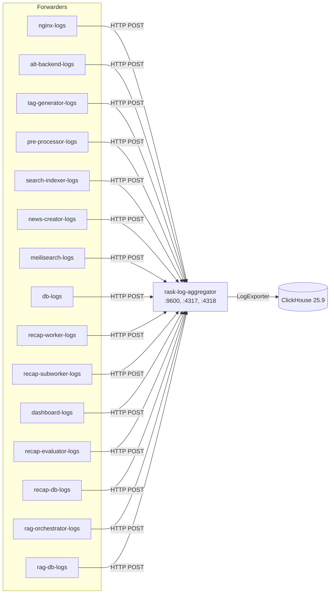

# Rask Log Aggregator

_Last reviewed: January 13, 2026_

**Location:** `rask-log-aggregator/app`

## Role
- Rust 1.87+ (2024 Edition) Axum API でログバッチを集約
- rask-log-forwarder から newline-delimited JSON ログを受信し ClickHouse に書き込み
- OTLP (OpenTelemetry Protocol) gRPC/HTTP エンドポイント提供
- 拡張可能な `LogExporter` trait によるエクスポーター抽象化

## Architecture & Flow

| Component | Responsibility |
| --- | --- |
| `main.rs` | アプリケーションエントリポイント |
| `aggregate_handler` | HTTP POST /v1/aggregate ハンドラー |
| `health_handler` | ヘルスチェックハンドラー |
| `log_exporter/mod.rs` | LogExporter trait 定義 |
| `log_exporter/clickhouse.rs` | ClickHouse エクスポーター実装 |
| `config.rs` | 環境変数設定 |



## Endpoints & Behavior

| Port | Protocol | Endpoint | Description |
|------|----------|----------|-------------|
| 9600 | HTTP | `/v1/aggregate` | ログバッチ受信 (newline-delimited JSON) |
| 9600 | HTTP | `/v1/health` | ヘルスチェック |
| 4317 | gRPC | OTLP gRPC | OpenTelemetry gRPC エンドポイント |
| 4318 | HTTP | OTLP HTTP | OpenTelemetry HTTP エンドポイント |

### /v1/aggregate Handler
- raw request body を読み込み
- 各行を `EnrichedLogEntry` にパース
- パースエラーはログ出力してスキップ (リクエスト全体は失敗しない)
- バッチを `LogExporter` に送信

## Configuration & Env

| Variable | Default | Description |
|----------|---------|-------------|
| `APP_CLICKHOUSE_HOST` | clickhouse | ClickHouse ホスト |
| `APP_CLICKHOUSE_PORT` | 8123 | ClickHouse HTTP ポート |
| `APP_CLICKHOUSE_USER` | - | ClickHouse ユーザー |
| `APP_CLICKHOUSE_PASSWORD_FILE` | - | ClickHouse パスワードファイル |
| `APP_CLICKHOUSE_DATABASE` | - | ClickHouse データベース名 |
| `HTTP_PORT` | 9600 | HTTP API ポート |
| `OTLP_GRPC_PORT` | 4317 | OTLP gRPC ポート |
| `OTLP_HTTP_PORT` | 4318 | OTLP HTTP ポート |
| `RUST_LOG` | info | ログレベル |

**Note**: ClickHouse 接続設定は必須。未設定の場合 `config::get_configuration()` で失敗。

## LogExporter Trait

```rust
pub trait LogExporter {
    async fn export(&self, entries: Vec<EnrichedLogEntry>) -> Result<(), ExportError>;
}
```

現在の実装:
- `ClickHouseExporter`: HTTP INSERT で ClickHouse に書き込み

将来の拡張候補:
- S3 エクスポーター
- Kafka エクスポーター

## Testing & Tooling

```bash
# テスト実行
cargo test

# フォーマット + Lint
cargo fmt && cargo clippy -- -D warnings

# リリースビルド
cargo build --release

# ヘルスチェック (Docker)
./rask-log-aggregator healthcheck
```

**Integration Tests:**
- `tests/` ディレクトリでインテグレーションテスト
- Docker で ClickHouse を起動、またはモックエクスポーターで検証

## Operational Runbook

1. ClickHouse 環境変数を設定して起動:
   ```bash
   docker compose -f compose/logging.yaml up rask-log-aggregator -d
   ```

2. ヘルスチェック:
   ```bash
   curl http://localhost:9600/v1/health
   ```

3. ログ投入テスト:
   ```bash
   printf '{"message":"test","level":"info"}\n' | \
     curl -X POST --data-binary @- http://localhost:9600/v1/aggregate
   ```

4. ClickHouse でデータ確認:
   ```bash
   docker compose exec clickhouse clickhouse-client
   SELECT * FROM rask_logs.logs LIMIT 10;
   ```

5. OTLP エンドポイントテスト:
   ```bash
   # gRPC
   grpcurl -plaintext localhost:4317 list
   # HTTP
   curl http://localhost:4318/v1/logs
   ```

## Observability
- tracing via `tracing_subscriber`
- `info!` ログ: バッチ到着時
- `error!` ログ: パース/エクスポート失敗時
- rask.group ラベル: `rask-log-aggregator`

## ClickHouse Schema

ログは以下の構造で ClickHouse に保存:
- `timestamp`: ログタイムスタンプ
- `level`: ログレベル (info, warn, error, etc.)
- `message`: ログメッセージ
- `service`: サービス名
- `container_id`: Docker コンテナ ID
- Additional enriched fields

## LLM Notes
- Rust 2024 Edition (edition = "2024")
- Axum ベースの非同期 HTTP サーバー
- `EnrichedLogEntry` 拡張時は ClickHouse カラムマッピングも更新必須
- OTLP サポートは OpenTelemetry エコシステムとの統合用
- 15 の rask-log-forwarder インスタンスからログを集約
