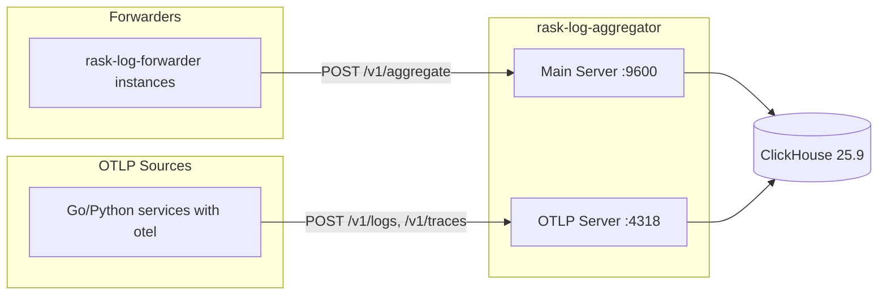

# Rask Log Aggregator

_Last reviewed: February 28, 2026_

**Location:** `rask-log-aggregator/app`

## Role
- Rust 1.87+ (2024 Edition) Axum API でログバッチを集約
- rask-log-forwarder から newline-delimited JSON ログを受信し ClickHouse に書き込み
- OTLP (OpenTelemetry Protocol) HTTP エンドポイント提供 (gRPC は未実装)
- デュアルサーバー構成: Main Server (:9600) + OTLP Server (:4318)
- 拡張可能な `LogExporter` / `OTelExporter` trait によるエクスポーター抽象化

## Architecture & Flow

| Component | Responsibility |
| --- | --- |
| `main.rs` | アプリケーションエントリポイント、デュアルサーバー起動 |
| `config.rs` | 環境変数設定、Docker Secrets 対応 |
| `domain/otel_log.rs` | OTelLog, OTelTrace, SpanEvent, SpanLink ドメインモデル |
| `log_exporter/mod.rs` | LogExporter trait 定義 |
| `log_exporter/otel_exporter.rs` | OTelExporter trait 定義 |
| `log_exporter/clickhouse_exporter.rs` | ClickHouse エクスポーター実装 |
| `log_exporter/json_file_exporter.rs` | JSON ファイルエクスポーター (テスト/デバッグ用) |
| `log_exporter/disk_cleaner.rs` | ディスククリーナー |
| `otlp/receiver.rs` | OTLP HTTP ハンドラー (logs, traces) |
| `otlp/converter.rs` | OTLP protobuf → ドメインモデル変換 |



## Endpoints & Behavior

| Port | Protocol | Endpoint | Description |
|------|----------|----------|-------------|
| 9600 | HTTP | `GET /v1/health` | ヘルスチェック |
| 9600 | HTTP | `POST /v1/aggregate` | ログバッチ受信 (newline-delimited JSON) |
| 4318 | HTTP | `POST /v1/logs` | OTLP HTTP ログ (protobuf) |
| 4318 | HTTP | `POST /v1/traces` | OTLP HTTP トレース (protobuf) |

### /v1/aggregate Handler
- raw request body を読み込み
- 各行を `EnrichedLogEntry` にパース
- パースエラーはログ出力してスキップ (リクエスト全体は失敗しない)
- バッチを `LogExporter` に送信

### /v1/logs, /v1/traces Handlers
- `application/x-protobuf` 形式で受信
- protobuf デコード失敗時は 400 Bad Request
- ドメインモデルに変換後 `OTelExporter` でエクスポート
- 成功時は protobuf 形式でレスポンス

## Configuration & Env

| Variable | Default | Required | Description |
|----------|---------|----------|-------------|
| `APP_CLICKHOUSE_HOST` | - | Yes | ClickHouse ホスト |
| `APP_CLICKHOUSE_PORT` | - | Yes | ClickHouse HTTP ポート |
| `APP_CLICKHOUSE_USER` | - | Yes | ClickHouse ユーザー |
| `APP_CLICKHOUSE_PASSWORD` | - | Yes* | ClickHouse パスワード |
| `APP_CLICKHOUSE_PASSWORD_FILE` | - | Yes* | Docker Secrets 用パスワードファイルパス |
| `APP_CLICKHOUSE_DATABASE` | - | Yes | ClickHouse データベース名 |
| `HTTP_PORT` | 9600 | No | Main HTTP API ポート |
| `OTLP_HTTP_PORT` | 4318 | No | OTLP HTTP ポート |
| `RUST_LOG` | info | No | ログレベル |
| `RUST_LOG_FORMAT` | json | No | ログフォーマット (`json` or `pretty`) |

**Note**: `APP_CLICKHOUSE_PASSWORD` または `APP_CLICKHOUSE_PASSWORD_FILE` のいずれかが必要 (Docker Secrets 対応)

## Domain Models

### OTelLog

OpenTelemetry Log Data Model 準拠のログエントリ。

```rust
pub struct OTelLog {
    pub timestamp: u64,              // ナノ秒
    pub observed_timestamp: u64,     // ナノ秒
    pub trace_id: String,            // 32-char hex
    pub span_id: String,             // 16-char hex
    pub trace_flags: u8,
    pub severity_text: String,
    pub severity_number: u8,
    pub body: String,
    pub resource_schema_url: String,
    pub resource_attributes: HashMap<String, String>,
    pub scope_schema_url: String,
    pub scope_name: String,
    pub scope_version: String,
    pub scope_attributes: HashMap<String, String>,
    pub log_attributes: HashMap<String, String>,
    pub service_name: String,
}
```

### OTelTrace

OpenTelemetry Span Data Model 準拠のトレーススパン。

```rust
pub struct OTelTrace {
    pub timestamp: u64,              // ナノ秒
    pub trace_id: String,            // 32-char hex
    pub span_id: String,             // 16-char hex
    pub parent_span_id: String,      // 16-char hex (root の場合は空)
    pub trace_state: String,
    pub span_name: String,
    pub span_kind: SpanKind,
    pub service_name: String,
    pub resource_attributes: HashMap<String, String>,
    pub span_attributes: HashMap<String, String>,
    pub duration: i64,               // ナノ秒
    pub status_code: StatusCode,
    pub status_message: String,
    pub events_nested: Vec<SpanEvent>,
    pub links_nested: Vec<SpanLink>,
}
```

### SpanKind / StatusCode

```rust
pub enum SpanKind {
    Unspecified = 0,
    Internal = 1,
    Server = 2,
    Client = 3,
    Producer = 4,
    Consumer = 5,
}

pub enum StatusCode {
    Unset = 0,
    Ok = 1,
    Error = 2,
}
```

## LogExporter / OTelExporter Traits

dyn-compatible のため boxed future を使用。

```rust
/// Legacy ログ用エクスポーター
pub trait LogExporter: Send + Sync {
    fn export_batch(
        &self,
        logs: Vec<EnrichedLogEntry>,
    ) -> Pin<Box<dyn Future<Output = Result<(), AggregatorError>> + Send + '_>>;
}

/// OpenTelemetry ログ/トレース用エクスポーター
pub trait OTelExporter: Send + Sync {
    fn export_otel_logs(
        &self,
        logs: Vec<OTelLog>,
    ) -> Pin<Box<dyn Future<Output = Result<(), AggregatorError>> + Send + '_>>;

    fn export_otel_traces(
        &self,
        traces: Vec<OTelTrace>,
    ) -> Pin<Box<dyn Future<Output = Result<(), AggregatorError>> + Send + '_>>;
}
```

現在の実装:
- `ClickHouseExporter`: 両方の trait を実装

## ClickHouse Schema

### logs テーブル (legacy)

rask-log-forwarder からの NDJSON ログを保存。TTL 2日。

```sql
CREATE TABLE logs (
    service_type LowCardinality(String),
    log_type LowCardinality(String),
    message String,
    level Enum8('Debug' = 0, 'Info' = 1, 'Warn' = 2, 'Error' = 3, 'Fatal' = 4),
    timestamp DateTime64(3, 'UTC'),
    stream LowCardinality(String),
    container_id String,
    service_name LowCardinality(String),
    service_group LowCardinality(String),
    TraceId FixedString(32),      -- trace correlation
    SpanId FixedString(16),       -- span correlation
    fields Map(String, String)
) ENGINE = MergeTree()
PARTITION BY (service_group, service_name)
ORDER BY (timestamp)
TTL timestamp + INTERVAL 2 DAY DELETE;
```

### otel_logs テーブル

OpenTelemetry Log Data Model 準拠。TTL 7日。

```sql
CREATE TABLE otel_logs (
    Timestamp DateTime64(9, 'UTC'),
    ObservedTimestamp DateTime64(9, 'UTC'),
    TraceId FixedString(32),
    SpanId FixedString(16),
    TraceFlags UInt8,
    SeverityText LowCardinality(String),
    SeverityNumber UInt8,
    Body String,
    ResourceSchemaUrl String,
    ResourceAttributes Map(LowCardinality(String), String),
    ScopeSchemaUrl String,
    ScopeName String,
    ScopeVersion String,
    ScopeAttributes Map(LowCardinality(String), String),
    LogAttributes Map(LowCardinality(String), String),
    -- Materialized columns for search optimization
    ServiceName LowCardinality(String) MATERIALIZED ResourceAttributes['service.name']
) ENGINE = MergeTree()
PARTITION BY toDate(Timestamp)
ORDER BY (ServiceName, SeverityNumber, Timestamp)
TTL Timestamp + INTERVAL 7 DAY DELETE;
```

### otel_traces テーブル

OpenTelemetry Span Data Model 準拠。Grafana ClickHouse datasource 互換の nested arrays を含む。TTL 7日。

```sql
CREATE TABLE otel_traces (
    Timestamp DateTime64(9, 'UTC'),
    TraceId FixedString(32),
    SpanId FixedString(16),
    ParentSpanId FixedString(16),
    TraceState String,
    SpanName LowCardinality(String),
    SpanKind Enum8('UNSPECIFIED'=0, 'INTERNAL'=1, 'SERVER'=2, 'CLIENT'=3, 'PRODUCER'=4, 'CONSUMER'=5),
    ServiceName LowCardinality(String),
    ResourceAttributes Map(LowCardinality(String), String),
    SpanAttributes Map(LowCardinality(String), String),
    Duration Int64,              -- nanoseconds
    StatusCode Enum8('UNSET'=0, 'OK'=1, 'ERROR'=2),
    StatusMessage String,
    -- Nested arrays for Grafana ClickHouse datasource
    `Events.Timestamp` Array(DateTime64(9, 'UTC')),
    `Events.Name` Array(LowCardinality(String)),
    `Events.Attributes` Array(Map(LowCardinality(String), String)),
    `Links.TraceId` Array(String),
    `Links.SpanId` Array(String),
    `Links.TraceState` Array(String),
    `Links.Attributes` Array(Map(LowCardinality(String), String)),
    -- Materialized column
    DurationMs Float64 MATERIALIZED Duration / 1000000.0
) ENGINE = MergeTree()
PARTITION BY toDate(Timestamp)
ORDER BY (ServiceName, Timestamp, TraceId)
TTL Timestamp + INTERVAL 7 DAY DELETE;
```

## Testing & Tooling

```bash
# テスト実行
cargo test

# フォーマット + Lint
cargo fmt && cargo clippy -- -D warnings

# リリースビルド
cargo build --release

# ヘルスチェック (Docker)
./rask-log-aggregator healthcheck
```

**Integration Tests:**
- `tests/` ディレクトリでインテグレーションテスト
- Docker で ClickHouse を起動、またはモックエクスポーターで検証

## Operational Runbook

1. ClickHouse 環境変数を設定して起動:
   ```bash
   docker compose -f compose/logging.yaml up rask-log-aggregator -d
   ```

2. ヘルスチェック:
   ```bash
   curl http://localhost:9600/v1/health
   ```

3. Legacy ログ投入テスト:
   ```bash
   printf '{"message":"test","level":"info","service_type":"test","log_type":"app","timestamp":"2026-01-22T00:00:00Z","stream":"stdout","container_id":"abc123","service_name":"test-svc"}\n' | \
     curl -X POST --data-binary @- http://localhost:9600/v1/aggregate
   ```

4. OTLP HTTP ログ投入テスト (protobuf バイナリが必要):
   ```bash
   # Go/Python の OTel SDK を使用してテスト
   # 直接 curl でテストする場合は protobuf エンコードが必要
   curl -X POST \
     -H "Content-Type: application/x-protobuf" \
     --data-binary @otlp_logs.pb \
     http://localhost:4318/v1/logs
   ```

5. ClickHouse でデータ確認:
   ```bash
   docker compose exec clickhouse clickhouse-client

   -- Legacy logs
   SELECT * FROM rask_logs.logs LIMIT 10;

   -- OTel logs
   SELECT Timestamp, ServiceName, SeverityText, Body
   FROM rask_logs.otel_logs LIMIT 10;

   -- OTel traces
   SELECT Timestamp, ServiceName, SpanName, Duration/1000000 as duration_ms
   FROM rask_logs.otel_traces LIMIT 10;
   ```

## Observability
- tracing via `tracing_subscriber`
- JSON 形式 (本番) または pretty 形式 (開発) でログ出力
- `info!` ログ: バッチ到着時、エクスポート成功時
- `error!` ログ: パース/エクスポート失敗時
- rask.group ラベル: `rask-log-aggregator`

## LLM Notes
- Rust 2024 Edition (edition = "2024")
- Axum ベースの非同期デュアル HTTP サーバー
- `EnrichedLogEntry` 拡張時は ClickHouse カラムマッピングも更新必須
- OTLP HTTP エンドポイントは OpenTelemetry エコシステムとの統合用
- 15+ の rask-log-forwarder インスタンスからログを集約
- gRPC エンドポイントは未実装 (HTTP のみ)
- Docker Secrets 対応: `_FILE` サフィックスで秘密情報をファイルから読み込み
