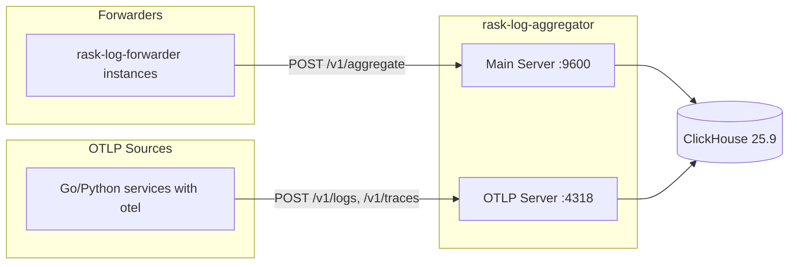

# Rask Log Aggregator

_Last reviewed: September 5, 2026_

**Location:** `rask-log-aggregator/app`

## Role
- Rust 1.94+ (2024 Edition) Axum API でログバッチを集約
- rask-log-forwarder から newline-delimited JSON ログを受信し ClickHouse に書き込み
- OTLP (OpenTelemetry Protocol) HTTP エンドポイント提供 (gRPC は未実装)
- デュアルサーバー構成: Main Server (:9600) + OTLP Server (:4318)
- 拡張可能な `LogExporter` / `OTelExporter` trait によるエクスポーター抽象化

## Architecture & Flow

Clean Architecture (Handler → Port → Adapter) にレイヤ分割済み:

| Component | Responsibility |
| --- | --- |
| `main.rs` | エントリポイント (`healthcheck` サブコマンド分岐 + `app::run()` 呼び出し) |
| `app/mod.rs` | 起動シーケンス (config → `AppState` → router → serve → graceful shutdown で flush 待ち) |
| `app/router.rs` | Main router (`/v1/health`, `/v1/aggregate`) と OTLP router (`/v1/logs`, `/v1/traces`) の構築。gzip decompression + body limit 付与 |
| `app/server.rs` | 両サーバーの bind・graceful shutdown (SIGTERM/SIGINT) |
| `app/state.rs` | `AppState` (ClickHouse `Client` 生成、`BatchWriter` spawn、両 exporter の Arc 共有) |
| `config.rs` | 環境変数設定、Docker Secrets (`_FILE`) 対応 |
| `handler/aggregate.rs` | `POST /v1/aggregate` ハンドラー |
| `handler/health.rs` | `GET /v1/health` ハンドラー |
| `domain/enriched_log.rs` | `EnrichedLogEntry` (legacy NDJSON) ドメインモデル |
| `domain/otel.rs` | OTelLog, OTelTrace, SpanEvent, SpanLink, SpanKind, StatusCode ドメインモデル |
| `port/log_exporter.rs` | `LogExporter` trait 定義 (Port 層) |
| `port/otel_exporter.rs` | `OTelExporter` trait 定義 (Port 層) |
| `adapter/clickhouse/batch_writer.rs` | `BatchWriter` (両 trait を実装、チャネル経由でバッチを蓄積し定期 flush) |
| `adapter/clickhouse/row.rs` / `otel_row.rs` | ClickHouse `Row` 構造体、ドメインモデルからの変換 |
| `adapter/clickhouse/convert.rs` | 文字列 → `FixedString` バイト列などの変換ヘルパー |
| `adapter/json_file/disk_cleaner.rs` | `DiskCleaner` (ディレクトリ容量クォータ管理) — 現状どこからも呼ばれていない未配線コード |
| `otlp/receiver.rs` | OTLP HTTP ハンドラー (logs, traces) |
| `otlp/converter.rs` | OTLP protobuf → ドメインモデル変換 |

`log_exporter/` モジュールは旧レイアウトの型を `port::{LogExporter, OTelExporter}` と `adapter::clickhouse` / `adapter::json_file` から re-export するだけの後方互換シムとして残っている。


```mermaid
flowchart LR
    subgraph Forwarders
        F[rask-log-forwarder instances]
    end
    subgraph OTLP Sources
        O[Go/Python services with otel]
    end
    subgraph rask-log-aggregator
        MS[Main Server :9600]
        OS[OTLP Server :4318]
    end
    CH[(ClickHouse 25.9)]

    F -->|POST /v1/aggregate| MS
    O -->|POST /v1/logs, /v1/traces| OS
    MS & OS --> CH
```

## Endpoints & Behavior

| Port | Protocol | Endpoint | Description |
|------|----------|----------|-------------|
| 9600 | HTTP | `GET /v1/health` | ヘルスチェック |
| 9600 | HTTP | `POST /v1/aggregate` | ログバッチ受信 (newline-delimited JSON) |
| 4318 | HTTP | `POST /v1/logs` | OTLP HTTP ログ (protobuf) |
| 4318 | HTTP | `POST /v1/traces` | OTLP HTTP トレース (protobuf) |

両サーバーとも `Content-Encoding: gzip` の透過的なデコンプレッション (`RequestDecompressionLayer`) と最大 20 MB のボディ上限 (`DefaultBodyLimit`) を持つ。forwarder は `ENABLE_COMPRESSION=true` の場合に gzip 圧縮した NDJSON / OTLP protobuf を送ってくるため必須。

### /v1/aggregate Handler
- raw request body を読み込み
- 各行を `EnrichedLogEntry` にパース
- パースエラーはログ出力してスキップ (リクエスト全体は失敗しない)
- バッチを `LogExporter` に送信
- 200 OK は `export_batch` が `Ok` を返した後にのみ返す (`Ok` を返す前に 200 を返さない)。ただし `BatchWriter` は channel send 成功時点で `Ok` を返し、実際の ClickHouse flush は数秒後の別ループで行われるため、200 は「ClickHouse に書き込み済み」の確認ではなく「エクスポート層が受理した」確認。エクスポート失敗時は forwarder が再送できるよう 500 を返す

### /v1/logs, /v1/traces Handlers
- `application/x-protobuf` 形式で受信
- protobuf デコード失敗時は 400 Bad Request
- ドメインモデルに変換後 `OTelExporter` でエクスポート
- 成功時は protobuf 形式でレスポンス

## Configuration & Env

| Variable | Default | Required | Description |
|----------|---------|----------|-------------|
| `APP_CLICKHOUSE_HOST` | - | Yes | ClickHouse ホスト |
| `APP_CLICKHOUSE_PORT` | - | Yes | ClickHouse HTTP ポート |
| `APP_CLICKHOUSE_USER` | - | Yes | ClickHouse ユーザー |
| `APP_CLICKHOUSE_PASSWORD` | - | Yes* | ClickHouse パスワード |
| `APP_CLICKHOUSE_PASSWORD_FILE` | - | Yes* | Docker Secrets 用パスワードファイルパス |
| `APP_CLICKHOUSE_DATABASE` | - | Yes | ClickHouse データベース名 |
| `HTTP_PORT` | 9600 | No | Main HTTP API ポート |
| `OTLP_HTTP_PORT` | 4318 | No | OTLP HTTP ポート |
| `RUST_LOG` | info | No | ログレベル |
| `RUST_LOG_FORMAT` | json | No | ログフォーマット (`json` or `pretty`) |

**Note**: `APP_CLICKHOUSE_PASSWORD` または `APP_CLICKHOUSE_PASSWORD_FILE` のいずれかが必要 (Docker Secrets 対応)

## Domain Models

### OTelLog

OpenTelemetry Log Data Model 準拠のログエントリ。

```rust
pub struct OTelLog {
    pub timestamp: u64,              // ナノ秒
    pub observed_timestamp: u64,     // ナノ秒
    pub trace_id: String,            // 32-char hex
    pub span_id: String,             // 16-char hex
    pub trace_flags: u8,
    pub severity_text: String,
    pub severity_number: u8,
    pub body: String,
    pub resource_schema_url: String,
    pub resource_attributes: HashMap<String, String>,
    pub scope_schema_url: String,
    pub scope_name: String,
    pub scope_version: String,
    pub scope_attributes: HashMap<String, String>,
    pub log_attributes: HashMap<String, String>,
    pub service_name: String,
}
```

### OTelTrace

OpenTelemetry Span Data Model 準拠のトレーススパン。

```rust
pub struct OTelTrace {
    pub timestamp: u64,              // ナノ秒
    pub trace_id: String,            // 32-char hex
    pub span_id: String,             // 16-char hex
    pub parent_span_id: String,      // 16-char hex (root の場合は空)
    pub trace_state: String,
    pub span_name: String,
    pub span_kind: SpanKind,
    pub service_name: String,
    pub resource_attributes: HashMap<String, String>,
    pub span_attributes: HashMap<String, String>,
    pub duration: i64,               // ナノ秒
    pub status_code: StatusCode,
    pub status_message: String,
    pub events_nested: Vec<SpanEvent>,
    pub links_nested: Vec<SpanLink>,
}
```

### SpanKind / StatusCode

```rust
pub enum SpanKind {
    Unspecified = 0,
    Internal = 1,
    Server = 2,
    Client = 3,
    Producer = 4,
    Consumer = 5,
}

pub enum StatusCode {
    Unset = 0,
    Ok = 1,
    Error = 2,
}
```

## LogExporter / OTelExporter Traits

dyn-compatible のため boxed future を使用。

```rust
/// Legacy ログ用エクスポーター
pub trait LogExporter: Send + Sync {
    fn export_batch(
        &self,
        logs: Vec<EnrichedLogEntry>,
    ) -> Pin<Box<dyn Future<Output = Result<(), AggregatorError>> + Send + '_>>;
}

/// OpenTelemetry ログ/トレース用エクスポーター
pub trait OTelExporter: Send + Sync {
    fn export_otel_logs(
        &self,
        logs: Vec<OTelLog>,
    ) -> Pin<Box<dyn Future<Output = Result<(), AggregatorError>> + Send + '_>>;

    fn export_otel_traces(
        &self,
        traces: Vec<OTelTrace>,
    ) -> Pin<Box<dyn Future<Output = Result<(), AggregatorError>> + Send + '_>>;
}
```

現在の実装:
- `BatchWriter` (`adapter/clickhouse/batch_writer.rs`): 両方の trait を実装。チャネルで受けたバッチを 5 秒間隔 (`FLUSH_INTERVAL_SECS`) の flush ループで ClickHouse に書き込む

## ClickHouse Schema

Schema は Atlas ではなく `clickhouse/migrations/*.sql` の生 SQL ファイル群で管理する。各ファイルは `IF NOT EXISTS` / `ADD COLUMN IF NOT EXISTS` 等で冪等に書かれており、`clickhouse` コンテナ起動時に毎回全ファイルを順番に再実行する (`clickhouse/entrypoint-wrapper.sh`)。デプロイ時はコンテナ再作成を経由しない `clickhouse-migrator` ワンショットサービスが同じスクリプトを `apply` モードで実行する。全テーブルで `ttl_only_drop_parts=1`。`sli_metrics` を除く全テーブルの TTL は 1 日 (2026-01 の retention 見直しで 2〜14 日から短縮)。

`rask_logs` DB には以下の 7 テーブルが存在する:

| テーブル | 用途 | TTL |
|---|---|---|
| `logs` | rask-log-forwarder からの legacy NDJSON ログ | 1 日 |
| `http_logs` | `logs` から MV (`http_logs_mv`) で抽出した HTTP アクセスログ | 1 日 |
| `otel_logs` | OTLP 経由の構造化ログ (OTel Log Data Model 準拠) | 1 日 |
| `otel_traces` | OTLP 経由の distributed trace (OTel Span Data Model 準拠) | 1 日 |
| `otel_http_requests` | `otel_logs` から MV (`otel_http_requests_mv`) で抽出した HTTP リクエスト分析用テーブル | 1 日 |
| `otel_error_logs` | `otel_logs` から MV (`otel_error_logs_mv`, `SeverityNumber >= 17`) で抽出したエラーログ | 1 日 |
| `sli_metrics` | `otel_logs` から MV (`sli_error_rate_mv`, `sli_log_throughput_mv`) で 1 分粒度集計した SLI (error_rate, log_throughput) | 90 日 |

### logs テーブル (legacy)

rask-log-forwarder からの NDJSON ログを保存。`entrypoint-wrapper.sh` が起動のたびに、`PARTITION BY (service_group, service_name)` のままの `logs` テーブルを検出すると一度だけ `toDate(timestamp)` へ再作成する (非時間軸 PARTITION + `ttl_only_drop_parts=1` では TTL が効かなかったため、[[000934]])。

```sql
CREATE TABLE logs (
    service_type LowCardinality(String),
    log_type LowCardinality(String),
    message String,
    level Enum8('Debug' = 0, 'Info' = 1, 'Warn' = 2, 'Error' = 3, 'Fatal' = 4),
    timestamp DateTime64(3, 'UTC'),
    stream LowCardinality(String),
    container_id String,
    service_name LowCardinality(String),
    service_group LowCardinality(String),
    TraceId FixedString(32) DEFAULT '',      -- trace correlation
    SpanId FixedString(16) DEFAULT '',       -- span correlation
    fields Map(String, String)
) ENGINE = MergeTree()
PARTITION BY toDate(timestamp)
ORDER BY (timestamp)
TTL timestamp + INTERVAL 1 DAY DELETE
SETTINGS ttl_only_drop_parts = 1;
```

HTTP 固有フィールド (`method`/`path`/`status_code`/`response_size`/`ip_address`/`user_agent`) は別カラムではなく `http_method` 等のプレフィックス付きキーとして `fields` Map に畳み込まれる (`adapter/clickhouse/row.rs`)。`http_logs_mv` はこの `fields` map から `service_name='nginx'` (プレフィックス付きキー) と `service_name='plecto-proxy'` (素のキー) の 2 パターンを個別に拾って `http_logs` に書く。

### otel_logs テーブル

OpenTelemetry Log Data Model 準拠。business context 用の materialized column (`alt.*` 属性由来) と bloom filter index 付き。

```sql
CREATE TABLE otel_logs (
    Timestamp DateTime64(9, 'UTC'),
    ObservedTimestamp DateTime64(9, 'UTC'),
    TraceId FixedString(32),
    SpanId FixedString(16),
    TraceFlags UInt8,
    SeverityText LowCardinality(String),
    SeverityNumber UInt8,
    Body String,
    ResourceSchemaUrl String,
    ResourceAttributes Map(LowCardinality(String), String),
    ScopeSchemaUrl String,
    ScopeName String,
    ScopeVersion String,
    ScopeAttributes Map(LowCardinality(String), String),
    LogAttributes Map(LowCardinality(String), String),
    -- Materialized columns for search optimization
    ServiceName LowCardinality(String) MATERIALIZED ResourceAttributes['service.name'],
    ServiceVersion LowCardinality(String) MATERIALIZED ResourceAttributes['service.version'],
    DeploymentEnvironment LowCardinality(String) MATERIALIZED ResourceAttributes['deployment.environment'],
    -- Business context (alt.* 属性由来、2026-01 追加)
    FeedId String MATERIALIZED LogAttributes['alt.feed.id'],
    ArticleId String MATERIALIZED LogAttributes['alt.article.id'],
    JobId String MATERIALIZED LogAttributes['alt.job.id'],
    ProcessingStage LowCardinality(String) MATERIALIZED LogAttributes['alt.processing.stage'],
    AIPipeline LowCardinality(String) MATERIALIZED LogAttributes['alt.ai.pipeline'],
    RequestId String MATERIALIZED LogAttributes['alt.request.id']
    -- + bloom_filter index on TraceId/SpanId/FeedId/ArticleId/JobId/RequestId, tokenbf_v1 on Body
) ENGINE = MergeTree()
PARTITION BY toDate(Timestamp)
ORDER BY (ServiceName, SeverityNumber, Timestamp)
TTL Timestamp + INTERVAL 1 DAY DELETE
SETTINGS ttl_only_drop_parts = 1;
```

### otel_traces テーブル

OpenTelemetry Span Data Model 準拠。Grafana ClickHouse datasource 互換の nested arrays を含む。

```sql
CREATE TABLE otel_traces (
    Timestamp DateTime64(9, 'UTC'),
    TraceId FixedString(32),
    SpanId FixedString(16),
    ParentSpanId FixedString(16),
    TraceState String,
    SpanName LowCardinality(String),
    SpanKind Enum8('UNSPECIFIED'=0, 'INTERNAL'=1, 'SERVER'=2, 'CLIENT'=3, 'PRODUCER'=4, 'CONSUMER'=5),
    ServiceName LowCardinality(String),
    ResourceAttributes Map(LowCardinality(String), String),
    SpanAttributes Map(LowCardinality(String), String),
    Duration Int64,              -- nanoseconds
    StatusCode Enum8('UNSET'=0, 'OK'=1, 'ERROR'=2),
    StatusMessage String,
    -- Nested arrays for Grafana ClickHouse datasource
    `Events.Timestamp` Array(DateTime64(9, 'UTC')),
    `Events.Name` Array(LowCardinality(String)),
    `Events.Attributes` Array(Map(LowCardinality(String), String)),
    `Links.TraceId` Array(String),
    `Links.SpanId` Array(String),
    `Links.TraceState` Array(String),
    `Links.Attributes` Array(Map(LowCardinality(String), String)),
    -- Materialized column
    DurationMs Float64 MATERIALIZED Duration / 1000000.0
) ENGINE = MergeTree()
PARTITION BY toDate(Timestamp)
ORDER BY (ServiceName, Timestamp, TraceId)
TTL Timestamp + INTERVAL 1 DAY DELETE
SETTINGS ttl_only_drop_parts = 1;
```

### otel_http_requests / otel_error_logs / sli_metrics

`otel_logs` からの派生テーブルで、rask-log-aggregator が直接書き込むことはない (ClickHouse 側の Materialized View が `otel_logs` への INSERT をトリガーに populate する):

- `otel_http_requests` — `LogAttributes['http.method']` が空でない行から `HttpMethod`/`HttpRoute`/`HttpStatusCode`/`ResponseSize`/`RequestDuration`/`UserId`/`ClientIp`/`UserAgent` を抽出。TTL 1日
- `otel_error_logs` — `SeverityNumber >= 17` (ERROR 以上) の行から `ExceptionType`/`ExceptionMessage`/`Stacktrace` を抽出。TTL 1日
- `sli_metrics` — `(Timestamp, ServiceName, Metric, Value, Tags)` の汎用スキーマ。`error_rate` と `log_throughput` を 1 分粒度で集計。TTL 90日 (SLO トレンド分析用に長期保持)

## Testing & Tooling

```bash
# テスト実行
cargo test

# フォーマット + Lint
cargo fmt && cargo clippy -- -D warnings

# リリースビルド
cargo build --release

# ヘルスチェック (Docker)
./rask-log-aggregator healthcheck
```

**Integration Tests:**
- `tests/` ディレクトリでインテグレーションテスト
- Docker で ClickHouse を起動、またはモックエクスポーターで検証

**ClickHouse Retention Regression Tests** (`clickhouse/tests/`):
- `retention_policy_test.sh` — 全テーブルの TTL (1 日、`sli_metrics` のみ 90 日) を `system.tables` から検証。読み取り専用、RED→GREEN ガードおよび CI 用 ([[000934]])
- `http_logs_mv_shape_test.sh` — `http_logs_mv` が期待通りの列構成を維持しているかを検証

## Operational Runbook

`compose/logging.yaml` の `rask-log-aggregator` サービスは `ports:` を持たないため、9600/4318 は `alt-network` 内からのみ到達可能。ホストから直接 `curl localhost:9600` しても Connection refused になる — `alt-network` に参加したコンテナから叩くこと。

1. ClickHouse 環境変数を設定して起動:
   ```bash
   docker compose -f compose/compose.yaml -p alt up -d rask-log-aggregator
   ```

2. ヘルスチェック (コンテナ内から):
   ```bash
   docker compose -f compose/compose.yaml -p alt exec rask-log-aggregator /rask-log-aggregator healthcheck
   ```

3. Legacy ログ投入テスト (`rask-log-aggregator` は distroless イメージで shell/curl を持たないため、`alt-network` 上の使い捨てコンテナから叩く):
   ```bash
   printf '{"message":"test","level":"info","service_type":"test","log_type":"app","timestamp":"2026-01-22T00:00:00Z","stream":"stdout","container_id":"abc123","service_name":"test-svc"}\n' | \
     docker run --rm -i --network alt_alt-network curlimages/curl:8.11.1 \
       -X POST --data-binary @- http://rask-log-aggregator:9600/v1/aggregate
   ```

4. OTLP HTTP ログ投入テスト (protobuf バイナリが必要。同じく `alt-network` 上の使い捨てコンテナから):
   ```bash
   # Go/Python の OTel SDK を使用してテスト
   # 直接 curl でテストする場合は protobuf エンコードが必要
   docker run --rm -v "$(pwd):/data" --network alt_alt-network curlimages/curl:8.11.1 \
     -X POST \
     -H "Content-Type: application/x-protobuf" \
     --data-binary @/data/otlp_logs.pb \
     http://rask-log-aggregator:4318/v1/logs
   ```

5. ClickHouse でデータ確認:
   ```bash
   docker compose -f compose/compose.yaml -p alt exec clickhouse clickhouse-client

   -- Legacy logs
   SELECT * FROM rask_logs.logs LIMIT 10;

   -- OTel logs
   SELECT Timestamp, ServiceName, SeverityText, Body
   FROM rask_logs.otel_logs LIMIT 10;

   -- OTel traces
   SELECT Timestamp, ServiceName, SpanName, Duration/1000000 as duration_ms
   FROM rask_logs.otel_traces LIMIT 10;
   ```

## Observability
- tracing via `tracing_subscriber`
- JSON 形式 (本番) または pretty 形式 (開発) でログ出力
- `info!` ログ: バッチ到着時、エクスポート成功時
- `error!` ログ: パース/エクスポート失敗時
- rask.group ラベル: `rask-log-aggregator`

## Known failure patterns

Distilled from the ADR / postmortem corpus (see `docs/runbooks/crystallized-knowledge.md`).

- **Trace context dropped hop-by-hop** — Grafana showed all-zero TraceIds; every hop (slog → stdout → forwarder → aggregator → ClickHouse) lost fields independently and took 8 ADRs to fix one hop at a time ([[000122]]–[[000135]]). The otelslog bridge puts trace_id only into *attributes*, so the aggregator must fall back to attributes when OTLP protocol fields are empty ([[000123]], [[000128]]).
- **"Accepted ADR ≠ implemented"** — three pieces of the trace saga (port 4318 fix, logger.Init, slog context wiring) were found unimplemented after the ADRs were accepted ([[000127]]).
- **ClickHouse RowBinary is type-strict** — `FixedString(N)` needs `[u8; N]`, `Enum8` needs `i8`, `DateTime64` needs `i64`; passing a Rust `String` corrupts the byte layout via its length prefix ([[000074]]).
- **`Events` (String) and `Events.*` (Array) columns cannot coexist** — RowBinary INSERT fails with ILLEGAL_COLUMN; keep only the nested-array columns Grafana needs ([[000130]]).
- **Never return 200 OK on export failure** — the aggregator once swallowed ClickHouse export errors and reported success to forwarders, defeating their retry/disk-fallback ([[000070]]).
- **TTL and PARTITION interact** — a non-time-axis PARTITION (e.g. the legacy `logs` table's `(service_group, service_name)`) combined with `ttl_only_drop_parts=1` means TTL never fires; "unify all TTLs" migrations also miss MV-derived tables. Pin retention with a regression test that inspects `engine_full` ([[000934]]).
- **DB container logs are intentionally not collected** — PostgreSQL-family containers were permanently removed from collection (74% noise reduction); do not re-add them ([[000098]]).
- **Log volume is itself a health metric** — an ms-interval retry loop upstream generated 148 GB of logs in ~48-72h before any disk alert existed; watch per-container log volume and disk usage (PM-2026-042).

## LLM Notes
- Rust 2024 Edition (edition = "2024")
- Axum ベースの非同期デュアル HTTP サーバー
- `EnrichedLogEntry` 拡張時は ClickHouse カラムマッピングも更新必須
- OTLP HTTP エンドポイントは OpenTelemetry エコシステムとの統合用
- 16 の rask-log-forwarder インスタンスからログを集約 (`compose/logging.yaml`)
- gRPC エンドポイントは未実装 (HTTP のみ)。`compose/logging.yaml` は `OTLP_GRPC_PORT: 4317` を環境変数として渡すが `config.rs` はこれを読まない (未配線・無効)
- Docker Secrets 対応: `_FILE` サフィックスで秘密情報をファイルから読み込み
