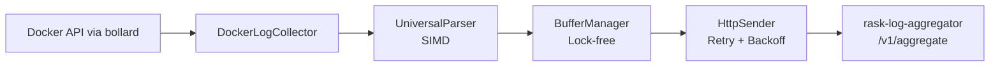

# Rask Log Forwarder

_Last reviewed: January 13, 2026_

**Location:** `rask-log-forwarder/app`

## Role
- Rust 1.87+ サイドカーで Docker ログを収集し rask-log-aggregator に転送
- `bollard` で Docker ログを tail、SIMD パーサーで高速処理
- ロックフリーバッファリング、バックプレッシャー対応
- aggregator 不可用時のディスクフォールバック (`sled`)

## Architecture & Flow

| Component | Responsibility |
| --- | --- |
| `main.rs` | CLI エントリポイント |
| `collector/docker_log_collector.rs` | Docker ログ収集 |
| `parser/universal_parser.rs` | SIMD 対応ユニバーサルパーサー |
| `buffer/buffer_manager.rs` | ロックフリーバッファ管理 |
| `sender/http_sender.rs` | HTTP 送信 + リトライ |
| `reliability/` | ヘルスレポート、リトライ管理 |



## Forwarder Instances

logging.yaml で定義された 15 インスタンス:

| Instance | Target Service | Description |
|----------|----------------|-------------|
| nginx-logs | nginx | Edge/Reverse proxy |
| alt-backend-logs | alt-backend | Backend API |
| tag-generator-logs | tag-generator | Tag extraction |
| pre-processor-logs | pre-processor | RSS ingestion |
| search-indexer-logs | search-indexer | Meilisearch indexing |
| news-creator-logs | news-creator | LLM summarization |
| meilisearch-logs | meilisearch | Search engine |
| db-logs | db | PostgreSQL 17 |
| recap-worker-logs | recap-worker | Recap orchestrator |
| recap-subworker-logs | recap-subworker | ML clustering |
| dashboard-logs | dashboard | Streamlit UI |
| recap-evaluator-logs | recap-evaluator | Quality evaluation |
| recap-db-logs | recap-db | Recap PostgreSQL |
| rag-orchestrator-logs | rag-orchestrator | RAG system |
| rag-db-logs | rag-db | RAG PostgreSQL |

## Configuration & Env

| Variable | Default | Description |
|----------|---------|-------------|
| `DOCKER_HOST` | unix:///var/run/docker.sock | Docker socket |
| `RASK_ENDPOINT` | http://rask-log-aggregator:9600/v1/aggregate | Aggregator URL |
| `TARGET_SERVICE` | - | 対象サービス名 |
| `BATCH_SIZE` | 1000 | バッチサイズ |
| `FLUSH_INTERVAL_MS` | 500 | フラッシュ間隔 (ms) |
| `BUFFER_CAPACITY` | 100000 | バッファ容量 |
| `LOG_LEVEL` | info | ログレベル |
| `RUST_LOG` | info | Rust ログレベル |

## CLI Options

```bash
rask-log-forwarder [OPTIONS]

Options:
  --target-service <SERVICE>  対象サービス名
  --endpoint <URL>            Aggregator エンドポイント
  --batch-size <SIZE>         バッチサイズ
  --buffer-capacity <SIZE>    バッファ容量
  --health-check              ヘルスチェックモード
  --metrics                   メトリクス有効化
```

## Pipeline Details

### Buffer Manager
- サイズ/時間ベースでバッチをフラッシュ
- 80% 容量でバックプレッシャー発動
- オプションでディスクスピル (`sled`)

### HTTP Sender
- ペイロード圧縮
- 指数バックオフでリトライ
- `reliability` 経由でヘルスレポート出力

## Testing & Tooling

```bash
# テスト実行
cargo test

# ベンチマーク (Criterion)
cargo bench

# ビルド
cargo build --release

# ローカル実行
cargo run -- --target-service alt-backend \
  --endpoint http://rask-log-aggregator:9600/v1/aggregate
```

**Integration Tests:**
- `tests/` で wiremock + モック Docker ストリーム使用
- パーサー/バッファのホットパスは 5% 以下の regression を維持

## Operational Runbook

1. logging プロファイルで全 forwarder を起動:
   ```bash
   docker compose --profile logging up -d
   ```

2. 特定 forwarder のログ確認:
   ```bash
   docker compose logs -f alt-backend-logs
   ```

3. パフォーマンスチューニング:
   - `BUFFER_CAPACITY`, `BATCH_SIZE`, `FLUSH_INTERVAL_MS` を同時調整
   - スループット増加時はこれらを連動して増やす

4. ディスクフォールバック有効化:
   - aggregator レイテンシ急増時にデータロス回避
   - `sled` ボリュームを設定

5. 手動ターゲット指定:
   ```bash
   RASK_TARGET_SERVICE=alt-backend ./rask-log-forwarder
   ```

## Observability
- `RUST_LOG=debug` で詳細スループット診断
- reliability manager がリトライメトリクス、`PendingChunks`、`HealthReport` を記録
- オプションで `metrics` + `debug/dns`, `debug/config` エンドポイント

## Volume Mounts

各 forwarder インスタンスは以下をマウント:
- `/var/run/docker.sock:/var/run/docker.sock:ro` - Docker socket
- `/var/lib/docker/containers:/var/lib/docker/containers:ro` - Container logs

## LLM Notes
- 各サービスに対応した forwarder インスタンスが存在
- Docker labels (`rask.group`) でターゲットサービスを自動検出
- SIMD パーサーで高速ログ処理
- バックプレッシャー機構で aggregator 過負荷を防止
- `stop_grace_period: 12s` でグレースフルシャットダウン
