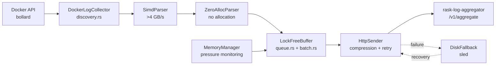

# Rask Log Forwarder

_Last reviewed: February 28, 2026_

**Location:** `rask-log-forwarder/app`

## Role
- Rust 1.87+ (2024 Edition) サイドカーで Docker ログを収集し rask-log-aggregator に転送
- `bollard` で Docker ログを tail、SIMD パーサーで高速処理 (>4 GB/s)
- ロックフリーバッファリング、バックプレッシャー対応
- aggregator 不可用時のディスクフォールバック (`sled`)

## Architecture & Flow

| Component | Responsibility |
| --- | --- |
| `main.rs` | CLI エントリポイント |
| `app/config.rs` | 設定管理 (clap + env) |
| `collector/docker.rs` | Docker ログ収集 |
| `collector/discovery.rs` | コンテナ自動検出 |
| `parser/simd.rs` | SIMD 対応 JSON パーサー |
| `parser/zero_alloc_parser.rs` | ゼロアロケーション数値パーサー |
| `parser/universal.rs` | ユニバーサルログパーサー |
| `parser/generated.rs` | ビルド時検証済み正規表現 |
| `buffer/lockfree.rs` | ロックフリーバッファ |
| `buffer/queue.rs` | キュー管理 |
| `buffer/batch.rs` | バッチ管理 |
| `buffer/memory.rs` | メモリ管理 + プレッシャー監視 |
| `buffer/backpressure.rs` | バックプレッシャー戦略 |
| `sender/http.rs` | HTTP 送信 |
| `sender/client.rs` | HTTP クライアント管理 |
| `sender/transmission.rs` | 送信制御 + リトライ |
| `reliability/retry.rs` | リトライ管理 (指数/線形/固定) |
| `reliability/disk.rs` | ディスクフォールバック (`sled`) |
| `reliability/health.rs` | ヘルスレポート |



## Forwarder Instances

logging.yaml で定義された 13 インスタンス:

| Instance | Target Service | Description |
|----------|----------------|-------------|
| nginx-logs | nginx | Edge/Reverse proxy |
| alt-backend-logs | alt-backend | Backend API |
| auth-hub-logs | auth-hub | Authentication hub |
| tag-generator-logs | tag-generator | Tag extraction |
| pre-processor-logs | pre-processor | RSS ingestion |
| search-indexer-logs | search-indexer | Meilisearch indexing |
| news-creator-logs | news-creator | LLM summarization |
| news-creator-backend-logs | news-creator-backend | LLM backend (Ollama) |
| recap-worker-logs | recap-worker | Recap orchestrator |
| recap-subworker-logs | recap-subworker | ML clustering |
| dashboard-logs | dashboard | Streamlit UI |
| recap-evaluator-logs | recap-evaluator | Quality evaluation |
| rag-orchestrator-logs | rag-orchestrator | RAG system |

## Configuration & Env

### Core Settings

| Variable | Default | Description |
|----------|---------|-------------|
| `TARGET_SERVICE` | - | 対象サービス名 (自動検出可) |
| `RASK_ENDPOINT` | http://rask-aggregator:9600/v1/aggregate | Aggregator URL |
| `BATCH_SIZE` | 10000 | バッチサイズ |
| `FLUSH_INTERVAL_MS` | 500 | フラッシュ間隔 (ms) |
| `BUFFER_CAPACITY` | 100000 | バッファ容量 |
| `LOG_LEVEL` | info | ログレベル (error/warn/info/debug/trace) |
| `RUST_LOG` | info | Rust ログレベル |
| `CONFIG_FILE` | - | TOML 設定ファイルパス |

### Metrics Settings

| Variable | Default | Description |
|----------|---------|-------------|
| `ENABLE_METRICS` | false | Prometheus メトリクス有効化 |
| `METRICS_PORT` | 9090 | メトリクスエンドポイントポート |

### Reliability Settings

| Variable | Default | Description |
|----------|---------|-------------|
| `ENABLE_DISK_FALLBACK` | false | ディスクフォールバック有効化 |
| `DISK_FALLBACK_PATH` | /tmp/rask-log-forwarder/fallback | フォールバック保存先 |
| `MAX_DISK_USAGE_MB` | 1000 | 最大ディスク使用量 (MB) |

### Performance Settings

| Variable | Default | Description |
|----------|---------|-------------|
| `CONNECTION_TIMEOUT_SECS` | 30 | 接続タイムアウト (秒) |
| `MAX_CONNECTIONS` | 10 | 最大 HTTP 接続数 |
| `ENABLE_COMPRESSION` | false | HTTP リクエスト圧縮 (gzip) |

## CLI Options

```bash
rask-log-forwarder [OPTIONS]

Options:
  --target-service <SERVICE>      対象サービス名
  --endpoint <URL>                Aggregator エンドポイント
  --batch-size <SIZE>             バッチサイズ [default: 10000]
  --flush-interval-ms <MS>        フラッシュ間隔 [default: 500]
  --buffer-capacity <SIZE>        バッファ容量 [default: 100000]
  --log-level <LEVEL>             ログレベル [default: info]
  --enable-metrics                メトリクス有効化
  --metrics-port <PORT>           メトリクスポート [default: 9090]
  --enable-disk-fallback          ディスクフォールバック有効化
  --disk-fallback-path <PATH>     フォールバックパス
  --max-disk-usage-mb <MB>        最大ディスク使用量 [default: 1000]
  --connection-timeout-secs <S>   接続タイムアウト [default: 30]
  --max-connections <N>           最大接続数 [default: 10]
  --enable-compression            圧縮有効化
  --config-file <PATH>            TOML 設定ファイル
  -h, --help                      ヘルプ表示
  -V, --version                   バージョン表示
```

## Pipeline Details

### SIMD Parser
- `simd-json` クレートで JSON パース (>4 GB/s スループット)
- `bumpalo` アリーナアロケーターで一時メモリ管理
- Docker ログ形式 (`log`, `stream`, `time`) を高速デコード

### Zero-Allocation Parser
- 数値パース時のメモリアロケーションを回避
- HTTP ステータスコード (u16)、レスポンスサイズ (u64) を直接パース
- オーバーフローチェック付き安全なパース

### Build-Time Regex Validation
- `build.rs` で正規表現パターンをビルド時検証
- コンパイル済みパターンを `generated.rs` に埋め込み
- インデックス定数 (`pattern_index::*`) で高速アクセス

### Memory Manager
- 3 段階プレッシャー監視: None / Warning (80%) / Critical (95%)
- Warning 時: 1ms スリープでスロットリング
- Critical 時: 10ms スリープ + ドロップ許可

### Buffer Manager
- サイズ/時間ベースでバッチをフラッシュ
- ロックフリー実装 (`parking_lot`)
- バックプレッシャー戦略: Sleep / Yield / Drop / Block

### HTTP Sender
- `reqwest` + rustls でポータブル TLS
- gzip 圧縮対応 (`flate2`)
- 指数バックオフでリトライ (jitter 付き)

### Retry Manager
- 戦略: `ExponentialBackoff` / `LinearBackoff` / `FixedDelay`
- デフォルト: 最大 5 回、base 500ms、max 60s、jitter ±50%
- バッチ単位でリトライ状態管理

### Disk Fallback
- `sled` 組み込み DB でローカル永続化
- aggregator 障害時に自動スピル
- 復旧後に自動リカバリ送信

## Testing & Tooling

```bash
# テスト実行
cargo test

# ベンチマーク (Criterion)
cargo bench

# ビルド (最適化)
cargo build --release

# ローカル実行
cargo run -- --target-service alt-backend \
  --endpoint http://rask-log-aggregator:9600/v1/aggregate
```

**Test Suites:**
- Unit tests: `src/` 内の `#[cfg(test)]` モジュール
- Integration tests: `tests/` ディレクトリ
  - `concurrency_test.rs` - 並行処理テスト
  - `disk_fallback_test.rs` - ディスクフォールバック
  - `reliability_integration_test.rs` - 信頼性統合テスト
  - `retry_integration_test.rs` - リトライ統合テスト
  - `memory_leak_test.rs` - メモリリークテスト
  - `metrics_test.rs` - メトリクステスト

**Benchmarks (Criterion):**
- `parser_benchmarks.rs` - パーサースループット
- `buffer/throughput_benchmarks.rs` - バッファスループット
- `buffer/memory_benchmarks.rs` - メモリ使用量

## Dependencies

### Core Crates

| Crate | Purpose |
|-------|---------|
| `tokio` | 非同期ランタイム |
| `bollard` | Docker API クライアント |
| `bytes` | ゼロコピーバイト列 |
| `simd-json` | SIMD JSON パーサー |
| `reqwest` | HTTP クライアント (rustls) |
| `clap` | CLI パーサー |
| `serde` / `serde_json` | シリアライゼーション |
| `tracing` | 構造化ロギング |

### Optional Features

| Feature | Crates | Description |
|---------|--------|-------------|
| `disk-fallback` | `sled` | ディスク永続化 |
| `metrics` | `prometheus`, `warp` | メトリクスエクスポート |
| `grpc` | `tonic`, `prost` | gRPC サポート |

## Performance Characteristics

- **SIMD パーススループット**: >4 GB/s
- **バッチサイズ**: 10,000 エントリ/バッチ
- **バッファ容量**: 100,000 エントリ
- **メモリ上限**: 100 MB (デフォルト)
- **リリースビルド最適化**: LTO=fat, codegen-units=1, opt-level=3

## Operational Runbook

1. logging プロファイルで全 forwarder を起動:
   ```bash
   docker compose --profile logging up -d
   ```

2. 特定 forwarder のログ確認:
   ```bash
   docker compose logs -f alt-backend-logs
   ```

3. パフォーマンスチューニング:
   - `BUFFER_CAPACITY`, `BATCH_SIZE`, `FLUSH_INTERVAL_MS` を同時調整
   - スループット増加時はこれらを連動して増やす

4. ディスクフォールバック有効化:
   - aggregator レイテンシ急増時にデータロス回避
   - `ENABLE_DISK_FALLBACK=true` + `sled` ボリュームを設定

5. 手動ターゲット指定:
   ```bash
   RASK_TARGET_SERVICE=alt-backend ./rask-log-forwarder
   ```

## Observability
- `RUST_LOG=debug` で詳細スループット診断
- `ENABLE_METRICS=true` で Prometheus エンドポイント公開 (`:9090/metrics`)
- reliability manager がリトライメトリクス、`PendingChunks`、`HealthReport` を記録

## Volume Mounts

各 forwarder インスタンスは以下をマウント:
- `/var/run/docker.sock:/var/run/docker.sock:ro` - Docker socket
- `/var/lib/docker/containers:/var/lib/docker/containers:ro` - Container logs

## LLM Notes
- 各サービスに対応した forwarder インスタンスが存在
- Docker labels (`rask.group`) でターゲットサービスを自動検出
- SIMD パーサーで高速ログ処理 (>4 GB/s)
- ゼロアロケーション数値パースでメモリ効率向上
- バックプレッシャー機構で aggregator 過負荷を防止
- ビルド時正規表現検証でランタイムエラー回避
- `stop_grace_period: 12s` でグレースフルシャットダウン
