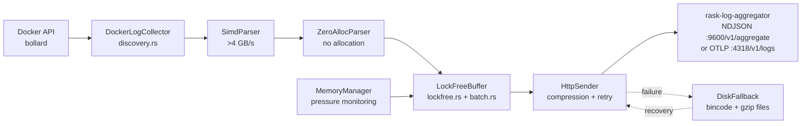

# Rask Log Forwarder

_Last reviewed: September 5, 2026_

**Location:** `rask-log-forwarder/app`

## Role
- Rust 1.94+ (2024 Edition) サイドカーで Docker ログを収集し rask-log-aggregator に転送
- `bollard` で Docker ログを tail、SIMD パーサーで高速処理 (>4 GB/s)
- ロックフリーバッファリング、バックプレッシャー対応
- aggregator 不可用時のディスクフォールバック (バッチ単位のファイル永続化、`bincode` + 任意 gzip 圧縮。組み込み DB は使っていない)
- デフォルトは legacy NDJSON (`/v1/aggregate`) だが、`PROTOCOL=otlp` で OTLP HTTP protobuf 送信 (`/v1/logs`) に切り替え可能 (`otlp` Cargo feature、本番イメージはこの feature 付きでビルドされる)

## Architecture & Flow

| Component | Responsibility |
| --- | --- |
| `main.rs` | CLI エントリポイント |
| `app/config/*.rs` | 設定管理 (clap + env + TOML、CLI/env/`RASK_CONFIG` のマージルール、`groups.rs` に Retry/DiskFallback/Metrics のネスト設定) |
| `app/docker.rs` | ホスト名からのサービス自動検出 (`*-logs` → ターゲット名) |
| `app/protocol.rs` | 送信プロトコル選択 (`SenderConfig`: ndjson/otlp) |
| `app/pipeline.rs` | メイン処理ループ (collect → parse → batch → send) |
| `app/service.rs` | サービス起動・停止のオーケストレーション |
| `app/shutdown.rs` | シグナルハンドリング + graceful shutdown |
| `app/application_initializer.rs` / `initialization.rs` / `logging_system.rs` | 起動時初期化とロギング設定 |
| `collector/docker.rs` | Docker ログ収集 |
| `collector/discovery.rs` | コンテナ自動検出 |
| `parser/simd.rs` | SIMD 対応 JSON パーサー |
| `parser/zero_alloc_parser.rs` | ゼロアロケーション数値パーサー |
| `parser/universal.rs` | ユニバーサルログパーサー (サービス別パーサーへのディスパッチ) |
| `parser/registry.rs` | `ServiceParserRegistry` — サービス名/自動検出優先度からパーサーを解決 |
| `parser/services/*.rs` | サービス別パーサー: `nginx`, `go` (構造化 JSON), `python_structlog`, `rust_tracing`, `postgres`, `meilisearch` |
| `parser/generated.rs` | ビルド時検証済み正規表現 (`build.rs`) |
| `buffer/lockfree.rs` | ロックフリーバッファ |
| `buffer/batch.rs` | バッチ管理 |
| `buffer/memory.rs` | メモリ管理 + プレッシャー監視 |
| `buffer/backpressure.rs` | バックプレッシャー戦略 |
| `buffer/concurrency.rs` | Mutex 汚染からの自動回復付き並行プリミティブ |
| `sender/client.rs` | HTTP クライアント管理 |
| `sender/transmission.rs` | 送信制御 + リトライ |
| `sender/serialization.rs` | NDJSON / (feature 有効時) OTLP protobuf へのバッチシリアライズ |
| `sender/otlp.rs` | OTLP protobuf シリアライザ (`otlp` feature 時のみコンパイル) |
| `reliability/retry.rs` | リトライ管理 (指数/線形/固定) |
| `reliability/disk.rs` | ディスクフォールバック (バッチ 1 個 = 1 ファイル、`bincode` + 任意 gzip) |
| `reliability/health.rs` | ヘルスレポート |


```mermaid
flowchart LR
    Docker[Docker API<br/>bollard]
    Collector[DockerLogCollector<br/>discovery.rs]
    Parser[SimdParser<br/>>4 GB/s]
    ZeroAlloc[ZeroAllocParser<br/>no allocation]
    Memory[MemoryManager<br/>pressure monitoring]
    Buffer[LockFreeBuffer<br/>lockfree.rs + batch.rs]
    Sender[HttpSender<br/>compression + retry]
    Disk[DiskFallback<br/>bincode + gzip files]
    Aggregator[rask-log-aggregator<br/>NDJSON :9600/v1/aggregate<br/>or OTLP :4318/v1/logs]

    Docker --> Collector --> Parser --> ZeroAlloc --> Buffer
    Memory --> Buffer
    Buffer --> Sender --> Aggregator
    Sender -.->|failure| Disk
    Disk -.->|recovery| Sender
```

## Forwarder Instances

`compose/logging.yaml` で定義された 16 インスタンス (`x-rask-forwarder` アンカーを継承し `TARGET_SERVICE` だけ上書き):

| Instance | Target Service | Description |
|----------|----------------|-------------|
| nginx-logs | plecto-proxy (`NGINX_TARGET` で上書き可) | Edge/Reverse proxy (nginx から plecto-proxy に移行済み) |
| alt-backend-logs | alt-backend | Backend API |
| alt-harvester-logs | alt-harvester | alt-backend 3-binary split の定期ジョブバイナリ |
| alt-data-hub-logs | alt-data-hub | alt-backend 3-binary split の alt-db 専有バイナリ (mTLS) |
| auth-hub-logs | auth-hub | Authentication hub |
| tag-generator-logs | tag-generator | Tag extraction |
| pre-processor-logs | pre-processor | RSS ingestion |
| search-indexer-logs | search-indexer | Meilisearch indexing |
| news-creator-logs | news-creator | LLM summarization |
| news-creator-backend-logs | news-creator-backend | LLM backend (Ollama) |
| recap-worker-logs | recap-worker | Recap orchestrator |
| recap-subworker-logs | recap-subworker | ML clustering |
| dashboard-logs | dashboard | Streamlit UI |
| recap-evaluator-logs | recap-evaluator | Quality evaluation |
| rag-orchestrator-logs | rag-orchestrator | RAG system |
| mq-hub-logs | mq-hub | Message queue hub |

`meilisearch-logs` と DB コンテナ (`db-logs`, `recap-db-logs`, `rag-db-logs`) は意図的に未定義 (SQL フラグメントで全ログの 74% を占め、observability 価値が低いため除外)。

## Configuration & Env

### Core Settings

| Variable | Default | Description |
|----------|---------|-------------|
| `TARGET_SERVICE` | - | 対象サービス名 (自動検出可) |
| `RASK_ENDPOINT` | http://rask-aggregator:9600/v1/aggregate | Aggregator URL |
| `BATCH_SIZE` | 10000 | バッチサイズ |
| `FLUSH_INTERVAL_MS` | 500 | フラッシュ間隔 (ms) |
| `BUFFER_CAPACITY` | 100000 | バッファ容量 |
| `LOG_LEVEL` | info | ログレベル (error/warn/info/debug/trace) |
| `RUST_LOG` | info | Rust ログレベル |
| `CONFIG_FILE` | - | TOML 設定ファイルパス |
| `PROTOCOL` | ndjson | 送信プロトコル (`ndjson` または `otlp`) |
| `OTLP_ENDPOINT` | http://rask-log-aggregator:4318/v1/logs | `PROTOCOL=otlp` 時の送信先 |

`compose/logging.yaml` は全インスタンス共通で `BATCH_SIZE=1000` を渡しており、上表のコード上のデフォルト (10000) を上書きしている。

### Metrics Settings

| Variable | Default | Description |
|----------|---------|-------------|
| `ENABLE_METRICS` | false | プロセス内メトリクス収集を有効化するのみ。HTTP エンドポイントは公開されない (下記 Observability 参照) |
| `METRICS_PORT` | 9090 | 設定値として保持されるが、どのプロセスもこのポートで listen していない |

### Reliability Settings

| Variable | Default | Description |
|----------|---------|-------------|
| `ENABLE_DISK_FALLBACK` | false | ディスクフォールバック有効化 |
| `DISK_FALLBACK_PATH` | /tmp/rask-log-forwarder/fallback | フォールバック保存先 |
| `MAX_DISK_USAGE_MB` | 1000 | 最大ディスク使用量 (MB) |

### Performance Settings

| Variable | Default | Description |
|----------|---------|-------------|
| `CONNECTION_TIMEOUT_SECS` | 30 | 接続タイムアウト (秒) |
| `MAX_CONNECTIONS` | 10 | 最大 HTTP 接続数 |
| `ENABLE_COMPRESSION` | false | HTTP リクエスト圧縮 (gzip) |

## CLI Options

```bash
rask-log-forwarder [OPTIONS]

Options:
  --target-service <SERVICE>      対象サービス名
  --endpoint <URL>                Aggregator エンドポイント
  --batch-size <SIZE>             バッチサイズ [default: 10000]
  --flush-interval-ms <MS>        フラッシュ間隔 [default: 500]
  --buffer-capacity <SIZE>        バッファ容量 [default: 100000]
  --log-level <LEVEL>             ログレベル [default: info]
  --enable-metrics                メトリクス有効化
  --metrics-port <PORT>           メトリクスポート [default: 9090]
  --enable-disk-fallback          ディスクフォールバック有効化
  --disk-fallback-path <PATH>     フォールバックパス
  --max-disk-usage-mb <MB>        最大ディスク使用量 [default: 1000]
  --connection-timeout-secs <S>   接続タイムアウト [default: 30]
  --max-connections <N>           最大接続数 [default: 10]
  --enable-compression            圧縮有効化
  --config-file <PATH>            TOML 設定ファイル
  --protocol <ndjson|otlp>        送信プロトコル [default: ndjson]
  --otlp-endpoint <URL>           OTLP 送信先 (protocol=otlp 時)
  -h, --help                      ヘルプ表示
  -V, --version                   バージョン表示
```

## Pipeline Details

### SIMD Parser
- `simd-json` クレートで JSON パース (>4 GB/s スループット)
- `bumpalo` アリーナアロケーターで一時メモリ管理
- Docker ログ形式 (`log`, `stream`, `time`) を高速デコード

### Zero-Allocation Parser
- 数値パース時のメモリアロケーションを回避
- HTTP ステータスコード (u16)、レスポンスサイズ (u64) を直接パース
- オーバーフローチェック付き安全なパース

### Build-Time Regex Validation
- `build.rs` で正規表現パターンをビルド時検証
- コンパイル済みパターンを `generated.rs` に埋め込み
- インデックス定数 (`pattern_index::*`) で高速アクセス

### Service Parser Registry
- `parser/registry.rs` の `ServiceParserRegistry` がサービス名 → パーサー種別のマッピングと自動検出優先度 (`detection_priority`, 0-100) を管理
- `parser/services/*.rs` にサービス別パーサー実装: `nginx` (access/error log)、`go` (構造化 JSON)、`python_structlog` (JSONRenderer)、`rust_tracing` (`tracing_subscriber` fmt().json())、`postgres`、`meilisearch` (ANSI エスケープ除去含む)
- Rust `tracing` は `fields.message` に、Python structlog は `event` にメッセージを入れるなど、サービスごとにログ形式が異なるため自動判定に頼らず明示的にマッピングする ([[000315]])

### Memory Manager
- 3 段階プレッシャー監視: None / Warning (80%) / Critical (95%)
- Warning 時: 1ms スリープでスロットリング
- Critical 時: 10ms スリープ + ドロップ許可

### Buffer Manager
- サイズ/時間ベースでバッチをフラッシュ
- ロックフリー実装 (`parking_lot`)
- バックプレッシャー戦略: Sleep / Yield / Drop / Block

### HTTP Sender
- `reqwest` + rustls でポータブル TLS
- gzip 圧縮対応 (`flate2`)
- 指数バックオフでリトライ (jitter 付き)

### Retry Manager
- 戦略: `ExponentialBackoff` / `LinearBackoff` / `FixedDelay`
- デフォルト: 最大 5 回、base 500ms、max 60s、jitter ±50%
- バッチ単位でリトライ状態管理

### Disk Fallback
- バッチ 1 個を 1 ファイル (`<batch_id>.batch`) として `bincode` でシリアライズし、`DISK_FALLBACK_PATH` 配下にローカル永続化 (任意で gzip 圧縮)。組み込み DB (sled 等) には依存しない
- aggregator 障害時に自動スピル、ディスク使用量が `MAX_DISK_USAGE_MB` を超えないよう管理
- 復旧後に自動リカバリ送信

## Testing & Tooling

```bash
# テスト実行
cargo test

# ベンチマーク (Criterion)
cargo bench

# ビルド (最適化)
cargo build --release

# ローカル実行
cargo run -- --target-service alt-backend \
  --endpoint http://rask-log-aggregator:9600/v1/aggregate
```

**Test Suites:**
- Unit tests: `src/` 内の `#[cfg(test)]` モジュール
- Integration tests: `tests/` ディレクトリ
  - `concurrency_test.rs` - 並行処理テスト
  - `disk_fallback_test.rs` - ディスクフォールバック
  - `reliability_integration_test.rs` - 信頼性統合テスト
  - `retry_integration_test.rs` - リトライ統合テスト
  - `memory_leak_test.rs` - メモリリークテスト
  - `metrics_test.rs` - メトリクステスト

**Benchmarks (Criterion):**
- `parser_benchmarks.rs` - パーサースループット
- `buffer/throughput_benchmarks.rs` - バッファスループット
- `buffer/memory_benchmarks.rs` - メモリ使用量
- `otlp_benchmarks.rs` - OTLP シリアライズ (要 `--features otlp`)

## Dependencies

### Core Crates

| Crate | Purpose |
|-------|---------|
| `tokio` | 非同期ランタイム |
| `bollard` | Docker API クライアント |
| `bytes` | ゼロコピーバイト列 |
| `simd-json` | SIMD JSON パーサー |
| `reqwest` | HTTP クライアント (rustls) |
| `clap` | CLI パーサー |
| `serde` / `serde_json` | シリアライゼーション |
| `tracing` | 構造化ロギング |

### Optional Features (Cargo)

| Feature | Crates | Description |
|---------|--------|-------------|
| `metrics` (default で有効) | `prometheus`, `warp` | Prometheus メトリクスエクスポート |
| `otlp` | `opentelemetry-proto`, `prost`, `prost-types`, `hex` | `PROTOCOL=otlp` の OTLP protobuf シリアライズ。本番 Docker イメージはこの feature を有効にしてビルドされる |
| `grpc` | `tonic`, `prost` | 未使用の予約 feature。本番ビルドでは有効化されておらず、gRPC エンドポイントは存在しない |

ディスクフォールバックは Cargo feature ではなく `ENABLE_DISK_FALLBACK` の実行時設定で有効/無効を切り替える (`sled` 等の組み込み DB クレートには依存しない、上記 Disk Fallback 参照)。

## Performance Characteristics

- **SIMD パーススループット**: >4 GB/s
- **バッチサイズ**: コード上のデフォルトは 10,000 エントリ/バッチだが、`compose/logging.yaml` は全インスタンス共通で `BATCH_SIZE=1000` を渡しており実運用値は 1,000
- **バッファ容量**: 100,000 エントリ
- **メモリ上限**: 100 MB (デフォルト)
- **リリースビルド最適化**: LTO=fat, codegen-units=1, opt-level=3

## Operational Runbook

1. `logging.yaml` は compose profile ではなく `compose/compose.yaml` の `include:` チェーンの一部なので、通常起動で全 forwarder が立ち上がる:
   ```bash
   docker compose -f compose/compose.yaml -p alt up -d
   ```

2. 特定 forwarder のログ確認:
   ```bash
   docker compose -f compose/compose.yaml -p alt logs -f alt-backend-logs
   ```

3. パフォーマンスチューニング:
   - `BUFFER_CAPACITY`, `BATCH_SIZE`, `FLUSH_INTERVAL_MS` を同時調整
   - スループット増加時はこれらを連動して増やす

4. ディスクフォールバック有効化:
   - aggregator レイテンシ急増時にデータロス回避
   - `ENABLE_DISK_FALLBACK=true` + `DISK_FALLBACK_PATH` の永続ボリュームを設定

5. 手動ターゲット指定:
   ```bash
   TARGET_SERVICE=alt-backend ./rask-log-forwarder
   ```

## Observability
- `RUST_LOG=debug` で詳細スループット診断
- `ENABLE_METRICS=true` は内部メトリクス収集を有効にするだけで、HTTP エンドポイントは公開されない。`PrometheusExporter::start_server` (`reliability/metrics.rs`) はどこからも呼ばれていない未配線コードで、`METRICS_PORT` を listen しているプロセスは存在しない
- reliability manager がリトライメトリクス、`PendingChunks`、`HealthReport` を記録

## Volume Mounts

各 forwarder インスタンスは以下をマウント:
- `/var/run/docker.sock:/var/run/docker.sock:ro` - Docker socket
- `/var/lib/docker/containers:/var/lib/docker/containers:ro` - Container logs

## Known failure patterns

Distilled from the ADR / postmortem corpus (see `docs/runbooks/crystallized-knowledge.md`).

- **Log parsers need an explicit per-service format mapping** — Rust `tracing` emits `fields.message`, Python structlog emits `event`; the auto-detect fallback is non-deterministic and silently produced empty `message` columns in ClickHouse. Map every service's log formatter explicitly ([[000315]]).
- **Trace context fields were dropped at the forwarder hop** — trace_id/span_id passthrough had to be added to the forwarder as part of the 8-ADR trace-context saga; verify any new field end-to-end, not per-hop ([[000124]], [[000125]]; saga overview [[000122]]–[[000135]]).
- **DB containers are excluded from collection by design** — collecting PostgreSQL-family container logs was permanently stopped (74% noise reduction); do not add forwarder instances for them ([[000098]]).
- **A retry storm upstream floods the whole pipeline** — a component retrying at ms intervals produced 148 GB of logs before detection; per-container log volume is a first-class health metric, not just payload (PM-2026-042).
- **Containers without a compose `logging` cap eat the host disk** — pin json-file `max-size`/`max-file`; an OOM-restart loop otherwise fills the disk ([[000895]]).

## LLM Notes
- 各サービスに対応した forwarder インスタンスが存在
- ターゲットコンテナの選択は `TARGET_SERVICE` (未設定時は `com.docker.compose.service` ラベルまたは `*-logs` ホスト名) で決まる。`rask.group` ラベルは選択には使われず、検出したコンテナから読み取って下流へ引き渡すエンリッチメント用 (`collector/discovery.rs`)
- SIMD パーサーで高速ログ処理 (>4 GB/s)
- ゼロアロケーション数値パースでメモリ効率向上
- バックプレッシャー機構で aggregator 過負荷を防止
- ビルド時正規表現検証でランタイムエラー回避
- `stop_grace_period: 12s` でグレースフルシャットダウン
