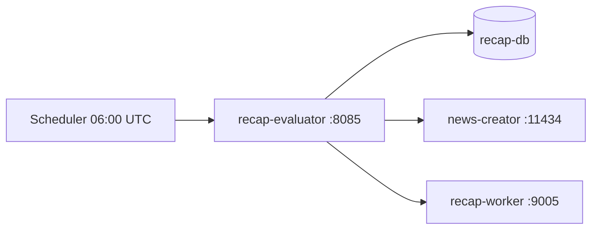

# Recap Evaluator

_Last reviewed: January 13, 2026_

**Location:** `recap-evaluator`

## Role
- RecapJob 精度評価マイクロサービス
- 7日間 Recap の品質を多角的に評価
- G-Eval による LLM ベース評価 (Ollama 連携)

## Architecture & Flow

| Component | Responsibility |
| --- | --- |
| `main.py` | FastAPI アプリケーションエントリポイント |
| `api/routes.py` | API ルートハンドラー |
| `config.py` | 設定管理 |
| `infra/database.py` | recap-db 接続 |
| `infra/ollama.py` | Ollama LLM クライアント |
| `utils/logging.py` | structlog ロギング設定 |



## Endpoints & Behavior
- `GET /health` - ヘルスチェック
- `POST /evaluate` - 手動評価トリガー
- `GET /evaluations` - 評価結果一覧
- `GET /evaluations/{id}` - 評価結果詳細

## Evaluation Metrics

| Metric | Description |
|--------|-------------|
| G-Eval Coherence | 要約の一貫性スコア (LLM 評価) |
| G-Eval Fluency | 要約の流暢さスコア (LLM 評価) |
| G-Eval Relevance | 要約の関連性スコア (LLM 評価) |
| Coverage | エビデンスカバレッジ率 |
| Cluster Quality | クラスタリング品質 |

## Configuration & Env

| Variable | Default | Description |
|----------|---------|-------------|
| `RECAP_DB_DSN` | postgres://... | recap-db 接続文字列 |
| `OLLAMA_URL` | http://news-creator:11434 | Ollama API URL |
| `RECAP_WORKER_URL` | http://recap-worker:9005 | recap-worker URL |
| `EVALUATION_SCHEDULE` | 0 6 * * * | cron スケジュール (UTC) |
| `LOG_LEVEL` | INFO | ログレベル |
| `LOG_FORMAT` | json | ログフォーマット |
| `HOST` | 0.0.0.0 | バインドホスト |
| `PORT` | 8080 | バインドポート (内部) |

## Scheduled Evaluation
- 毎日 06:00 UTC (15:00 JST) に自動評価実行
- cron 式: `0 6 * * *`

## Testing & Tooling
```bash
# テスト実行
uv run pytest

# ローカル起動
uv run python -m recap_evaluator.main

# Docker 起動
docker compose -f compose/recap.yaml up recap-evaluator -d

# ヘルスチェック
curl http://localhost:8085/health
```

## Operational Runbook
1. `docker compose -f compose/recap.yaml up recap-evaluator -d` で起動
2. `curl http://localhost:8085/health` でヘルスチェック
3. 手動評価: `curl -X POST http://localhost:8085/evaluate`
4. 結果確認: `curl http://localhost:8085/evaluations`

## Observability
- 構造化ログ: structlog JSON フォーマット
- ログレベル: LOG_LEVEL 環境変数で設定
- rask.group ラベル: `recap-evaluator`

## Dependencies
- recap-db: 評価対象データ取得
- news-creator (Ollama): G-Eval LLM 評価
- recap-worker: ジョブ状態確認

## Resource Limits
- Memory: 2GB limit, 512MB reservation

## LLM Notes
- FastAPI + structlog による Python サービス
- G-Eval は LLM (Ollama) を使用した要約品質評価手法
- スケジュール評価は cron 式で設定
- Ollama が利用不可の場合、G-Eval 評価はスキップ (警告ログ)
- ポートマッピング: 外部 8085 → 内部 8080
