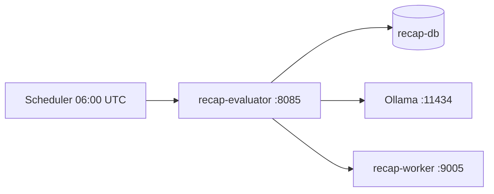

# Recap Evaluator

_Last reviewed: February 28, 2026_

**Location:** `recap-evaluator`

## Role
- RecapJob 精度評価マイクロサービス
- 7日間 Recap の品質を多角的に評価
- 多次元要約品質評価: G-Eval (Ollama), ROUGE, BERTScore, Faithfulness (NLI)

## Architecture & Flow

Clean Architecture レイヤー: Handler -> Usecase -> Port -> Gateway -> Driver

| Component | Responsibility |
| --- | --- |
| `main.py` | FastAPI アプリケーションエントリポイント・DI Composition Root |
| `config.py` | 設定管理 (Settings, AlertThresholds, EvaluatorWeights) |
| `handler/evaluation_handler.py` | 評価 API ルートハンドラー (`/api/v1/evaluations/*`) |
| `handler/metrics_handler.py` | メトリクス API ルートハンドラー (`/api/v1/metrics/*`) |
| `handler/health_handler.py` | ヘルスチェック (`/health`) |
| `handler/schemas.py` | Pydantic リクエスト/レスポンススキーマ |
| `usecase/run_evaluation.py` | 全次元評価実行ユースケース |
| `usecase/get_metrics.py` | メトリクス取得ユースケース |
| `usecase/alert_resolver.py` | アラートレベル判定 |
| `port/database_port.py` | DB ポート (Protocol) |
| `port/llm_port.py` | LLM ポート (Protocol) |
| `port/evaluation_port.py` | 評価ポート (Protocol) |
| `port/recap_worker_port.py` | recap-worker ポート (Protocol) |
| `gateway/postgres_gateway.py` | AsyncPG DB ゲートウェイ |
| `gateway/ollama_gateway.py` | Ollama G-Eval ゲートウェイ |
| `gateway/recap_worker_gateway.py` | recap-worker HTTP ゲートウェイ |
| `evaluator/genre_evaluator.py` | ジャンル分類評価 |
| `evaluator/summary_evaluator.py` | 多次元要約品質評価オーケストレーター |
| `evaluator/cluster_evaluator.py` | クラスタリング品質評価 |
| `evaluator/pipeline_evaluator.py` | パイプライン健全性評価 |
| `evaluator/rouge_eval.py` | ROUGE メトリクス (n-gram overlap) |
| `evaluator/bertscore_eval.py` | BERTScore メトリクス (semantic similarity) |
| `evaluator/faithfulness_eval.py` | NLI ベース Faithfulness 評価 (幻覚検出) |
| `scheduler/evaluation_scheduler.py` | APScheduler cron スケジューラー |
| `domain/models.py` | ドメインモデル (EvaluationRun, SummaryMetrics, etc.) |
| `utils/logging.py` | ADR 98 準拠ロギング |
| `utils/otel.py` | OpenTelemetry プロバイダー |



## Endpoints & Behavior

All endpoints use `/api/v1` prefix (evaluation, metrics). Health check is at root.

| Method | Path | Description |
|--------|------|-------------|
| `GET` | `/api/v1/evaluations` | 評価履歴一覧 (query: `evaluation_type`, `limit`) |
| `POST` | `/api/v1/evaluations/run` | 全次元評価実行 (body: `window_days`, `include_*`, `sample_per_job`) |
| `POST` | `/api/v1/evaluations/genre` | ジャンル分類評価 (body: `trigger_new`) |
| `POST` | `/api/v1/evaluations/cluster` | クラスタリング品質評価 (body: `window_days`) |
| `POST` | `/api/v1/evaluations/summary` | 多次元要約品質評価 (body: `window_days`, `sample_per_job`) |
| `GET` | `/api/v1/evaluations/{evaluation_id}` | 評価詳細取得 |
| `GET` | `/api/v1/metrics/latest` | 最新メトリクスサマリー |
| `GET` | `/api/v1/metrics/trends` | メトリクストレンド (query: `window_days`) |
| `GET` | `/health` | ヘルスチェック |

## Evaluation Metrics

### Genre Classification
| Metric | Description |
|--------|-------------|
| macro_f1 | マクロ平均 F1 スコア |
| micro_f1 | マイクロ平均 F1 スコア |
| macro_precision | マクロ平均適合率 |
| macro_recall | マクロ平均再現率 |
| weighted_f1 | 加重 F1 スコア |
| per_genre_metrics | ジャンル別詳細 (precision/recall/f1/support) |

### Cluster Quality
| Metric | Description |
|--------|-------------|
| silhouette_score | シルエット係数 (-1~1, 高いほど良い) |
| davies_bouldin_index | Davies-Bouldin 指数 (低いほど良い) |
| calinski_harabasz_index | Calinski-Harabasz 指数 (高いほど良い) |
| nmi | 正規化相互情報量 (ground truth ありの場合) |
| ari | 調整ランド指数 (ground truth ありの場合) |
| homogeneity / completeness / v_measure | クラスタリング均質性指標 |
| num_clusters | クラスター数 |
| avg/min/max_cluster_size | クラスターサイズ統計 |

### Summary Quality (Multi-Dimensional)

要約品質評価は4つの手法を組み合わせた多次元評価。各手法の重みは `WEIGHT_*` 環境変数で設定可能。

#### G-Eval via Ollama

Ollama の `/api/generate` エンドポイントを使用して LLM ベースの要約品質評価を実行する。

- **モデル**: `gemma3-4b-8k` (デフォルト、`OLLAMA_MODEL` で変更可能)
- **プロンプト**: 日本語プロンプトで4次元を1-5点で評価。JSON 構造化出力を要求
- **パラメータ**: `temperature: 0.1`, `num_predict: 256`, `stream: false`
- **並行制御**: `asyncio.Semaphore` でリクエスト並行数を制限 (デフォルト5、`OLLAMA_CONCURRENCY`)
- **ソーステキスト**: 元記事を最大4000文字に切り詰めてプロンプトに含める
- **レスポンスパース**: 正規表現で JSON を抽出し、各次元スコアを取得
- **ヘルスチェック**: 起動時に `/api/tags` で Ollama 接続・モデル存在を確認

| Metric | Description |
|--------|-------------|
| coherence | 論理性スコア (1-5) |
| consistency | 整合性スコア (1-5) |
| fluency | 流暢さスコア (1-5) |
| relevance | 関連性スコア (1-5) |
| geval_overall | G-Eval 平均スコア |

#### ROUGE
| Metric | Description |
|--------|-------------|
| rouge_1_f1 | ROUGE-1 F1 (unigram overlap) |
| rouge_2_f1 | ROUGE-2 F1 (bigram overlap) |
| rouge_l_f1 | ROUGE-L F1 (longest common subsequence) |

日本語テキストは文字レベルトークナイズ (`JapaneseTokenizer`) を使用。

#### BERTScore
| Metric | Description |
|--------|-------------|
| bertscore_precision | BERTScore 適合率 |
| bertscore_recall | BERTScore 再現率 |
| bertscore_f1 | BERTScore F1 |

モデル: 日本語 `cl-tohoku/bert-base-japanese-v3`、英語 `microsoft/deberta-xlarge-mnli`。

#### Faithfulness (NLI-based Hallucination Detection)
| Metric | Description |
|--------|-------------|
| faithfulness_score | 忠実性スコア (0-1, 高いほど良い) |
| hallucination_rate | 幻覚率 (0-1, 低いほど良い) |

NLI モデル `tasksource/ModernBERT-base-nli` を使用。要約文を文単位に分割し、元記事との含意関係を max-pooling 戦略で判定。

#### Composite Score
| Metric | Description |
|--------|-------------|
| overall_quality_score | 加重複合スコア (0-1) |

デフォルト重み配分: G-Eval 40%, BERTScore 25%, Faithfulness 25%, ROUGE-L 10%。

### Pipeline Health
| Metric | Description |
|--------|-------------|
| success_rate | ジョブ成功率 |
| total_jobs | 総ジョブ数 |
| completed_jobs | 完了ジョブ数 |
| failed_jobs | 失敗ジョブ数 |
| avg_articles_per_job | ジョブあたり平均記事数 |
| avg_processing_time_seconds | 平均処理時間 |
| stage_success_rates | ステージ別成功率 |

## Configuration & Env

| Variable | Default | Description |
|----------|---------|-------------|
| `RECAP_DB_DSN` | (required) | recap-db 接続文字列 |
| `DB_POOL_MIN_SIZE` | 5 | DB プール最小サイズ |
| `DB_POOL_MAX_SIZE` | 20 | DB プール最大サイズ |
| `OLLAMA_URL` | http://localhost:11434 | Ollama API URL |
| `OLLAMA_MODEL` | gemma3-4b-8k | G-Eval 用モデル |
| `OLLAMA_TIMEOUT` | 120 | Ollama タイムアウト (秒, 10-600) |
| `OLLAMA_CONCURRENCY` | 5 | Ollama 並行リクエスト数 (1-20) |
| `RECAP_WORKER_URL` | http://localhost:8081 | recap-worker API URL |
| `EVALUATION_WINDOW_DAYS` | 14 | 評価対象期間 (日, 1-90) |
| `GEVAL_SAMPLE_SIZE` | 50 | G-Eval サンプル数 (1-200) |
| `EVALUATION_SCHEDULE` | 0 6 * * * | cron スケジュール (UTC) |
| `ENABLE_SCHEDULER` | true | スケジュール評価有効化 |
| `EVALUATION_THREAD_POOL_SIZE` | 4 | CPU-bound 評価用スレッドプール (1-16) |
| `CORS_ALLOWED_ORIGINS` | ["http://localhost:3000"] | CORS 許可オリジン |
| `LOG_LEVEL` | INFO | ログレベル |
| `LOG_FORMAT` | json | ログフォーマット |
| `HOST` | 0.0.0.0 | バインドホスト |
| `PORT` | 8080 | バインドポート (内部) |
| `OTEL_ENABLED` | true | OpenTelemetry 有効化 |
| `OTEL_SERVICE_NAME` | recap-evaluator | サービス名 |
| `OTEL_EXPORTER_OTLP_ENDPOINT` | http://localhost:4318 | OTLP エンドポイント |

### Evaluator Weights

`WEIGHT_` プレフィックス付き環境変数で複合スコアの重み配分を設定 (合計 1.0)。

| Variable | Default | Description |
|----------|---------|-------------|
| `WEIGHT_GEVAL` | 0.40 | G-Eval 重み (40%) |
| `WEIGHT_BERTSCORE` | 0.25 | BERTScore 重み (25%) |
| `WEIGHT_FAITHFULNESS` | 0.25 | Faithfulness 重み (25%) |
| `WEIGHT_ROUGE_L` | 0.10 | ROUGE-L 重み (10%) |

## Alert Thresholds

閾値は `ALERT_` プレフィックス付き環境変数で設定可能。

| Metric | Warn | Critical |
|--------|------|----------|
| `GENRE_MACRO_F1` | 0.70 | 0.60 |
| `CLUSTERING_SILHOUETTE` | 0.25 | 0.15 |
| `GEVAL_COHERENCE` | 3.5 | 3.0 |
| `GEVAL_CONSISTENCY` | 3.5 | 3.0 |
| `GEVAL_FLUENCY` | 3.5 | 3.0 |
| `GEVAL_RELEVANCE` | 3.5 | 3.0 |
| `ROUGE_L_F1` | 0.30 | 0.20 |
| `BERTSCORE_F1` | 0.60 | 0.40 |
| `FAITHFULNESS_SCORE` | 0.60 | 0.40 |
| `HALLUCINATION_RATE` | 0.30 | 0.50 |
| `OVERALL_QUALITY_SCORE` | 0.50 | 0.30 |
| `PIPELINE_SUCCESS_RATE` | 0.95 | 0.90 |

## Scheduled Evaluation
- 毎日 06:00 UTC (15:00 JST) に自動評価実行
- cron 式: `0 6 * * *`
- `ENABLE_SCHEDULER=false` で無効化可能
- APScheduler (AsyncIOScheduler) + CronTrigger を使用

## Testing & Tooling
```bash
# テスト実行
uv run pytest

# ローカル起動
uv run python -m recap_evaluator.main

# Docker 起動
docker compose -f compose/recap.yaml up recap-evaluator -d

# ヘルスチェック
curl http://localhost:8085/health
```

## Operational Runbook
1. `docker compose -f compose/recap.yaml up recap-evaluator -d` で起動
2. `curl http://localhost:8085/health` でヘルスチェック
3. 全次元評価: `curl -X POST http://localhost:8085/api/v1/evaluations/run -H "Content-Type: application/json" -d '{"window_days": 14}'`
4. 最新メトリクス: `curl http://localhost:8085/api/v1/metrics/latest`
5. 評価履歴: `curl http://localhost:8085/api/v1/evaluations`

## Observability
- 構造化ログ: structlog JSON フォーマット (ADR 98 準拠)
- OpenTelemetry: OTLP tracing/logging (http://localhost:4318)
- FastAPI 自動計装: `opentelemetry-instrumentation-fastapi`
- ビジネスコンテキスト: `alt.job.id`, `alt.processing.stage`, `alt.ai.pipeline`
- rask.group ラベル: `recap-evaluator`

## Dependencies
- **Python**: >=3.13
- **Web Framework**: FastAPI 0.115+, uvicorn
- **Database**: asyncpg
- **HTTP**: httpx
- **Evaluation**: scikit-learn, numpy, rouge-score, bert-score, transformers
- **Report**: jinja2, pandas, openpyxl
- **Logging**: structlog
- **Observability**: opentelemetry-sdk, opentelemetry-exporter-otlp-proto-http, opentelemetry-instrumentation-fastapi
- **Scheduling**: apscheduler
- **Settings**: pydantic-settings

### Runtime Dependencies
- recap-db: 評価対象データ取得
- Ollama: G-Eval LLM 評価 (gemma3-4b-8k)
- recap-worker: ジャンル評価結果取得
- HuggingFace Models (自動ダウンロード): BERTScore用 `cl-tohoku/bert-base-japanese-v3`, Faithfulness用 `tasksource/ModernBERT-base-nli`

## Resource Limits
- Memory: 2GB limit, 512MB reservation

## LLM Notes
- FastAPI + structlog による Python サービス
- 要約品質評価は4手法の多次元評価: G-Eval (Ollama), ROUGE, BERTScore, Faithfulness (NLI)
- G-Eval は Ollama `/api/generate` エンドポイント経由で gemma3-4b-8k を使用
- G-Eval プロンプトは日本語、JSON 構造化出力を要求 (temperature 0.1)
- G-Eval は async + semaphore 並行制御、ROUGE/BERTScore/Faithfulness は ThreadPoolExecutor で並列実行
- スケジュール評価は APScheduler の CronTrigger で設定
- Ollama が利用不可の場合、G-Eval 評価はスキップ (警告ログ)
- ポートマッピング: 外部 8085 -> 内部 8080
- 4つの評価次元: Genre, Cluster, Summary (multi-dimensional), Pipeline
