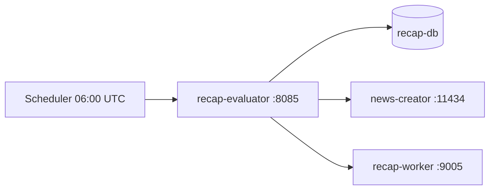

# Recap Evaluator

_Last reviewed: January 22, 2026_

**Location:** `recap-evaluator`

## Role
- RecapJob 精度評価マイクロサービス
- 7日間 Recap の品質を多角的に評価
- G-Eval による LLM ベース評価 (Ollama 連携)

## Architecture & Flow

| Component | Responsibility |
| --- | --- |
| `main.py` | FastAPI アプリケーションエントリポイント |
| `config.py` | 設定管理・アラート閾値 |
| `api/routes.py` | API ルートハンドラー |
| `api/schemas.py` | Pydantic スキーマ |
| `domain/models.py` | ドメインモデル |
| `infra/database.py` | AsyncPG DB クライアント |
| `infra/ollama.py` | Ollama G-Eval クライアント |
| `evaluators/genre.py` | ジャンル分類評価 |
| `evaluators/summary.py` | 要約品質評価 (G-Eval) |
| `evaluators/cluster.py` | クラスタリング品質評価 |
| `evaluators/pipeline.py` | パイプライン健全性評価 |
| `utils/logging.py` | ADR 98 準拠ロギング |
| `utils/otel.py` | OpenTelemetry プロバイダー |



## Endpoints & Behavior

All endpoints use `/api/v1` prefix.

| Method | Path | Description |
|--------|------|-------------|
| `GET` | `/api/v1/evaluations` | 評価履歴一覧 |
| `POST` | `/api/v1/evaluations/run` | 全次元評価実行 |
| `POST` | `/api/v1/evaluations/genre` | ジャンル分類評価 |
| `POST` | `/api/v1/evaluations/cluster` | クラスタリング品質評価 |
| `POST` | `/api/v1/evaluations/summary` | 要約品質評価 (G-Eval) |
| `GET` | `/api/v1/evaluations/{id}` | 評価詳細取得 |
| `GET` | `/api/v1/metrics/latest` | 最新メトリクスサマリー |
| `GET` | `/api/v1/metrics/trends` | メトリクストレンド |
| `GET` | `/health` | ヘルスチェック |

## Evaluation Metrics

### Genre Classification
| Metric | Description |
|--------|-------------|
| macro_f1 | マクロ平均 F1 スコア |
| micro_f1 | マイクロ平均 F1 スコア |
| macro_precision | マクロ平均適合率 |
| macro_recall | マクロ平均再現率 |
| weighted_f1 | 加重 F1 スコア |
| per_genre_metrics | ジャンル別詳細 (precision/recall/f1/support) |

### Cluster Quality
| Metric | Description |
|--------|-------------|
| silhouette_score | シルエット係数 (-1〜1, 高いほど良い) |
| davies_bouldin_index | Davies-Bouldin 指数 (低いほど良い) |
| calinski_harabasz_index | Calinski-Harabasz 指数 (高いほど良い) |
| nmi | 正規化相互情報量 (ground truth ありの場合) |
| ari | 調整ランド指数 (ground truth ありの場合) |
| num_clusters | クラスター数 |
| avg/min/max_cluster_size | クラスターサイズ統計 |

### Summary G-Eval
| Metric | Description |
|--------|-------------|
| coherence | 一貫性スコア (1-5) |
| consistency | 整合性スコア (1-5) |
| fluency | 流暢さスコア (1-5) |
| relevance | 関連性スコア (1-5) |
| overall | 総合スコア |
| sample_count | 評価サンプル数 |

### Pipeline Health
| Metric | Description |
|--------|-------------|
| success_rate | ジョブ成功率 |
| total_jobs | 総ジョブ数 |
| completed_jobs | 完了ジョブ数 |
| failed_jobs | 失敗ジョブ数 |
| avg_articles_per_job | ジョブあたり平均記事数 |
| avg_processing_time_seconds | 平均処理時間 |
| stage_success_rates | ステージ別成功率 |

## Configuration & Env

| Variable | Default | Description |
|----------|---------|-------------|
| `RECAP_DB_DSN` | postgres://... | recap-db 接続文字列 |
| `DB_POOL_MIN_SIZE` | 5 | DB プール最小サイズ |
| `DB_POOL_MAX_SIZE` | 20 | DB プール最大サイズ |
| `OLLAMA_URL` | http://localhost:11434 | Ollama API URL |
| `OLLAMA_MODEL` | gemma3-4b-16k | G-Eval 用モデル |
| `OLLAMA_TIMEOUT` | 120 | Ollama タイムアウト (秒) |
| `RECAP_WORKER_URL` | http://localhost:8081 | recap-worker API URL |
| `EVALUATION_WINDOW_DAYS` | 14 | 評価対象期間 (日) |
| `GEVAL_SAMPLE_SIZE` | 50 | G-Eval サンプル数 |
| `EVALUATION_SCHEDULE` | 0 6 * * * | cron スケジュール (UTC) |
| `ENABLE_SCHEDULER` | true | スケジュール評価有効化 |
| `LOG_LEVEL` | INFO | ログレベル |
| `LOG_FORMAT` | json | ログフォーマット |
| `HOST` | 0.0.0.0 | バインドホスト |
| `PORT` | 8080 | バインドポート (内部) |
| `OTEL_ENABLED` | true | OpenTelemetry 有効化 |
| `OTEL_SERVICE_NAME` | recap-evaluator | サービス名 |
| `OTEL_EXPORTER_OTLP_ENDPOINT` | http://localhost:4318 | OTLP エンドポイント |

## Alert Thresholds

閾値は `ALERT_` プレフィックス付き環境変数で設定可能。

| Metric | Warn | Critical |
|--------|------|----------|
| `GENRE_MACRO_F1` | 0.70 | 0.60 |
| `CLUSTERING_SILHOUETTE` | 0.25 | 0.15 |
| `GEVAL_COHERENCE` | 3.5 | 3.0 |
| `GEVAL_CONSISTENCY` | 3.5 | 3.0 |
| `GEVAL_FLUENCY` | 3.5 | 3.0 |
| `GEVAL_RELEVANCE` | 3.5 | 3.0 |
| `PIPELINE_SUCCESS_RATE` | 0.95 | 0.90 |

## Scheduled Evaluation
- 毎日 06:00 UTC (15:00 JST) に自動評価実行
- cron 式: `0 6 * * *`
- `ENABLE_SCHEDULER=false` で無効化可能

## Testing & Tooling
```bash
# テスト実行
uv run pytest

# ローカル起動
uv run python -m recap_evaluator.main

# Docker 起動
docker compose -f compose/recap.yaml up recap-evaluator -d

# ヘルスチェック
curl http://localhost:8085/health
```

## Operational Runbook
1. `docker compose -f compose/recap.yaml up recap-evaluator -d` で起動
2. `curl http://localhost:8085/health` でヘルスチェック
3. 全次元評価: `curl -X POST http://localhost:8085/api/v1/evaluations/run -H "Content-Type: application/json" -d '{"window_days": 14}'`
4. 最新メトリクス: `curl http://localhost:8085/api/v1/metrics/latest`
5. 評価履歴: `curl http://localhost:8085/api/v1/evaluations`

## Observability
- 構造化ログ: structlog JSON フォーマット (ADR 98 準拠)
- OpenTelemetry: OTLP tracing/logging (http://localhost:4318)
- ビジネスコンテキスト: `alt.job.id`, `alt.processing.stage`, `alt.ai.pipeline`
- rask.group ラベル: `recap-evaluator`

## Dependencies
- **Python**: >=3.13
- **Web Framework**: FastAPI 0.115+, uvicorn
- **Database**: asyncpg
- **HTTP**: httpx
- **Evaluation**: scikit-learn, numpy, rouge-score, bert-score
- **Report**: jinja2, pandas, openpyxl
- **Logging**: structlog
- **Observability**: opentelemetry-sdk, opentelemetry-exporter-otlp-proto-http
- **Scheduling**: apscheduler

### Runtime Dependencies
- recap-db: 評価対象データ取得
- news-creator (Ollama): G-Eval LLM 評価
- recap-worker: ジャンル評価結果取得

## Resource Limits
- Memory: 2GB limit, 512MB reservation

## LLM Notes
- FastAPI + structlog による Python サービス
- G-Eval は LLM (Ollama gemma3-4b-16k) を使用した要約品質評価手法
- スケジュール評価は cron 式で設定
- Ollama が利用不可の場合、G-Eval 評価はスキップ (警告ログ)
- ポートマッピング: 外部 8085 → 内部 8080
- 4つの評価次元: Genre, Cluster, Summary (G-Eval), Pipeline
