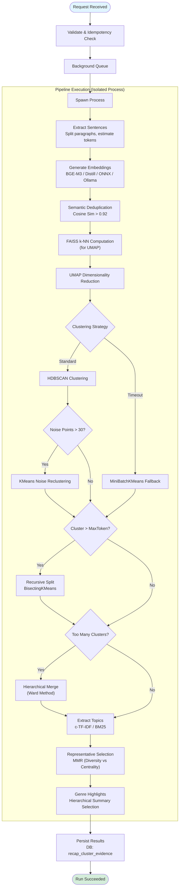
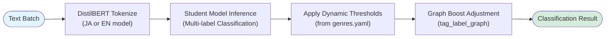
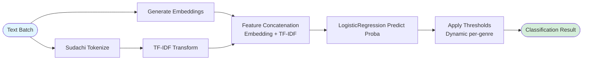
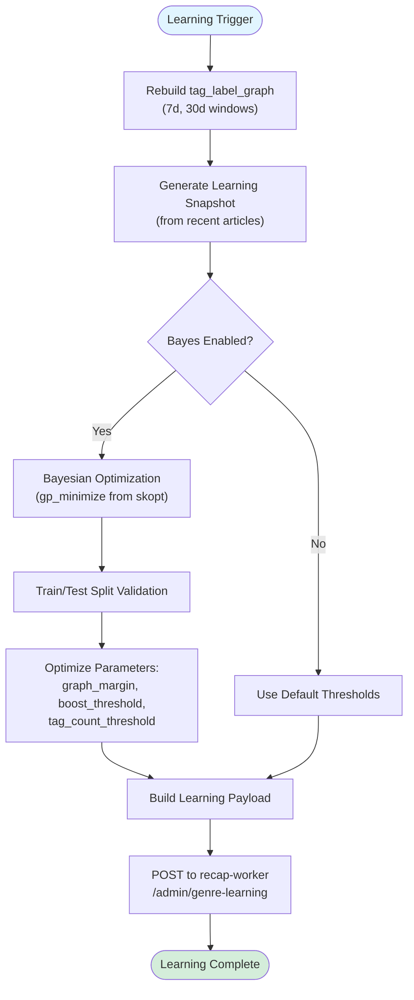

# Recap Subworker

_Last reviewed: January 22, 2026_

**Location:** `recap-subworker/`

## Role
Recap Subworker is a specialized ML/ETL microservice responsible for heavy text processing tasks that support the Recap Worker. It primarily executes:
1.  **Evidence Gathering**: Embeds, deduplicates, and clusters article sentences to form "Evidence Bundles" for summarization.
2.  **Genre Classification**: Provides inference endpoints for genre verification using either traditional ML models (joblib) or DistilBERT-based student models (learning_machine).
3.  **Content Extraction**: Extracts main content from HTML using trafilatura.
4.  **Evaluation**: Provides statistical evaluation of classification and summarization quality.

It runs as a **FastAPI** application on Gunicorn with Uvicorn workers, optimized for high-concurrency CPU-bound operations.

**Python Version**: 3.12+

## Architecture

| Layer | Details |
| --- | --- |
| **HTTP Edge** | `gunicorn` + `uvicorn.workers.UvicornWorker`. Configured for high concurrency with configurable workers and request recycling. |
| **Orchestration** | `RunManager` handles async job submission (`/v1/runs`, `/v1/classify-runs`), idempotency checks (via `XXH3`), and background task scheduling. |
| **Pipeline Execution** | `PipelineTaskRunner` spawns dedicated processes (via `ProcessPoolExecutor`) for CPU-intensive tasks. Supports `inprocess` or `processpool` modes with configurable `max_tasks_per_child` to prevent memory leaks. |
| **ML Engine - Embeddings** | Multiple backends: `sentence-transformers` (BGE-M3/Distill), `onnx`, `hash`, `ollama-remote`. LRU caching for embeddings. |
| **ML Engine - Clustering** | `umap-learn` + `hdbscan` (density-based) with FAISS for k-NN computation. Recursive `BisectingKMeans` for splitting large clusters. `MiniBatchKMeans` fallback on HDBSCAN timeout. Ward hierarchical merging for excessive clusters. |
| **ML Engine - Classification** | Two backends: `joblib` (LogisticRegression + TF-IDF) or `learning_machine` (DistilBERT student models with language-specific models for JA/EN). |
| **Persistence** | Async `SQLAlchemy` (PostgreSQL) for run state, clusters, diagnostics (`recap_run_diagnostics`), evidence (`recap_cluster_evidence`), and evaluation results. |

## API & Endpoints

### 1. Health Check
-   **GET `/health`**: Service health status.
    -   **Response**: `{ status, model_id, backend }`

### 2. Evidence Clustering (`/v1/runs`)
Handles the core "reduce" phase of the recap pipeline using async job pattern.
-   **POST `/v1/runs`**: Submit a generic clustering job.
    -   **Headers**: `X-Alt-Job-Id` (required), `X-Alt-Genre` (required), `Idempotency-Key` (optional)
    -   **Payload**: `ClusterJobPayload` (List of documents, constraints).
    -   **Behavior**: Async 202 Accepted. Starts background processing.
-   **GET `/v1/runs/{run_id}`**: Poll for status (`running` -> `succeeded` | `partial` | `failed`). Returns clusters and representatives.

### 3. Classification Inference (`/v1/classify`)
Provides synchronous batch inference for genre detection.
-   **POST `/v1/classify`**: Classify a batch of texts.
    -   **Payload**: `{ texts: List[str], multi_label: bool = false, top_k: int = 5 }`
    -   **Response**: `{ results: [{ top_genre, confidence, scores, candidates }] }`
    -   **Logic**: Uses configured backend (joblib or learning_machine) with dynamic thresholds.

### 4. Classification Runs (`/v1/classify-runs`)
Async job pattern for classification (matches evidence clustering pattern).
-   **POST `/v1/classify-runs`**: Submit async classification job.
    -   **Headers**: `X-Alt-Job-Id` (required), `Idempotency-Key` (optional)
    -   **Payload**: `ClassificationJobPayload`
    -   **Behavior**: Async 202 Accepted.
-   **GET `/v1/classify-runs/{run_id}`**: Poll classification run status.

### 5. Preprocessing (`/v1`)
-   **POST `/v1/extract`**: Content extraction from HTML.
    -   **Payload**: `{ html: str, include_comments: bool = false }`
    -   **Response**: `{ text: str }`
    -   **Note**: Protected by concurrency semaphore (`extract_concurrency_max`).
-   **POST `/v1/classify/coarse`**: Coarse genre classification.
    -   **Payload**: `{ text: str }`
    -   **Response**: `{ scores: Dict[str, float] }`
-   **POST `/v1/cluster/other`**: Sub-cluster 'Other' genre items.
    -   **Payload**: `{ texts: List[str] }`
    -   **Response**: `{ labels, probabilities, diagnostics }`

### 6. Evaluation (`/v1/evaluation`)
-   **POST `/v1/evaluation/genres`**: Genre classification evaluation with Bootstrap/CV.
    -   **Payload**: `{ golden_data_path, weights_path, use_bootstrap, n_bootstrap, use_cross_validation, n_folds, save_to_db }`
    -   **Response**: Detailed metrics including accuracy CI, macro/micro metrics, per-genre metrics, confusion matrix, statistical power.
-   **POST `/v1/evaluation/summary`**: Summary quality evaluation using DeepEval.
    -   **Payload**: `{ source_text, generated_summary, context, save_to_db }`
    -   **Response**: `{ relevance, brevity, consistency, faithfulness }`

### 7. Administration (`/admin`)
-   **POST `/admin/warmup`**: Pre-loads models (Embedder, Tokenizers) into memory.
-   **POST `/admin/build-graph`**: Manually trigger `tag_label_graph` rebuild.
    -   **Response**: `{ status, edge_counts: { "7d": N, "30d": M }, total_edges }`
-   **POST `/admin/learning`**: Trigger synchronous genre learning (graph rebuild + payload generation).
    -   **Behavior**: Rebuilds tag_label_graph, generates learning result, sends to recap-worker.
-   **POST `/admin/graph-jobs`**: Async graph build job (202 Accepted).
    -   **Response**: `{ job_id }`
-   **GET `/admin/graph-jobs/{job_id}`**: Poll graph job status.
-   **POST `/admin/learning-jobs`**: Async learning job with Bayesian threshold optimization.
    -   **Response**: `{ job_id }`
-   **GET `/admin/learning-jobs/{job_id}`**: Poll learning job status.

## Workflows

### Evidence Pipeline Flow
This process converts a raw corpus of articles into structured "clusters" of evidence.



### Classification Inference Flow (Learning Machine)
Used by `recap-worker` (or other clients) to verify or refine genre assignments using student models.



### Classification Inference Flow (Joblib - Legacy)
Traditional ML pipeline using embeddings and TF-IDF.



### Learning & Threshold Optimization Flow



## Key Configuration (Environment Variables)

### Core Settings

| Variable | Default | Description |
| --- | --- | --- |
| `RECAP_SUBWORKER_PIPELINE_MODE` | `inprocess` | Execution strategy: `inprocess` or `processpool`. |
| `RECAP_SUBWORKER_PIPELINE_WORKER_PROCESSES` | `2` | Number of concurrent pipeline worker processes. |
| `RECAP_SUBWORKER_PROCESS_POOL_SIZE` | `2` | Number of worker processes in the process pool. |
| `RECAP_SUBWORKER_MODEL_BACKEND` | `sentence-transformers` | Embedding backend: `sentence-transformers`, `onnx`, `hash`, `ollama-remote`. |
| `RECAP_SUBWORKER_DEVICE` | `cpu` | Device for embedding inference (`cpu` or `cuda`). |

### Classification Settings

| Variable | Default | Description |
| --- | --- | --- |
| `RECAP_SUBWORKER_CLASSIFICATION_BACKEND` | `learning_machine` | Backend: `joblib` or `learning_machine`. |
| `RECAP_SUBWORKER_CLASSIFICATION_DEVICE` | (inherits device) | Device for classification inference. |
| `RECAP_SUBWORKER_CLASSIFICATION_WORKER_PROCESSES` | `6` | Classification worker processes. |
| `RECAP_SUBWORKER_LEARNING_MACHINE_STUDENT_JA_DIR` | `.../artifacts/student/v0_ja` | Japanese student model path. |
| `RECAP_SUBWORKER_LEARNING_MACHINE_STUDENT_EN_DIR` | `.../artifacts/student/v0_en` | English student model path. |
| `RECAP_SUBWORKER_LEARNING_MACHINE_TAXONOMY_PATH` | `.../taxonomy/genres.yaml` | Taxonomy file for genre classification. |
| `RECAP_SUBWORKER_GENRE_THRESHOLDS` | `{}` | JSON string mapping genres to custom threshold values. |

### Clustering Settings

| Variable | Default | Description |
| --- | --- | --- |
| `RECAP_SUBWORKER_CLUSTERING_RECURSIVE_ENABLED` | `true` | Enable recursive splitting of large clusters. |
| `RECAP_SUBWORKER_USE_BAYES_OPT` | `true` | Enable Optuna-based hyperparameter tuning for clustering. |
| `RECAP_SUBWORKER_HDBSCAN_TIMEOUT_SECS` | `300` | HDBSCAN timeout before fallback to MiniBatchKMeans. |
| `RECAP_SUBWORKER_HDBSCAN_MIN_CLUSTER_SIZE` | `5` | HDBSCAN minimum cluster size. |
| `RECAP_SUBWORKER_HDBSCAN_MIN_SAMPLES` | `5` | HDBSCAN minimum samples. |

### Learning & Graph Settings

| Variable | Default | Description |
| --- | --- | --- |
| `RECAP_SUBWORKER_LEARNING_BAYES_ENABLED` | `true` | Enable Bayesian threshold tuning. |
| `RECAP_SUBWORKER_LEARNING_BAYES_ITERATIONS` | `30` | Bayes optimization iterations. |
| `RECAP_SUBWORKER_LEARNING_SCHEDULER_ENABLED` | `true` | Enable automatic periodic learning. |
| `RECAP_SUBWORKER_LEARNING_SCHEDULER_INTERVAL_HOURS` | `4.0` | Learning interval in hours. |
| `RECAP_SUBWORKER_GRAPH_BUILD_ENABLED` | `true` | Enable tag_label_graph rebuild. |
| `RECAP_SUBWORKER_GRAPH_BUILD_WINDOWS` | `7,30` | Window days for graph building (comma-separated). |
| `RECAP_SUBWORKER_GRAPH_BUILD_MAX_TAGS` | `6` | Maximum tags per article to consider. |
| `RECAP_SUBWORKER_GRAPH_BUILD_MIN_SUPPORT` | `3` | Minimum article count for an edge. |

### Ollama Remote Embedding Settings

| Variable | Default | Description |
| --- | --- | --- |
| `OLLAMA_EMBED_URL` | - | Remote Ollama API URL (required when backend=`ollama-remote`). |
| `OLLAMA_EMBED_MODEL` | `mxbai-embed-large` | Ollama embedding model name. |
| `OLLAMA_EMBED_TIMEOUT` | `30.0` | Timeout for Ollama API calls. |

### Concurrency & Limits

| Variable | Default | Description |
| --- | --- | --- |
| `RECAP_SUBWORKER_MAX_BACKGROUND_RUNS` | `2` | Maximum concurrent background runs per worker. |
| `RECAP_SUBWORKER_CLASSIFICATION_CONCURRENCY` | `8` | Maximum concurrent classification submissions. |
| `RECAP_SUBWORKER_EXTRACT_CONCURRENCY_MAX` | `20` | Maximum concurrent /v1/extract requests. |
| `RECAP_SUBWORKER_RUN_EXECUTION_TIMEOUT_SECONDS` | `2400` | Hard timeout for a single genre run (40 minutes). |

## Observability
-   **Metrics**: Prometheus at `/metrics`. Tracks `embed_seconds`, `hdbscan_seconds`, `dedup_removed`, classification throughput, learning scheduler metrics.
-   **Diagnostics**: Every run stores a `diagnostics` JSON in Postgres.
    -   `noise_ratio`: % of sentences discarded as noise by HDBSCAN.
    -   `dbcv_score`: Density-Based Clustering Validation score (cluster quality).
    -   `dedup_pairs`: Number of sentences removed as duplicates.
-   **Evaluation Metrics**: Classification and summarization evaluation results stored in `recap_system_metrics` table.

## Development & Testing

### Commands
```bash
# Run Unit Tests
uv run pytest tests/unit

# Run Integration Tests
uv run pytest tests/integration

# Check Code Quality
uv run ruff check

# Type Checking
uv run mypy recap_subworker
```

### Learning Machine Model Training
```bash
# Train Japanese student model
uv run python -m recap_subworker.learning_machine.train --lang ja

# Train English student model
uv run python -m recap_subworker.learning_machine.train --lang en
```

### Taxonomy Validation
The `genres.yaml` taxonomy file defines the genre hierarchy and thresholds for the learning_machine backend. Ensure it's validated before deployment.
