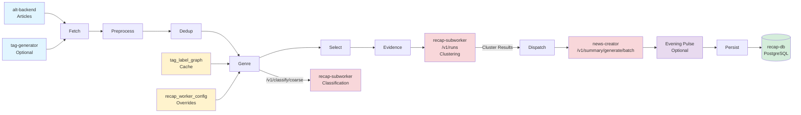

# Recap Worker

_Last reviewed: February 28, 2026_

**Location:** `recap-worker` (Crate: `recap-worker/recap-worker`)

## Role
`recap-worker` is the **orchestrator and pipeline runner** for the Alt recap system. Written in Rust (2024 edition), it manages the end-to-end flow of generating Japanese news recaps for both **7-day** (weekly deep-dive) and **3-day** (daily quick-catch) windows.

It delegates **heavy ML tasks** (embedding generation, coarse classification, clustering) to `recap-subworker`, keeping the worker itself focused on high-throughput data processing, pipeline coordination, and persistence.

**Pipelines:**
1.  **7-Day Recap Pipeline:** Weekly deep-dive batch process (runs daily at 02:00 JST via `BatchDaemon`).
2.  **3-Day Recap Pipeline:** Daily quick-catch batch process with smaller article window, faster processing, and reduced prompt sizes. The batch daemon uses `RECAP_3DAYS_WINDOW_DAYS` for window configuration.
3.  **Evening Pulse Pipeline:** Daily digest delivering up to 3 high-quality news topics as an "entrance" to 7 Days Recap, helping users understand the day's news in 60 seconds. Controlled by `PULSE_ENABLED`, `PULSE_ROLLOUT_PERCENT`, and `PULSE_VERSION` feature flags.
4.  **Morning Update Pipeline:** A lighter pipeline for daily article deduplication and grouping (Daemon currently **disabled** in `main.rs`, but logic exists).

## Service Snapshot

| Layer | Responsibilities |
| --- | --- |
| **Control Plane** | Axum router exposing: <br>- **Ops**: `/health/ready`, `/health/live`, `/metrics` (Prometheus) <br>- **Triggers**: `/v1/generate/recaps/7days`, `/v1/generate/recaps/3days` <br>- **Fetch**: `/v1/recaps/7days`, `/v1/recaps/3days`, `/v1/morning/updates` <br>- **Pulse**: `/v1/pulse/latest` (Evening Pulse digest) <br>- **Admin**: `/admin/jobs/retry`, `/admin/genre-learning` <br>- **Dashboard**: `/v1/dashboard/*` (Metrics, Overview, Logs, Jobs, recap_jobs, job-progress, job-stats) <br>- **Eval**: `/v1/evaluation/*` (Genre classification stats) |
| **Pipeline Core** | `src/pipeline/`: Modular stages for Fetch, Preprocess, Dedup, Genre, Select, Evidence, Dispatch, Persist. |
| **Clients** | `src/clients/`: Strongly-typed HTTP clients for: <br>- **`recap-subworker`**: Coarse classification (`/v1/classify/coarse`), clustering (`/v1/runs`), graph refresh. <br>- **`news-creator`**: LLM summarization (`/v1/summary/generate`, `/v1/summary/generate/batch`). <br>- **`alt-backend`**: Article fetching. <br>- **`tag-generator`**: Optional tag enrichment. |
| **Classification** | **Remote Coarse**: Calls `recap-subworker` (`/v1/classify/coarse`) for initial genre assignment. <br>**Local Refine**: Optional Graph Label Propagation stage (`src/pipeline/genre_refine/`) using cached graph data. |
| **Store** | `src/store/`: SQLx DAO managing `recap_jobs`, `recap_cluster_evidence`, `recap_genre_learning_results`, `pulse_generations`, and `tag_label_graph` (cached from DB). |

## API Endpoints

### Ops
| Endpoint | Method | Description |
| --- | --- | --- |
| `/health/ready` | GET | Readiness probe |
| `/health/live` | GET | Liveness probe (used by Docker `healthcheck` subcommand) |
| `/metrics` | GET | Prometheus metrics exporter |

### Triggers
| Endpoint | Method | Description |
| --- | --- | --- |
| `/v1/generate/recaps/7days` | POST | Trigger 7-day recap pipeline |
| `/v1/generate/recaps/3days` | POST | Trigger 3-day recap pipeline |

### Fetch
| Endpoint | Method | Description |
| --- | --- | --- |
| `/v1/recaps/7days` | GET | Retrieve latest 7-day recap |
| `/v1/recaps/3days` | GET | Retrieve latest 3-day recap |
| `/v1/morning/updates` | GET | Retrieve morning updates |

### Pulse
| Endpoint | Method | Description |
| --- | --- | --- |
| `/v1/pulse/latest` | GET | Retrieve latest Evening Pulse (accepts optional `?date=YYYY-MM-DD`) |

### Admin
| Endpoint | Method | Description |
| --- | --- | --- |
| `/admin/jobs/retry` | POST | Retry failed jobs |
| `/admin/genre-learning` | POST | Receive genre learning results |

### Evaluation
| Endpoint | Method | Description |
| --- | --- | --- |
| `/v1/evaluation/genres` | POST | Run genre classification evaluation |
| `/v1/evaluation/genres/latest` | GET | Get latest evaluation result |
| `/v1/evaluation/genres/{run_id}` | GET | Get evaluation result by run ID |

### Dashboard
| Endpoint | Method | Description |
| --- | --- | --- |
| `/v1/dashboard/metrics` | GET | Get dashboard metrics |
| `/v1/dashboard/overview` | GET | Get dashboard overview |
| `/v1/dashboard/logs` | GET | Get dashboard logs |
| `/v1/dashboard/jobs` | GET | Get jobs list |
| `/v1/dashboard/recap_jobs` | GET | Get recap job details |
| `/v1/dashboard/job-progress` | GET | Get job progress |
| `/v1/dashboard/job-stats` | GET | Get job statistics |

## Dependency Injection: ComponentRegistry

The application uses a `ComponentRegistry` pattern (`src/app.rs`) for centralised dependency injection. All shared infrastructure is constructed once at startup and wrapped in `Arc` for thread-safe sharing across Axum handlers and background daemons.

```
ComponentRegistry
  +-- config: Arc<Config>
  +-- telemetry: Telemetry
  +-- scheduler: Scheduler
  +-- news_creator_client: Arc<NewsCreatorClient>
  +-- subworker_client: Arc<SubworkerClient>
  +-- recap_dao: Arc<dyn RecapDao>
```

`AppState` wraps `Arc<ComponentRegistry>` and is passed as Axum `State` to all route handlers. The `build_router()` function wires `AppState` into the Axum `Router`.

Key construction flow in `ComponentRegistry::build()`:

1. Parse `Config` from environment variables.
2. Initialise `Telemetry` (Prometheus + optional OTLP).
3. Build HTTP clients (`NewsCreatorClient`, `SubworkerClient`).
4. Create `PgPool` for `recap-db` and wrap it in `RecapDaoImpl` (the unified DAO implementation).
5. Initialise `ClassificationJobQueue` (persistent queue with retry).
6. Build `PipelineOrchestrator` with all stage implementations.
7. Build `MorningPipeline` and `Scheduler`.

## Module Architecture

### Core Modules

| Module | Description |
|--------|-------------|
| `queue/` | Classification job queue with persistent storage, retry logic, and worker pool |
| `replay/` | Pipeline replay functionality |
| `classifier/` | Graph-based classification workflow |
| `analysis/` | Analysis module |
| `language_detection/` | Language detection using lingua (English/Japanese) |
| `pipeline/executor.rs` | Resume-capable stage execution |
| `pipeline/embedding.rs` | Embedding service integration |
| `pipeline/minhash.rs` | MinHash-based similarity detection |
| `pipeline/graph_override.rs` | Dynamic graph override settings |
| `pipeline/pulse/` | Evening Pulse v4 pipeline (quality eval, syndication removal, role-based selection, rationale generation) |
| `pipeline/pulse_integration.rs` | Pulse integration with the main recap pipeline |
| `pipeline/genre_canonical.rs` | Canonical genre name resolution |
| `pipeline/genre_keywords.rs` | Genre keyword definitions and scoring |
| `pipeline/tag_signal.rs` | Tag signal extraction from articles |
| `pipeline/select/` | Sub-modules: clustering, filtering, scoring, thresholds, trimming |
| `pipeline/genre_refine/` | Sub-modules: cache, config, engine, scoring, strategy, tag_profile |

### Evaluation Module (`evaluation/`)

| File | Description |
|------|-------------|
| `genre.rs` | Genre classification evaluation |
| `golden.rs` | Golden dataset management |
| `metrics.rs` | Evaluation metrics calculation |
| `rouge.rs` | ROUGE score computation |

## Pipeline Flow

The 7-Day Recap Pipeline (`src/pipeline.rs`) follows these stages:

```mermaid
flowchart TB
    Start([Job Triggered<br/>Scheduler/Manual]) --> Init[Pipeline Initialization]

    Init --> GraphRefresh{Graph Pre-Refresh<br/>Enabled?}
    GraphRefresh -->|Yes| RefreshGraph[Refresh Graph via<br/>recap-subworker]
    GraphRefresh -->|No| LoadConfig
    RefreshGraph --> LoadConfig[Load Graph Override Settings<br/>from recap_worker_config]

    LoadConfig --> Fetch[Fetch Stage<br/>AltBackendFetchStage]

    Fetch --> FetchDetails[Fetch Articles<br/>- Paginated from alt-backend<br/>- Optional tag enrichment<br/>- Backup raw HTML to DB]

    FetchDetails --> Preprocess[Preprocess Stage<br/>TextPreprocessStage]

    Preprocess --> PreprocessDetails["Preprocess Articles<br/>HTML cleaning (ammonia)<br/>Language detection (whatlang)<br/>Tokenization (Lindera)<br/>Tag signal extraction"]

    PreprocessDetails --> Dedup[Dedup Stage<br/>HashDedupStage]

    Dedup --> DedupDetails["Deduplicate Articles<br/>XXH3 hashing<br/>Sentence-level similarity"]

    DedupDetails --> Genre[Genre Stage<br/>TwoStageGenreStage]

    Genre --> RemoteCoarse["Remote Coarse Pass<br/>(Call recap-subworker /v1/classify/coarse)"]

    RemoteCoarse --> RefineCheck{Refine<br/>Needed?}
    RefineCheck -->|Yes| LocalRefine["Local Graph Refine<br/>(Label Propagation)"]
    RefineCheck -->|No| Select
    LocalRefine --> Select

    Select --> SelectDetails["Select Stage<br/>Trim max 20 per genre<br/>Ensure min documents"]

    SelectDetails --> Evidence[Evidence Stage<br/>EvidenceBundle]

    Evidence --> Dispatch[Dispatch Stage<br/>MlLlmDispatchStage]

    Dispatch --> Phase1["Phase 1: Parallel Clustering<br/>(Call recap-subworker /v1/runs)"]

    Phase1 --> Phase2["Phase 2: Batch Summary<br/>(Call news-creator /v1/summary/generate/batch)"]

    Phase2 --> Pulse{Pulse<br/>Enabled?}
    Pulse -->|Yes| PulseStage["Evening Pulse Stage<br/>(Quality Eval, Syndication Removal,<br/>Role-Based Selection, Rationale)"]
    Pulse -->|No| Persist
    PulseStage --> Persist

    Persist --> PersistStage[Persist Stage<br/>FinalSectionPersistStage]

    PersistStage --> End([Pipeline Complete])

    style Start fill:#e1f5ff
    style End fill:#d4edda
    style Genre fill:#fff3cd
    style RemoteCoarse fill:#fff3cd
    style LocalRefine fill:#fff3cd
    style Dispatch fill:#f8d7da
    style Phase1 fill:#f8d7da
    style Phase2 fill:#f8d7da
    style Pulse fill:#e8daef
    style PulseStage fill:#e8daef
```



### 1. Fetch (`fetch.rs`)
*   Pulls articles from `alt-backend` for the configured window (default 7 days).
*   Optionally enriches with tags from `tag-generator`.
*   Persists raw HTML/metadata to `recap_job_articles`.

### 2. Preprocess (`preprocess.rs`)
*   Cleans HTML (`ammonia`, `html2text`).
*   Normalizes Unicode (`nfkc`).
*   Tokenizes (Lindera IPADIC) and extracts tag signals.
*   Executed in parallel using `rayon`.

### 3. Dedup (`dedup.rs`)
*   Filters near-duplicates using XXH3 hashing and sentence-level comparison.
*   Identifies a representative article for each duplicate group.

### 4. Genre Assignment (`genre.rs`, `genre_remote.rs`)
The genre classification is a hybrid **Remote + Local** process:

1.  **Remote Coarse (`RemoteGenreStage`)**: Sends article text batches to `recap-subworker` (`/v1/classify/coarse`). The subworker uses a GPU-accelerated embedding model and a Logistic Regression classifier to return genre probabilities.
2.  **Local Refine (Optional)**: If the primary genre's confidence is below `GENRE_CLASSIFIER_THRESHOLD`, the worker runs a local Graph Label Propagation using the cached `tag_label_graph` to rescue the article based on its tags.

### 5. Selection (`select.rs`)
*   Trims articles per genre to meet the target count (default ~20).
*   Ensures minimum document counts per genre.
*   Can use `embedding.rs` (if enabled) for coherence filtering.

### 6. Evidence Assembly (`evidence.rs`)
*   Bundles selected articles into an `EvidenceBundle`.
*   Constructs the payload for clustering.

### 7. Dispatch (`dispatch.rs`)
*   **Clustering** (`dispatch/clustering.rs`): Sends the `EvidenceBundle` to `recap-subworker` (`/v1/runs`). The subworker performs HDBSCAN/K-Means clustering and returns sorted clusters with representatives. Uses idempotency keys for deduplication and supports configurable timeouts (`RECAP_CLUSTERING_GENRE_TIMEOUT_SECS`, `RECAP_CLUSTERING_STUCK_THRESHOLD_SECS`).
*   **Summarization** (`dispatch/summarization.rs`): Sends cluster data to `news-creator` via batch API (`/v1/summary/generate/batch`). Multiple genres are batched into a single HTTP call for efficiency. Falls back to per-genre sequential calls (`/v1/summary/generate`) if needed.

### 8. Persist (`persist.rs`)
*   Saves the final `Recap` and `RecapGenre` results to `recap_db`.
*   Stores cluster evidence in `recap_cluster_evidence` for transparency.

### 9. Evening Pulse (`pulse/`)
The Evening Pulse is an optional post-pipeline stage (controlled by `PULSE_ENABLED` and `PULSE_ROLLOUT_PERCENT`) that selects up to 3 high-quality topics from the recap clusters:

1.  **Quality Evaluation** (`cluster_quality.rs`): Evaluates cluster quality using cohesion, ambiguity, and entity consistency metrics.
2.  **Syndication Removal** (`syndication.rs`): Removes duplicate/syndicated content using canonical URL matching, wire source detection, and title similarity.
3.  **Role-Based Selection** (`selection.rs`): Selects topics with diverse roles: **NeedToKnow**, **Trend**, and **Serendipity**.
4.  **Rationale Generation** (`rationale.rs`): Generates human-readable explanations for why each topic was selected.

Results are persisted to the `pulse_generations` table and served via `/v1/pulse/latest`.

## Pipeline Resume Support

The pipeline supports resume capability for fault tolerance:

*   **Stage State Persistence**: Stage execution state is persisted to the `recap_stage_state` table.
*   **Lightweight Checkpoints**: The fetch stage uses lightweight checkpoints to track progress.
*   **Automatic Resume**: On restart, the pipeline automatically resumes from the last successful stage.

## Data Flow Overview



## Configuration & Tuning

Configuration is handled via `src/config.rs` (env vars) and dynamic DB overrides.

### Key Environment Variables

#### Core Settings
*   `RECAP_WINDOW_DAYS`: Number of days to include in the 7-day recap (default 7).
*   `RECAP_3DAYS_WINDOW_DAYS`: Number of days to include in the 3-day recap (default 3). Also used by `BatchDaemon` as the window for the automated 3-day pipeline run.
*   `RECAP_GENRES`: Comma-separated list of genre slugs to process (default: 30 genres including `ai_data`, `climate_environment`, `consumer_products`, `consumer_tech`, `culture_arts`, `cybersecurity`, `diplomacy_security`, `economics_macro`, `education`, `energy_transition`, `film_tv`, `food_cuisine`, `games_esports`, `health_medicine`, `home_living`, `industry_logistics`, `internet_platforms`, `labor_workplace`, `law_crime`, `life_science`, `markets_finance`, `mobility_automotive`, `music_audio`, `politics_government`, `society_demographics`, `software_dev`, `space_astronomy`, `sports`, `startups_innovation`, `travel_places`). If empty at startup, the batch daemon is skipped.
*   `RECAP_GENRE_MODEL_THRESHOLD`: Confidence threshold for local genre classification (default: 0.5 via config, 0.75 in classifier).
*   `RECAP_GENRE_REFINE_ENABLED`: Enable/disable local graph refinement (default: false).
*   `RECAP_GENRE_REFINE_REQUIRE_TAGS`: Require tag data for refinement (default: true).
*   `RECAP_GENRE_REFINE_ROLLOUT_PERCENT`: Gradual rollout control for refinement (default: 100).
*   `MIN_DOCUMENTS_PER_GENRE`: Minimum articles required to generate a recap for a genre.

#### LLM Configuration
*   `LLM_SUMMARY_TIMEOUT_SECS`: Timeout for LLM summarization requests (default: 600).
*   `RECAP_BATCH_SUMMARY_CHUNK_SIZE`: Batch size for summary processing (default: 25).

#### Classification Queue
*   `CLASSIFICATION_QUEUE_CONCURRENCY`: Number of concurrent classification workers (default: 8).
*   `CLASSIFICATION_QUEUE_CHUNK_SIZE`: Chunk size for classification batches.
*   `CLASSIFICATION_QUEUE_MAX_RETRIES`: Maximum retry attempts (default: 3).
*   `CLASSIFICATION_QUEUE_RETRY_DELAY_MS`: Delay between retries in milliseconds (default: 5000).

#### Job Management
*   `RECAP_JOB_RETENTION_DAYS`: Number of days to retain job data (default: 14).

#### Classification Evaluation
*   `RECAP_CLASSIFICATION_EVAL_ENABLED`: Enable classification evaluation (default: true).
*   `RECAP_CLASSIFICATION_EVAL_USE_BOOTSTRAP`: Use bootstrap sampling for evaluation (default: true).
*   `RECAP_CLASSIFICATION_EVAL_N_BOOTSTRAP`: Number of bootstrap iterations (default: 200).
*   `RECAP_CLASSIFICATION_EVAL_USE_CV`: Use cross-validation (default: false).

#### Clustering Timeouts
*   `RECAP_CLUSTERING_GENRE_TIMEOUT_SECS`: Timeout per genre clustering (default: 1500).
*   `RECAP_CLUSTERING_JOB_TIMEOUT_SECS`: Total job timeout (default: 1800).
*   `RECAP_CLUSTERING_MIN_SUCCESS_GENRES`: Minimum genres required for success (default: 1).
*   `RECAP_CLUSTERING_STUCK_THRESHOLD_SECS`: Threshold to detect stuck jobs (default: 600).

#### Language-specific Model Weights
*   `RECAP_GENRE_MODEL_WEIGHTS_JA`: Path to Japanese genre model weights.
*   `RECAP_GENRE_MODEL_WEIGHTS_EN`: Path to English genre model weights.

#### Language Detection
*   `RECAP_LANG_DETECT_MIN_CHARS`: Minimum characters for detection (default: 50).
*   `RECAP_LANG_DETECT_MIN_CONFIDENCE`: Minimum confidence threshold (default: 0.65).

#### Evening Pulse
*   `PULSE_ENABLED`: Global enable/disable for the Evening Pulse pipeline (default: true).
*   `PULSE_ROLLOUT_PERCENT`: Percentage rollout for Pulse (0-100).
*   `PULSE_VERSION`: Target Pulse version (v2, v3, v4).
*   `PULSE_MAX_TOPICS`: Maximum topics to select (default: 3).
*   `PULSE_COHESION_THRESHOLD`: Minimum cluster cohesion score (default: 0.3).
*   `PULSE_AMBIGUITY_THRESHOLD`: Maximum cluster ambiguity score (default: 0.5).
*   `PULSE_ENTITY_CONSISTENCY_THRESHOLD`: Minimum entity consistency (default: 0.4).
*   `PULSE_MIN_SCORE_THRESHOLD`: Minimum topic score to include (default: 0.3).
*   `PULSE_MAX_FALLBACK_LEVEL`: Maximum fallback level for topic selection (default: 5).
*   `PULSE_SYNDICATION_*`: Syndication removal toggles (`CANONICAL_ENABLED`, `WIRE_ENABLED`, `TITLE_ENABLED`, `TITLE_THRESHOLD`).

### Graph & Learning
*   **Tag Label Graph**: Cached locally for `TAG_LABEL_GRAPH_TTL_SECONDS`. Loaded from `tag_label_graph` table.
*   **Graph Overrides**: Dynamic thresholds and weights can be loaded from `recap_worker_config` table at runtime.
*   **Refresh**: The pipeline can trigger a graph refresh on `recap-subworker` before execution (`RECAP_PRE_REFRESH_GRAPH_ENABLED`).

## DAO Architecture

The store layer uses a modular trait-based DAO architecture:

### Traits
| Trait | Description |
|-------|-------------|
| `ArticleDao` | Article storage and retrieval |
| `ConfigDao` | Configuration management |
| `EvaluationDao` | Evaluation data access |
| `GenreLearningDao` | Genre learning results |
| `JobDao` | Job management |
| `JobStatusDao` | Job status tracking |
| `MetricsDao` | Metrics persistence |
| `MorningDao` | Morning pipeline data |
| `OutputDao` | Output storage |
| `PulseDao` | Evening Pulse generation data (`pulse_generations` table) |
| `StageDao` | Stage state persistence |
| `SubworkerDao` | Subworker communication |

### Implementation
*   **`UnifiedDao`** (`RecapDaoImpl`): Unified implementation of all DAO traits, backed by a single `PgPool`.
*   **Backward Compatibility**: `RecapDao` super-trait remains available via compat module (`store/dao/compat.rs`) for code that needs access to all DAO capabilities through a single trait object.
*   **Mock**: `MockRecapDao` (`store/dao/mock.rs`) implements all traits for unit testing without a database.

## Development & Testing

### Commands
```bash
# Run Unit Tests
cargo -C recap-worker test

# Check Health
curl http://localhost:9005/health/ready
```

### Replay Tools
*   **`replay_genre_pipeline`**: A binary (`src/bin/replay_genre_pipeline.rs`) allowed to re-run the genre assignment stage using local datasets or DB data.
    ```bash
    cargo run --bin replay_genre_pipeline -- --dataset path/to/dataset.json --dsn $RECAP_DB_DSN
    ```

## Database Interaction
`recap-worker` relies on `recap-db` (Postgres).
*   **Migrations**: Managed in `recap-migration-atlas`.
*   **Key Tables**:
    *   `recap_jobs`: Job status and metadata.
    *   `recap_job_articles`: Raw article backup.
    *   `recap_outputs` / `recap_genres`: Final recap content.
    *   `recap_cluster_evidence`: Articles used for each cluster.
    *   `recap_worker_config`: Dynamic configuration store.
    *   `recap_stage_state`: Pipeline stage state for resume support.
    *   `pulse_generations`: Evening Pulse generation results (job_id, target_date, version, status, result payload).

## Dependencies

Key dependencies (Rust Edition 2024):

| Crate | Version | Purpose |
|-------|---------|---------|
| `axum` | 0.8 | HTTP control plane |
| `rust-bert` | 0.23.0 | Transformer models |
| `lingua` | 1.7 | Language detection (English/Japanese) |
| `lindera` | 0.21 | Japanese tokenization |
| `ndarray` | 0.16 | Numerical arrays |
| `petgraph` | 0.6 | Graph data structures |
| `sprs` | 0.11 | Sparse matrices |
| `sqlx` | 0.8 | Async PostgreSQL access |
| `reqwest` | 0.12 | HTTP client (JSON, gzip, HTTP/2, rustls) |
| `tokenizers` | 0.20 | Tokenizer for token counting |
