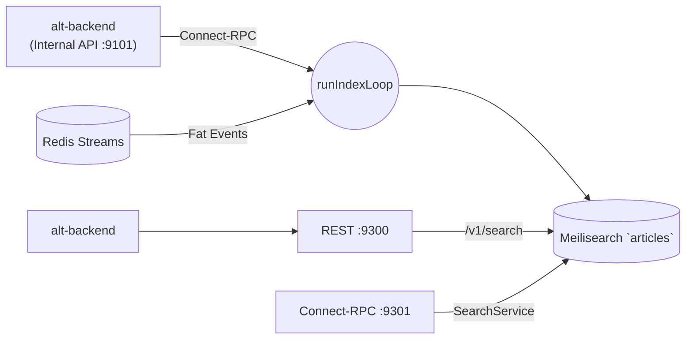

# Search Indexer

_Last reviewed: February 28, 2026_

**Location:** `search-indexer/app`

## Role
- Go 1.24+ サービスで Meilisearch への記事バッチインデックスと `/v1/search` エンドポイントを提供
- デュアルフェーズインデックスループ (Backfill + Incremental, 200 ドキュメント/バッチ) + 軽量 HTTP ハンドラーで検索クエリ処理
- Clean Architecture レイヤーと共通トークナイザーを使用
- OpenTelemetry (トレース・メトリクス・ログ) による可観測性

## Architecture & Flow

| Layer | Component |
| --- | --- |
| Driver | `driver/backend_api/client.go` (Connect-RPC via alt-backend)、`driver/meilisearch_driver.go` (Meilisearch 接続)。`BACKEND_API_URL` 未設定時は `driver/database_driver.go` にフォールバック (Legacy DB モード) |
| Gateway | `gateway/article_repository_gateway.go` (バッチ取得)、`gateway/search_engine_gateway.go` (インデックス設定) |
| Usecases | `IndexArticlesUsecase` (インデックスループ)、`SearchByUserUsecase` (クエリ処理) |
| Server | `bootstrap/app.go` - `runIndexLoop` + `bootstrap/servers.go` でサーバーオーケストレーション |
| Tokenizer | `tokenize/tokenizer.go` - MeCab ベースのトークナイザー |
| Middleware | `middleware/otel_status_middleware.go` - OTel スパンステータス設定 |
| Consumer | `consumer/` - Redis Streams による Fat Event 消費 |



## Endpoints & Behavior

| Port | Protocol | Endpoint | Description |
|------|----------|----------|-------------|
| 9300 | HTTP | `/v1/search` | 検索 API (q + user_id 必須) |
| 9300 | HTTP | `/health` | ヘルスチェック |
| 9301 | Connect-RPC | SearchService | Connect-RPC 検索サービス |

> **ポート定義**: `config/constants.go:14-15` で `HTTP_ADDR=:9300`, `CONNECT_ADDR=:9301` として定義。環境変数で上書き可能。

### Search Handler
- 必須クエリパラメータ: `q` (検索文字列), `user_id`
- 不足時は `400 Bad Request`
- フィルター: `user_id = "<value>"` (エスケープ処理済み)
- レスポンス: `application/json` - id, title, content, tags

### Indexing Loop (Dual-Phase)

`bootstrap/app.go` の `runIndexLoop` はデュアルフェーズで動作:

**Phase 1 - Backfill:**
- 既存記事を最新から最古の順にインデックス
- `ExecuteBackfill(ctx, lastCreatedAt, lastID, batchSize)` で 200 件バッチ処理
- インデックス対象が 0 件になるまで継続

**Phase 2 - Incremental:**
- 新規記事のポーリングと削除済み記事の同期
- `ExecuteIncremental(ctx, incrementalMark, lastCreatedAt, lastID, lastDeletedAt, batchSize)` で処理
- 新記事/削除なしの場合は `INDEX_INTERVAL` (デフォルト 5m) スリープ

**共通リトライ:**
- 指数バックオフ (初期 5s, 最大 5m, 倍率 2x) (`cenkalti/backoff/v5`)
- 成功時にバックオフをリセット

## Data Access Mode (ADR-000241)

`BACKEND_API_URL` 環境変数で動作モードを自動判定:
- **API モード** (`BACKEND_API_URL=http://alt-backend:9101`): `driver/backend_api/client.go` で Connect-RPC 経由のデータ取得。`SERVICE_TOKEN_FILE` で認証
- **Legacy DB モード** (未設定): `driver/database_driver.go` で PostgreSQL 直接接続

### Fat Events
`consumer/event_handler.go` で `ArticleCreated` イベントの Fat Events を処理:
- **Fat Event** (content + tags 含有): API/DB 呼び出し不要で直接インデックス
- **Thin Event** (ID のみ): バッファリング後にバッチ API 呼び出しでデータ取得

## Configuration & Env

### Core

| Variable | Default | Description |
|----------|---------|-------------|
| `BACKEND_API_URL` | - | alt-backend Internal API URL (設定時は API モード) |
| `SERVICE_TOKEN_FILE` | - | サービス認証トークンファイル |
| `MEILISEARCH_HOST` | - | Meilisearch ホスト (必須) |
| `MEILISEARCH_API_KEY_FILE` | - | Meilisearch API キーファイル |
| `MEILI_MASTER_KEY_FILE` | - | Meilisearch マスターキーファイル |
| `INDEX_BATCH_SIZE` | 200 | バッチサイズ |
| `INDEX_INTERVAL` | 5m | インデックスポーリング間隔 (`config/constants.go`) |
| `INDEX_RETRY_INTERVAL` | 1m | リトライ間隔 |
| `HTTP_ADDR` | `:9300` | REST HTTP リッスンアドレス |
| `CONNECT_ADDR` | `:9301` | Connect-RPC リッスンアドレス |
| `DB_TIMEOUT` | 10s | データベースタイムアウト |
| `MEILI_TIMEOUT` | 15s | Meilisearch タイムアウト |

### Redis Streams Consumer

| Variable | Default | Description |
|----------|---------|-------------|
| `CONSUMER_ENABLED` | `false` | Redis Streams コンシューマー有効化 |
| `REDIS_STREAMS_URL` | `redis://localhost:6379` | Redis 接続 URL |
| `CONSUMER_GROUP` | `search-indexer-group` | コンシューマーグループ名 |
| `CONSUMER_NAME` | `search-indexer-1` | コンシューマー名 |
| `CONSUMER_STREAM_KEY` | `alt:events:articles` | Redis Stream キー |
| `CONSUMER_BATCH_SIZE` | 10 | メッセージ読み取りバッチサイズ |

### OpenTelemetry

| Variable | Default | Description |
|----------|---------|-------------|
| `OTEL_ENABLED` | `true` | OTel プロバイダー有効化 |
| `OTEL_SERVICE_NAME` | `search-indexer` | サービス名 |
| `OTEL_EXPORTER_OTLP_ENDPOINT` | `http://localhost:4318` | OTLP HTTP エンドポイント |
| `OTEL_TRACE_SAMPLE_RATIO` | `0.1` | トレースサンプリング比率 (0.0-1.0) |
| `SERVICE_VERSION` | `0.0.0` | サービスバージョン |
| `DEPLOYMENT_ENV` | `development` | デプロイ環境 |

> **削除された変数** (ADR-000241 Phase 4 で廃止): `DB_HOST`, `DB_PORT`, `DB_NAME`, `SEARCH_INDEXER_DB_USER`, `SEARCH_INDEXER_DB_PASSWORD_FILE`, `DB_SSL_MODE`

## Testing & Tooling

```bash
# テスト実行
go test ./...

# ヘルスチェック (Docker)
./search-indexer healthcheck

# 検索テスト
curl "http://localhost:9300/v1/search?q=test&user_id=tenant-1"
```

**Integration Tests:**
- 実 Meilisearch に対するテスト (`docker compose` 経由)
- `meilisearch-go` クライアント使用
- インデックススキーマ変更時は `EnsureIndex` テストを追加

## Operational Runbook

1. 環境変数設定して起動:
   ```bash
   docker compose -f compose/workers.yaml up search-indexer -d
   ```

2. Meilisearch ヘルスチェック:
   ```bash
   curl http://localhost:7700/health
   ```

3. 検索エンドポイントテスト:
   ```bash
   curl "http://localhost:9300/v1/search?q=test&user_id=tenant-1"
   ```

4. インデックスループは 1 プロセスのみ実行 (`INDEX_BATCH_SIZE` + `INDEX_INTERVAL` で調整)

5. 再インデックスが必要な場合はカーソルをリセットしてサービス再起動

## Observability

### 構造化ログ
- バッチごとの `Indexed` / `Deleted` カウント、カーソル更新
- Phase 1 (Backfill) / Phase 2 (Incremental) のステージ表示
- OTel 有効時は `logger/trace_context_handler.go` でトレースコンテキストをログに自動付与
- rask.group ラベル: `search-indexer`
- ヘルスチェック: `/health`

### OTel Metrics

`utils/otel/metrics.go` で定義。メーター名: `search-indexer`。

| Metric | Type | Description | Attributes |
|--------|------|-------------|------------|
| `search_indexer_indexed_total` | Counter | インデックスされた記事の総数 | `phase` (backfill/incremental) |
| `search_indexer_deleted_total` | Counter | インデックスから削除された記事の総数 | `phase` (backfill/incremental) |
| `search_indexer_errors_total` | Counter | エラーの総数 | `operation` (backfill/incremental/search) |
| `search_indexer_batch_duration_seconds` | Histogram | バッチ処理所要時間 (秒) | `phase` (backfill/incremental) |
| `search_indexer_search_duration_seconds` | Histogram | 検索リクエスト所要時間 (秒) | - |

### OTel Traces
- `middleware/otel_status_middleware.go` で HTTP リクエストにスパンを自動生成
- 5xx レスポンスで `codes.Error` ステータスを設定 (OTel HTTP セマンティック規約準拠)
- W3C Trace Context + Baggage プロパゲーション
- `ParentBased` サンプラー (デフォルト 10% サンプリング)

### OTel Logs
- OTLP HTTP エクスポーター (`/v1/logs`) でログを送信
- バッチプロセッサー (5s 間隔, 最大 512 件/バッチ)

## LLM Notes
- インデックスロジック変更時は `usecase`, `gateway`, `driver` のどこに属するか明示
- 定数 (`INDEX_BATCH_SIZE`, `INDEX_INTERVAL`) は `config/constants.go` で集中管理
- ポート: REST 9300 (`HTTP_ADDR`), Connect-RPC 9301 (`CONNECT_ADDR`) - `config/constants.go:14-15`
- MeCab トークナイザーでインデックス/クエリスコアリングを統一
- OTel メトリクス計装は `utils/otel/metrics.go`、記録は `bootstrap/app.go` の `recordBatch` / `recordError` と `rest/handler.go`
