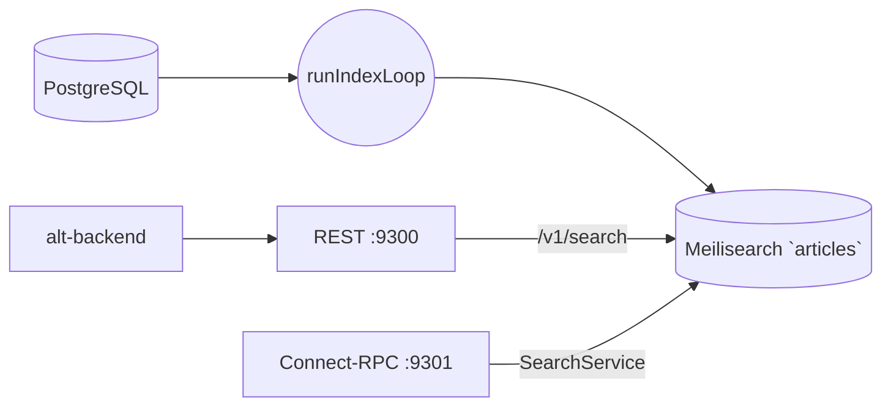

# Search Indexer

_Last reviewed: January 13, 2026_

**Location:** `search-indexer/app`

## Role
- Go 1.24+ サービスで Meilisearch への記事バッチインデックスと `/v1/search` エンドポイントを提供
- 継続的インデックスループ (200 ドキュメント/バッチ) + 軽量 HTTP ハンドラーで検索クエリ処理
- Clean Architecture レイヤーと共通トークナイザーを使用

## Architecture & Flow

| Layer | Component |
| --- | --- |
| Driver | `driver/database_driver.go`, `driver/meilisearch_driver.go` - Postgres + Meilisearch 接続、リトライ、ヘルスチェック、コネクションプール |
| Gateway | `gateway/article_repository_gateway.go` (バッチ取得)、`gateway/search_engine_gateway.go` (インデックス設定) |
| Usecases | `IndexArticlesUsecase` (インデックスループ)、`SearchArticlesUsecase` (クエリ処理) |
| Server | `main.go` - `runIndexLoop` + `rest.SearchArticles` オーケストレーション |
| Tokenizer | `tokenize/tokenizer.go` - MeCab ベースのトークナイザー |



## Endpoints & Behavior

| Port | Protocol | Endpoint | Description |
|------|----------|----------|-------------|
| 9300 | HTTP | `/v1/search` | 検索 API (q + user_id 必須) |
| 9300 | HTTP | `/v1/health` | ヘルスチェック |
| 9301 | Connect-RPC | SearchService | Connect-RPC 検索サービス |

### Search Handler
- 必須クエリパラメータ: `q` (検索文字列), `user_id`
- 不足時は `400 Bad Request`
- フィルター: `user_id = "<value>"` (エスケープ処理済み)
- レスポンス: `application/json` - id, title, content, tags

### Indexing Loop
- `runIndexLoop` でカーソル管理 (`lastCreatedAt`, `lastID`)
- `IndexArticlesUsecase.Execute(ctx, cursor, 200)` で 200 件バッチ処理
- 失敗時は `INDEX_RETRY_INTERVAL` でリトライ
- 新記事なしの場合は `INDEX_INTERVAL` (1m) スリープ

## Configuration & Env

| Variable | Default | Description |
|----------|---------|-------------|
| `MEILISEARCH_HOST` | - | Meilisearch ホスト (必須) |
| `MEILISEARCH_API_KEY_FILE` | - | Meilisearch API キーファイル |
| `MEILI_MASTER_KEY_FILE` | - | Meilisearch マスターキーファイル |
| `DB_HOST` | db | PostgreSQL ホスト |
| `DB_PORT` | 5432 | PostgreSQL ポート |
| `DB_NAME` | - | データベース名 |
| `SEARCH_INDEXER_DB_USER` | - | DB ユーザー |
| `SEARCH_INDEXER_DB_PASSWORD_FILE` | - | DB パスワードファイル |
| `DB_SSL_MODE` | prefer | SSL モード |
| `INDEX_BATCH_SIZE` | 200 | バッチサイズ |
| `INDEX_INTERVAL` | 60s | インデックス間隔 |
| `INDEX_RETRY_INTERVAL` | 60s | リトライ間隔 |

## Testing & Tooling

```bash
# テスト実行
go test ./...

# ヘルスチェック (Docker)
./search-indexer healthcheck

# 検索テスト
curl "http://localhost:9300/v1/search?q=test&user_id=tenant-1"
```

**Integration Tests:**
- 実 Meilisearch に対するテスト (`docker compose` 経由)
- `meilisearch-go` クライアント使用
- インデックススキーマ変更時は `EnsureIndex` テストを追加

## Operational Runbook

1. 環境変数設定して起動:
   ```bash
   docker compose -f compose/workers.yaml up search-indexer -d
   ```

2. Meilisearch ヘルスチェック:
   ```bash
   curl http://localhost:7700/health
   ```

3. 検索エンドポイントテスト:
   ```bash
   curl "http://localhost:9300/v1/search?q=test&user_id=tenant-1"
   ```

4. インデックスループは 1 プロセスのみ実行 (`INDEX_BATCH_SIZE` + `INDEX_INTERVAL` で調整)

5. 再インデックスが必要な場合はカーソルをリセットしてサービス再起動

## Observability
- 構造化ログ: バッチごとの `Indexed` カウント、カーソル更新
- rask.group ラベル: `search-indexer`
- ヘルスチェック: `/v1/health`

## LLM Notes
- インデックスロジック変更時は `usecase`, `gateway`, `driver` のどこに属するか明示
- 定数 (`INDEX_BATCH_SIZE`, `INDEX_INTERVAL`) は集中管理
- ポート: REST 9300, Connect-RPC 9301
- MeCab トークナイザーでインデックス/クエリスコアリングを統一
