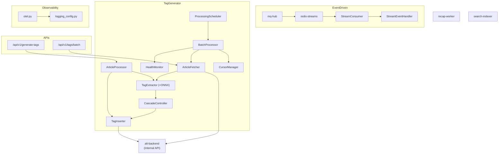

# Tag Generator

_Last reviewed: February 28, 2026_

**Location:** `tag-generator/app`

## Role
- Python 3.13+ FastAPI サービスで未タグ記事をバッチ処理し ML タグを抽出
- Redis Streams コンシューマーとしてイベント駆動タグ生成
- ONNX / SentenceTransformer + KeyBERT によるタグ抽出
- メモリ使用量を一定に保つ最適化設計
- Hybrid 処理戦略による効率的なバックフィル・フォワード処理

## Architecture & Flow



## Directory Structure

```
tag-generator/app/
├── main.py                     # FastAPI エントリポイント
├── pyproject.toml              # 依存関係・ツール設定
├── conftest.py                 # pytest 共通フィクスチャ
├── db_pool.py                  # DB 接続プール
├── auth_service.py             # 認証サービス
├── tag_fetcher.py              # タグ取得ユーティリティ
├── tag_generator/
│   ├── __init__.py
│   ├── config.py               # TagGeneratorConfig
│   ├── service.py              # TagGeneratorService (メインサービス)
│   ├── scheduler.py            # ProcessingScheduler
│   ├── batch_processor.py      # BatchProcessor (Hybrid処理)
│   ├── article_processor.py    # ArticleProcessor
│   ├── cursor_manager.py       # CursorManager
│   ├── health_monitor.py       # HealthMonitor
│   ├── cascade.py              # CascadeController
│   ├── database.py             # DatabaseManager
│   ├── driver/
│   │   ├── connect_client_factory.py   # Connect-RPC クライアントファクトリ
│   │   ├── connect_article_fetcher.py  # ArticleFetcher (API モード)
│   │   └── connect_tag_inserter.py     # TagInserter (API モード)
│   ├── stream_consumer.py      # StreamConsumer (Redis Streams)
│   ├── stream_event_handler.py # TagGeneratorEventHandler
│   ├── otel.py                 # OpenTelemetry Provider
│   └── logging_config.py       # ADR 98 準拠ロギング
├── tag_extractor/
│   ├── extract.py              # TagExtractor
│   ├── model_manager.py        # ModelManager (Singleton)
│   ├── lazy_model_manager.py   # 遅延ロードマネージャ
│   ├── input_sanitizer.py      # InputSanitizer
│   └── onnx_embedder.py        # ONNX Embedder
├── tag_inserter/
│   └── upsert_tags.py          # TagInserter
├── article_fetcher/
│   └── fetch.py                # ArticleFetcher
├── scripts/
│   └── build_label_graph.py    # ラベルグラフ構築スクリプト
└── tests/
    ├── __init__.py
    ├── unit/
    │   ├── test_scheduler.py
    │   ├── test_input_sanitizer.py
    │   ├── test_model_manager.py
    │   ├── test_batch_processor_recursion.py
    │   ├── test_article_fetcher_forward.py
    │   ├── test_batch_upsert_skipped_articles.py
    │   ├── test_build_label_graph.py
    │   ├── test_logging_config.py
    │   ├── test_pyrefly_compliance.py
    │   └── test_ruff_compliance.py
    └── integration/
        ├── test_tag_generator_logging.py
        └── test_sanitized_tag_extraction.py
```

## Data Access Mode (ADR-000241)

`service.py` がサービス起動時に `BACKEND_API_URL` 環境変数を検出し、自動的にモードを切り替え:
- **API モード**: `ConnectArticleFetcher` + `ConnectTagInserter` が Connect protocol (HTTP/1.1 + JSON) で alt-backend Internal API を呼び出し。`_NullDatabaseManager` により DB 接続不要
- **Legacy DB モード**: 従来の `ArticleFetcher` + `TagInserter` が PostgreSQL 直接アクセス

API モードでは httpx を使い、Proto コード生成なしで Connect protocol を直接呼び出す。

## Redis Streams Integration

| Setting | Value | Description |
|---------|-------|-------------|
| `REDIS_STREAMS_URL` | redis://redis-streams:6379 | Redis Streams URL |
| `CONSUMER_ENABLED` | true | コンシューマー有効化 |
| `CONSUMER_GROUP` | tag-generator-group | コンシューマーグループ名 |
| `CONSUMER_NAME` | tag-generator-1 | コンシューマー名 |
| `STREAM_KEY` | alt:events:articles | ストリームキー |
| `CONSUMER_BATCH_SIZE` | 10 | バッチサイズ |
| `CONSUMER_BLOCK_TIMEOUT_MS` | 5000 | ブロックタイムアウト (ms) |
| `CONSUMER_CLAIM_IDLE_TIME_MS` | 30000 | アイドル時間 (ms) |

**Events:**
- `ArticleCreated`: 新規記事作成時にタグ生成トリガー
- `alt:events:articles` ストリームを購読

## Endpoints & Behavior

| Port | Endpoint | Description |
|------|----------|-------------|
| 9400 | `/health` | ヘルスチェック |
| 9400 | `/api/v1/generate-tags` | 認証付きタグ生成 (ユーザー向け) |
| 9400 | `/api/v1/tags/batch` | サービス間バッチタグ取得 |

### /api/v1/generate-tags
- 認証: `verify_service_token`
- ログ: `article_id`, sanitized tags, cascade verdicts

### /api/v1/tags/batch
- 認証: `SERVICE_SECRET` (X-Service-Token)
- リクエスト: `{"article_ids":[...]}`
- レスポンス: タグマップ + `updated_at`

## Pipeline

1. **ArticleFetcher**: カーソルベースで記事取得
2. **InputSanitizer**: HTML サニタイズ + バリデーション
3. **TagExtractor**: ONNX (存在時) or SentenceTransformer + KeyBERT
4. **CascadeController**: 信頼度、レイテンシ、レート予算で判定
5. **TagInserter**: バッチ upsert

## Hybrid Processing Strategy

tag-generator は **Hybrid 処理戦略** を採用し、効率的なタグ付けを実現:

### Forward Processing
新規記事の処理 (初回バックフィル完了後):
- `fetch_new_articles()` で forward cursor より新しい未タグ記事を取得
- 昇順 (ASC) で処理し、最新記事を優先

### Backfill Mode
過去記事の遡及タグ付け:
- `fetch_articles()` で backward cursor より古い未タグ記事を取得
- 降順 (DESC) で処理し、新しい記事から順にバックフィル

### 自動切り替えロジック
```python
# BatchProcessor での処理戦略選択
if backfill_completed and has_existing_tags:
    return process_article_batch_forward()
else:
    return process_article_batch_backfill()  # 内部で hybrid モードも実行
```

- `max_empty_backfill_fetches`: 3 回連続で空バッチなら backfill 完了と判定
- バックフィル中も新規記事を検出した場合は hybrid モードで両方処理

## Configuration & Env

### Core Settings

| Variable | Default | Description |
|----------|---------|-------------|
| `PORT` | 9400 | サービスポート |
| `BACKEND_API_URL` | - | alt-backend Internal API URL (設定時は API モード) |
| `SERVICE_TOKEN_FILE` | - | サービス認証トークンファイル |
| `SERVICE_SECRET_FILE` | - | サービス認証シークレット |

> **削除された変数** (ADR-000241 Phase 4 で廃止): `DB_HOST`, `DB_PORT`, `DB_NAME`, `DB_TAG_GENERATOR_USER`, `DB_TAG_GENERATOR_PASSWORD_FILE`

### Processing Settings

| Variable | Default | Description |
|----------|---------|-------------|
| `PROCESSING_INTERVAL` | 300 | 処理間隔 (秒) - アイドル時 |
| `BATCH_LIMIT` | 75 | バッチ制限 |
| `MEMORY_CLEANUP_INTERVAL` | 25 | GC 実行間隔 (記事数) |

### ML Model Settings

| Variable | Default | Description |
|----------|---------|-------------|
| `TAG_ONNX_MODEL_PATH` | /models/onnx/model.onnx | ONNX モデルパス |
| `TAG_USE_FP16` | false | FP16 有効化 |
| `CUDA_VISIBLE_DEVICES` | "" | GPU 無効化 (CPU 使用) |
| `OMP_NUM_THREADS` | 4 | OpenMP スレッド数制限 (CPU 爆発防止) |
| `MKL_NUM_THREADS` | 4 | MKL スレッド数制限 |
| `TORCH_NUM_THREADS` | 4 | PyTorch スレッド数制限 |
| `TOKENIZERS_PARALLELISM` | false | HuggingFace Tokenizers 並列化無効 (fork 安全性) |

### Logging & Observability

| Variable | Default | Description |
|----------|---------|-------------|
| `TAG_LOG_LEVEL` | INFO | ログレベル |
| `OTEL_ENABLED` | true | OpenTelemetry 有効化 |
| `OTEL_SERVICE_NAME` | tag-generator | OTel サービス名 |
| `OTEL_EXPORTER_OTLP_ENDPOINT` | http://localhost:4318 | OTel エンドポイント |
| `SERVICE_VERSION` | 0.0.0 | サービスバージョン |
| `DEPLOYMENT_ENV` | development | 環境 (development/production) |

## Cascade Controller

Cost-Sensitive Cascade / EERO-style gating heuristic による判定:

### Configuration (`CascadeConfig`)

| Parameter | Default | Description |
|-----------|---------|-------------|
| `confidence_threshold` | 0.72 | 信頼度閾値 |
| `min_tags_for_confident_exit` | 5 | 高信頼度 exit に必要な最小タグ数 |
| `max_refine_ratio` | 0.35 | refine 候補の最大比率 |
| `inference_ms_threshold` | 180.0 | 推論時間閾値 (ms) |
| `min_confidence_boost` | 0.1 | 最小信頼度ブースト |

### Decision Reasons

| Reason | Trigger |
|--------|---------|
| `high_confidence_exit` | 信頼度・タグ数・推論時間すべて閾値内 |
| `low_confidence` | confidence < 0.72 |
| `insufficient_tag_coverage` | tag_count < 5 |
| `slow_inference` | inference_ms > 180.0 |
| `refine_ratio_budget_capped` | refine 比率が 35% を超過 |

## Input Sanitization

`InputSanitizer` による入力検証・サニタイズ:

### Validation Limits

| Field | Limit | Description |
|-------|-------|-------------|
| `title` | 1-1000 文字 | タイトル長 |
| `content` | 1-100000 文字 | コンテンツ長 (100KB) |
| `url` | max 2048 文字 | URL 長 |

### Sanitization Steps

1. **HTML サニタイズ** (`nh3`): 危険なタグ (script, style, iframe, object, embed) を除去
2. **制御文字除去**: ord < 32 の文字を除去 (タブ・改行・CR は許可)
3. **Unicode 正規化**: NFC 正規化
4. **セキュリティチェック**: 疑わしいパターン検出 (過度な繰り返し、異常な文字頻度)

## Memory Optimization

| Setting | Effect | Memory Impact |
|---------|--------|---------------|
| `TAG_USE_FP16=true` | FP16 重み変換 | ~200-300MB 削減 |
| ONNX Runtime | 最適化推論エンジン | ~100MB 削減 + 高速化 |
| `MEMORY_CLEANUP_INTERVAL` | GC 頻度 | 蓄積防止 |

**メモリフットプリント:**
- デフォルト (FP32): ~2GB
- FP16: ~1.6-1.8GB
- FP16 + ONNX: ~1.4-1.6GB

## Dependencies

### Core Dependencies
```toml
requires-python = ">=3.13"

dependencies = [
    "fugashi[unidic-lite]>=1.5.1",  # Japanese text processing
    "nltk>=3.9.1",
    "langdetect>=1.0.9",
    "psycopg2-binary>=2.9.0",
    "structlog>=25.4.0",
    "pydantic>=2.10.0",
    "nh3>=0.2.18",                   # HTML sanitizer
    "fastapi>=0.100.0",
    "uvicorn>=0.20.0",
    "httpx>=0.27.0",                 # Connect protocol client (ADR-000241)
    "aiohttp>=3.9.0",
    "redis>=5.0.0",                  # Redis Streams consumer
    "PyJWT>=2.8.0",
    "python-multipart>=0.0.6",
    "opentelemetry-sdk>=1.29.0",
    "opentelemetry-exporter-otlp-proto-http>=1.29.0",
    "opentelemetry-instrumentation-logging>=0.50b0",
]
```

### Dev Dependencies
```toml
dev = [
    "pytest>=8.4.1",
    "pytest-cov>=6.0.0",
    "pytest-mock>=3.14.1",
    "pytest-timeout>=2.4.0",
    "ruff>=0.12.1",
    "bandit>=1.8.0",
    "pyrefly>=0.42.0",              # Type checking (replaces mypy)
    "types-psycopg2>=2.9.21.20250516",
]
```

### ML Dependencies (Optional)
```toml
ml = [
    "sentence-transformers>=3.3.0",
    "keybert>=0.8.5",
    "transformers>=4.40.0",
    "torch>=2.1.0",
    "scikit-learn>=1.5.2",
    "numpy>=1.26.0",
    "onnxruntime>=1.21.0",
]
```

## Testing & Tooling

```bash
# テスト実行
uv run pytest

# カバレッジ付き
uv run pytest --cov=.

# 型チェック (pyrefly)
uv run pyrefly check .

# Lint
uv run ruff check
uv run ruff format

# セキュリティスキャン
uv run bandit -r . -x tests
```

## Operational Runbook

1. サービス起動:
   ```bash
   docker compose -f compose/workers.yaml up tag-generator -d
   ```

2. ヘルスチェック:
   ```bash
   curl http://localhost:9400/health
   ```

3. Redis Streams コンシューマー確認:
   ```bash
   docker compose exec redis-streams redis-cli XINFO GROUPS alt:events:articles
   ```

4. メモリ最適化: `TAG_USE_FP16=true` 設定

5. カーソルポイズニング警告時は recovery クエリに切り替え

## Observability

### Structured Logging
- `structlog` + JSON 出力
- ADR 98 準拠: `alt.*` プレフィックス

### ADR 98 Business Context
`logging_config.py` の `add_business_context()` により自動変換:
- `article_id` → `alt.article.id`
- `feed_id` → `alt.feed.id`
- 全ログに `alt.ai.pipeline = "tag-extraction"` を付与

### Log Fields
- `cursor`, `batch_size`, `cascade_reason`, `inference_ms`, `confidence`
- rask.group ラベル: `tag-generator`
- ヘルスチェック: `consecutive_empty_cycles`, `average articles per cycle`

### OpenTelemetry Integration
- **Tracing**: `TracerProvider` + `OTLPSpanExporter`
- **Logging**: `LoggerProvider` + `OTLPLogExporter`
- Resource attributes: `service.name`, `service.version`, `deployment.environment`

## Health Monitoring

`HealthMonitor` がサービス状態を監視:

- `TagGeneratorService` がサイクル統計をログ出力
- `MAX_CONSECUTIVE_EMPTY_CYCLES` (20) 超過で診断ログ + カーソルポイズニング警告
- 将来タイムスタンプ (>1時間) or >365日古いカーソルで recovery クエリ発動

## LLM Notes

- 編集対象明示: `ArticleFetcher`, `TagExtractor`, `TagInserter`, `TagGeneratorService`, `BatchProcessor`
- `TAG_ONNX_MODEL_PATH` or `SERVICE_SECRET` の env 設定時は `_get_database_dsn()` を再利用
- メモリ最適化: `TAG_USE_FP16=true` → `ModelManager._load_models()` の動作変更
- Singleton パターンでモデル共有 (`ModelManager`)
- Model config フロー: `TagExtractionConfig` → `ModelConfig` → `ModelManager.get_models()`
- Redis Streams 連携でイベント駆動タグ生成に対応
- Hybrid 処理: `BatchProcessor.process_article_batch()` が戦略を自動選択
- 入力サニタイズ: `InputSanitizer` を経由してタグ抽出
