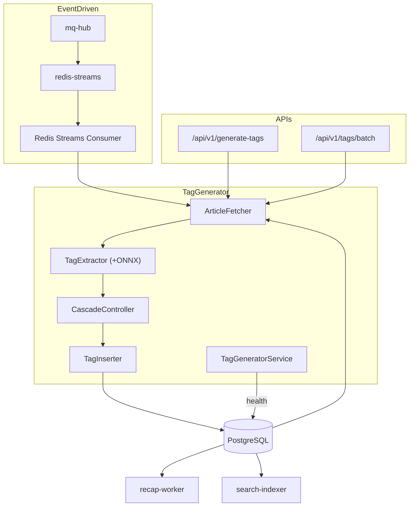

# Tag Generator

_Last reviewed: January 13, 2026_

**Location:** `tag-generator/app`

## Role
- Python 3.13+ FastAPI サービスで未タグ記事をバッチ処理し ML タグを抽出
- Redis Streams コンシューマーとしてイベント駆動タグ生成
- ONNX / SentenceTransformer + KeyBERT によるタグ抽出
- メモリ使用量を一定に保つ最適化設計

## Architecture & Flow



## Redis Streams Integration

| Setting | Value | Description |
|---------|-------|-------------|
| `REDIS_STREAMS_URL` | redis://redis-streams:6379 | Redis Streams URL |
| `CONSUMER_ENABLED` | true | コンシューマー有効化 |
| `CONSUMER_GROUP` | tag-generator-group | コンシューマーグループ名 |
| `CONSUMER_NAME` | tag-generator-1 | コンシューマー名 |

**Events:**
- `ArticleCreated`: 新規記事作成時にタグ生成トリガー
- `alt:events:articles` ストリームを購読

## Endpoints & Behavior

| Port | Endpoint | Description |
|------|----------|-------------|
| 9400 | `/health` | ヘルスチェック |
| 9400 | `/api/v1/generate-tags` | 認証付きタグ生成 (ユーザー向け) |
| 9400 | `/api/v1/tags/batch` | サービス間バッチタグ取得 |

### /api/v1/generate-tags
- 認証: `verify_service_token`
- ログ: `article_id`, sanitized tags, cascade verdicts

### /api/v1/tags/batch
- 認証: `SERVICE_SECRET` (X-Service-Token)
- リクエスト: `{"article_ids":[...]}`
- レスポンス: タグマップ + `updated_at`

## Pipeline

1. **ArticleFetcher**: カーソルベースで記事取得
2. **TagExtractor**: ONNX (存在時) or SentenceTransformer + KeyBERT
3. **CascadeController**: 信頼度、レイテンシ、レート予算で判定
4. **TagInserter**: バッチ upsert

## Configuration & Env

| Variable | Default | Description |
|----------|---------|-------------|
| `PORT` | 9400 | サービスポート |
| `DB_HOST` | db | PostgreSQL ホスト |
| `DB_PORT` | 5432 | PostgreSQL ポート |
| `DB_NAME` | - | データベース名 |
| `DB_TAG_GENERATOR_USER` | - | DB ユーザー |
| `DB_TAG_GENERATOR_PASSWORD_FILE` | - | DB パスワードファイル |
| `SERVICE_SECRET_FILE` | - | サービス認証シークレット |
| `REDIS_STREAMS_URL` | redis://redis-streams:6379 | Redis Streams URL |
| `CONSUMER_ENABLED` | true | コンシューマー有効化 |
| `TAG_ONNX_MODEL_PATH` | /models/onnx/model.onnx | ONNX モデルパス |
| `TAG_USE_FP16` | false | FP16 有効化 |
| `PROCESSING_INTERVAL` | - | 処理間隔 |
| `BATCH_LIMIT` | - | バッチ制限 |
| `CUDA_VISIBLE_DEVICES` | "" | GPU 無効化 (CPU 使用) |

## Memory Optimization

| Setting | Effect | Memory Impact |
|---------|--------|---------------|
| `TAG_USE_FP16=true` | FP16 重み変換 | ~200-300MB 削減 |
| ONNX Runtime | 最適化推論エンジン | ~100MB 削減 + 高速化 |
| `MEMORY_CLEANUP_INTERVAL` | GC 頻度 | 蓄積防止 |

**メモリフットプリント:**
- デフォルト (FP32): ~2GB
- FP16: ~1.6-1.8GB
- FP16 + ONNX: ~1.4-1.6GB

## Testing & Tooling

```bash
# テスト実行
uv run pytest

# 型チェック + Lint
uv run mypy
uv run ruff check
uv run ruff format

# セキュリティスキャン
uv run bandit
```

## Operational Runbook

1. サービス起動:
   ```bash
   docker compose -f compose/workers.yaml up tag-generator -d
   ```

2. ヘルスチェック:
   ```bash
   curl http://localhost:9400/health
   ```

3. Redis Streams コンシューマー確認:
   ```bash
   docker compose exec redis-streams redis-cli XINFO GROUPS alt:events:articles
   ```

4. メモリ最適化: `TAG_USE_FP16=true` 設定

5. カーソルポイズニング警告時は recovery クエリに切り替え

## Observability
- 構造化ログ: `structlog` + JSON
- ログフィールド: `cursor`, `batch_size`, `cascade_reason`, `inference_ms`, `confidence`
- rask.group ラベル: `tag-generator`
- ヘルスチェックログ: `consecutive_empty_cycles`, `average articles per cycle`

## Health Monitoring
- `TagGeneratorService` がサイクル統計をログ出力
- `MAX_CONSECUTIVE_EMPTY_CYCLES` 超過で診断ログ + カーソルポイズニング警告
- 将来タイムスタンプ or >30日古いカーソルで recovery クエリ発動

## LLM Notes
- 編集対象明示: `ArticleFetcher`, `TagExtractor`, `TagInserter`, `TagGeneratorService`
- `TAG_ONNX_MODEL_PATH` or `SERVICE_SECRET` の env 設定時は `_get_database_dsn()` を再利用
- メモリ最適化: `TAG_USE_FP16=true` → `ModelManager._load_models()` の動作変更
- Singleton パターンでモデル共有 (`ModelManager`)
- Model config フロー: `TagExtractionConfig` → `ModelConfig` → `ModelManager.get_models()`
- Redis Streams 連携でイベント駆動タグ生成に対応
