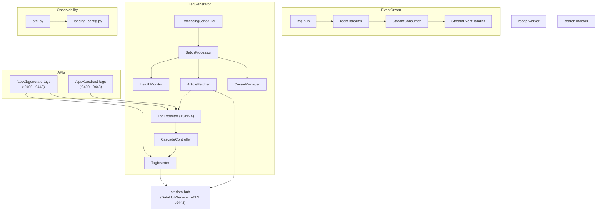

# Tag Generator

_Last reviewed: September 5, 2026_

**Location:** `tag-generator/app`

## Role
- Python 3.14+ FastAPI サービスで未タグ記事をバッチ処理し ML タグを抽出
- Redis Streams コンシューマーとしてイベント駆動タグ生成
- ONNX / SentenceTransformer + KeyBERT によるタグ抽出
- メモリ使用量を一定に保つ最適化設計
- Hybrid 処理戦略による効率的なバックフィル・フォワード処理

## Architecture & Flow


```mermaid
flowchart TD
    subgraph EventDriven
        RS[redis-streams]
        MQ[mq-hub]
        Consumer[StreamConsumer]
        Handler[StreamEventHandler]
    end

    subgraph TagGenerator
        Scheduler[ProcessingScheduler]
        BatchProc[BatchProcessor]
        Fetcher[ArticleFetcher]
        Extractor["TagExtractor (+ONNX)"]
        Cascade[CascadeController]
        Inserter[TagInserter]
        CursorMgr[CursorManager]
        HealthMon[HealthMonitor]
    end

    subgraph APIs
        API["/api/v1/generate-tags\n(:9400, :9443)"]
        ExtractAPI["/api/v1/extract-tags\n(:9400, :9443)"]
    end

    subgraph Observability
        OTel[otel.py]
        LogConfig[logging_config.py]
    end

    DataHub["alt-data-hub\n(DataHubService, mTLS :9443)"]
    Recap[recap-worker]
    Search[search-indexer]

    RS --> Consumer --> Handler
    MQ --> RS
    Scheduler --> BatchProc
    BatchProc --> CursorMgr
    BatchProc --> Fetcher
    Fetcher --> DataHub
    Extractor --> Cascade --> Inserter --> DataHub
    Fetcher --> Extractor
    BatchProc --> HealthMon
    API --> Extractor
    API --> Inserter
    ExtractAPI --> Extractor
    OTel --> LogConfig
```

## Directory Structure

```
tag-generator/app/
├── main.py                     # スタンドアロンの consumer/batch ランナー (FastAPI なし) — Dockerfile.tag-generator の CMD はこれではなく auth_service.py を起動する
├── pyproject.toml              # 依存関係・ツール設定
├── conftest.py                 # pytest 共通フィクスチャ
├── auth_service.py             # FastAPI アプリ + 認証ヘルパ
├── tag_generator/
│   ├── __init__.py
│   ├── config.py               # infra/config.py からの再エクスポート (後方互換)
│   ├── otel.py                 # infra/otel.py からの再エクスポート (後方互換)
│   ├── logging_config.py       # infra/logging_config.py からの再エクスポート (後方互換)
│   ├── service.py              # TagGeneratorService (メインサービス)
│   ├── scheduler.py            # ProcessingScheduler
│   ├── batch_processor.py      # BatchProcessor (Hybrid処理)
│   ├── cursor_manager.py       # CursorManager
│   ├── health_monitor.py       # HealthMonitor
│   ├── cascade.py              # CascadeController
│   ├── ports.py                 # ArticleFetcherPort / TagInserterPort
│   ├── exceptions.py            # ドメイン例外
│   ├── domain/
│   │   ├── errors.py            # ドメイン例外型
│   │   └── models.py            # ドメインモデル
│   ├── handler/
│   │   └── event_payload.py     # Redis Streams イベントペイロードのパース
│   ├── driver/
│   │   ├── connect_client_factory.py   # Connect-RPC クライアントファクトリ (alt-data-hub 宛)
│   │   ├── connect_article_fetcher.py  # ArticleFetcher (API モード)
│   │   └── connect_tag_inserter.py     # TagInserter (API モード)
│   ├── gen/proto/services/datahub/v1/  # buf 生成の Connect-RPC スタブ
│   ├── infra/
│   │   ├── config.py            # TagGeneratorConfig (pydantic-settings, env_prefix=TAG_)
│   │   ├── mtls_client.py        # 送信 mTLS クライアント構築
│   │   ├── inbound_tls.py        # 受信 in-process mTLS リスナー (:9443)
│   │   ├── peer_identity.py      # PeerIdentityMiddleware
│   │   ├── otel.py               # OpenTelemetry Provider
│   │   ├── logging_config.py     # ADR 98 準拠ロギング
│   │   └── pki/                  # step-ca 自動 enrollment + ops listener (manager/native_issuer/certfile/state/ops/metrics/config/start/filesafe)
│   ├── stream_consumer.py      # StreamConsumer (Redis Streams)
│   └── stream_event_handler.py # TagGeneratorEventHandler
├── tag_extractor/
│   ├── extract.py              # TagExtractor
│   ├── model_manager.py        # ModelManager (Singleton)
│   ├── lazy_model_manager.py   # 遅延ロードマネージャ
│   ├── input_sanitizer.py      # InputSanitizer
│   └── onnx_embedder.py        # ONNX Embedder
├── tag_inserter/
│   └── upsert_tags.py          # TagInserter
├── article_fetcher/
│   └── fetch.py                # ArticleFetcher
├── scripts/
│   └── build_label_graph.py    # ラベルグラフ構築スクリプト
└── tests/
    ├── __init__.py
    ├── unit/
    │   ├── test_scheduler.py
    │   ├── test_input_sanitizer.py
    │   ├── test_model_manager.py
    │   ├── test_batch_processor_recursion.py
    │   ├── test_article_fetcher_forward.py
    │   ├── test_batch_upsert_skipped_articles.py
    │   ├── test_build_label_graph.py
    │   ├── test_logging_config.py
    │   ├── test_pyrefly_compliance.py
    │   └── test_ruff_compliance.py
    └── integration/
        ├── test_tag_generator_logging.py
        └── test_sanitized_tag_extraction.py
```

## Data Access Mode (ADR-000241 / ADR-000397 / ADR-000954)

tag-generator は Connect-RPC (API モード) のみを使う。Legacy の
PostgreSQL 直接アクセスは [[ADR-000397]] で撤去され、さらに本サービスに
残っていた `/api/v1/tags/batch` + `tag_fetcher.py` + `db_pool.py` も
[[ADR-000241]] の北極星に揃える形で撤去された。

**ADR-000954 でデータオーナーが alt-backend から alt-data-hub に移設**された
(D7)。`tag_generator/driver/connect_client_factory.py` が呼ぶのは
`services.datahub.v1.DataHubService` — 環境変数名は `BACKEND_API_URL` /
`BACKEND_API_MTLS_URL` のまま残っているが、実際に待ち受けるのは alt-data-hub。
現在タグ参照は alt-data-hub `BatchGetTagsByArticleIDs` が担う。

サービス間通信は mTLS が前提 (`MTLS_ENFORCE` は compose で `true` がデフォルト)。
クライアントは `connect-python` + `protobuf` で生成した型付きスタブ
(`tag_generator/gen/proto/services/datahub/v1/`) を使い、実際の HTTP/TLS
トランスポートは `pyqwest`（mTLS 証明書のホットリロード対応、`_ReloadingBackendClient`）。
`httpx` は依存関係には残っているが、Connect-RPC 呼び出し経路には使われていない。

インバウンド側も mTLS 化されている（Wave 4）: `PORT` (デフォルト `9400`) の
平文リスナーに加えて、`INBOUND_TLS_ENABLED=true` のとき同じ FastAPI アプリを
`INBOUND_TLS_PORT` (デフォルト `9443`) で in-process mTLS リスナーとしても
起動する (`tag_generator/infra/inbound_tls.py`)。compose は `9400` を
`127.0.0.1` のみに bind しており、外部から到達できるのは `9443` 側だけ。

## Redis Streams Integration

| Setting | Value | Description |
|---------|-------|-------------|
| `REDIS_STREAMS_URL` | redis://redis-streams:6379 | Redis Streams URL |
| `CONSUMER_ENABLED` | true | コンシューマー有効化 |
| `CONSUMER_GROUP` | tag-generator-group | コンシューマーグループ名 |
| `CONSUMER_NAME` | tag-generator-1 | コンシューマー名 |
| `STREAM_KEY` | alt:events:articles | ストリームキー |
| `CONSUMER_BATCH_SIZE` | 10 | バッチサイズ |
| `CONSUMER_BLOCK_TIMEOUT_MS` | 5000 | ブロックタイムアウト (ms) |
| `CONSUMER_CLAIM_IDLE_TIME_MS` | 30000 | アイドル時間 (ms) |

**Events:**
- `ArticleCreated`: 新規記事作成時にタグ生成トリガー
- `alt:events:articles` ストリームを購読

## Endpoints & Behavior

| Port | Endpoint | Description |
|------|----------|-------------|
| 9400 (`127.0.0.1` only), 9443 (in-process mTLS, `INBOUND_TLS_ENABLED=true`) | `/health` | ヘルスチェック |
| 9400, 9443 | `/api/v1/generate-tags` | 認証付きタグ生成 (ユーザー向け、`@require_auth`) |
| 9400, 9443 | `/api/v1/extract-tags` | サービス間テキスト抽出。認証は事実上未強制（下記参照）— 到達性のみで守られている |

### /api/v1/generate-tags
- 認証: `@require_auth(tag_service.auth_client)` — エンドユーザー向けの alt-auth トークン検証（ユーザー起点のタグ生成）
- ログ: `article_id`, sanitized tags, cascade verdicts

### /api/v1/extract-tags
- 認証: `verify_service_token` を呼ぶが、これは **no-op**（何も検証しない）。`PeerIdentityMiddleware`
  も `strict=False` で登録されており（`auth_service.py`）、strict でないときは 401/403 を一切返さない
  ——  peer CN を `request.state.peer_identity` に記録して通すだけで、`MTLS_ALLOWED_PEERS` の
  allowlist は現状 **何も強制していない**。sidecar 由来のヘッダー (`X-Alt-Peer-Identity`) も
  compose が `PEER_IDENTITY_TRUSTED=off` にしているため信用されない。実際に効いている制御は
  (a) `9443` (in-process mTLS リスナー) の `ssl.CERT_REQUIRED` — CA 署名済みのクライアント証明書を
  要求するが、`MTLS_ALLOWED_PEERS` allowlist 自体は検証しない — と (b) 平文ポート `9400` が
  `127.0.0.1` にしか bind されていないというネットワーク到達性の 2 点のみ
- リクエスト: `{"title": str, "content": str}`
- レスポンス: `{success, tags[], confidence, inference_ms, language}`

タグのバッチ参照 (旧 `/api/v1/tags/batch`) は [[ADR-000241]] / [[ADR-000397]]
の方針によりバックエンドの `BatchGetTagsByArticleIDs` に移設され、ADR-000954 で
その提供元が alt-backend から alt-data-hub に変わった。recap-worker
など下流サービスはそちらを経由する。

## Pipeline

1. **ArticleFetcher**: カーソルベースで記事取得
2. **InputSanitizer**: HTML サニタイズ + バリデーション
3. **TagExtractor**: ONNX (存在時) or SentenceTransformer + KeyBERT
4. **CascadeController**: 信頼度、レイテンシ、レート予算で判定
5. **TagInserter**: バッチ upsert

## Hybrid Processing Strategy

tag-generator は **Hybrid 処理戦略** を採用し、効率的なタグ付けを実現:

### Forward Processing
新規記事の処理 (初回バックフィル完了後):
- `fetch_new_articles()` で forward cursor より新しい未タグ記事を取得
- 昇順 (ASC) で処理し、最新記事を優先

### Backfill Mode
過去記事の遡及タグ付け:
- `fetch_articles()` で backward cursor より古い未タグ記事を取得
- 降順 (DESC) で処理し、新しい記事から順にバックフィル

### 自動切り替えロジック
```python
# BatchProcessor での処理戦略選択
if backfill_completed and has_existing_tags:
    return process_article_batch_forward()
else:
    return process_article_batch_backfill()  # 内部で hybrid モードも実行
```

- `max_empty_backfill_fetches`: 3 回連続で空バッチなら backfill 完了と判定
- バックフィル中も新規記事を検出した場合は hybrid モードで両方処理

## Configuration & Env

### Core Settings

| Variable | Default | Description |
|----------|---------|-------------|
| `PORT` | 9400 | 平文サービスポート (compose では `127.0.0.1` のみに bind) |
| `INBOUND_TLS_ENABLED`, `INBOUND_TLS_PORT` | `false`, 9443 | in-process mTLS リスナー。Wave 4 での東西 mTLS 化 |
| `BACKEND_API_URL` / `BACKEND_API_MTLS_URL` | - | 実際の宛先は alt-data-hub の Connect-RPC (ADR-000954)。名前は歴史的経緯で `BACKEND_API_URL` のまま |
| `MTLS_ENFORCE`, `MTLS_CERT_FILE`, `MTLS_KEY_FILE`, `MTLS_CA_FILE` | compose では `MTLS_ENFORCE=true` | 送信側 mTLS。alt-data-hub の data plane に平文フォールバックはない |
| `PKI_ENROLLMENT`, `CERT_SUBJECT`, `CERT_SANS`, `CERT_PATH`, `KEY_PATH`, `STEP_CA_URL`, `STEP_CA_ROOT_FILE`, `STEP_CA_PROVISIONER`, `STEP_CA_PROVISIONER_PASSWORD_FILE`, `RENEW_AT_FRACTION`, `OPS_LISTEN` | compose: `PKI_ENROLLMENT=enabled`, `OPS_LISTEN=:9110`。未設定時は disabled | `tag_generator/infra/pki` の in-process step-ca enrollment（9 モジュール: manager / native_issuer / certfile / state / ops / metrics / config / start / filesafe）。`:9443` の leaf 証明書を発行・更新し、`OPS_LISTEN` で `/health` + `/metrics` を提供。enrollment 失敗は起動時に fatal（`auth_service.py` lifespan で例外が握りつぶされない） |

> **削除された変数** (ADR-000241 で廃止): `DB_HOST`, `DB_PORT`, `DB_NAME`, `DB_TAG_GENERATOR_USER`, `DB_TAG_GENERATOR_PASSWORD_FILE`。旧 `SERVICE_TOKEN_FILE` / `SERVICE_SECRET_FILE` もコード上どこからも参照されておらず、実質的に廃止済み

### Processing Settings

`TagGeneratorConfig` (pydantic-settings, `env_prefix="TAG_"`) 経由。プレフィックスなしの
`PROCESSING_INTERVAL` 等では読み込まれない。

| Variable | Default | Description |
|----------|---------|-------------|
| `TAG_PROCESSING_INTERVAL` | 300 | 処理間隔 (秒) - アイドル時 |
| `TAG_ACTIVE_PROCESSING_INTERVAL` | 180 | 処理間隔 (秒) - 未処理記事が残っている時 |
| `TAG_ERROR_RETRY_INTERVAL` | 60 | エラー後のリトライ間隔 (秒) |
| `TAG_BATCH_LIMIT` | 75 | バッチ制限 |
| `TAG_MEMORY_CLEANUP_INTERVAL` | 25 | GC 実行間隔 (記事数) |

### ML Model Settings

| Variable | Default | Description |
|----------|---------|-------------|
| `TAG_ONNX_MODEL_PATH` | /models/onnx/model.onnx | ONNX モデルパス |
| `TAG_USE_FP16` | false | FP16 有効化 |
| `CUDA_VISIBLE_DEVICES` | "" | GPU 無効化 (CPU 使用) |
| `OMP_NUM_THREADS` | 4 | OpenMP スレッド数制限 (CPU 爆発防止) |
| `MKL_NUM_THREADS` | 4 | MKL スレッド数制限 |
| `TORCH_NUM_THREADS` | 4 | PyTorch スレッド数制限 |
| `TOKENIZERS_PARALLELISM` | false | HuggingFace Tokenizers 並列化無効 (fork 安全性) |

### Logging & Observability

| Variable | Default | Description |
|----------|---------|-------------|
| `TAG_LOG_LEVEL` | INFO | ログレベル |
| `OTEL_ENABLED` | true | OpenTelemetry 有効化 |
| `OTEL_SERVICE_NAME` | tag-generator | OTel サービス名 |
| `OTEL_EXPORTER_OTLP_ENDPOINT` | http://localhost:4318 | OTel エンドポイント |
| `SERVICE_VERSION` | 0.0.0 | サービスバージョン |
| `DEPLOYMENT_ENV` | development | 環境 (development/production) |

## Cascade Controller

Cost-Sensitive Cascade / EERO-style gating heuristic による判定:

### Configuration (`CascadeConfig`)

| Parameter | Default | Description |
|-----------|---------|-------------|
| `confidence_threshold` | 0.72 | 信頼度閾値 |
| `min_tags_for_confident_exit` | 5 | 高信頼度 exit に必要な最小タグ数 |
| `max_refine_ratio` | 0.35 | refine 候補の最大比率 |
| `inference_ms_threshold` | 180.0 | 推論時間閾値 (ms) |
| `min_confidence_boost` | 0.1 | 最小信頼度ブースト |

### Decision Reasons

| Reason | Trigger |
|--------|---------|
| `high_confidence_exit` | 信頼度・タグ数・推論時間すべて閾値内 |
| `low_confidence` | confidence < 0.72 |
| `insufficient_tag_coverage` | tag_count < 5 |
| `slow_inference` | inference_ms > 180.0 |
| `refine_ratio_budget_capped` | refine 比率が 35% を超過 |

## Input Sanitization

`InputSanitizer` による入力検証・サニタイズ:

### Validation Limits

| Field | Limit | Description |
|-------|-------|-------------|
| `title` | 1-1000 文字 | タイトル長 |
| `content` | 1-100000 文字 | コンテンツ長 (100KB) |
| `url` | max 2048 文字 | URL 長 |

### Sanitization Steps

1. **HTML サニタイズ** (`nh3`): 危険なタグ (script, style, iframe, object, embed) を除去
2. **制御文字除去**: ord < 32 の文字を除去 (タブ・改行・CR は許可)
3. **Unicode 正規化**: NFC 正規化
4. **セキュリティチェック**: 疑わしいパターン検出 (過度な繰り返し、異常な文字頻度)

## Memory Optimization

| Setting | Effect | Memory Impact |
|---------|--------|---------------|
| `TAG_USE_FP16=true` | FP16 重み変換 | ~200-300MB 削減 |
| ONNX Runtime | 最適化推論エンジン | ~100MB 削減 + 高速化 |
| `MEMORY_CLEANUP_INTERVAL` | GC 頻度 | 蓄積防止 |

**メモリフットプリント:**
- デフォルト (FP32): ~2GB
- FP16: ~1.6-1.8GB
- FP16 + ONNX: ~1.4-1.6GB

## Dependencies

### Core Dependencies
```toml
requires-python = ">=3.14,<3.15"

dependencies = [
    "fugashi[unidic-lite]>=1.5.1",   # Japanese text processing
    "nltk>=3.10.3",
    "langdetect>=1.0.9",
    "psycopg2-binary>=2.9.0",
    "psycopg[binary]>=3.2.0",
    "psycopg-pool>=3.2.0",
    "structlog>=25.4.0",
    "pydantic>=2.10.0",
    "pydantic-settings>=2.7.0",
    "nh3>=0.2.18",                   # HTML sanitizer
    "readability-lxml>=0.8.4.1",     # HTML readability extraction
    "lxml>=5.3.0",
    "connect-python>=0.9.0",         # typed Connect-RPC client (alt-data-hub)
    "protobuf>=6.33.5,<7.0",
    "fastapi>=0.100.0",
    "uvicorn>=0.20.0",
    "aiohttp>=3.14.3",
    "redis>=5.0.0",                  # Redis Streams consumer
    "PyJWT>=2.12.0",
    "python-multipart>=0.0.27",
    "opentelemetry-sdk>=1.29.0",
    "opentelemetry-exporter-otlp-proto-http>=1.29.0",
    "opentelemetry-instrumentation-logging>=0.50b0",
    "cryptography>=50.0.0,<51",
    "jwcrypto>=1.5.8,<2",
    "prometheus-client>=0.26.0,<1",
    "httpx>=0.28.1,<0.29",           # not on the Connect-RPC path today
]
```

pyqwest (the mTLS-capable HTTP transport `connect_client_factory.py` actually uses) is
pulled in transitively by `connect-python` and is not listed directly in `pyproject.toml`.

### Dev Dependencies
```toml
dev = [
    "pytest>=9.0.3",
    "pytest-cov>=6.0.0",
    "pytest-mock>=3.14.1",
    "pytest-timeout>=2.4.0",
    "ruff>=0.12.1",
    "bandit>=1.8.0",
    "pytest-asyncio>=0.24.0",
    "hypothesis>=6.100.0",           # property-based testing
    "pyrefly>=0.42.0",               # Type checking (replaces mypy)
    "types-psycopg2>=2.9.21.20250516",
    "psutil>=5.9.0",
    "pact-python>=3.2.1",            # contract testing
]
```

### ML Dependencies (dependency-groups, not extras)

The base install is deliberately "ultra-minimal" (per `pyproject.toml`'s own
description) — heavy ML packages are excluded from `dependencies` and installed
separately via `uv sync --group ml` in the Dockerfile (torch resolves against the
CPU-only wheel index):

```toml
ml = [
    "torch>=2.1.0",
    "sentence-transformers>=5.0.0",
    "keybert>=0.8.5",
    "transformers>=5.8.1",
    "scikit-learn>=1.5.2",
    "numpy>=1.26.0",
    "onnxruntime>=1.21.0",
    "unidic",
]
```

A second `ml-extended` group adds GiNZA for improved Japanese NLP (`ginza`,
`ja-ginza`, `spacy`) on top of the same ML stack; nothing installs it by default.

## Testing & Tooling

```bash
# テスト実行
uv run pytest

# カバレッジ付き
uv run pytest --cov=.

# 型チェック (pyrefly)
uv run pyrefly check .

# Lint
uv run ruff check
uv run ruff format

# セキュリティスキャン
uv run bandit -r . -x tests
```

## Operational Runbook

1. サービス起動:
   ```bash
   docker compose -f compose/workers.yaml up tag-generator -d
   ```

2. ヘルスチェック:
   ```bash
   curl http://localhost:9400/health
   ```

3. Redis Streams コンシューマー確認:
   ```bash
   docker compose exec redis-streams redis-cli XINFO GROUPS alt:events:articles
   ```

4. メモリ最適化: `TAG_USE_FP16=true` 設定

5. カーソルポイズニング警告時は recovery クエリに切り替え

## Known failure patterns

- **KeyBERT lowercase default kills uppercase candidates**: tags like "GitHub"/"API" never extracted → CountVectorizer defaults to `lowercase=True` → pass a custom vectorizer with `lowercase=False` → [[000181]].
- **`\b` word boundary does not work in Japanese**: regex candidate matching silently fails on unspaced CJK text → use a Fugashi-based `analyzer` instead of `token_pattern` → [[000183]].
- **Special-character-frequency sanitizer blocks Japanese punctuation**: legitimate articles rejected because 、。「」 counted as suspicious → detect CJK ratio (10%+) and bypass the check → [[000172]].
- **Legacy transaction residue stopped tagging for 7 days**: crash loop every 60s (12,000+ cycles) on `conn.autocommit` AttributeError, with no alert → `_NullDatabaseManager` yielded `None` after the DB-access migration → remove legacy code paths completely; crash loops need alerting → [[000266]].
- **Request-Reply consumer wiring + Redis pool exhaustion**: tags consumer "deployed" but never ran (added to `main.py` while the real entrypoint was `auth_service.py`); 60s reply-waits × parallelism then exhausted the pool (10) → verify the actual container entrypoint; size pools as parallelism × hold time → [[000319]]. Same ADR: protobuf gencode 7.x vs runtime 6.x crashes at import — pin `protobuf>=6.x,<7.0`.
- **Offset pagination on a shrinking result set**: untagged-article pages skip rows because tagging removes items from the set → keyset pagination on `(created_at, id)`; note a backward keyset cursor turns "new-article forward" semantics into backfill → [[000481]] [[000529]].
- **Poison pill head-of-line blocking**: one permanently failing article stalls the whole batch → process-local failure counter to skip it + dig into the next page (bounded) instead of cross-service state → [[000525]] [[000529]].
- **Do not re-fetch what the event already carries**: `feed_id` present in the `ArticleCreated` payload was discarded and re-fetched via RPC, producing NULLs → consume the event payload directly → [[000483]].

## Observability

### Structured Logging
- `structlog` + JSON 出力
- ADR 98 準拠: `alt.*` プレフィックス

### ADR 98 Business Context
`logging_config.py` の `add_business_context()` により自動変換:
- `article_id` → `alt.article.id`
- `feed_id` → `alt.feed.id`
- 全ログに `alt.ai.pipeline = "tag-extraction"` を付与

### Log Fields
- `cursor`, `batch_size`, `cascade_reason`, `inference_ms`, `confidence`
- rask.group ラベル: `tag-generator`
- ヘルスチェック: `consecutive_empty_cycles`, `average articles per cycle`

### OpenTelemetry Integration
- **Tracing**: `TracerProvider` + `OTLPSpanExporter`
- **Logging**: `LoggerProvider` + `OTLPLogExporter`
- Resource attributes: `service.name`, `service.version`, `deployment.environment`

## Health Monitoring

`HealthMonitor` がサービス状態を監視:

- `TagGeneratorService` がサイクル統計をログ出力
- `MAX_CONSECUTIVE_EMPTY_CYCLES` (20) 超過で診断ログ + カーソルポイズニング警告
- 将来タイムスタンプ (>1時間) or >365日古いカーソルで recovery クエリ発動

## LLM Notes

- 編集対象明示: `ArticleFetcher`, `TagExtractor`, `TagInserter`, `TagGeneratorService`, `BatchProcessor`
- メモリ最適化: `TAG_USE_FP16=true` → `ModelManager._load_models()` の動作変更
- Singleton パターンでモデル共有 (`ModelManager`)
- Model config フロー: `TagExtractionConfig` → `ModelConfig` → `ModelManager.get_models()`
- Redis Streams 連携でイベント駆動タグ生成に対応
- Hybrid 処理: `BatchProcessor.process_article_batch()` が戦略を自動選択
- 入力サニタイズ: `InputSanitizer` を経由してタグ抽出
