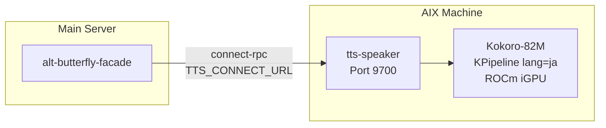

# TTS Speaker

_Last reviewed: February 11, 2026_

**Location:** `tts-speaker/`
**Port:** 9700

## Role

- **Japanese TTS Service**: Text-to-speech synthesis using Kokoro-82M (82M parameters) for Japanese news audio.
- **Evening Pulse Integration**: Provides audio narration for the Evening Pulse v4.0 daily news digest.
- **iGPU Accelerated**: ROCm 7.2 on AMD Radeon iGPU with FP16, CPU fallback.
- **connect-rpc API**: Accessed via alt-butterfly-facade using connect-rpc protocol.

## Architecture Overview



## Model Configuration

### Kokoro-82M

- **Parameters**: 82M
- **Language**: Japanese (`lang_code="j"`)
- **Sample Rate**: 24kHz
- **Output Format**: WAV (float32)
- **First Load**: Downloads ~330MB from HuggingFace Hub
- **GPU**: ROCm 7.2 FP16 on AMD Radeon iGPU (auto-detected, CPU fallback)

### Available Voices

| Voice ID | Name | Gender |
|----------|------|--------|
| `jf_alpha` | Alpha | Female (default) |
| `jf_gongitsune` | Gongitsune | Female |
| `jf_nezumi` | Nezumi | Female |
| `jf_tebukuro` | Tebukuro | Female |
| `jm_kumo` | Kumo | Male |

## API Endpoints

| Protocol | Path | Auth | Description |
|----------|------|------|-------------|
| REST | `/health` | No | Service health + device info |
| connect-rpc | `/alt.tts.v1.TTSService/Synthesize` | Yes | Text-to-speech synthesis |
| connect-rpc | `/alt.tts.v1.TTSService/ListVoices` | Yes | List available voices |

### Synthesize (connect-rpc)

**Proto:** `proto/alt/tts/v1/tts.proto`

**Request (`SynthesizeRequest`):**

```json
{
  "text": "本日の重要ニュースをお伝えします。",
  "voice": "jf_alpha",
  "speed": 1.0
}
```

- `text`: 1-5000 characters (required)
- `voice`: Voice ID (optional, defaults to `TTS_DEFAULT_VOICE`)
- `speed`: 0.5-2.0 (optional, defaults to `TTS_DEFAULT_SPEED`)

**Response (`SynthesizeResponse`):**

```json
{
  "audioWav": "<base64 WAV bytes>",
  "sampleRate": 24000,
  "durationSeconds": 2.5
}
```

### GET /health

```json
{"status": "ok", "model": "kokoro-82m", "lang": "ja", "device": "cuda"}
```

Returns 503 with `{"status": "loading"}` during model initialization.

## Directory Structure

```
tts-speaker/
├── Dockerfile                  # Multi-stage build (Python 3.12 + ROCm PyTorch)
├── .dockerignore
├── pyproject.toml
├── tts_speaker/
│   ├── app/
│   │   ├── main.py             # create_app() factory, Starlette ASGI
│   │   └── connect_service.py  # connect-rpc TTSService implementation
│   ├── core/
│   │   └── pipeline.py         # TTSPipeline wrapper, GPU auto-detection
│   ├── gen/
│   │   └── proto/              # buf-generated protobuf + connect-rpc stubs
│   └── infra/
│       ├── config.py           # pydantic-settings
│       └── auth.py             # X-Service-Token verification (legacy)
└── tests/
    ├── unit/                   # Fast tests (mocked pipeline)
    └── integration/            # Requires model download
```

## Compose Integration

### Separate Compose File (`compose.tts.yaml`)

tts-speaker runs in a dedicated Compose file on the AMD Ryzen machine with GPU passthrough:

```yaml
services:
  tts-speaker:
    build:
      context: ./tts-speaker
      dockerfile: Dockerfile
    ports:
      - "9700:9700"
    devices:
      - /dev/kfd
      - /dev/dri
    group_add:
      - video
      - render
    volumes:
      - tts_models:/app/.cache/huggingface
    healthcheck:
      test: ["CMD", "curl", "-f", "http://localhost:9700/health"]
      start_period: 120s
```

### BFF Access (alt-butterfly-facade)

alt-butterfly-facade routes connect-rpc TTS requests via `TTS_CONNECT_URL`:

```yaml
# compose/bff.yaml
environment:
  - TTS_CONNECT_URL=http://tts-external:9700
```

Requests to `/alt.tts.v1.TTSService/*` are forwarded to the TTS service.

## Environment Variables

| Variable | Default | Description |
|----------|---------|-------------|
| `SERVICE_SECRET` | `` | Auth token (empty = skip auth) |
| `SERVICE_SECRET_FILE` | - | Docker secrets file path |
| `TTS_DEFAULT_VOICE` | `jf_alpha` | Default voice ID |
| `TTS_DEFAULT_SPEED` | `1.0` | Default speech speed |
| `LOG_LEVEL` | `INFO` | Application log level |
| `HF_HOME` | `/app/.cache/huggingface` | HuggingFace model cache |
| `HSA_OVERRIDE_GFX_VERSION` | `11.0.0` | ROCm GPU override for iGPU |
| `HIP_VISIBLE_DEVICES` | `0` | GPU device selection |

### .env.template Variables

| Variable | Default | Description |
|----------|---------|-------------|
| `TTS_EXTERNAL` | `http://tts-external:9700` | URL for consumers to reach tts-speaker |
| `TTS_EXTERNAL_HOST` | `0.0.0.0` | AMD Ryzen machine IP for extra_hosts |
| `TTS_CONNECT_URL` | `http://tts-external:9700` | BFF connect-rpc routing URL |

## Health Check

```yaml
healthcheck:
  test: ["CMD", "curl", "-f", "http://localhost:9700/health"]
  interval: 30s
  timeout: 10s
  retries: 3
  start_period: 120s  # Allow time for model download (~330MB)
```

## Related Services

| Service | Relationship |
|---------|-------------|
| `alt-butterfly-facade` | BFF proxy (connect-rpc routing via `TTS_CONNECT_URL`) |
| `news-creator` | Consumer (Evening Pulse audio generation) |
| `knowledge-augur` | Sibling AMD Ryzen machine service (same GPU passthrough pattern) |

## Troubleshooting

| Symptom | Cause | Resolution |
|---------|-------|------------|
| 503 on /health | Model still loading | Wait for `start_period` (120s); check `docker logs tts-speaker` |
| `device: cpu` in /health | GPU not detected | Verify `/dev/kfd` and `/dev/dri` available, ROCm drivers installed |
| Connection refused from BFF | `TTS_CONNECT_URL` misconfigured | Verify URL in compose/bff.yaml matches AMD Ryzen machine IP |
| Slow first request | Model downloading | First run downloads ~330MB; subsequent starts use cached volume |
| espeak-ng error | Missing system dependency | Ensure `espeak-ng` is in Dockerfile runtime stage |

## Development

### Local Testing

```bash
cd tts-speaker
uv sync
uv run pytest tests/unit/
```

### Proto Code Generation

```bash
cd proto && buf generate --template buf.gen.tts-speaker.yaml
```

### AMD Ryzen machine Deployment

```bash
ssh <AMD Ryzen machine IP> "cd ~/Alt && git pull"
ssh <AMD Ryzen machine IP> "cd ~/Alt && docker compose -f compose.tts.yaml up -d --build"
ssh <AMD Ryzen machine IP> "curl -s http://localhost:9700/health"  # Check GPU status
```

### connect-rpc Test

```bash
buf curl --protocol connect \
  http://<AMD Ryzen machine IP>:9700/alt.tts.v1.TTSService/ListVoices
```
