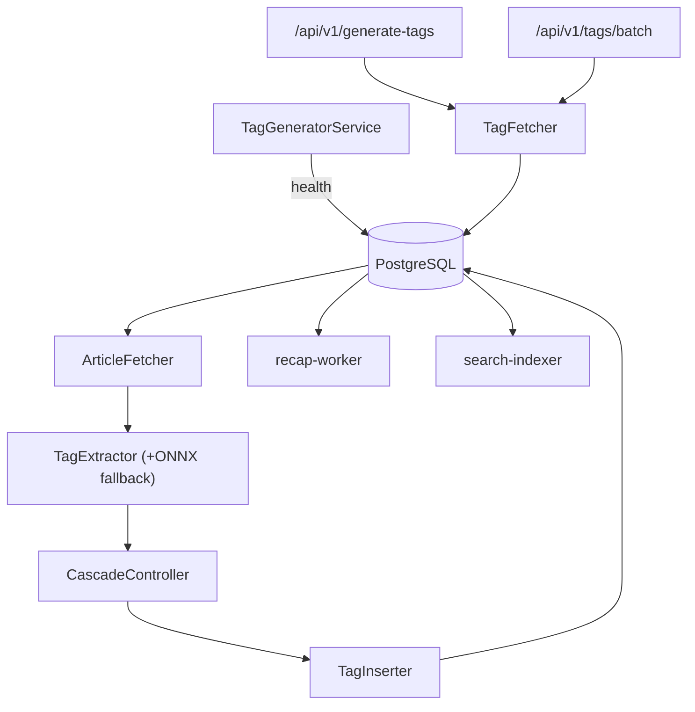

# Tag Generator

_Last reviewed: January 2, 2026_

**Location:** `tag-generator/app`

## Role
- Python 3.13 FastAPI service that batches untagged articles, extracts ML-driven tags, and writes them back to Postgres while keeping memory usage flat.
- Runs a background `TagGeneratorService` loop with `TagExtractor`, `CascadeController`, and `TagInserter`, plus exposes authenticated APIs for real-time and batch requests.
- Maintains detailed cascade diagnostics so recap-worker, search-indexer, and downstream clients can trust tag confidences and bias checks.

## Pipeline & APIs
- `TagGeneratorService`: loops forever (`run_service`) while tracking health (total cycles, consecutive empty cycles). Each cycle:
  1. Fetches articles via `ArticleFetcher.fetch_articles` (cursor-based, `last_processed_created_at`, `last_processed_id`).
  2. Runs `TagExtractor.extract_tags_with_metrics` (ONNX runtime if model exists, else SentenceTransformer + KeyBERT fallback) and attaches `TagExtractionOutcome`.
  3. Applies `CascadeController` decisions (confidence, latency, rate budgets) to decide refinements before handing results to `TagInserter`.
  4. Inserts tags via `TagInserter.batch_upsert_tags[_no_commit]`.
  5. Performs manual GC every `memory_cleanup_interval` entries and logs cascade metadata.
- APIs:
  - `/api/v1/generate-tags`: authenticated endpoint (`verify_service_token`) for user-specific requests; logs `article_id`, sanitized tags, cascade verdicts.
  - `/api/v1/tags/batch`: service-to-service endpoint guarded by `SERVICE_SECRET`; accepts JSON `{"article_ids":[... ]}` and delegates to `tag_fetcher.fetch_tags_by_article_ids`.
  - `tag_fetcher.py` centralizes DB reads, ensures ISO timestamps, and builds aggregated tag maps with `updated_at`.
- `build_label_graph.py` script refreshes `tag_label_graph` from `recap_genre_learning_results` (used by recap-worker).

## Configuration & Env
- DB: `DB_TAG_GENERATOR_USER`, `DB_TAG_GENERATOR_PASSWORD`, `DB_HOST`, `DB_PORT`, `DB_NAME`.
- Processing: `PROCESSING_INTERVAL`, `BATCH_LIMIT`, `PROGRESS_LOG_INTERVAL`, `MEMORY_CLEANUP_INTERVAL`, `ENABLE_GC_COLLECTION`.
- Health: `HEALTH_CHECK_INTERVAL`, `MAX_CONSECUTIVE_EMPTY_CYCLES`.
- ONNX: `TAG_ONNX_MODEL_PATH` (default `/models/onnx/model.onnx`), `use_onnx_runtime` toggles fallback; when model missing, automatically switches to SentenceTransformer + KeyBERT.
- **Memory optimization**: `TAG_USE_FP16=true` enables FP16 (half-precision) for ~200-300MB memory reduction; recommended for GPU, works on CPU with potential speed tradeoff. See [ADR-0042](./ADR/000042.md).
- Service tokens: `SERVICE_SECRET` secures `/api/v1/tags/batch`; absence emits 500, missing/invalid headers emit 401/403.
- Tag label graph windows: `TAG_LABEL_GRAPH_WINDOW` (default `7d`) and `TAG_LABEL_GRAPH_TTL_SECONDS` (900) align scripts + recap-worker.

## Memory Optimization
The service uses a singleton `ModelManager` to share ML models across all `TagExtractor` instances, avoiding duplicate loading. Key optimization levers:

| Setting | Effect | Memory Impact |
|---------|--------|---------------|
| `TAG_USE_FP16=true` | Convert model weights to FP16 | ~200-300MB reduction |
| ONNX Runtime (default) | Use optimized inference engine | ~100MB reduction + faster inference |
| `MEMORY_CLEANUP_INTERVAL` | GC frequency during batch processing | Prevents accumulation |

**Typical memory footprint:**
- Default (FP32): ~2GB
- With FP16: ~1.6-1.8GB
- With FP16 + ONNX: ~1.4-1.6GB (requires ONNX model file)

## Testing & Tooling
- `uv run pytest` covers unit tests (`tag_extractor`, `tag_fetcher`, `tag_inserter`) and integration suites (pipeline end-to-end).
- `uv run mypy`, `uv run ruff check/format` enforce typing/style. Optionally run `uv run bandit` for security scans.
- When tweaking cursor recovery, add tests under `tests/unit/test_service_cursor.py`.
- Golden datasets for cascade metrics live alongside `tests/unit`.

## Health & Monitoring
- `TagGeneratorService` logs cycle stats (`Consecutive empty cycles`, `Articles processed`, `cursor poisoning warnings`, `untagged article count`).
- If empty cycles ≥ `MAX_CONSECUTIVE_EMPTY_CYCLES`, logs diagnostics (untagged count) and warns about cursor poisoning.
- `_perform_health_check` outputs `consecutive_empty_cycles`, `average articles per cycle`, and `diagnostic counts` before continuing.
- The service warns about `cursor poisoning` (future timestamps or >30 days old) and switches to recovery queries.

## Observability
- Logging uses `structlog` + JSON output; entries include `cursor`, `batch_size`, `cascade_reason`, `inference_ms`, `confidence`.
- Cascade metadata (e.g., `needs_refine`, `refine_ratio`, `inference_ms`) is included in both API responses and internal logs.
- `tag_generator.cascade.CascadeController` metrics can be exported once Prometheus/ClickHouse integration is wired.

## LLM Notes
- Specify whether edits touch `ArticleFetcher`, `TagExtractor`, `TagInserter`, or `TagGeneratorService`.
- Provide `TAG_ONNX_MODEL_PATH` or `SERVICE_SECRET` when generating env wiring; instruct models not to duplicate DSN logic but to reuse `_get_database_dsn()`.
- For memory optimization, use `TAG_USE_FP16=true`; this modifies `ModelManager._load_models()` behavior. The singleton pattern ensures models are shared across threads.
- Model config flows: `TagExtractionConfig` → `ModelConfig` → `ModelManager.get_models()`. Changes to model loading should go through `model_manager.py`.
