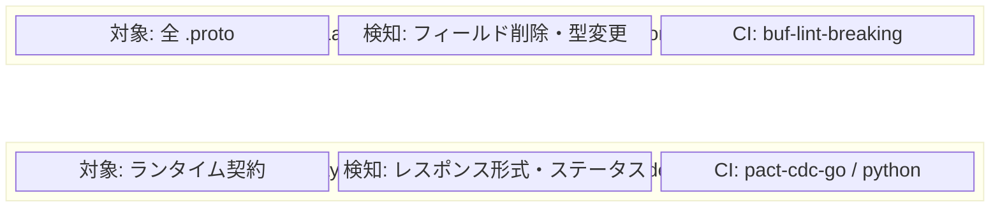
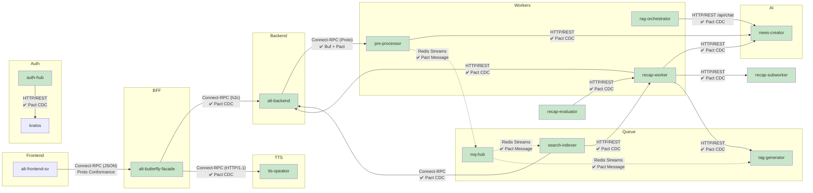
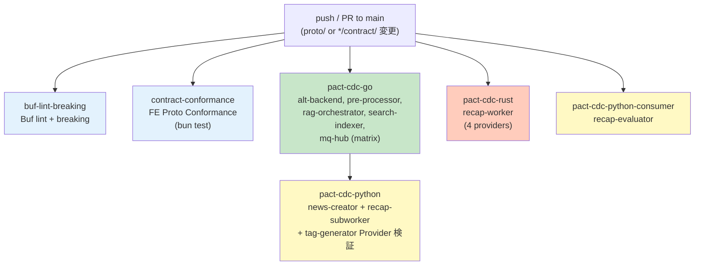
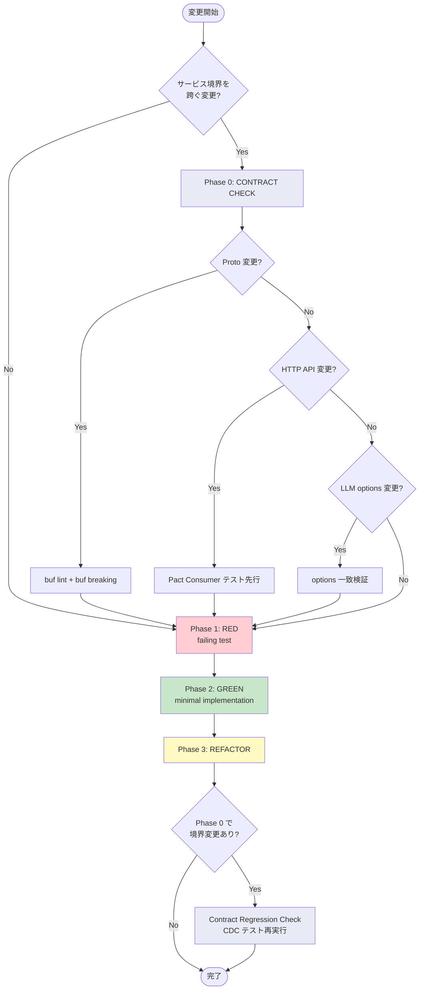

# Alt Testing Strategy

## Test Pyramid

```
                 ┌─────────┐
                 │  E2E    │  Playwright (integration + mock)
                ┌┴─────────┴┐
                │  Contract  │  Buf schema + Pact CDC + Proto conformance
               ┌┴───────────┴┐
               │  Component   │  Vitest + Browser (Svelte)
              ┌┴─────────────┴┐
              │    Unit        │  Vitest (TS) / go test (Go) / uv run pytest (Py)
              └───────────────┘
```

---

## Contract Testing（CDC）

Alt の 23+ マイクロサービスは 5 言語（Go/Python/Rust/TypeScript/Deno）で書かれ、Connect-RPC・HTTP/REST・Redis Streams の 3 プロトコルで通信する。契約テストは 2 層構成で運用する。

### 2 層 Contract Testing 概要



### サービス間契約マップ



**凡例:** ✅ Pact CDC 導入済み / 緑: テスト済み

### Layer 1: Buf スキーマ検証

`.proto` ファイルの破壊的変更を PR レベルで自動検知する。

| 項目 | 値 |
|------|-----|
| ツール | `buf` CLI（Go 製、Java 不要） |
| 設定 | `proto/buf.yaml`（`breaking.use: FILE`） |
| CI ジョブ | `buf-lint-breaking` |
| タイミング | PR + push to main（proto/ 変更時） |

```bash
# ローカル実行
cd proto && buf lint
cd proto && buf breaking --against '.git#branch=main'
```

### Layer 2: Pact CDC

Consumer（呼び出し側）が期待するリクエスト/レスポンス形式を Pact 契約ファイル（JSON）として記録し、Provider（提供側）がそれを満たしていることを自動検証する。

#### 技術構成

| 依存 | バージョン | Java 依存 |
|------|-----------|----------|
| pact-go | v2.4.2 | **不要**（Rust FFI 経由） |
| pact-python | v3.2.1 | **不要**（Rust FFI 経由） |
| pact_consumer (Rust) | v1.4.2 | **不要**（ネイティブ Rust） |
| libpact_ffi | v0.4.28 | Rust 製ネイティブライブラリ |
| Pact Broker | latest | Docker（`compose/pact.yaml`、`pact` profile） |

#### テスト対象ペア

| Consumer | Provider | プロトコル | テスト数 | テストファイル |
|----------|----------|-----------|---------|--------------|
| alt-backend | pre-processor | Connect-RPC (JSON) | 3 | `alt-backend/app/driver/preprocessor_connect/contract/consumer_test.go` |
| pre-processor | news-creator | HTTP/REST | 3 | `pre-processor/app/driver/contract/news_creator_consumer_test.go` |
| rag-orchestrator | news-creator | HTTP/REST (/api/chat) | 2 | `rag-orchestrator/internal/adapter/contract/news_creator_chat_consumer_test.go` |
| recap-worker | news-creator | HTTP/REST | 3 | `recap-worker/recap-worker/src/clients/news_creator/contract.rs` |
| recap-worker | recap-subworker | HTTP/REST | 4 | `recap-worker/recap-worker/src/clients/subworker_contract.rs` |
| recap-worker | alt-backend | HTTP/REST | 1 | `recap-worker/recap-worker/src/clients/alt_backend_contract.rs` |
| recap-worker | tag-generator | HTTP/REST | 2 | `recap-worker/recap-worker/src/clients/tag_generator_contract.rs` |
| search-indexer | alt-backend | Connect-RPC | 2 | `search-indexer/app/driver/contract/backend_consumer_test.go` |
| search-indexer | recap-worker | HTTP/REST | 1 | `search-indexer/app/driver/contract/recap_consumer_test.go` |
| recap-evaluator | recap-worker | HTTP/REST | 3 | `recap-evaluator/tests/contract/test_recap_worker_consumer.py` |
| mq-hub ↔ search-indexer | Redis Streams | Pact Message | — | `mq-hub/app/driver/contract/`, `search-indexer/app/driver/contract/` |
| — | news-creator (Provider) | — | 2 | `news-creator/app/tests/contract/test_provider_verification.py` |
| — | recap-subworker (Provider) | — | — | `recap-subworker/tests/contract/test_provider_verification.py` |
| — | tag-generator (Provider) | — | — | `tag-generator/app/tests/contract/test_provider_verification.py` |
| alt-butterfly-facade | alt-backend | Connect-RPC (h2c proxy) | 3 | `alt-butterfly-facade/internal/handler/contract/backend_consumer_test.go` |
| alt-butterfly-facade | tts-speaker | Connect-RPC (HTTP/1.1) | 2 | `alt-butterfly-facade/internal/handler/contract/tts_consumer_test.go` |
| auth-hub | kratos | HTTP/REST | 3 | `auth-hub/internal/adapter/gateway/contract/kratos_consumer_test.go` |
| — | alt-backend (Provider) | — | — | `alt-backend/app/driver/contract/provider_test.go` |
| — | tts-speaker (Provider) | — | — | `tts-speaker/tests/contract/test_provider_verification.py` |

#### Pact Consumer テスト（Go）

CDC の Consumer テストは `//go:build contract` ビルドタグで通常の `go test ./...` から分離されている。

```bash
# Consumer テスト実行（pact JSON を生成）
cd alt-backend/app && go test -tags=contract ./driver/preprocessor_connect/contract/ -v
cd pre-processor/app && go test -tags=contract ./driver/contract/ -v
cd rag-orchestrator && go test -tags=contract ./internal/adapter/contract/ -v
cd search-indexer/app && go test -tags=contract ./driver/contract/ -v
cd mq-hub/app && go test -tags=contract ./driver/contract/ -v
```

各パッケージには `doc.go` が含まれ、タグなし実行時は `[no test files]`（exit 0）になる。

#### Pact Consumer テスト（Rust）

recap-worker の CDC Consumer テストは `#[ignore]` 属性で通常の `cargo test` から分離されている。

```bash
# Consumer テスト実行（pact JSON を生成）
cd recap-worker/recap-worker && cargo test --lib contract -- --ignored
```

#### Pact Consumer テスト（Python）

```bash
# Consumer テスト実行（pact JSON を生成）
cd recap-evaluator && uv run pytest tests/contract/ -v --no-cov
```

#### Pact Provider 検証テスト（Python）

Consumer テストが生成した pact JSON ファイルを、news-creator の実アプリ（モック依存）で検証する。

```bash
# Provider 検証実行
cd news-creator/app && SERVICE_SECRET=test-secret uv run pytest tests/contract/ -v
```

Provider state に応じて mock の挙動を切り替える:
- `"the LLM queue is full"` → `QueueFullError` → HTTP 429
- その他 → 正常レスポンス → HTTP 200

#### 生成される Pact 契約ファイル

```
alt-backend/pacts/alt-backend-pre-processor.json
pacts/pre-processor-news-creator.json
rag-orchestrator/pacts/rag-orchestrator-news-creator.json
```

#### 検証内容の例

**alt-backend → pre-processor (Summarize):**
- `POST /services.preprocessor.v2.PreProcessorService/Summarize`
- Request: `{"articleId": "...", "title": "...", "content": "..."}`
- Response: `{"success": true, "summary": "...", "articleId": "..."}`

**rag-orchestrator → news-creator (/api/chat streaming):**
- `POST /api/chat`
- Request: `{"model": "gemma3:4b-it-qat", "messages": [...], "stream": true}`
- Response: `Content-Type: application/x-ndjson`

**pre-processor → news-creator (429 Queue Full):**
- `POST /api/v1/summarize` + content >= 100 chars
- Response: HTTP 429 + `Retry-After: 30` + `{"error": "queue full"}`

### Layer 3: FE Proto Conformance（既存）

フロントエンドのモックデータが proto スキーマと乖離していないことを検証する。

```bash
cd alt-frontend-sv && bun test src/test/contracts/
```

| テストファイル | 検証内容 |
|--------------|---------|
| `feed-contract.test.ts` | Feed proto の round-trip + required fields |
| `article-contract.test.ts` | Article proto の conformance |
| `recap-contract.test.ts` | Recap proto の conformance |
| `knowledge-home-contract.test.ts` | Knowledge Home proto の conformance |
| `knowledge-home-admin-contract.test.ts` | KH Admin proto の conformance |
| `rest-v1-contract.test.ts` | REST v1 の Valibot schema 検証 |

---

## CI ワークフロー: proto-contract.yaml



**トリガー条件:** push/PR to main で以下のパスが変更された場合:
- `.github/workflows/proto-contract.yaml`
- `proto/**`
- `*/contract/**` (全 CDC テストディレクトリ)
- `alt-frontend-sv/src/test/contracts/**`

**FFI ライブラリのインストール:** `$HOME/.pact/lib/` にダウンロードし、`LD_LIBRARY_PATH` + `CGO_LDFLAGS` で参照。sudo 不要。

---

## 開発フローへの統合

### TDD ワークフロー（/tdd-workflow スキル）

サービス境界を跨ぐ変更時は、通常の RED→GREEN→REFACTOR の前に Phase 0（CONTRACT CHECK）が挿入される:



### サービス境界チェックリスト

サービス間通信を変更する際に確認する項目（PM-004/006/008 から学んだ教訓）:

- [ ] `buf breaking` が PASS する
- [ ] LLM パラメータが全リクエストパスで一致する（PM-008 防止）
- [ ] GPU リクエストが HybridPrioritySemaphore を経由する（PM-006 防止）
- [ ] プロキシ層が全 Connect-RPC シリアライゼーション形式を検出する（PM-004 防止）
- [ ] CDC Consumer テストが更新されている

---

## その他のテストカテゴリ

### Unit Tests
- **Frontend**: `cd alt-frontend-sv && bun test`
- **Backend (Go)**: `cd <service>/app && go test ./...`
- **Backend (Python)**: `cd <service>/app && SERVICE_SECRET=test-secret uv run pytest tests/ -v`
- **Backend (Rust)**: `cd <service> && cargo test`

### Component Tests (Browser)
- **Command**: `VITEST_BROWSER=true bun run test:client`
- **Location**: `src/**/*.svelte.test.ts`
- **MSW**: Shared handlers from `src/test/msw-setup.ts`

### E2E Tests (Mock)
- **Command**: `cd alt-frontend-sv && bun run test:e2e`
- **Projects**: auth, desktop-chromium, desktop-webkit, mobile-chrome, mobile-safari
- **Location**: `tests/e2e/{auth,desktop,mobile}/`

### E2E Tests (Integration)
- **Command**: `ALT_RUNTIME_URL=http://<IP>:4173/sv/ bun run test:e2e:integration`
- **Location**: `tests/e2e/integration/`

### Visual Regression Tests
- **Command**: `npx playwright test --project=visual-regression`
- **Location**: `tests/e2e/visual/`

### Performance Tests
- **K6**: Weekly CI smoke test (`.github/workflows/performance-smoke.yaml`)
- **Go benchmarks**: `go test -bench=. ./app/performance_tests/`

---

## ディレクトリ構造

```
alt-backend/
  app/
    driver/
      preprocessor_connect/
        contract/               # Pact CDC Consumer (Connect-RPC)
          consumer_test.go      # //go:build contract
          doc.go
    integration_tests/          # Go integration tests
    performance_tests/          # Go benchmarks
  pacts/                        # 生成された Pact JSON
    alt-backend-pre-processor.json

pre-processor/
  app/
    driver/
      contract/                 # Pact CDC Consumer (HTTP/REST)
        news_creator_consumer_test.go  # //go:build contract
        doc.go

rag-orchestrator/
  internal/
    adapter/
      contract/                 # Pact CDC Consumer (/api/chat)
        news_creator_chat_consumer_test.go  # //go:build contract
        doc.go
  pacts/
    rag-orchestrator-news-creator.json

news-creator/
  app/
    tests/
      contract/                 # Pact Provider Verification
        test_provider_verification.py

pacts/                          # 共有 Pact JSON
  pre-processor-news-creator.json

alt-frontend-sv/
  src/
    test/
      contracts/                # FE Proto conformance
        feed-contract.test.ts
        article-contract.test.ts
        ...
  tests/
    e2e/                        # Playwright E2E
      auth/
      desktop/
      mobile/
      integration/
      visual/

compose/
  pact.yaml                     # Pact Broker (profile: pact)

proto/
  buf.yaml                      # Buf 設定（breaking.use: FILE）
  buf.gen.yaml                  # コード生成設定
```

---

## CI ワークフロー一覧

| Workflow | Trigger | テスト内容 |
|----------|---------|-----------|
| `proto-contract.yaml` | proto/ + contract/ 変更 | Buf lint/breaking + FE conformance + Pact CDC (Go x3 + Python) |
| `backend-go.yaml` | alt-backend/ 変更 | Go unit tests (`go test ./...`、CDC は build tag で除外) |
| `alt-frontend-sv.yml` | alt-frontend-sv/ 変更 | Playwright E2E (3 shards) |
| `alt-frontend-sv-unit-test.yaml` | alt-frontend-sv/ 変更 | Vitest unit tests |
| `performance-smoke.yaml` | Weekly | K6 API smoke test |
| `search-indexer.yaml` | search-indexer/ 変更 | Go unit tests |
| `tag-generator.yaml` | tag-generator/ 変更 | Python tests |

---

## 関連 ADR

- [[000588]] マイクロサービス間 Contract Testing 戦略として Buf + Pact CDC の 2 層構成を採用する
- [[000589]] Pact CDC テスト基盤を導入し最重要 3 ペアの Consumer/Provider テストを実装する
- [[000590]] tdd-workflow スキルに CDC Contract Testing フローを統合する
