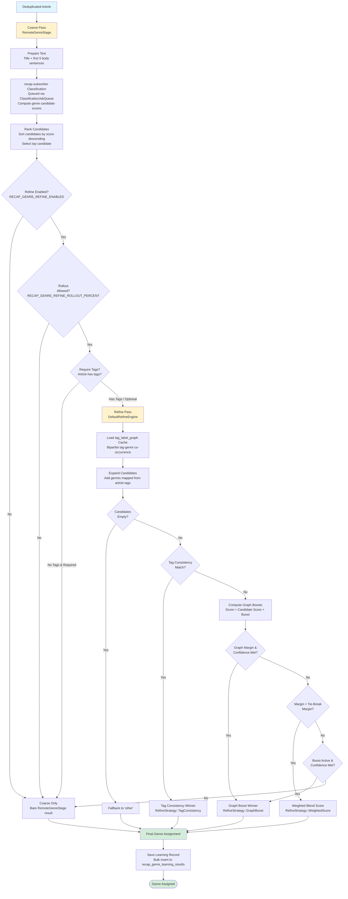
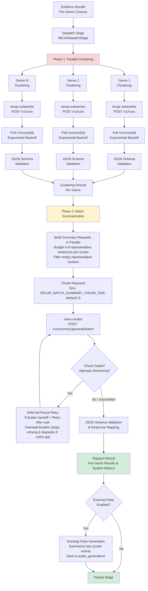
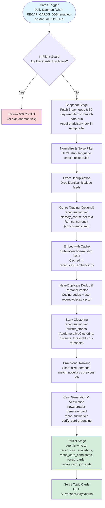
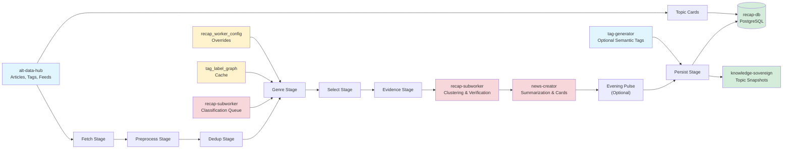

# Recap Worker Pipeline Flow

このドキュメントは、recap-workerの実装に基づいた詳細なパイプラインフロー図です。

## Recap Pipeline (3-Day window is the main production batch; メインパイプライン)

```mermaid
flowchart TB
    Start["Job Triggered<br/>Scheduler/Manual"] --> Init["Pipeline Initialization"]

    Init --> GraphRefresh{"Graph Pre-Refresh<br/>Enabled?"}
    GraphRefresh -->|Yes| RefreshGraph["Refresh Graph via<br/>admin/graph-jobs and admin/learning-jobs"]
    GraphRefresh -->|No| LoadConfig
    RefreshGraph --> LoadConfig["Load Graph Override Settings<br/>from recap_worker_config"]

    LoadConfig --> Fetch["Fetch Stage<br/>AltBackendFetchStage"]

    Fetch --> FetchDetails["Fetch Articles<br/>- Paginated articles from alt-data-hub<br/>- Batch tags from alt-data-hub<br/>- Backup raw HTML to DB<br/>- Acquire advisory lock in recap_jobs"]

    FetchDetails --> Preprocess["Preprocess Stage<br/>TextPreprocessStage"]

    Preprocess --> PreprocessDetails["Preprocess Articles<br/>Subworker Trafilatura extraction<br/>Fallback: ammonia + html2text<br/>Language detection (lingua)<br/>Tokenization (Japanese bi-gram / Latin words)<br/>Tag signal extraction<br/>CPU offload via spawn_blocking"]

    PreprocessDetails --> Dedup["Dedup Stage<br/>HashDedupStage"]

    Dedup --> DedupDetails["Deduplicate Articles<br/>XXH3 64-bit hashing<br/>Rolling character window (100 chars)<br/>Near-duplicate detection (0.8 threshold)<br/>Track duplicate relationships"]

    DedupDetails --> GenreCheck{"Genre Refine<br/>Enabled?<br/>RECAP_GENRE_REFINE_ENABLED"}

    GenreCheck -->|No| BareRemote["Bare Coarse Stage<br/>RemoteGenreStage (Skip Refine)"]
    GenreCheck -->|Yes| TwoStageGenre["TwoStageGenreStage<br/>Coarse Pass: RemoteGenreStage"]

    TwoStageGenre --> CoarseDetails["Remote Classification<br/>Send text to recap-subworker<br/>Queued via ClassificationJobQueue<br/>Return genre scores and candidates"]

    CoarseDetails --> RolloutCheck{"Rollout<br/>Allowed?<br/>RECAP_GENRE_REFINE_ROLLOUT_PERCENT"}

    RolloutCheck -->|No| CoarseOnly["Use Coarse Result<br/>Skip Refine"]
    RolloutCheck -->|Yes| RefinePass["Refine Pass<br/>DefaultRefineEngine"]

    RefinePass --> RefineDetails["Tag Co-occurrence Refine<br/>Load tag_label_graph cache<br/>Expand candidates from tags<br/>Tag consistency check<br/>Bipartite graph boost"]

    RefineDetails --> RefineStrategies{"Refine Strategy"}
    RefineStrategies -->|TagConsistency| TagConsistency["Tag Consistency Check"]
    RefineStrategies -->|GraphBoost| GraphBoost["Apply Graph Boost"]
    RefineStrategies -->|WeightedScore| WeightedScore["Weighted Score Tie-Break"]
    RefineStrategies -->|FallbackOther| FallbackOther["Fallback to 'other'"]
    RefineStrategies -->|CoarseOnly| CoarseOnly

    GraphBoost --> ParallelRefine["Parallel Processing<br/>All assignments"]
    TagConsistency --> ParallelRefine
    WeightedScore --> ParallelRefine
    FallbackOther --> ParallelRefine
    CoarseOnly --> ParallelRefine

    ParallelRefine --> SaveLearning["Save Learning Records<br/>to recap_genre_learning_results"]

    SaveLearning --> Select["Select Stage<br/>SummarySelectStage"]
    BareRemote --> Select

    Select --> SelectTrim["Subcluster and Trim Articles<br/>Load dynamic thresholds from DB<br/>Subcluster 'other' and large genres<br/>Trim to max 20 per genre"]

    SelectTrim --> EmbeddingCheck{"Embedding Service<br/>Available?"}

    EmbeddingCheck -->|Yes| OutlierFilter["Outlier Filtering<br/>EmbeddingService (all-MiniLM-L12-v2)<br/>Centroid distance threshold<br/>Drop distant outliers"]
    EmbeddingCheck -->|No| SkipOutlier["Skip Outlier Filter"]

    OutlierFilter --> Evidence["Evidence Stage<br/>EvidenceBundle"]
    SkipOutlier --> Evidence

    Evidence --> EvidenceDetails["Build Evidence Corpus<br/>Group by genre<br/>Filter short sentences (&lt; 20 chars)<br/>Track metadata and language stats<br/>Enforce article uniqueness"]

    EvidenceDetails --> Dispatch["Dispatch Stage<br/>MlLlmDispatchStage"]

    Dispatch --> Phase1["Phase 1: Parallel Clustering<br/>All genres concurrently"]

    Phase1 --> ClusterDetails["Cluster per Genre<br/>Send corpus to recap-subworker /v1/runs<br/>Poll /v1/runs/{run_id} until terminal<br/>Validate JSON Schema<br/>Subworker saves to recap_cluster_evidence"]

    ClusterDetails --> Phase2["Phase 2: Batch Summarization<br/>Chunked batch API processing"]

    Phase2 --> SummaryDetails["Generate Summaries<br/>Build requests with 5-8 representative sentences<br/>Filter empty representative clusters<br/>Send chunks to news-creator /v1/summary/generate/batch<br/>Deferred retries (stops retrying and degrades if &gt;50% fail)"]

    SummaryDetails --> EveningPulse{"Evening Pulse<br/>Enabled?"}

    EveningPulse -->|Yes| GeneratePulse["Generate Evening Pulse<br/>Summarize top daily developments<br/>Save to pulse_generations"]
    EveningPulse -->|No| Persist
    GeneratePulse --> Persist["Persist Stage<br/>FinalSectionPersistStage"]

    Persist --> PersistDetails["Persist Results<br/>Reconcile citations to sentence IDs<br/>Optional semantic tags via tag-generator<br/>Atomic write to recap_outputs and recap_sections<br/>Emit topic snapshots to knowledge-sovereign<br/>Record errors to recap_failed_tasks"]

    PersistDetails --> End(["Pipeline Complete"])

    style Start fill:#e1f5ff
    style End fill:#d4edda
    style TwoStageGenre fill:#fff3cd
    style BareRemote fill:#fff3cd
    style RefinePass fill:#fff3cd
    style Dispatch fill:#f8d7da
    style Phase1 fill:#f8d7da
    style Phase2 fill:#f8d7da
    style Persist fill:#d4edda
```

## Genre Classification Detail (Two-Stage Process)

```mermaid
flowchart TB
    Article["Deduplicated Article"] --> Coarse["Coarse Pass<br/>RemoteGenreStage"]

    Coarse --> PrepText["Prepare Text<br/>Title + first 5 body sentences"]

    PrepText --> SubworkerQueue["recap-subworker Classification<br/>Queued via ClassificationJobQueue<br/>Compute genre candidate scores"]

    SubworkerQueue --> CandidateRanking["Rank Candidates<br/>Sort candidates by score descending<br/>Select top candidate"]

    CandidateRanking --> RefineEnabled{"Refine Enabled?<br/>RECAP_GENRE_REFINE_ENABLED"}

    RefineEnabled -->|No| CoarseOnly["Coarse Only<br/>Bare RemoteGenreStage result"]
    RefineEnabled -->|Yes| CheckRollout{"Rollout<br/>Allowed?<br/>RECAP_GENRE_REFINE_ROLLOUT_PERCENT"}

    CheckRollout -->|No| CoarseOnly
    CheckRollout -->|Yes| RequireTagsCheck{"Require Tags?<br/>Article has tags?"}

    RequireTagsCheck -->|No Tags &amp; Required| CoarseOnly
    RequireTagsCheck -->|Has Tags / Optional| Refine["Refine Pass<br/>DefaultRefineEngine"]

    Refine --> LoadGraph["Load tag_label_graph Cache<br/>Bipartite tag-genre co-occurrence"]

    LoadGraph --> ExpandCandidates["Expand Candidates<br/>Add genres mapped from article tags"]

    ExpandCandidates --> CandidatesEmpty{"Candidates<br/>Empty?"}
    CandidatesEmpty -->|Yes| Fallback["Fallback to 'other'"]
    CandidatesEmpty -->|No| TagConsistencyCheck{"Tag Consistency<br/>Match?"}

    TagConsistencyCheck -->|Yes| TagWinner["Tag Consistency Winner<br/>RefineStrategy::TagConsistency"]
    TagConsistencyCheck -->|No| CalcBoost["Compute Graph Boosts<br/>Score = Candidate Score + Boost"]

    CalcBoost --> MarginCheck{"Graph Margin &amp;<br/>Confidence Met?"}

    MarginCheck -->|Yes| GraphWinner["Graph Boost Winner<br/>RefineStrategy::GraphBoost"]
    MarginCheck -->|No| WeightedCheck{"Margin &lt; Tie-Break<br/>Margin?"}

    WeightedCheck -->|Yes| WeightedWinner["Weighted Blend Score<br/>RefineStrategy::WeightedScore"]
    WeightedCheck -->|No| BoostActive{"Boost Active &amp;<br/>Confidence Met?"}

    BoostActive -->|Yes| GraphWinner
    BoostActive -->|No| CoarseOnly

    TagWinner --> FinalGenre["Final Genre Assignment"]
    GraphWinner --> FinalGenre
    WeightedWinner --> FinalGenre
    Fallback --> FinalGenre
    CoarseOnly --> FinalGenre

    FinalGenre --> SaveRecord["Save Learning Record<br/>Bulk insert to recap_genre_learning_results"]

    SaveRecord --> Done(["Genre Assigned"])

    style Article fill:#e1f5ff
    style Coarse fill:#fff3cd
    style Refine fill:#fff3cd
    style FinalGenre fill:#d4edda
    style Done fill:#d4edda
```

## Dispatch Stage Detail (ML + LLM Processing)

```mermaid
flowchart TB
    Evidence["Evidence Bundle<br/>Per-Genre Corpora"] --> Dispatch["Dispatch Stage<br/>MlLlmDispatchStage"]

    Dispatch --> Phase1["Phase 1: Parallel Clustering"]

    Phase1 --> Genre1["Genre 1<br/>Clustering"]
    Phase1 --> Genre2["Genre 2<br/>Clustering"]
    Phase1 --> GenreN["Genre N<br/>Clustering"]

    Genre1 --> Subworker1["recap-subworker<br/>POST /v1/runs"]
    Genre2 --> Subworker2["recap-subworker<br/>POST /v1/runs"]
    GenreN --> SubworkerN["recap-subworker<br/>POST /v1/runs"]

    Subworker1 --> Poll1["Poll /v1/runs/{id}<br/>Exponential Backoff"]
    Subworker2 --> Poll2["Poll /v1/runs/{id}<br/>Exponential Backoff"]
    SubworkerN --> PollN["Poll /v1/runs/{id}<br/>Exponential Backoff"]

    Poll1 --> Validate1["JSON Schema<br/>Validation"]
    Poll2 --> Validate2["JSON Schema<br/>Validation"]
    PollN --> ValidateN["JSON Schema<br/>Validation"]

    Validate1 --> ClusterResults["Clustering Results<br/>Per Genre"]
    Validate2 --> ClusterResults
    ValidateN --> ClusterResults

    ClusterResults --> Phase2["Phase 2: Batch Summarization"]

    Phase2 --> BuildRequests["Build Summary Requests in Parallel<br/>Budget 5-8 representative sentences per cluster<br/>Filter empty representative clusters"]

    BuildRequests --> ChunkRequests["Chunk Requests<br/>Size: RECAP_BATCH_SUMMARY_CHUNK_SIZE (default 3)"]

    ChunkRequests --> BatchCall["news-creator<br/>POST /v1/summary/generate/batch"]

    BatchCall --> DeferredCheck{"Chunk Failed?<br/>Attempts Remaining?"}

    DeferredCheck -->|Yes| DeferredRetry["Deferred Round Retry<br/>Full-jitter backoff + Retry-After wait<br/>Overload breaker (stops retrying &amp; degrades if &gt;50% fail)"]
    DeferredRetry --> BatchCall

    DeferredCheck -->|No / Succeeded| ValidateBatch["JSON Schema Validation<br/>&amp; Response Mapping"]

    ValidateBatch --> DispatchResult["Dispatch Result<br/>Per-Genre Results &amp; System Metrics"]

    DispatchResult --> EveningPulseCheck{"Evening Pulse<br/>Enabled?"}

    EveningPulseCheck -->|Yes| EveningPulse["Evening Pulse Generation<br/>Summarize key cluster events<br/>Save to pulse_generations"]
    EveningPulseCheck -->|No| Persist
    EveningPulse --> Persist["Persist Stage"]

    style Phase1 fill:#f8d7da
    style Phase2 fill:#fff3cd
    style DispatchResult fill:#d4edda
    style Persist fill:#d4edda
```

## Morning Update Pipeline

```mermaid
flowchart TB
    MorningStart(["Morning Update<br/>Daily Daemon"]) --> MorningFetch["Fetch Stage<br/>AltBackendFetchStage (1-Day Window from alt-data-hub)"]

    MorningFetch --> MorningPreprocess["Preprocess Stage<br/>TextPreprocessStage<br/>Subworker Trafilatura + lingua"]

    MorningPreprocess --> MorningDedup["Dedup Stage<br/>HashDedupStage<br/>XXH3 + 100-char rolling window"]

    MorningDedup --> GroupArticles["Group Articles<br/>Centroid primary + duplicate IDs"]

    GroupArticles --> SaveGroups["Save Article Groups<br/>to morning_article_groups"]

    SaveGroups --> LoadRecap["Load Recap Context<br/>Latest completed 3-day recap from DB<br/>Fallback to degraded mode if unavailable"]

    LoadRecap --> AssembleInput["Assemble Prompt Inputs<br/>Capped overnight groups + recap summaries<br/>Budget-safe prompt formatting"]

    AssembleInput --> GenLetter["Generate Morning Letter<br/>news-creator POST /v1/morning-letter/generate"]

    GenLetter --> EnrichEditorial["Editorial Enrichment<br/>Deterministic through-line<br/>Section why_reasons (in_weekly_recap, pulse_need_to_know, new_unread)"]

    EnrichEditorial --> PersistLetter["Persist Morning Letter<br/>Upsert into morning_letters table<br/>Insert sources into morning_letter_sources"]

    PersistLetter --> MorningEnd(["Morning Update Complete"])

    style MorningStart fill:#e1f5ff
    style MorningEnd fill:#d4edda
```

## Three-Day Topic Cards Pipeline

```mermaid
flowchart TB
    Trigger(["Cards Trigger<br/>Daily Daemon (when RECAP_CARDS_JOB=enabled)<br/>or Manual POST API"]) --> InFlightGuard{"In-Flight Guard<br/>Another Cards Run Active?"}

    InFlightGuard -->|Yes| Conflict409["Return 409 Conflict<br/>(or skip daemon tick)"]
    InFlightGuard -->|No| Snapshot["Snapshot Stage<br/>Fetch 3-day feeds &amp; 30-day read items from alt-data-hub<br/>Acquire advisory lock in recap_jobs"]

    Snapshot --> NormalizeNoise["Normalize &amp; Noise Filter<br/>HTML strip, language check, noise rules"]

    NormalizeNoise --> DedupExact["Exact Deduplication<br/>Drop identical title/lede feeds"]

    DedupExact --> GenreTag["Genre Tagging (Optional)<br/>recap-subworker classify_coarse per text<br/>Run concurrently (concurrency limit)"]

    GenreTag --> EmbedCache["Embed with Cache<br/>Subworker bge-m3 dim 1024<br/>Cached in recap_card_embeddings"]

    EmbedCache --> NearDedup["Near-Duplicate Dedup &amp; Personal Vector<br/>Cosine dedup + user recency-decay vector"]

    NearDedup --> Cluster["Story Clustering<br/>recap-subworker cluster_stories<br/>(AgglomerativeClustering, distance_threshold = 1 - threshold)"]

    Cluster --> Rank["Provisional Ranking<br/>Score size, personal match, novelty vs previous job"]

    Rank --> GenVerify["Card Generation &amp; Verification<br/>news-creator generate_card<br/>recap-subworker verify_card grounding"]

    GenVerify --> PersistCards["Persist Stage<br/>Atomic write to recap_card_snapshots,<br/>recap_card_candidates, recap_cards, recap_card_job_stats"]

    PersistCards --> ServeAPI["Serve Topic Cards<br/>GET /v1/recaps/3days/cards"]

    style Trigger fill:#e1f5ff
    style Conflict409 fill:#f8d7da
    style PersistCards fill:#d4edda
    style ServeAPI fill:#d4edda
```

## Data Flow Overview

```mermaid
flowchart LR
    AltDataHub["alt-data-hub<br/>Articles, Tags, Feeds"] --> Fetch["Fetch Stage"]
    AltDataHub --> Cards["Topic Cards"]

    Fetch --> Preprocess["Preprocess Stage"]
    Preprocess --> Dedup["Dedup Stage"]
    Dedup --> Genre["Genre Stage"]

    Genre --> Select["Select Stage"]
    Select --> Evidence["Evidence Stage"]

    Evidence --> Subworker["recap-subworker<br/>Clustering &amp; Verification"]
    Subworker --> NewsCreator["news-creator<br/>Summarization &amp; Cards"]

    NewsCreator --> Pulse["Evening Pulse<br/>(Optional)"]
    Pulse --> Persist["Persist Stage"]

    Persist --> RecapDB[("recap-db<br/>PostgreSQL")]
    Cards --> RecapDB
    Persist --> Sovereign["knowledge-sovereign<br/>Topic Snapshots"]

    SubworkerQueue["recap-subworker<br/>Classification Queue"] --> Genre
    GraphCache["tag_label_graph<br/>Cache"] --> Genre
    Config["recap_worker_config<br/>Overrides"] --> Genre
    TagGen["tag-generator<br/>Optional Semantic Tags"] --> Persist

    style AltDataHub fill:#e1f5ff
    style Subworker fill:#f8d7da
    style SubworkerQueue fill:#f8d7da
    style NewsCreator fill:#f8d7da
    style RecapDB fill:#d4edda
    style Sovereign fill:#d4edda
    style TagGen fill:#e1f5ff
    style GraphCache fill:#fff3cd
    style Config fill:#fff3cd
```

## Key Implementation Details

### Genre Classification
- **Coarse Pass**: Remote classification via `RemoteGenreStage` delegating to `recap-subworker` through `ClassificationJobQueue` (`classify_texts_queued`); if `RECAP_GENRE_REFINE_ENABLED=false`, the genre stage runs as bare `RemoteGenreStage` without the refine pass
- **Refine Pass**: Bipartite tag-genre co-occurrence graph (`TagLabelGraphCache` loaded from `tag_label_graph` table) with candidate expansion, tag consistency checks, and graph boosts
- **Rollout Control**: Percentage-based rollout (0-100%) via `RECAP_GENRE_REFINE_ROLLOUT_PERCENT` evaluated against job ID modulo 100
- **Parallel Processing**: All article assignments processed concurrently in refine pass via `tokio::spawn` and `futures::future::join_all`
- **Learning Persistence**: Bulk upsert of decisions, tag profiles, and telemetry to `recap_genre_learning_results`

### Deduplication
- **Hashing**: XXH3 64-bit hashing
- **Near-Duplicate Detection**: Rolling 100-character window of body text with similarity threshold of 0.8; tracks duplicate relationships

### Select Stage
- **Dynamic Thresholds**: Loads minimum document and cosine similarity thresholds from database
- **Subclustering**: Subclusters "other" genre items and large genres into subgenres (e.g. `software_dev_001`) via `SubgenreConfig` (max docs 200, target 50, max k 10)
- **Trim**: Max 20 articles per genre by confidence ranking, adjusted for `min_documents_per_genre`
- **Outlier Filtering**: Optional embedding-based coherence filtering using `EmbeddingService` (`all-MiniLM-L12-v2`) to prune distant centroid outliers

### Dispatch Stage
- **Phase 1 (Clustering)**: Parallel clustering across all genres via `recap-subworker` `/v1/runs`, polling `/v1/runs/{run_id}` with exponential backoff and JSON Schema validation; subworker writes to `recap_subworker_clusters` and `recap_cluster_evidence`
- **Phase 2 (Batch Summarization)**: Parallel request building allocating 5-8 representative sentences per cluster; empty representative clusters filtered out; requests batched into chunks (`RECAP_BATCH_SUMMARY_CHUNK_SIZE`, default 3) sent to `news-creator` `/v1/summary/generate/batch`
- **Resilience**: Deferred retry rounds for failed chunks with full-jitter backoff, respect for upstream `Retry-After` headers, and overload circuit breaker tripping when >50% of a deferred round fails again (stops retrying and degrades remaining genres to missing-from-batch)
- **Evening Pulse**: Optional post-dispatch generation summarizing major cluster developments saved to `pulse_generations` before persist

### Evidence Building
- **Sentence Filtering**: Minimum 20 non-whitespace characters per sentence (`MIN_SENTENCE_LENGTH_CHARS = 20`)
- **Uniqueness**: Per-genre article uniqueness enforced before dispatch
- **Metadata**: Language distribution, character counts, and classifier stats tracked in corpus metadata

### Persistence
- **Atomic Storage**: Single transaction writes full recap outputs JSONB to `recap_outputs` and genre pointers to `recap_sections` via `persist_genre_output`
- **Citation Reconciliation**: Reconciles bullet citation markers `[n]` to `recap_subworker_sentences.id` via article UUID/URL matching
- **Knowledge Sovereign**: Optional emission of `recap.topic_snapshotted.v1` events to `knowledge-sovereign` when `RECAP_KNOWLEDGE_EMIT=true`
- **Error Tracking**: Detailed counts for stored/failed/skipped/no-evidence genres, with failure telemetry recorded in `recap_failed_tasks`

### Morning Update
- **Data Source**: Fetches 1-day window articles and tags from `alt-data-hub` via `AltBackendFetchStage`
- **Article Groups**: Centroid-based grouping with duplicate mapping saved to `morning_article_groups`
- **Recap Grounding**: Grounds on latest completed 3-day recap context from DB (falls back to degraded mode if unavailable)
- **Generation & Enrichment**: Calls `news-creator` `/v1/morning-letter/generate`, attaches deterministic through-line and per-bullet `why_reasons` codes (`in_weekly_recap`, `pulse_need_to_know`, `new_unread`)
- **Persistence**: Saved to `morning_letters` with source references in `morning_letter_sources`

### Three-Day Topic Cards
- **Triggers**: Scheduled daily daemon (`CardsBatchDaemon` via `spawn_cards_batch_daemon` at `RECAP_CARDS_JOB_UTC_TIME`, active only when `RECAP_CARDS_JOB=enabled` and `RECAP_CARDS_USER_ID` is set) and manual endpoint (`POST /v1/generate/recaps/3days/cards`)
- **In-Flight Guard**: Rejects overlapping runs with HTTP 409 Conflict using in-process `Mutex<Option<Uuid>>` and database running job check
- **Pipeline Stages**: Snapshot (3d candidate feeds + 30d user read items from `alt-data-hub`) → normalize & noise rules → exact dedup → optional genre tagging (`classify_coarse` per text, run concurrently via `SubworkerGenreTagger`) → cached embeddings (`bge-m3` dim 1024) → near-duplicate dedup (cosine threshold) → personal preference vector (recency decay) → story clustering (`recap-subworker` sklearn `AgglomerativeClustering` with `distance_threshold = 1 - threshold`) → provisional ranking → LLM card generation (`news-creator`) & factual verification (`recap-subworker`)
- **Persistence & Serving**: Atomic output written to `recap_card_snapshots`, `recap_card_candidates`, `recap_cards`, and `recap_card_job_stats`; served via `GET /v1/recaps/3days/cards`
