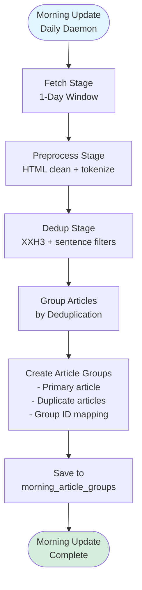

# Recap Worker Pipeline Flow

このドキュメントは、recap-workerの実装に基づいた詳細なパイプラインフロー図です。

## 7-Day Recap Pipeline (メインパイプライン)

```mermaid
flowchart TB
    Start([Job Triggered<br/>Scheduler/Manual]) --> Init[Pipeline Initialization]

    Init --> GraphRefresh{Graph Pre-Refresh<br/>Enabled?}
    GraphRefresh -->|Yes| RefreshGraph[Refresh Graph via<br/>recap-subworker/admin/refresh-graph]
    GraphRefresh -->|No| LoadConfig
    RefreshGraph --> LoadConfig[Load Graph Override Settings<br/>from recap_worker_config]

    LoadConfig --> Fetch[Fetch Stage<br/>AltBackendFetchStage]

    Fetch --> FetchDetails[Fetch Articles<br/>- Paginated from alt-backend<br/>- Optional tag enrichment<br/>- Backup raw HTML to DB<br/>- Acquire advisory lock]

    FetchDetails --> Preprocess[Preprocess Stage<br/>TextPreprocessStage]

    Preprocess --> PreprocessDetails[Preprocess Articles<br/>- HTML cleaning (ammonia)<br/>- Markup stripping (html2text)<br/>- Language detection (whatlang)<br/>- Tokenization (Lindera IPADIC)<br/>- Tag signal extraction<br/>- CPU offload via spawn_blocking]

    PreprocessDetails --> Dedup[Dedup Stage<br/>HashDedupStage]

    Dedup --> DedupDetails[Deduplicate Articles<br/>- XXH3 hashing<br/>- Sentence-level similarity<br/>- Near-duplicate detection<br/>- Track duplicate relationships]

    DedupDetails --> Genre[Genre Stage<br/>TwoStageGenreStage]

    Genre --> CoarsePass[Coarse Pass<br/>CoarseGenreStage]

    CoarsePass --> CoarseDetails[Centroid Classification<br/>- Load Golden Dataset<br/>- Multi-centroid Rocchio<br/>- Temperature scaling<br/>- Adaptive thresholds<br/>- Feature vector: TF-IDF + BM25<br/>- Fallback to keywords]

    CoarseDetails --> RolloutCheck{Rollout<br/>Allowed?}

    RolloutCheck -->|No| CoarseOnly[Use Coarse Result<br/>Skip Refine]
    RolloutCheck -->|Yes| RefinePass[Refine Pass<br/>DefaultRefineEngine]

    RefinePass --> RefineDetails[Graph Label Propagation<br/>- Load tag_label_graph cache<br/>- Build similarity graph<br/>- Label propagation (sprs)<br/>- Tag-based boosts<br/>- LLM tie-break if needed]

    RefineDetails --> RefineStrategies{Refine Strategy}
    RefineStrategies -->|GraphBoost| GraphBoost[Apply Graph Boost]
    RefineStrategies -->|TagConsistency| TagConsistency[Tag Consistency Check]
    RefineStrategies -->|WeightedScore| WeightedScore[Weighted Score]
    RefineStrategies -->|LlmTieBreak| LlmTieBreak[LLM Tie-Break]
    RefineStrategies -->|FallbackOther| FallbackOther[Fallback to 'other']
    RefineStrategies -->|CoarseOnly| CoarseOnly

    GraphBoost --> ParallelRefine[Parallel Processing<br/>All assignments]
    TagConsistency --> ParallelRefine
    WeightedScore --> ParallelRefine
    LlmTieBreak --> ParallelRefine
    FallbackOther --> ParallelRefine
    CoarseOnly --> ParallelRefine

    ParallelRefine --> SaveLearning[Save Learning Records<br/>to recap_genre_learning_results]

    SaveLearning --> Select[Select Stage<br/>SummarySelectStage]

    Select --> SelectTrim[Trim Articles<br/>- Max 20 per genre<br/>- Adjusted for min_documents<br/>- Confidence-based ranking]

    SelectTrim --> EmbeddingCheck{Embedding Service<br/>Available?}

    EmbeddingCheck -->|Yes| OutlierFilter[Outlier Filtering<br/>- Embedding-based similarity<br/>- Centroid calculation<br/>- Coherence threshold<br/>- Fallback to top-scoring]
    EmbeddingCheck -->|No| SkipOutlier[Skip Outlier Filter]

    OutlierFilter --> Evidence[Evidence Stage<br/>EvidenceBundle]
    SkipOutlier --> Evidence

    Evidence --> EvidenceDetails[Build Evidence Corpus<br/>- Group by genre<br/>- Filter short sentences<br/>- Track metadata<br/>- Enforce uniqueness]

    EvidenceDetails --> Dispatch[Dispatch Stage<br/>MlLlmDispatchStage]

    Dispatch --> Phase1[Phase 1: Parallel Clustering<br/>All genres concurrently]

    Phase1 --> ClusterDetails[Cluster per Genre<br/>- Send to recap-subworker/v1/runs<br/>- Poll until success<br/>- JSON Schema validation<br/>- Save to recap_cluster_evidence]

    ClusterDetails --> Phase2[Phase 2: Sequential Summary<br/>Queue-based processing]

    Phase2 --> SummaryDetails[Generate Summaries<br/>- Top 40 clusters only<br/>- Send to news-creator<br/>- Sequential processing<br/>- JSON Schema validation]

    SummaryDetails --> Persist[Persist Stage<br/>FinalSectionPersistStage]

    Persist --> PersistDetails[Persist Results<br/>- Save to recap_outputs JSONB<br/>- Save to recap_sections<br/>- Track success/failure counts]

    PersistDetails --> End([Pipeline Complete])

    style Start fill:#e1f5ff
    style End fill:#d4edda
    style Genre fill:#fff3cd
    style CoarsePass fill:#fff3cd
    style RefinePass fill:#fff3cd
    style Dispatch fill:#f8d7da
    style Phase1 fill:#f8d7da
    style Phase2 fill:#f8d7da
```

## Genre Classification Detail (Two-Stage Process)

```mermaid
flowchart TB
    Article[Deduplicated Article] --> Coarse[Coarse Pass]

    Coarse --> LoadGolden[Load Golden Dataset<br/>/app/data/golden_classification.json]

    LoadGolden --> ExtractFeatures[Extract Features<br/>- TF-IDF sum<br/>- BM25 peak<br/>- Token count<br/>- Tag overlap]

    ExtractFeatures --> BuildVector[Build Feature Vector<br/>Combined representation]

    BuildVector --> CentroidMatch[Centroid Matching<br/>- Multi-centroid per genre<br/>- Cosine similarity<br/>- Temperature scaling<br/>- Adaptive thresholds]

    CentroidMatch --> ThresholdCheck{Above<br/>Threshold?}

    ThresholdCheck -->|Yes| CoarseSuccess[Coarse Success<br/>Genre Assigned]
    ThresholdCheck -->|No| CheckRollout{Rollout<br/>Allowed?}

    CheckRollout -->|No| CoarseOnly[Coarse Only<br/>Use best candidate]
    CheckRollout -->|Yes| Refine[Refine Pass]

    Refine --> LoadGraph[Load tag_label_graph<br/>from cache/DB]

    LoadGraph --> BuildGraph[Build Similarity Graph<br/>- Similarity ≥ 0.85<br/>- Undirected edges<br/>- Labeled + Unlabeled nodes]

    BuildGraph --> LabelProp[Label Propagation<br/>- Sparse matrix ops (sprs)<br/>- Iterative updates<br/>- Tag-based boosts]

    LabelProp --> RefineStrategies{Refine Strategy}

    RefineStrategies -->|TagConsistency| TagCheck[Check Tag Consistency<br/>with tag_label_graph]
    RefineStrategies -->|GraphBoost| GraphBoost[Apply Graph Boost<br/>from tag associations]
    RefineStrategies -->|WeightedScore| Weighted[Weighted Score<br/>Coarse + Refine]
    RefineStrategies -->|LlmTieBreak| LlmCall[LLM Tie-Break<br/>via news-creator]
    RefineStrategies -->|FallbackOther| Fallback[Fallback to 'other']

    TagCheck --> FinalGenre[Final Genre Assignment]
    GraphBoost --> FinalGenre
    Weighted --> FinalGenre
    LlmCall --> FinalGenre
    Fallback --> FinalGenre
    CoarseSuccess --> FinalGenre
    CoarseOnly --> FinalGenre

    FinalGenre --> SaveRecord[Save Learning Record<br/>to recap_genre_learning_results]

    SaveRecord --> Done([Genre Assigned])

    style Article fill:#e1f5ff
    style Coarse fill:#fff3cd
    style Refine fill:#fff3cd
    style FinalGenre fill:#d4edda
    style Done fill:#d4edda
```

## Dispatch Stage Detail (ML + LLM Processing)


## Morning Update Pipeline



## Data Flow Overview


## Key Implementation Details

### Genre Classification
- **Coarse Pass**: Centroid-based (Rocchio) with multi-centroid support, temperature scaling, and adaptive thresholds
- **Refine Pass**: Graph label propagation with tag-based boosts, LLM tie-break fallback
- **Rollout Control**: Percentage-based rollout (0-100%) via `RECAP_GENRE_REFINE_ROLLOUT_PERCENT`
- **Parallel Processing**: All assignments processed concurrently in refine pass

### Select Stage
- **Trim**: Max 20 articles per genre (adjusted for `min_documents_per_genre`)
- **Outlier Filtering**: Optional embedding-based coherence similarity filtering
- **Fallback**: Ensures minimum document counts per genre

### Dispatch Stage
- **Phase 1**: Parallel clustering across all genres
- **Phase 2**: Sequential summary generation (queue-based) to respect LLM context limits
- **Top 40 Clusters**: Only largest clusters sent to news-creator (8k token limit)

### Evidence Building
- **Sentence Filtering**: Minimum 20 non-whitespace characters per sentence
- **Uniqueness**: Per-genre article uniqueness enforced before dispatch
- **Metadata**: Language distribution, character counts, classifier stats tracked

### Persistence
- **JSONB Storage**: Full recap outputs stored in `recap_outputs` table
- **Section Pointers**: Genre-to-output mapping in `recap_sections`
- **Error Tracking**: Detailed counts for stored/failed/skipped/no-evidence genres

